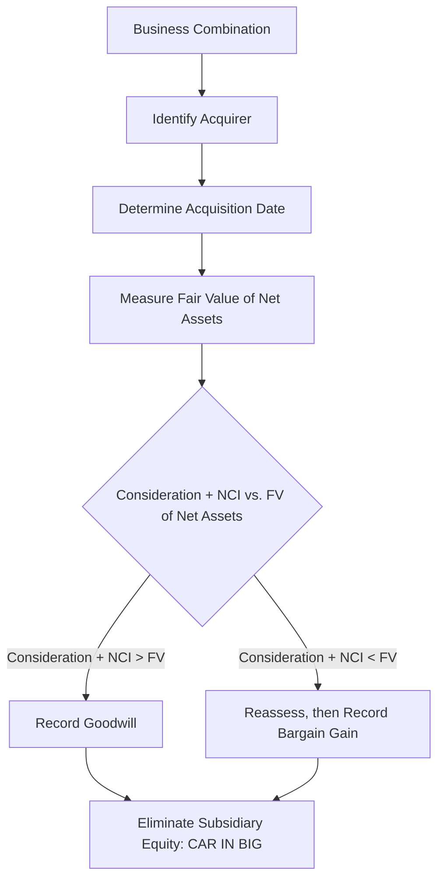
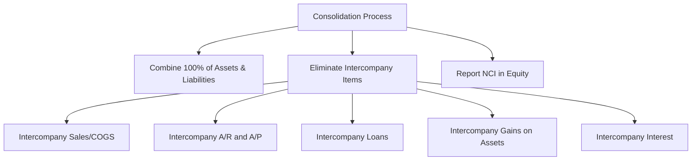

# Business Combinations

## Acquisition Method

Under ASC 805, all business combinations are accounted for using the **acquisition method**. This method requires the acquirer to:

1. Identify the **acquirer**
2. Determine the **acquisition date**
3. Recognize and measure the **identifiable assets acquired**, **liabilities assumed**, and any **noncontrolling interest (NCI)**
4. Recognize and measure **goodwill** or a **gain from a bargain purchase**

   :::info
   The acquisition method replaced the pooling-of-interests method. All assets and liabilities of the acquired entity are measured at **fair value** on the acquisition date.
   :::

---

## The CAR IN BIG Mnemonic

The consolidation elimination entry at acquisition follows the **CAR IN BIG** framework:
| Letter | Action |
|---|---|
| **C** | Eliminate subsidiary **Common stock** |
| **A** | Eliminate subsidiary **APIC** |
| **R** | Eliminate subsidiary **Retained earnings** |
| **I** | Eliminate the parent's **Investment** account |
| **N** | Create **Noncontrolling interest** (at fair value) |
| **B** | Record net assets at 100% fair value (**Book-to-fair-value adjustments**) |
| **I** | Record **Identifiable intangibles** at fair value |
| **G** | Record **Goodwill** (or bargain purchase gain) |

---

## Step-by-Step Example

Bear Co. acquires 80% of Gies Co. on January 1. The following information is available:
**Consideration transferred by Bear Co.:** \$640,000
**Gies Co.'s book values at acquisition:**
| Account | Book Value | Fair Value |
|---|---|---|
| Total assets | \$700,000 | \$850,000 |
| Total liabilities | \$200,000 | \$200,000 |
| Common stock | \$100,000 | — |
| APIC | \$150,000 | — |
| Retained earnings | \$250,000 | — |
| Net book value | \$500,000 | — |
| **Net assets at FV** | — | **\$650,000** |
**Fair value of NCI (20%):** \$160,000

### Calculating Goodwill

$$
\text{Goodwill} = (\text{Consideration} + \text{NCI at FV}) - \text{Net Assets at FV}
$$

$$
\text{Goodwill} = (\$640{,}000 + \$160{,}000) - \$650{,}000 = \$150{,}000
$$

The fair value adjustments to net assets are:

$$
\$850{,}000 - \$700{,}000 = \$150{,}000 \text{ (asset step-up)}
$$

### Elimination Entry at Acquisition

```journal
Dr. Common stock (Gies)       100,000
Dr. APIC (Gies)               150,000
Dr. Retained earnings (Gies)  250,000
Dr. Asset step-up             150,000
Dr. Goodwill                  150,000
    Cr. Investment in Gies            640,000
    Cr. Noncontrolling interest       160,000
```

:::tip[Exam Tip]

The total debits equal the **full (100%) fair value** of the subsidiary: \$640,000 (parent share) + \$160,000 (NCI) = \$800,000. This equals the net assets at FV (\$650,000) + goodwill (\$150,000).

:::

---

## Identifiable Intangible Assets

On the acquisition date, the acquirer must recognize intangible assets **separately from goodwill** if they meet either the:

- **Contractual-legal criterion** — arises from contractual or legal rights (patents, licenses, customer contracts)
- **Separability criterion** — can be sold, transferred, or licensed independently
  | Intangible Asset | Criterion Met |
  |---|---|
  | Customer relationships | Contractual-legal |
  | Trade names | Contractual-legal |
  | Technology patents | Contractual-legal |
  | Customer lists | Separability |
  | Non-compete agreements | Contractual-legal |
  | In-process R&D | Either |
  **Example:** In the Bear Co. / Gies Co. acquisition, assume \$50,000 of the asset step-up relates to identifiable intangible assets (customer relationships). The entry would be refined:

```journal
Dr. Common stock (Gies)       100,000
Dr. APIC (Gies)               150,000
Dr. Retained earnings (Gies)  250,000
Dr. Tangible asset step-up    100,000
Dr. Customer relationships     50,000
Dr. Goodwill                  150,000
    Cr. Investment in Gies            640,000
    Cr. Noncontrolling interest       160,000
```

---

## Goodwill vs. Bargain Purchase Gain

### Goodwill

Goodwill arises when the consideration transferred (plus NCI) **exceeds** the fair value of net identifiable assets acquired. Goodwill is:

- **Not amortized** (indefinite life)
- Tested for **impairment** at least annually at the reporting unit level
- Recorded only in a business combination (internally generated goodwill is never capitalized)

### Bargain Purchase Gain

A bargain purchase occurs when the fair value of net identifiable assets **exceeds** the consideration transferred (plus NCI). Before recognizing a gain, the acquirer must:

1. **Reassess** whether all assets and liabilities have been properly identified and measured
2. **Review** the procedures used to measure fair value
   If a bargain still exists after reassessment, the gain is recognized in **earnings** on the acquisition date.
   **Example:** MAS Inc. acquires 100% of Illini Security for \$400,000. Net identifiable assets at fair value total \$450,000.
   $$
   \text{Bargain purchase gain} = \$450{,}000 - \$400{,}000 = \$50{,}000
   $$

```journal
Dr. Net identifiable assets   450,000
    Cr. Cash                          400,000
    Cr. Gain on bargain purchase       50,000
```

---

## Measurement Period Adjustments

The acquirer has up to **one year** from the acquisition date to finalize the accounting for a business combination. During this **measurement period**, provisional amounts may be adjusted as new information is obtained about facts and circumstances that existed at the acquisition date.

:::warning

Measurement period adjustments are recorded **retrospectively** — they are applied as if the accounting had been completed on the acquisition date. Comparative prior-period financial statements are restated.

:::

**Example:** Bear Co. initially recorded goodwill of \$150,000. Six months later, an appraisal reveals that an acquired building was undervalued by \$30,000 on the acquisition date:

```journal
Dr. Building                   30,000
    Cr. Goodwill                       30,000
```

Revised goodwill: \$150,000 − \$30,000 = \$120,000

## Contingent Consideration

Contingent consideration is an obligation to transfer additional assets or equity if specified future events occur or conditions are met (e.g., earn-outs tied to post-acquisition revenue targets).

### Initial Recognition

Contingent consideration is measured at **fair value** on the acquisition date and included in the consideration transferred.
Kingfisher Industries acquires BIF Partners for \$300,000 cash plus contingent consideration with a fair value of \$40,000:

```journal
Dr. Net identifiable assets   280,000
Dr. Goodwill                   60,000
    Cr. Cash                          300,000
    Cr. Contingent consideration liability  40,000
```

### Subsequent Measurement

| Classification | Treatment                                                     |
| -------------- | ------------------------------------------------------------- |
| **Liability**  | Remeasured at fair value each period; changes in **earnings** |
| **Equity**     | Not remeasured; settled within equity                         |

If the contingent liability increases to \$55,000 at year-end:

```journal
Dr. Loss on contingent consideration  15,000
    Cr. Contingent consideration liability     15,000
```

---

## Acquisition-Related Costs

Costs incurred to effect the acquisition (e.g., finder's fees, advisory fees, legal fees, due diligence costs) are **expensed as incurred** — they are not part of the consideration transferred.

```journal
Dr. Acquisition expense        25,000
    Cr. Cash                           25,000
```

:::danger

Do **not** capitalize acquisition costs as part of goodwill. The only exception is costs to issue debt or equity securities, which follow their respective standards (debt issue costs reduce the carrying amount of debt; equity issue costs reduce APIC).

:::

---

## Summary Diagram



:::note[Chapter Checklist]

- [ ] Apply the acquisition method to business combinations
- [ ] Use the CAR IN BIG mnemonic for elimination entries
- [ ] Calculate goodwill as consideration + NCI − FV of net assets
- [ ] Recognize identifiable intangibles separately from goodwill
- [ ] Identify bargain purchase situations and recognize the gain
- [ ] Account for measurement period adjustments retrospectively
- [ ] Measure contingent consideration at fair value and remeasure liabilities through earnings
- [ ] Expense acquisition-related costs as incurred
      :::

      Collapse 225 lines

docs/far/special-topics-and-transactions/consolidated-financial-statements.md
Original file line number Diff line number Diff line change

# Consolidated Financial Statements

## Parent-Subsidiary Relationship

Consolidated financial statements are required when a parent company holds a **controlling financial interest** in one or more subsidiaries. Under the **voting interest model**, control is presumed when the parent owns **more than 50%** of the subsidiary's outstanding voting stock.

:::info

Consolidated statements present the parent and its subsidiaries as a **single economic entity**. All intercompany balances and transactions are eliminated.

:::

---

## Voting Interest Model

| Ownership Level | Accounting Method                               |
| --------------- | ----------------------------------------------- |
| < 20%           | Fair value (or equity if significant influence) |
| 20% – 50%       | Equity method (significant influence presumed)  |
| > 50%           | **Consolidation** (control presumed)            |

The parent controls the subsidiary's operations and presents combined results. The portion owned by outside shareholders is the **noncontrolling interest (NCI)**.

## Eliminating Intercompany Transactions

All intercompany transactions are eliminated **at 100%** regardless of the parent's ownership percentage. This prevents double-counting of revenues, expenses, assets, and liabilities.

### Eliminating Intercompany Accounts

**Intercompany receivables and payables:** Bear Co. (parent) has a \$50,000 receivable from Gies Co. (subsidiary):

```journal
Dr. Accounts payable (Gies)    50,000
    Cr. Accounts receivable (Bear)     50,000
```

**Intercompany interest:** Bear Co. charged Gies Co. \$3,000 of interest on an intercompany loan:

```journal
Dr. Interest revenue (Bear)     3,000
    Cr. Interest expense (Gies)         3,000
```

**Intercompany loans:** Bear Co. loaned Gies Co. \$100,000:

```journal
Dr. Notes payable (Gies)     100,000
    Cr. Notes receivable (Bear)       100,000
```

---

## Intercompany Inventory Transactions

When one affiliate sells inventory to another, the **intercompany sale, cost of goods sold, and any unrealized profit** in ending inventory must be eliminated.

### Downstream Sale (Parent → Subsidiary)

Bear Co. sells inventory costing \$60,000 to Gies Co. for \$80,000. At year-end, Gies Co. still holds 25% of this inventory.
**Step 1 — Eliminate intercompany sale and COGS:**

```journal
Dr. Sales (Bear)               80,000
    Cr. Cost of goods sold (Bear)      80,000
```

**Step 2 — Eliminate unrealized profit in ending inventory:**
Unrealized profit = (\$80,000 − \$60,000) × 25% = \$5,000

```journal
Dr. Cost of goods sold          5,000
    Cr. Inventory (Gies)               5,000
```

:::tip[Exam Tip]

In a **downstream** sale, 100% of the unrealized profit is eliminated against the **parent's** income. In an **upstream** sale, the unrealized profit is allocated between the parent and the NCI based on ownership percentages.

:::

### Upstream Sale (Subsidiary → Parent)

Gies Co. (80%-owned subsidiary) sells inventory costing \$40,000 to Bear Co. for \$55,000. Bear Co. still holds 40% at year-end.
**Eliminate intercompany sale and COGS:**

```journal
Dr. Sales (Gies)               55,000
    Cr. Cost of goods sold (Gies)      55,000
```

**Eliminate unrealized profit:**
Unrealized profit = (\$55,000 − \$40,000) × 40% = \$6,000

```journal
Dr. Cost of goods sold          6,000
    Cr. Inventory (Bear)               6,000
```

Allocation of the \$6,000 unrealized profit elimination:

- Parent's share (80%): \$4,800
- NCI's share (20%): \$1,200

---

## Intercompany Bond Transactions

When one affiliate purchases the bonds of another on the open market, from the consolidated perspective the debt is effectively **retired**. Any difference between the carrying amount and the purchase price results in a **constructive gain or loss**.
MAS Inc. (parent) has \$200,000 of bonds outstanding with a carrying value of \$196,000. BIF Partners (subsidiary) purchases these bonds on the open market for \$193,000.
Constructive gain: \$196,000 − \$193,000 = \$3,000
**Elimination entry:**

```journal
Dr. Bonds payable (MAS)       200,000
    Cr. Discount on bonds (MAS)         4,000
    Cr. Investment in bonds (BIF)     193,000
    Cr. Gain on constructive retirement  3,000
```

---

## Intercompany Land Transactions

When one affiliate sells land to another, any **unrealized gain or loss** must be eliminated until the land is sold to an outside party.
Bear Co. sells land (book value \$100,000) to Gies Co. for \$130,000.
**Elimination entry:**

```journal
Dr. Gain on sale of land       30,000
    Cr. Land                           30,000
```

The land stays on the consolidated balance sheet at the **original cost** of \$100,000 until sold externally.

## Intercompany Depreciable Assets

When one affiliate sells a depreciable asset to another at a gain, two adjustments are required:

1. **Eliminate the unrealized gain** and restore the asset to original cost
2. **Adjust depreciation** — the buyer is depreciating a higher basis, so excess depreciation is eliminated each year
   Kingfisher Industries sells equipment (cost \$80,000, accumulated depreciation \$30,000) to Illini Entertainment for \$70,000. Remaining life is 5 years.
   Gain on intercompany sale: \$70,000 − (\$80,000 − \$30,000) = \$20,000
   **Year of sale — eliminate gain and adjust asset:**

```journal
Dr. Gain on sale of equipment  20,000
Dr. Accumulated depreciation   30,000
    Cr. Equipment                      50,000
```

Wait — let me reconsider. The asset needs to appear at original cost:

```journal
Dr. Gain on sale              20,000
Dr. Equipment                 10,000
Dr. Accumulated depreciation  30,000
    Cr. Equipment                      60,000
```

Simplified elimination:

```journal
Dr. Gain on sale of equipment  20,000
    Cr. Equipment (net adjustment)     16,000
    Cr. Depreciation expense            4,000
```

The excess annual depreciation = \$20,000 ÷ 5 = \$4,000. Each year, \$4,000 of the unrealized gain is confirmed through higher depreciation, requiring a depreciation adjustment:

```journal
Dr. Accumulated depreciation    4,000
    Cr. Depreciation expense            4,000
```

---

## Consolidated Balance Sheet

The consolidated balance sheet combines the parent's and subsidiary's assets and liabilities, with the following adjustments:

- **Eliminate** all of the subsidiary's stockholders' equity
- **Eliminate** the parent's investment in subsidiary account
- **Add** fair value adjustments (from acquisition) to subsidiary assets/liabilities
- **Report** goodwill as an asset
- **Report NCI** in the **equity section** (separate from parent's equity)

  :::warning
  NCI is presented in the **equity section** of the consolidated balance sheet, not as a liability or mezzanine item.
  :::

---

## Consolidated Income Statement

The consolidated income statement includes:

- 100% of the parent's revenues and expenses for the **full year**
- 100% of the subsidiary's revenues and expenses for the **post-acquisition period only**
- Elimination of all intercompany revenues and expenses
- **Net income attributable to NCI** is deducted to arrive at net income attributable to the parent
  | Line Item | Amount |
  |---|---|
  | Consolidated revenues | XXX |
  | Consolidated expenses | (XXX) |
  | **Consolidated net income** | **XXX** |
  | Less: Net income attributable to NCI | (XXX) |
  | **Net income attributable to parent** | **XXX** |

---

## Consolidated Comprehensive Income

Other comprehensive income (OCI) items of both the parent and subsidiary are combined. NCI's share of OCI is reported separately.

## Consolidated Statement of Changes in Equity

This statement shows:

- Parent's equity accounts (common stock, APIC, retained earnings, AOCI)
- NCI balance and changes (NCI share of net income, NCI share of dividends)

---

## Consolidated Cash Flows in Acquisition Period

The consolidated statement of cash flows includes:

- Cash paid for the acquisition is reported as an **investing activity** (net of any cash acquired)
- Only **post-acquisition** cash flows of the subsidiary are included
- Intercompany cash flows are eliminated
  **Example:** Bear Co. pays \$640,000 cash to acquire 80% of Gies Co. Gies Co. had \$40,000 cash at acquisition:
  Cash outflow reported in investing activities:
  $$
  \$640{,}000 - \$40{,}000 = \$600{,}000
  $$

---

## Summary



:::note[Chapter Checklist]

- [ ] Determine when consolidation is required (>50% voting interest)
- [ ] Eliminate 100% of intercompany transactions regardless of ownership %
- [ ] Eliminate intercompany inventory profits (downstream vs. upstream)
- [ ] Account for constructive retirement of intercompany bonds
- [ ] Eliminate unrealized gains on intercompany land and depreciable assets
- [ ] Present NCI in the equity section of the consolidated balance sheet
- [ ] Include only post-acquisition subsidiary activity in the income statement
- [ ] Report acquisition cash outflows (net of cash acquired) as investing activities
      :::
