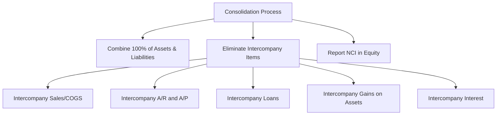

# Consolidated Financial Statements

## Parent-Subsidiary Relationship

Consolidated financial statements are required when a parent company holds a **controlling financial interest** in one or more subsidiaries. Under the **voting interest model**, control is presumed when the parent owns **more than 50%** of the subsidiary's outstanding voting stock.

:::info

Consolidated statements present the parent and its subsidiaries as a **single economic entity**. All intercompany balances and transactions are eliminated.

:::

---

## Voting Interest Model

| Ownership Level | Accounting Method                               |
| --------------- | ----------------------------------------------- |
| < 20%           | Fair value (or equity if significant influence) |
| 20% – 50%       | Equity method (significant influence presumed)  |
| > 50%           | **Consolidation** (control presumed)            |

The parent controls the subsidiary's operations and presents combined results. The portion owned by outside shareholders is the **noncontrolling interest (NCI)**.

## Eliminating Intercompany Transactions

All intercompany transactions are eliminated **at 100%** regardless of the parent's ownership percentage. This prevents double-counting of revenues, expenses, assets, and liabilities.

### Eliminating Intercompany Accounts

**Intercompany receivables and payables:** Bear Co. (parent) has a \$50,000 receivable from Gies Co. (subsidiary):

```journal
Dr. Accounts payable (Gies)    50,000
    Cr. Accounts receivable (Bear)     50,000
```

**Intercompany interest:** Bear Co. charged Gies Co. \$3,000 of interest on an intercompany loan:

```journal
Dr. Interest revenue (Bear)     3,000
    Cr. Interest expense (Gies)         3,000
```

**Intercompany loans:** Bear Co. loaned Gies Co. \$100,000:

```journal
Dr. Notes payable (Gies)     100,000
    Cr. Notes receivable (Bear)       100,000
```

---

## Intercompany Inventory Transactions

When one affiliate sells inventory to another, the **intercompany sale, cost of goods sold, and any unrealized profit** in ending inventory must be eliminated.

### Downstream Sale (Parent → Subsidiary)

Bear Co. sells inventory costing \$60,000 to Gies Co. for \$80,000. At year-end, Gies Co. still holds 25% of this inventory.
**Step 1 — Eliminate intercompany sale and COGS:**

```journal
Dr. Sales (Bear)               80,000
    Cr. Cost of goods sold (Bear)      80,000
```

**Step 2 — Eliminate unrealized profit in ending inventory:**
Unrealized profit = (\$80,000 − \$60,000) × 25% = \$5,000

```journal
Dr. Cost of goods sold          5,000
    Cr. Inventory (Gies)               5,000
```

:::tip[Exam Tip]

In a **downstream** sale, 100% of the unrealized profit is eliminated against the **parent's** income. In an **upstream** sale, the unrealized profit is allocated between the parent and the NCI based on ownership percentages.

:::

### Upstream Sale (Subsidiary → Parent)

Gies Co. (80%-owned subsidiary) sells inventory costing \$40,000 to Bear Co. for \$55,000. Bear Co. still holds 40% at year-end.
**Eliminate intercompany sale and COGS:**

```journal
Dr. Sales (Gies)               55,000
    Cr. Cost of goods sold (Gies)      55,000
```

**Eliminate unrealized profit:**
Unrealized profit = (\$55,000 − \$40,000) × 40% = \$6,000

```journal
Dr. Cost of goods sold          6,000
    Cr. Inventory (Bear)               6,000
```

Allocation of the \$6,000 unrealized profit elimination:

- Parent's share (80%): \$4,800
- NCI's share (20%): \$1,200

---

## Intercompany Bond Transactions

When one affiliate purchases the bonds of another on the open market, from the consolidated perspective the debt is effectively **retired**. Any difference between the carrying amount and the purchase price results in a **constructive gain or loss**.
MAS Inc. (parent) has \$200,000 of bonds outstanding with a carrying value of \$196,000. BIF Partners (subsidiary) purchases these bonds on the open market for \$193,000.
Constructive gain: \$196,000 − \$193,000 = \$3,000
**Elimination entry:**

```journal
Dr. Bonds payable (MAS)       200,000
    Cr. Discount on bonds (MAS)         4,000
    Cr. Investment in bonds (BIF)     193,000
    Cr. Gain on constructive retirement  3,000
```

---

## Intercompany Land Transactions

When one affiliate sells land to another, any **unrealized gain or loss** must be eliminated until the land is sold to an outside party.
Bear Co. sells land (book value \$100,000) to Gies Co. for \$130,000.
**Elimination entry:**

```journal
Dr. Gain on sale of land       30,000
    Cr. Land                           30,000
```

The land stays on the consolidated balance sheet at the **original cost** of \$100,000 until sold externally.

## Intercompany Depreciable Assets

When one affiliate sells a depreciable asset to another at a gain, two adjustments are required:

1. **Eliminate the unrealized gain** and restore the asset to original cost
2. **Adjust depreciation** — the buyer is depreciating a higher basis, so excess depreciation is eliminated each year
   Kingfisher Industries sells equipment (cost \$80,000, accumulated depreciation \$30,000) to Illini Entertainment for \$70,000. Remaining life is 5 years.
   Gain on intercompany sale: \$70,000 − (\$80,000 − \$30,000) = \$20,000
   **Year of sale — eliminate gain and adjust asset:**

```journal
Dr. Gain on sale of equipment  20,000
Dr. Accumulated depreciation   30,000
    Cr. Equipment                      50,000
```

Wait — let me reconsider. The asset needs to appear at original cost:

```journal
Dr. Gain on sale              20,000
Dr. Equipment                 10,000
Dr. Accumulated depreciation  30,000
    Cr. Equipment                      60,000
```

Simplified elimination:

```journal
Dr. Gain on sale of equipment  20,000
    Cr. Equipment (net adjustment)     16,000
    Cr. Depreciation expense            4,000
```

The excess annual depreciation = \$20,000 ÷ 5 = \$4,000. Each year, \$4,000 of the unrealized gain is confirmed through higher depreciation, requiring a depreciation adjustment:

```journal
Dr. Accumulated depreciation    4,000
    Cr. Depreciation expense            4,000
```

---

## Consolidated Balance Sheet

The consolidated balance sheet combines the parent's and subsidiary's assets and liabilities, with the following adjustments:

- **Eliminate** all of the subsidiary's stockholders' equity
- **Eliminate** the parent's investment in subsidiary account
- **Add** fair value adjustments (from acquisition) to subsidiary assets/liabilities
- **Report** goodwill as an asset
- **Report NCI** in the **equity section** (separate from parent's equity)

  :::warning
  NCI is presented in the **equity section** of the consolidated balance sheet, not as a liability or mezzanine item.
  :::

---

## Consolidated Income Statement

The consolidated income statement includes:

- 100% of the parent's revenues and expenses for the **full year**
- 100% of the subsidiary's revenues and expenses for the **post-acquisition period only**
- Elimination of all intercompany revenues and expenses
- **Net income attributable to NCI** is deducted to arrive at net income attributable to the parent
  | Line Item | Amount |
  |---|---|
  | Consolidated revenues | XXX |
  | Consolidated expenses | (XXX) |
  | **Consolidated net income** | **XXX** |
  | Less: Net income attributable to NCI | (XXX) |
  | **Net income attributable to parent** | **XXX** |

---

## Consolidated Comprehensive Income

Other comprehensive income (OCI) items of both the parent and subsidiary are combined. NCI's share of OCI is reported separately.

## Consolidated Statement of Changes in Equity

This statement shows:

- Parent's equity accounts (common stock, APIC, retained earnings, AOCI)
- NCI balance and changes (NCI share of net income, NCI share of dividends)

---

## Consolidated Cash Flows in Acquisition Period

The consolidated statement of cash flows includes:

- Cash paid for the acquisition is reported as an **investing activity** (net of any cash acquired)
- Only **post-acquisition** cash flows of the subsidiary are included
- Intercompany cash flows are eliminated
  **Example:** Bear Co. pays \$640,000 cash to acquire 80% of Gies Co. Gies Co. had \$40,000 cash at acquisition:
  Cash outflow reported in investing activities:
  $$
  \$640{,}000 - \$40{,}000 = \$600{,}000
  $$

---

## Summary



:::note[Chapter Checklist]

- [ ] Determine when consolidation is required (>50% voting interest)
- [ ] Eliminate 100% of intercompany transactions regardless of ownership %
- [ ] Eliminate intercompany inventory profits (downstream vs. upstream)
- [ ] Account for constructive retirement of intercompany bonds
- [ ] Eliminate unrealized gains on intercompany land and depreciable assets
- [ ] Present NCI in the equity section of the consolidated balance sheet
- [ ] Include only post-acquisition subsidiary activity in the income statement
- [ ] Report acquisition cash outflows (net of cash acquired) as investing activities
- [ ] Apply pushdown accounting when applicable
      :::

---

## Pushdown Accounting

**Pushdown accounting** is an optional election that allows the acquired entity (the subsidiary) to reflect the acquirer's purchase price allocation on its **own standalone financial statements**, rather than only on the consolidated workpapers.

### When It Applies

Pushdown accounting may be elected in the **first reporting period** after a change in control. Once elected, it applies to all assets and liabilities of the acquired entity.

### Key Mechanics

When pushdown accounting is applied:

1. The subsidiary's **assets and liabilities** are restated to **fair value** on its standalone books — matching the purchase price allocation performed by the parent
2. **Goodwill** (excess of the purchase price over the fair value of identifiable net assets) is recorded on the **subsidiary's** books
3. If the acquisition results in a **bargain purchase** (purchase price below fair value of net assets), the gain is recorded in **additional paid-in capital** on the subsidiary's books — not in earnings
4. Any subsequent fair value adjustments (e.g., additional depreciation on stepped-up assets) are recorded through a special equity account called **pushdown capital**

### Example

Kingfisher Industries acquires 100% of MAS Inc. for \$5,000,000. The book value of MAS's net assets is \$3,500,000, and the fair value of identifiable net assets is \$4,200,000. MAS elects pushdown accounting.

| Item | Amount |
|---|---:|
| Purchase price | \$5,000,000 |
| Fair value of identifiable net assets | \$4,200,000 |
| **Goodwill** | **\$800,000** |

On MAS's standalone books, all assets and liabilities are adjusted to fair value, and \$800,000 of goodwill is recorded. Pre-acquisition equity is eliminated and replaced with the new basis.

:::info

Pushdown accounting does **not** change the consolidated financial statements — it only affects the subsidiary's **standalone** financial statements. On consolidation, the parent already performs the purchase price allocation in its consolidation workpapers.

:::

:::tip[Exam Tip]

Remember the three distinguishing features of pushdown accounting: (1) it is **optional**, (2) goodwill is recorded on the **subsidiary's** books (not just on consolidation workpapers), and (3) any bargain purchase gain goes to **APIC** rather than earnings. Subsequent revaluation effects flow through **pushdown capital** (an equity account).

:::
