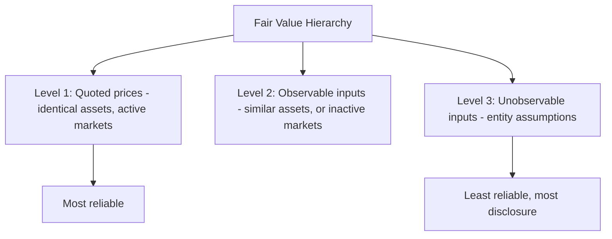

# Fair Value Measurement

## Fair Value Definition

Under ASC 820, **fair value** is defined as:

> The price that would be received to sell an asset or paid to transfer a liability in an **orderly transaction** between **market participants** at the **measurement date**.
> This is an **exit price** — the price from the perspective of a seller, not a buyer.
> :::info Key Concepts

- **Orderly transaction** — not a forced sale or liquidation
- **Market participants** — independent, knowledgeable, willing, and able parties
- **Measurement date** — the date of the financial statements (or interim measurement date)
  :::

---

## Principal Market vs. Most Advantageous Market

Fair value is determined based on transactions in:

1. **Principal market** — the market with the **greatest volume and activity** for the asset or liability
2. **Most advantageous market** — if no principal market exists, the market that **maximizes** the amount received (for assets) or **minimizes** the amount paid (for liabilities) after considering transaction costs
   :::tip Exam Tip
   **Transaction costs** are used to determine the most advantageous market but are **not** included in the fair value measurement itself. **Transport costs** (costs to move the asset to the market) **are** included in the measurement.
   :::
   **Example:** Bear Co. holds a commodity that trades in two active markets:
   | Market | Price | Transaction Costs | Transport Costs | Net Proceeds |
   |---|---|---|---|---|
   | Market A | \$105 | \$3 | \$2 | \$100 |
   | Market B | \$103 | \$1 | \$1 | \$101 |
   Market B is the most advantageous market (\$101 > \$100). However, the **fair value** reported excludes transaction costs:
   $$
   \text{Fair Value} = \$103 - \$1 \text{ (transport)} = \$102
   $$

---

## Valuation Approaches

ASC 820 identifies three acceptable approaches for measuring fair value:

### 1. Market Approach

Uses prices and other relevant information from **market transactions** involving identical or comparable assets/liabilities.
| Technique | Description |
|---|---|
| Quoted prices | Directly observable market prices |
| Matrix pricing | Used for fixed-income securities based on benchmark quoted prices |
| Market multiples | Comparable company analysis using P/E, EV/EBITDA, etc. |
**Example:** Gies Co. holds 1,000 shares of a publicly traded stock. The closing price is \$45 per share:

$$
\text{Fair Value} = 1{,}000 \times \$45 = \$45{,}000
$$

### 2. Cost Approach

Reflects the amount required to **replace** the service capacity of an asset (**current replacement cost**). Often used for tangible assets.

$$
\text{Fair Value} = \text{Replacement Cost} - \text{Physical Deterioration} - \text{Functional Obsolescence} - \text{Economic Obsolescence}
$$

**Example:** MAS Inc. owns a specialized machine. A new equivalent machine costs \$200,000, but the existing machine has 40% of its useful life remaining:

$$
\text{Fair Value} \approx \$200{,}000 \times 40\% = \$80{,}000
$$

### 3. Income Approach

Converts **future amounts** (cash flows, earnings) to a **single present value**. Techniques include:
| Technique | Description |
|---|---|
| Discounted cash flow (DCF) | PV of expected future cash flows |
| Option pricing models | Black-Scholes, binomial models |
| Multi-period excess earnings | Used for intangible assets |
**Example:** Kingfisher Industries values a patent using DCF. Expected annual cash flows are \$50,000 for 5 years, discounted at 8%:

$$
\text{Fair Value} = \$50{,}000 \times \frac{1 - (1.08)^{-5}}{0.08} = \$50{,}000 \times 3.99271 = \$199{,}636
$$

---

## Fair Value Hierarchy

ASC 820 establishes a three-level hierarchy based on the **observability** of inputs used in valuation techniques. Level 1 inputs are most reliable; Level 3 inputs are least reliable.

### Level 1 — Quoted Prices in Active Markets

- **Unadjusted** quoted prices for **identical** assets or liabilities in **active markets**
- Most reliable measurement
- Examples: NYSE-listed stock prices, commodity exchange prices
  :::info
  Level 1 inputs should be used without adjustment. A "blockage factor" (discount for holding a large block of shares) is **not** permitted for Level 1 measurements.
  :::

### Level 2 — Observable Inputs Other Than Level 1

- Quoted prices for **similar** (not identical) assets or liabilities in active markets
- Quoted prices for identical or similar items in **inactive** markets
- Observable inputs such as interest rates, yield curves, credit spreads
- Inputs derived from or corroborated by **observable** market data
  **Examples:**
- Interest rate swaps priced using the LIBOR/SOFR yield curve
- Real estate valued using comparable sales in the area
- Corporate bonds priced using benchmark Treasury rates plus a credit spread

### Level 3 — Unobservable Inputs

- **Entity-developed inputs** reflecting the entity's own assumptions about what market participants would use
- Used when observable inputs are not available
- Require the **most disclosure**
  **Examples:**
- Long-term cash flow projections for a private company
- Internally developed discount rates
- Assumptions about future technology adoption rates



### Classification Rules

| Scenario                                                  | Level   |
| --------------------------------------------------------- | ------- |
| NYSE-traded equity security                               | Level 1 |
| OTC bond priced with observable yield curves              | Level 2 |
| Private company valued with internal DCF model            | Level 3 |
| Real estate appraised using comparable sales              | Level 2 |
| Goodwill tested for impairment using internal projections | Level 3 |

:::warning

The **entire** fair value measurement is classified based on the **lowest level input** that is **significant** to the measurement. If a Level 2 measurement uses a significant Level 3 input, the entire measurement is classified as Level 3.

:::
---

## Fair Value Disclosures

Entities must disclose information to help users assess:

### 1. Valuation Techniques and Inputs

- Description of the valuation technique(s) used (market, cost, income)
- Key inputs and assumptions
- Any changes in techniques from prior periods and the reason

### 2. Level 3 Measurement Uncertainty

For recurring Level 3 measurements, entities must disclose:

- A **reconciliation** of beginning to ending balances (showing purchases, sales, gains/losses, transfers)
- The amount of total gains or losses included in **earnings** and where they are reported
- **Sensitivity analysis** — how changes in unobservable inputs would affect fair value

### 3. Impact on Financial Performance

- Unrealized gains and losses for assets/liabilities still held at the reporting date
- Transfers between Level 1, 2, and 3 (and reasons)

### 4. Required Disclosures Summary

| Measurement Type | Fair Value | Level    | Technique | Inputs   |
| ---------------- | ---------- | -------- | --------- | -------- |
| Recurring        | Required   | Required | Required  | Required |
| Nonrecurring     | Required   | Required | Required  | Required |

## **Example disclosure:** BIF Partners reports an investment property at fair value of \$1,200,000 (Level 3). The income approach was used with a capitalization rate of 7.5% applied to net operating income. A 50-basis-point change in the cap rate would change the fair value by approximately ±\$80,000.

## Exceptions to Fair Value Measurement

Certain items are **excluded** from ASC 820's scope or have specific measurement exceptions:
| Exception | Standard |
|---|---|
| Inventory measured at NRV | ASC 330 |
| Leases | ASC 842 |
| Share-based payment transactions | ASC 718 |
| ARO initial measurement | ASC 410 |
| Retirement benefit plan assets | ASC 715/960 |
Additionally, certain practical expedients exist:

- **Net asset value (NAV) per share** may be used as a practical expedient for investments in certain funds (hedge funds, private equity) that do not have readily determinable fair values
- This NAV practical expedient measurement is **not** classified within the fair value hierarchy

---

## Fair Value Option

Under ASC 825, entities may **elect** to measure certain financial assets and liabilities at fair value (the "fair value option"). Once elected, the choice is **irrevocable** for that instrument.
Illini Entertainment elects the fair value option for a \$500,000 note payable. At year-end, the fair value of the note is \$480,000:

$$
\text{Gain} = \$500{,}000 - \$480{,}000 = \$20{,}000
$$

```journal
Dr. Notes payable              20,000
    Cr. Unrealized gain — fair value    20,000
```

:::danger

Changes in fair value attributable to **instrument-specific credit risk** for liabilities measured under the fair value option are reported in **OCI**, not net income (ASU 2016-01).

:::
---

## Summary

:::note Chapter Checklist

- [ ] Define fair value as an exit price in an orderly transaction
- [ ] Distinguish principal market from most advantageous market
- [ ] Apply the three valuation approaches (market, cost, income)
- [ ] Classify measurements within the Level 1/2/3 hierarchy
- [ ] Determine the overall level based on the lowest significant input
- [ ] Understand required disclosures, especially for Level 3 measurements
- [ ] Identify exceptions and the NAV practical expedient
- [ ] Know the fair value option and where credit risk changes are reported
      :::
