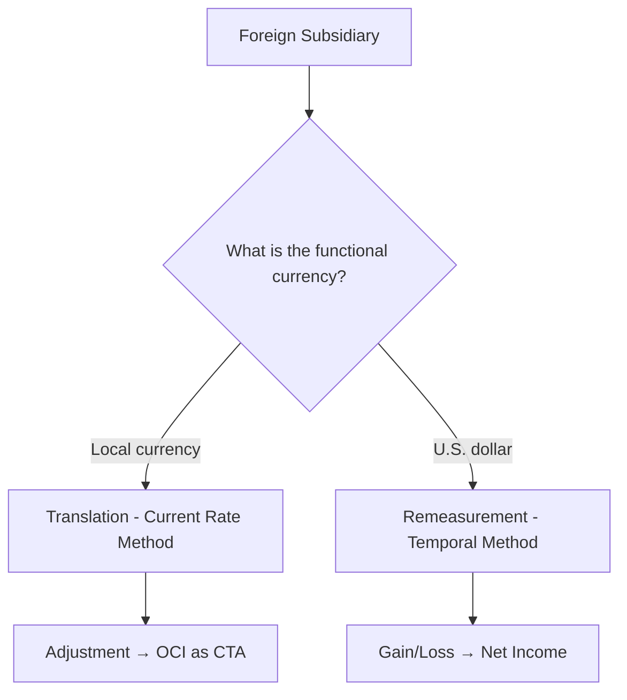

# Foreign Currency Issues

## Overview

When a U.S. company engages in transactions denominated in a foreign currency or has foreign subsidiaries, it must account for the effects of exchange rate fluctuations. ASC 830, _Foreign Currency Matters_, addresses two main areas:

1. **Foreign currency transactions** — buying/selling goods in a foreign currency
2. **Foreign currency translation and remeasurement** — converting a foreign subsidiary's financial statements

---

## Foreign Currency Transactions

A foreign currency transaction occurs when a U.S. company enters into a transaction denominated in a currency other than the U.S. dollar (its functional currency).

### Recording at the Spot Rate

Transactions are initially recorded at the **spot rate** (the exchange rate on the transaction date).
**Example:** On November 1, Bear Co. sells merchandise to a customer in the UK for £100,000 when the spot rate is \$1.30/£.

$$
\text{Receivable} = £100{,}000 \times \$1.30 = \$130{,}000
$$

```journal
Dr. Accounts receivable       130,000
    Cr. Sales revenue                 130,000
```

### Year-End Remeasurement

At the balance sheet date, **monetary items** (receivables, payables, cash) denominated in a foreign currency are adjusted to the **current spot rate**. The resulting gain or loss is recognized in **net income**.
On December 31, the spot rate is \$1.35/£:

$$
\text{New receivable value} = £100{,}000 \times \$1.35 = \$135{,}000
$$

$$
\text{Foreign currency gain} = \$135{,}000 - \$130{,}000 = \$5{,}000
$$

```journal
Dr. Accounts receivable         5,000
    Cr. Foreign currency gain           5,000
```

:::tip[Exam Tip]

**Receivables:** If the foreign currency **strengthens**, the U.S. company has a **gain** (the receivable is worth more in USD). If it **weakens**, the company has a **loss**.
**Payables:** The effect is opposite — a strengthening foreign currency means a **loss** (the payable costs more in USD).

:::

### Settlement

On February 1, Bear Co. collects the £100,000 when the spot rate is \$1.28/£:

$$
\text{Cash received} = £100{,}000 \times \$1.28 = \$128{,}000
$$

$$
\text{Foreign currency loss} = \$135{,}000 - \$128{,}000 = \$7{,}000
$$

```journal
Dr. Cash                      128,000
Dr. Foreign currency loss       7,000
    Cr. Accounts receivable           135,000
```

### Summary of Exchange Rate Effects

| Situation     | FC Strengthens | FC Weakens |
| ------------- | -------------- | ---------- |
| **A/R in FC** | Gain           | Loss       |
| **A/P in FC** | Loss           | Gain       |

---

## Forward Contracts (Hedging)

A company may enter into a **forward contract** to hedge against exchange rate risk. A forward contract locks in a future exchange rate for buying or selling foreign currency.

### Hedging a Recognized Foreign Currency Receivable

On November 1, Bear Co. enters into a forward contract to sell £100,000 in 90 days at a forward rate of \$1.32/£.
The forward contract is a **fair value hedge** of the receivable.
At December 31:

- Spot rate: \$1.35/£
- Forward rate for remaining 30 days: \$1.33/£
  The receivable gain of \$5,000 was recorded above. The forward contract generates:
  $$
  \text{Forward contract loss} = (£100{,}000) \times (\$1.33 - \$1.32) = \$1{,}000
  $$
  This simplified example shows how the hedge offsets (but may not perfectly match) the gain/loss on the hedged item.

  :::info
  The **forward contract** is recorded at fair value on the balance sheet. Changes in fair value are recognized in earnings for fair value hedges, offsetting the gain/loss on the hedged item.
  :::

---

## Foreign Currency Translation vs. Remeasurement

When a U.S. parent company has a foreign subsidiary, the subsidiary's financial statements must be converted to U.S. dollars. The method depends on the subsidiary's **functional currency**.

### Functional Currency Concept

The **functional currency** is the currency of the primary economic environment in which the subsidiary operates.
| Functional Currency | Method | Where Gains/Losses Go |
|---|---|---|
| Foreign currency (local) | **Translation** (current rate method) | OCI (CTA) |
| U.S. dollar | **Remeasurement** (temporal method) | Net income |



---

## Translation (Current Rate Method)

Used when the functional currency is the **foreign (local) currency**. This method preserves the subsidiary's financial relationships.
| Financial Statement Item | Exchange Rate Used |
|---|---|
| Assets | **Current rate** (balance sheet date) |
| Liabilities | **Current rate** (balance sheet date) |
| Equity (common stock, APIC) | **Historical rate** (date of issuance) |
| Revenues and expenses | **Weighted-average rate** for the period |
| Dividends | **Historical rate** (date declared) |
The **cumulative translation adjustment (CTA)** is reported in **accumulated other comprehensive income (AOCI)** — a component of equity.
**Example:** Gies Co. (U.S. parent) has a subsidiary in Japan. The yen is the functional currency. At year-end:
| Item | Yen Amount | Rate | USD Amount |
|---|---|---|---|
| Total assets | ¥50,000,000 | 0.0068 (current) | \$340,000 |
| Total liabilities | ¥20,000,000 | 0.0068 (current) | \$136,000 |
| Common stock | ¥10,000,000 | 0.0080 (historical) | \$80,000 |
| Retained earnings | ¥15,000,000 | Various | \$110,000 |
| Revenue | ¥30,000,000 | 0.0070 (average) | \$210,000 |
| Expenses | ¥25,000,000 | 0.0070 (average) | \$175,000 |
The CTA is the **plug** that makes the balance sheet balance in USD.

$$
\text{CTA} = \text{Total Assets (USD)} - \text{Total Liabilities (USD)} - \text{Equity accounts (USD)}
$$

$$
\text{CTA} = \$340{,}000 - \$136{,}000 - \$80{,}000 - \$110{,}000 = \$14{,}000
$$

---

## Remeasurement (Temporal Method)

Used when the functional currency is the **U.S. dollar** (or the subsidiary operates in a highly inflationary economy).
| Financial Statement Item | Exchange Rate Used |
|---|---|
| Monetary assets/liabilities (cash, receivables, payables) | **Current rate** |
| Nonmonetary assets (inventory at cost, fixed assets, intangibles) | **Historical rate** |
| Revenues and expenses | **Weighted-average rate** |
| Depreciation, amortization, COGS (if from historical cost inventory) | **Historical rate** |
| Common stock, APIC | **Historical rate** |
The **remeasurement gain or loss** is reported in **net income** (not OCI).

:::warning

A key difference: under translation, **all** assets use the current rate. Under remeasurement, only **monetary** items use the current rate while **nonmonetary** items use historical rates.

:::

---

## Highly Inflationary Economies

## An economy is considered highly inflationary if the cumulative inflation rate over a 3-year period exceeds approximately **100%** (roughly 26% per year compounded). In such cases, the functional currency is deemed to be the **reporting currency (USD)**, and the **temporal method** (remeasurement) is used regardless of the subsidiary's actual operating environment.

## Key Comparison

| Feature               | Translation         | Remeasurement                              |
| --------------------- | ------------------- | ------------------------------------------ |
| When used             | FC = local currency | FC = USD                                   |
| Assets rate           | Current             | Monetary: current; Nonmonetary: historical |
| Revenue/expense rate  | Average             | Average (except historical-cost items)     |
| Equity rate           | Historical          | Historical                                 |
| Gain/loss reported in | **OCI (CTA)**       | **Net income**                             |

:::tip[Exam Mnemonic]

**"Current goes to CTA"** — the current rate method produces a CTA that goes to OCI.
**"Temporal goes to the temporaries (income statement)"** — remeasurement gains/losses go directly to net income.

:::

---

## Summary

:::note[Chapter Checklist]

- [ ] Record foreign currency transactions at the spot rate
- [ ] Remeasure monetary items at year-end and recognize gains/losses in income
- [ ] Calculate settlement gains/losses on collection or payment
- [ ] Understand the basics of forward contracts as hedges
- [ ] Determine the functional currency to choose translation vs. remeasurement
- [ ] Apply the current rate method (translation) and report CTA in OCI
- [ ] Apply the temporal method (remeasurement) and report gains/losses in income
- [ ] Identify highly inflationary economies and use the temporal method
      :::
