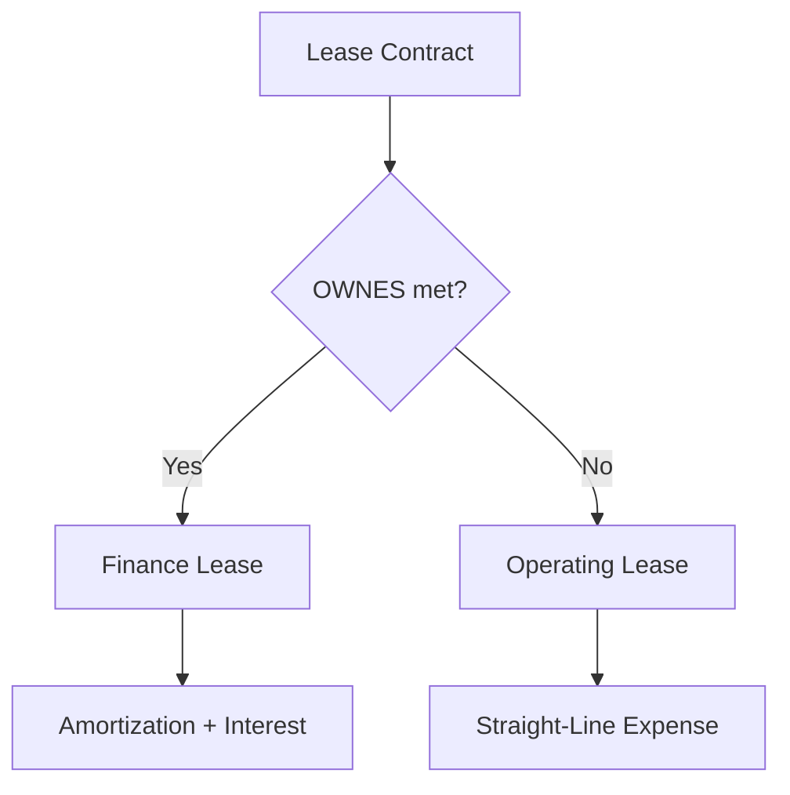

# Lease Accounting

## What Is a Lease?

A **lease** is a contract that conveys the right to control the use of an identified asset for a period of time in exchange for consideration. Under ASC 842, lessees recognize virtually all leases on the balance sheet (with a narrow exception for short-term leases).
:::info
The key question is whether the customer has the **right to control the use** of the asset — meaning the customer directs how and for what purpose the asset is used and obtains substantially all the economic benefits.
:::

---

## Combining and Separating Lease Components

A contract may contain **lease components** (the right to use an asset) and **non-lease components** (services like maintenance, insurance, or taxes paid by the lessor).

- **Separate** each lease component and allocate consideration based on relative standalone prices
- **Practical expedient:** A lessee may elect (by asset class) to combine lease and non-lease components into a single lease component
  **Example:** Bear Co. leases office space for \$10,000/month. The lease includes \$1,500/month for common area maintenance (CAM). If Bear Co. elects the practical expedient, the entire \$10,000 is treated as a lease payment.

---

## Classification: Finance vs. Operating Lease (OWNES)

From the **lessee's** perspective, a lease is classified as a **finance lease** if it meets **any one** of the OWNES criteria:
| Letter | Criterion | Test |
|---|---|---|
| **O** | Ownership transfer | Title transfers to lessee by end of lease |
| **W** | Written purchase option | Lessee has option reasonably certain to exercise |
| **N** | Ninety percent | PV of lease payments ≥ 90% of asset fair value |
| **E** | Economic life | Lease term ≥ 75% of economic life |
| **S** | Specialized asset | No alternative use to lessor at end of lease |
If **none** of the OWNES criteria are met, the lease is an **operating lease**.
:::tip Exam Tip
Both finance and operating leases result in a **right-of-use (ROU) asset** and a **lease liability** on the balance sheet. The difference is in how expense is recognized on the income statement.
:::

---

## Determining Lease Components

### Lease Term

The lease term includes:

- The **noncancellable period**
- Periods covered by an **option to extend** if the lessee is reasonably certain to exercise
- Periods covered by an **option to terminate** if the lessee is reasonably certain **not** to exercise

### Lease Payments

Lease payments include:

- Fixed payments (less any lease incentives)
- Variable payments that depend on an **index or rate**
- Exercise price of a purchase option if reasonably certain to exercise
- Penalties for terminating if the term reflects lessee exercising the termination option
- Residual value guarantees (only the amount the lessee expects to owe)
  :::warning
  Variable payments based on **usage** or **performance** (e.g., percentage of sales) are **excluded** from the lease liability measurement and expensed as incurred.
  :::

### Discount Rate

- Use the rate **implicit in the lease** if readily determinable
- Otherwise, use the lessee's **incremental borrowing rate**

---

## Lessee Operating Lease Accounting

Under an operating lease, the lessee recognizes a **single lease expense on a straight-line basis** over the lease term.
**Example:** Gies Co. enters a 5-year operating lease for equipment on January 1. Annual payments of \$24,000 are due at the **end** of each year. The incremental borrowing rate is 6%.

### Initial Measurement

$$
\text{PV of Lease Payments} = \$24{,}000 \times \frac{1 - (1.06)^{-5}}{0.06} = \$24{,}000 \times 4.21236 = \$101{,}097
$$

```journal
Dr. Right-of-use asset        101,097
    Cr. Lease liability               101,097
```

### Year 1 — Payment and Expense

Straight-line expense = \$24,000 per year (total payments ÷ lease term).
Interest on lease liability = \$101,097 × 6% = \$6,066.
Lease liability reduction = \$24,000 − \$6,066 = \$17,934.
ROU asset amortization (plug) = \$24,000 − \$6,066 = \$17,934.

```journal
Dr. Lease expense              24,000
    Cr. Lease liability                17,934
    Cr. Right-of-use asset              6,066
```

Wait — let me correct this. The operating lease entry is:

```journal
Dr. Lease expense              24,000
    Cr. Cash                           24,000
```

And separately, adjust the liability and ROU asset:

```journal
Dr. Lease liability            17,934
Dr. Right-of-use asset amort.   6,066
    Cr. Right-of-use asset             24,000
```

:::info Simplified View
In practice, the total lease expense equals the cash payment (\$24,000). Under the hood, interest accrues on the liability while the ROU asset is reduced by a plug amount so that the net expense is straight-line.
:::
The balance sheet at Year 1 end:

- Lease liability: \$101,097 − \$17,934 = \$83,163
- ROU asset: \$101,097 − (\$24,000 − \$6,066) = \$83,163
  For an operating lease, the ROU asset always equals the lease liability (adjusted for prepayments, incentives, and initial direct costs).

---

## Lessee Finance Lease Accounting

Under a finance lease, the lessee recognizes **two separate expenses**: amortization of the ROU asset and interest on the lease liability. This results in higher total expense in early years (front-loaded).
**Example:** MAS Inc. enters a 4-year finance lease on January 1 for a machine with a fair value of \$80,000. Annual payments are \$22,000 at the end of each year. The rate implicit in the lease is 5%.

### Initial Measurement

$$
\text{PV} = \$22{,}000 \times \frac{1 - (1.05)^{-4}}{0.05} = \$22{,}000 \times 3.54595 = \$78{,}011
$$

```journal
Dr. Right-of-use asset         78,011
    Cr. Lease liability                78,011
```

### Year 1

**Interest expense:** \$78,011 × 5% = \$3,901
**Lease liability reduction:** \$22,000 − \$3,901 = \$18,099

```journal
Dr. Interest expense            3,901
Dr. Lease liability            18,099
    Cr. Cash                           22,000
```

**ROU asset amortization** (straight-line over lease term):

$$
\frac{\$78{,}011}{4} = \$19{,}503
$$

```journal
Dr. Amortization expense       19,503
    Cr. Right-of-use asset             19,503
```

### Amortization Schedule

| Year | Beg. Liability | Interest (5%) | Payment  | Principal | End Liability |
| ---- | -------------- | ------------- | -------- | --------- | ------------- |
| 1    | \$78,011       | \$3,901       | \$22,000 | \$18,099  | \$59,912      |
| 2    | \$59,912       | \$2,996       | \$22,000 | \$19,004  | \$40,908      |
| 3    | \$40,908       | \$2,045       | \$22,000 | \$19,955  | \$20,953      |
| 4    | \$20,953       | \$1,047       | \$22,000 | \$20,953  | \$0           |

---

## Comparison: Operating vs. Finance Lease

| Feature                 | Operating Lease                    | Finance Lease                               |
| ----------------------- | ---------------------------------- | ------------------------------------------- |
| Balance sheet           | ROU asset + Lease liability        | ROU asset + Lease liability                 |
| Income statement        | Single straight-line lease expense | Amortization + Interest (front-loaded)      |
| Cash flow statement     | Operating section                  | Principal → Financing; Interest → Operating |
| Total expense over life | Same                               | Same                                        |



---

## Short-Term Lease Exception

A lessee may elect **not** to recognize a ROU asset and lease liability for leases with a term of **12 months or less** at commencement (with no purchase option the lessee is reasonably certain to exercise).
Under this election, lease payments are recognized as expense on a **straight-line basis** over the lease term.
BIF Partners leases a copier for 10 months at \$500/month:

```journal
Dr. Lease expense                 500
    Cr. Cash                             500
```

:::tip
The short-term lease election is made by **asset class**, not lease-by-lease.
:::

---

## Disclosures

Lessees must disclose:

- Nature of leasing activities
- Finance and operating lease costs
- Maturity analysis of lease liabilities (for each of the next 5 years, then thereafter)
- Weighted-average remaining lease term
- Weighted-average discount rate
- ROU assets obtained in exchange for new lease liabilities

---

## Summary

:::note Chapter Checklist

- [ ] Determine whether a contract contains a lease
- [ ] Apply OWNES criteria to classify as finance or operating
- [ ] Calculate the lease liability using PV of lease payments
- [ ] Record ROU asset and lease liability at commencement
- [ ] Distinguish expense patterns: straight-line (operating) vs. front-loaded (finance)
- [ ] Apply the short-term lease exception when applicable
- [ ] Prepare required disclosures
      :::
