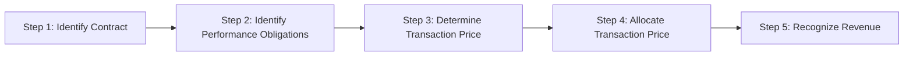

# Revenue Recognition (ASC 606)

## Overview of the Five-Step Model

ASC 606, _Revenue from Contracts with Customers_, provides a unified framework for recognizing revenue. The core principle is that revenue should be recognized when (or as) a company satisfies a performance obligation by transferring a promised good or service to a customer in an amount reflecting expected consideration.



---

## Step 1 — Identify the Contract

A **contract** exists when all five criteria are met:

1. Both parties have **approved** the contract and are committed
2. Each party's **rights** regarding goods/services are identifiable
3. **Payment terms** are identifiable
4. The contract has **commercial substance**
5. Collection is **probable**
   :::info
   If a contract does not meet all five criteria, any consideration received is recorded as a **liability** until the criteria are met or the contract is terminated.
   :::

### Contract Combination

Two or more contracts with the same customer should be **combined** if:

- Negotiated as a package with a single commercial objective
- Consideration in one contract depends on the other
- Goods/services are a single performance obligation

### Contract Modifications

A modification is treated as a **separate contract** when:

1. The scope increases due to **distinct** goods or services, **and**
2. The price increases by the **standalone selling price** of those goods/services
   If not a separate contract, the modification is accounted for as either a termination of the old contract and creation of a new one, or a cumulative catch-up adjustment.

---

## Step 2 — Identify Performance Obligations

A **performance obligation** is a promise to transfer a distinct good or service (or a series of distinct goods/services that are substantially the same and have the same pattern of transfer).
A good or service is **distinct** if both conditions are met:

1. **Capable of being distinct** — the customer can benefit from it on its own or with readily available resources
2. **Distinct within the contract** — it is separately identifiable from other promises
   **Example:** Bear Co. sells a software license and provides 2 years of post-contract support (PCS). The software functions independently. These are **two** performance obligations because the software is distinct from the PCS.
   :::tip Exam Tip
   Shipping and handling activities occurring **after** transfer of control are a separate performance obligation. Activities occurring **before** transfer of control are fulfillment costs, not a separate obligation.
   :::

---

## Step 3 — Determine the Transaction Price

The **transaction price** is the amount of consideration to which the entity expects to be entitled. It includes:

### Variable Consideration

Variable amounts (discounts, rebates, bonuses, penalties) are estimated using:
| Method | When to Use |
|---|---|
| **Expected value** | Large number of similar contracts |
| **Most likely amount** | Binary outcomes (threshold-based bonuses) |
Variable consideration is included only to the extent it is **probable** that a **significant reversal** will not occur (the "constraint").

### Significant Financing Component

If the timing of payments provides the customer or entity with a significant financing benefit, the transaction price is adjusted. Ignore if the period between payment and transfer is **one year or less** (practical expedient).

### Noncash Consideration

Measured at **fair value**. If fair value cannot be reasonably estimated, use the standalone selling price of the goods/services promised.

### Consideration Payable to a Customer

Payments to a customer (e.g., slotting fees, cooperative advertising) reduce the transaction price unless they are for a **distinct good or service** received from the customer.
Gies Co. pays a retailer \$50,000 for shelf space. This is consideration payable to a customer and reduces revenue:

```journal
Dr. Revenue (contra)           50,000
    Cr. Cash                           50,000
```

---

## Step 4 — Allocate the Transaction Price

The transaction price is allocated to each performance obligation based on **relative standalone selling prices (SSP)**.

### Determining Standalone Selling Price

Best evidence is the **observable price** when the entity sells the good/service separately. If not directly observable, estimate using:
| Method | Description |
|---|---|
| Adjusted market assessment | Estimate price customers would pay |
| Expected cost plus margin | Forecast costs and add appropriate margin |
| Residual approach | Only if SSP is highly variable or uncertain |

### Allocating Discounts

A discount is allocated to **all** performance obligations proportionally unless the entity has observable evidence that the discount relates entirely to one or more (but not all) performance obligations.

### Allocating Variable Consideration

Variable consideration is allocated to a specific performance obligation if:

1. The variable payment relates specifically to that obligation, **and**
2. Allocating entirely to that obligation is consistent with the overall allocation objective
   **Example:** MAS Inc. enters a \$120,000 contract for equipment and installation. SSPs are \$100,000 (equipment) and \$40,000 (installation). Total SSP = \$140,000.
   | Obligation | SSP | Ratio | Allocated Price |
   |---|---|---|---|
   | Equipment | \$100,000 | 71.4% | \$85,714 |
   | Installation | \$40,000 | 28.6% | \$34,286 |
   | **Total** | **\$140,000** | **100%** | **\$120,000** |

---

## Step 5 — Recognize Revenue

Revenue is recognized when (or as) the entity **satisfies a performance obligation** by transferring control of the promised good or service.

### Satisfaction Over Time

A performance obligation is satisfied over time if **any one** of the following is met:

1. The customer simultaneously receives and consumes the benefits (e.g., cleaning services)
2. The entity's performance creates or enhances an asset the customer controls (e.g., building on customer land)
3. The entity's performance does not create an asset with an alternative use, and the entity has an enforceable right to payment for performance completed to date

#### Measuring Progress

| Method             | Type   | Basis                                 |
| ------------------ | ------ | ------------------------------------- |
| Units delivered    | Output | Physical measure of value transferred |
| Milestones reached | Output | Surveys, appraisals                   |
| Costs incurred     | Input  | Cost-to-cost method                   |

$$
\text{Percentage Complete (Cost-to-Cost)} = \frac{\text{Costs Incurred to Date}}{\text{Total Estimated Costs}}
$$

**Example:** BIF Partners has a construction contract for \$2,000,000. Total estimated costs are \$1,500,000. Costs incurred in Year 1 are \$600,000.

$$
\% \text{ Complete} = \frac{\$600{,}000}{\$1{,}500{,}000} = 40\%
$$

$$
\text{Revenue Year 1} = \$2{,}000{,}000 \times 40\% = \$800{,}000
$$

```journal
Dr. Accounts receivable       800,000
    Cr. Revenue                       800,000
```

```journal
Dr. Construction expense      600,000
    Cr. Materials/Cash/etc.           600,000
```

### Satisfaction at a Point in Time

If none of the over-time criteria are met, revenue is recognized at the **point in time** when control transfers. Indicators of transfer include:

- Entity has a present right to payment
- Customer has legal title
- Physical possession has transferred
- Customer has significant risks and rewards of ownership
- Customer has accepted the asset
  Bear Co. ships inventory FOB shipping point on December 28 for \$75,000, cost \$50,000:

```journal
Dr. Accounts receivable        75,000
    Cr. Sales revenue                  75,000
```

```journal
Dr. Cost of goods sold         50,000
    Cr. Inventory                      50,000
```

---

## Contract Assets and Contract Liabilities

| Term                   | Definition                                                                 | Example                           |
| ---------------------- | -------------------------------------------------------------------------- | --------------------------------- |
| **Contract asset**     | Right to consideration conditional on something other than passage of time | Revenue recognized before billing |
| **Receivable**         | Unconditional right to consideration                                       | Billed amount due                 |
| **Contract liability** | Obligation to transfer goods/services for which consideration was received | Customer prepayments              |

Illini Entertainment receives \$30,000 upfront for a 12-month subscription service:

```journal
Dr. Cash                       30,000
    Cr. Contract liability             30,000
```

Each month, as service is provided (\$30,000 ÷ 12 = \$2,500):

```journal
Dr. Contract liability          2,500
    Cr. Subscription revenue            2,500
```

---

## Presentation and Disclosure

Revenue is presented on the income statement either as a single line item or disaggregated by:

- Type of good or service
- Geography
- Market or customer type
- Contract type
- Timing of transfer (point in time vs. over time)
  :::note Chapter Checklist
- [ ] Apply all five criteria to identify a valid contract
- [ ] Determine when goods/services are distinct performance obligations
- [ ] Estimate variable consideration and apply the constraint
- [ ] Allocate the transaction price using relative SSP
- [ ] Distinguish over-time from point-in-time revenue recognition
- [ ] Properly classify contract assets, receivables, and contract liabilities
      :::
