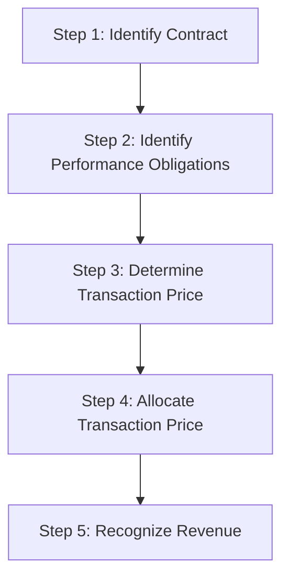

# Revenue Recognition (ASC 606)

## Overview of the Five-Step Model

ASC 606, _Revenue from Contracts with Customers_, provides a unified framework for recognizing revenue. The core principle is that revenue should be recognized when (or as) a company satisfies a performance obligation by transferring a promised good or service to a customer in an amount reflecting expected consideration.



---

## Step 1 — Identify the Contract

A **contract** exists when all five criteria are met:

1. Both parties have **approved** the contract and are committed
2. Each party's **rights** regarding goods/services are identifiable
3. **Payment terms** are identifiable
4. The contract has **commercial substance**
5. Collection is **probable**

   :::info
   If a contract does not meet all five criteria, any consideration received is recorded as a **liability** until the criteria are met or the contract is terminated.
   :::

### Contract Combination

Two or more contracts with the same customer should be **combined** if:

- Negotiated as a package with a single commercial objective
- Consideration in one contract depends on the other
- Goods/services are a single performance obligation

### Contract Modifications

A modification is treated as a **separate contract** when:

1. The scope increases due to **distinct** goods or services, **and**
2. The price increases by the **standalone selling price** of those goods/services
   If not a separate contract, the modification is accounted for as either a termination of the old contract and creation of a new one, or a cumulative catch-up adjustment.

---

## Step 2 — Identify Performance Obligations

A **performance obligation** is a promise to transfer a distinct good or service (or a series of distinct goods/services that are substantially the same and have the same pattern of transfer).
A good or service is **distinct** if both conditions are met:

1. **Capable of being distinct** — the customer can benefit from it on its own or with readily available resources
2. **Distinct within the contract** — it is separately identifiable from other promises
   **Example:** Bear Co. sells a software license and provides 2 years of post-contract support (PCS). The software functions independently. These are **two** performance obligations because the software is distinct from the PCS.

   :::tip[Exam Tip]
   Shipping and handling activities occurring **after** transfer of control are a separate performance obligation. Activities occurring **before** transfer of control are fulfillment costs, not a separate obligation.
   :::

---

## Step 3 — Determine the Transaction Price

The **transaction price** is the amount of consideration to which the entity expects to be entitled. It includes:

### Variable Consideration

Variable amounts (discounts, rebates, bonuses, penalties) are estimated using:
| Method | When to Use |
|---|---|
| **Expected value** | Large number of similar contracts |
| **Most likely amount** | Binary outcomes (threshold-based bonuses) |
Variable consideration is included only to the extent it is **probable** that a **significant reversal** will not occur (the "constraint").

### Significant Financing Component

If the timing of payments provides the customer or entity with a significant financing benefit, the transaction price is adjusted. Ignore if the period between payment and transfer is **one year or less** (practical expedient).

### Noncash Consideration

Measured at **fair value**. If fair value cannot be reasonably estimated, use the standalone selling price of the goods/services promised.

### Consideration Payable to a Customer

Payments to a customer (e.g., slotting fees, cooperative advertising) reduce the transaction price unless they are for a **distinct good or service** received from the customer.
Polar Co. pays a retailer \$50,000 for shelf space. This is consideration payable to a customer and reduces revenue:

```journal
Dr. Revenue (contra)           50,000
    Cr. Cash                           50,000
```

---

## Step 4 — Allocate the Transaction Price

The transaction price is allocated to each performance obligation based on **relative standalone selling prices (SSP)**.

### Determining Standalone Selling Price

Best evidence is the **observable price** when the entity sells the good/service separately. If not directly observable, estimate using:
| Method | Description |
|---|---|
| Adjusted market assessment | Estimate price customers would pay |
| Expected cost plus margin | Forecast costs and add appropriate margin |
| Residual approach | Only if SSP is highly variable or uncertain |

### Allocating Discounts

A discount is allocated to **all** performance obligations proportionally unless the entity has observable evidence that the discount relates entirely to one or more (but not all) performance obligations.

### Allocating Variable Consideration

Variable consideration is allocated to a specific performance obligation if:

1. The variable payment relates specifically to that obligation, **and**
2. Allocating entirely to that obligation is consistent with the overall allocation objective
   **Example:** Grizzly Inc. enters a \$120,000 contract for equipment and installation. SSPs are \$100,000 (equipment) and \$40,000 (installation). Total SSP = \$140,000.
   | Obligation | SSP | Ratio | Allocated Price |
   |---|---|---|---|
   | Equipment | \$100,000 | 71.4% | \$85,714 |
   | Installation | \$40,000 | 28.6% | \$34,286 |
   | **Total** | **\$140,000** | **100%** | **\$120,000** |

---

## Step 5 — Recognize Revenue

Revenue is recognized when (or as) the entity **satisfies a performance obligation** by transferring control of the promised good or service.

### Satisfaction Over Time

A performance obligation is satisfied over time if **any one** of the following is met:

1. The customer simultaneously receives and consumes the benefits (e.g., cleaning services)
2. The entity's performance creates or enhances an asset the customer controls (e.g., building on customer land)
3. The entity's performance does not create an asset with an alternative use, and the entity has an enforceable right to payment for performance completed to date

#### Measuring Progress

| Method             | Type   | Basis                                 |
| ------------------ | ------ | ------------------------------------- |
| Units delivered    | Output | Physical measure of value transferred |
| Milestones reached | Output | Surveys, appraisals                   |
| Costs incurred     | Input  | Cost-to-cost method                   |

$$
\text{Percentage Complete (Cost-to-Cost)} = \frac{\text{Costs Incurred to Date}}{\text{Total Estimated Costs}}
$$

**Example:** Kodiak Partners has a construction contract for \$2,000,000. Total estimated costs are \$1,500,000. Costs incurred in Year 1 are \$600,000.

$$
\% \text{ Complete} = \frac{\$600{,}000}{\$1{,}500{,}000} = 40\%
$$

$$
\text{Revenue Year 1} = \$2{,}000{,}000 \times 40\% = \$800{,}000
$$

```journal
Dr. Accounts receivable       800,000
    Cr. Revenue                       800,000
```

```journal
Dr. Construction expense      600,000
    Cr. Materials/Cash/etc.           600,000
```

:::warning[Loss Recognition on Long-Term Contracts]

Both over-time and point-in-time methods require **immediate recognition of the entire estimated loss** when a contract becomes unprofitable. The loss is not deferred until completion.

**Example:** In Year 2, Kodiak Partners revises total estimated costs to \$2,200,000, indicating an expected loss of \$200,000 on the \$2,000,000 contract. The entire \$200,000 loss must be recognized in Year 2, regardless of the percentage completed.

:::

### Satisfaction at a Point in Time

If none of the over-time criteria are met, revenue is recognized at the **point in time** when control transfers. Indicators of transfer include:

- Entity has a present right to payment
- Customer has legal title
- Physical possession has transferred
- Customer has significant risks and rewards of ownership
- Customer has accepted the asset
  Bear Co. ships inventory FOB shipping point on December 28 for \$75,000, cost \$50,000:

```journal
Dr. Accounts receivable        75,000
    Cr. Sales revenue                  75,000
```

```journal
Dr. Cost of goods sold         50,000
    Cr. Inventory                      50,000
```

---

## Contract Assets and Contract Liabilities

| Term                   | Definition                                                                 | Example                           |
| ---------------------- | -------------------------------------------------------------------------- | --------------------------------- |
| **Contract asset**     | Right to consideration conditional on something other than passage of time | Revenue recognized before billing |
| **Receivable**         | Unconditional right to consideration                                       | Billed amount due                 |
| **Contract liability** | Obligation to transfer goods/services for which consideration was received | Customer prepayments              |

Cub Entertainment receives \$30,000 upfront for a 12-month subscription service:

```journal
Dr. Cash                       30,000
    Cr. Contract liability             30,000
```

Each month, as service is provided (\$30,000 ÷ 12 = \$2,500):

```journal
Dr. Contract liability          2,500
    Cr. Subscription revenue            2,500
```

---

## Other Applications of Revenue Recognition

### Costs to Obtain and Fulfill a Contract

**Costs to obtain a contract** (e.g., sales commissions) are capitalized as an asset if the entity expects to recover them. Costs that would be incurred regardless of whether the contract was obtained (e.g., a bid proposal for an unsuccessful contract) are expensed as incurred.

**Contract fulfillment costs** are capitalized as an asset only when all three of the following are met:

1. The costs relate directly to a specific contract (or anticipated contract)
2. The costs generate or enhance resources used to satisfy performance obligations
3. The costs are expected to be recovered

Capitalized costs are amortized on a systematic basis consistent with the pattern of revenue recognition.

:::tip[Exam Tip]

As a practical expedient, costs to obtain a contract may be expensed immediately if the amortization period would be **one year or less**.

:::

### Principal vs. Agent

An entity must determine whether it is a **principal** (controls the good or service before transfer) or an **agent** (arranges for another party to provide the good or service).

| Role | Recognizes | Revenue Equals |
|---|---|---|
| **Principal** | Gross revenue | Full consideration from the customer |
| **Agent** | Net revenue | Fee or commission only |

**Key indicator:** Does the entity control the specified good or service **before** it is transferred to the customer? If yes → principal. If no → agent.

**Example:** Cub Entertainment operates a ticket marketplace. For standard listings, Bruin does not take possession of the tickets and has no pricing discretion — it simply connects the seller and buyer and earns a 15% commission. Bruin is an **agent** and recognizes revenue equal to its commission.

### Repurchase Agreements

A **repurchase agreement** is a contract in which an entity sells an asset and promises (or has the option) to repurchase it later.

| Type | Description | Accounting |
|---|---|---|
| **Forward** | Entity is **obligated** to repurchase | Financing arrangement (no sale) or lease |
| **Call option** | Entity has the **right** to repurchase | Financing arrangement (no sale) or lease, depending on economic substance |
| **Put option** | **Customer** has the right to require repurchase | If repurchase price < original selling price → lease. If repurchase price ≥ original selling price → financing arrangement |

:::info

When a repurchase agreement is treated as a **financing arrangement**, the entity does not derecognize the asset. Instead, it records a financial liability for the consideration received.

:::

### Bill-and-Hold Arrangements

In a **bill-and-hold** arrangement, the entity bills the customer but physically retains possession of the goods. Revenue may be recognized before the customer receives the product only if **all** of the following criteria are met:

1. There is a **substantive reason** for the arrangement (e.g., customer lacks warehouse space)
2. The product has been **separately identified** as belonging to the customer
3. The product is currently **ready for transfer** to the customer
4. The entity **cannot** use the product or direct it to another customer

**Example:** Grizzly Inc. manufactures specialized equipment for Bear Co. The equipment is complete and Bear Co. has been billed \$200,000, but Bear Co.'s facility is not yet ready to receive it. Grizzly holds the equipment in its warehouse. If all four criteria above are met, Grizzly recognizes revenue at the billing date.

### Consignment Arrangements

A **consignment** exists when an entity (the consignor) delivers a product to a dealer (the consignee) to hold until a third-party customer purchases it. The consignor retains control until the ultimate sale occurs.

**Revenue recognition:** The consignor recognizes revenue either upon the **sale to the ultimate customer** or after a defined **holding period expires** — whichever comes first.

Indicators that an arrangement is a consignment:

- The product is controlled by the consignor until a specified event occurs (e.g., sale to a third party)
- The consignor can require the return of the product or transfer it to another consignee
- The consignee does not have an unconditional obligation to pay for the product

### Warranty Obligations

Warranties may be accounted for in two ways depending on their nature:

| Type | Treatment |
|---|---|
| **Assurance-type warranty** (required by law or standard practice) | Not a separate performance obligation — accrue estimated warranty costs as a liability at the point of sale (cost accrual) |
| **Service-type warranty** (separately priced or provides additional service beyond assurance) | Separate performance obligation — allocate a portion of the transaction price and recognize revenue over the warranty period |

A warranty is more likely a **separate performance obligation** if:

- It is **not** required by law
- The coverage period is **lengthy** relative to the expected product life
- The entity is required to perform **specified tasks** (not just fix defects)

**Example:** Polar Co. sells a laptop for \$1,200 with a standard 1-year warranty (assurance-type) and offers an optional 2-year extended warranty for \$150 (service-type). The \$1,200 is recognized at the point of sale, with an estimated warranty accrual for Year 1. The \$150 extended warranty revenue is recognized ratably over the 2-year extended period.

### Customer Right of Return

When a customer has the right to return a product, the entity should:

1. Recognize revenue for the amount of consideration it expects to be **entitled to keep** (i.e., excluding estimated returns)
2. Record a **refund liability** for the portion expected to be returned
3. Recognize an **asset** (and corresponding adjustment to cost of sales) for the right to recover products from customers upon settling the refund liability

**Example:** Kodiak Partners sells \$500,000 of merchandise and estimates a 5% return rate based on historical data.

```journal
Dr. Accounts receivable        500,000
    Cr. Sales revenue                  475,000
    Cr. Refund liability                25,000
```

```journal
Dr. Cost of goods sold         285,000
Dr. Right of return asset       15,000
    Cr. Inventory                      300,000
```

(Assuming cost of goods is 60% of selling price: \$500,000 × 60% = \$300,000 total cost; returned portion = \$25,000 × 60% = \$15,000.)

---

## Presentation and Disclosure

Revenue is presented on the income statement either as a single line item or disaggregated by:

- Type of good or service
- Geography
- Market or customer type
- Contract type
- Timing of transfer (point in time vs. over time)

  :::note[Chapter Checklist]
- [ ] Apply all five criteria to identify a valid contract
- [ ] Determine when goods/services are distinct performance obligations
- [ ] Estimate variable consideration and apply the constraint
- [ ] Allocate the transaction price using relative SSP
- [ ] Distinguish over-time from point-in-time revenue recognition
- [ ] Recognize estimated losses on long-term contracts immediately
- [ ] Properly classify contract assets, receivables, and contract liabilities
- [ ] Capitalize recoverable costs to obtain or fulfill a contract
- [ ] Determine principal vs. agent and report gross vs. net revenue
- [ ] Identify repurchase agreements and determine if a sale has occurred
- [ ] Apply bill-and-hold criteria before recognizing revenue
- [ ] Distinguish assurance-type from service-type warranties
- [ ] Account for customer right of return with a refund liability
      :::
