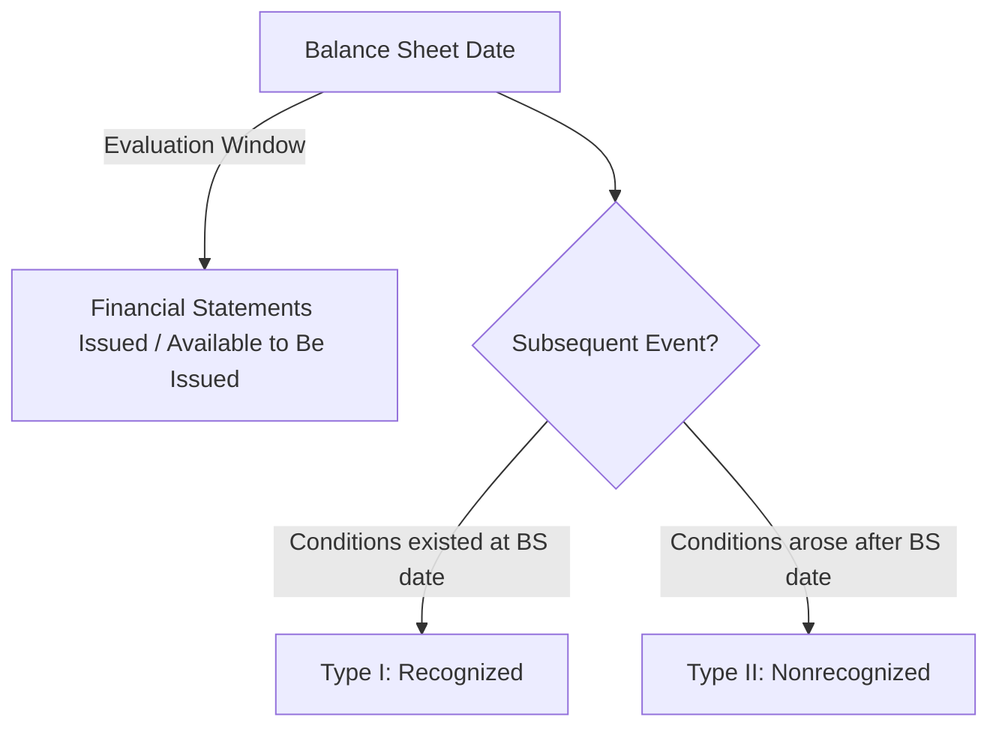

# Subsequent Events

## Definition

**Subsequent events** are events or transactions that occur **after the balance sheet date** but **before the financial statements are issued** (or available to be issued). ASC 855 requires entities to evaluate subsequent events and determine whether they require adjustment of, or disclosure in, the financial statements.



---

## Two Types of Subsequent Events

### Type I — Recognized Events (Adjusting)

A recognized subsequent event provides **additional evidence** about conditions that **existed at the balance sheet date**. The financial statements are **adjusted** to reflect the new information.

:::info[Key Principle]

Type I events clarify or confirm something that was already in existence on the balance sheet date. The financial statements should be updated because the event improves the estimate of an amount already recorded.

:::

**Examples of Type I events:**
| Event | Rationale |
|---|---|
| Settlement of litigation for a lawsuit filed before year-end | The obligation existed at the balance sheet date |
| Customer bankruptcy confirming an A/R was uncollectible | The financial difficulty existed at year-end |
| Sale of inventory below cost, confirming NRV write-down | The decline in value existed at year-end |
| Resolution of a tax dispute for a prior-year position | The tax position existed at year-end |
**Example:** Bear Co.'s fiscal year ends December 31. On February 10 (before financial statements are issued), a court rules that Bear Co. must pay \$250,000 to settle a lawsuit filed in October. Bear Co. had previously accrued \$150,000 as a contingent liability.
Since the lawsuit existed at December 31, this is a **Type I event**. Bear Co. adjusts the accrual:

```journal
Dr. Loss from litigation      100,000
    Cr. Estimated liability           100,000
```

The financial statements now reflect the \$250,000 liability.

### Type II — Nonrecognized Events (Nonadjusting)

A nonrecognized subsequent event provides evidence about conditions that **arose after the balance sheet date**. The financial statements are **not adjusted**, but the event may require **disclosure** in the notes if it would be misleading to omit.

:::warning

Type II events represent new conditions. They do **not** change amounts on the balance sheet. However, they must be disclosed if their omission would cause the financial statements to be misleading.

:::

**Examples of Type II events:**
| Event | Rationale |
|---|---|
| Business combination after year-end | New transaction, did not exist at year-end |
| Issuance of debt or equity after year-end | New financing activity |
| Loss from fire or natural disaster after year-end | New event, not a condition at year-end |
| Major customer bankruptcy occurring after year-end | New condition arising post-balance-sheet |
| Decline in market value of investments after year-end | New market conditions |
| Declaration of a stock split after year-end | New corporate action |
**Example:** On January 25, a fire destroys Gies Co.'s main warehouse (uninsured loss of \$2,000,000). Gies Co.'s fiscal year ends December 31, and financial statements have not yet been issued.
This is a **Type II event** — the fire occurred after the balance sheet date and does not relate to conditions existing at December 31. Gies Co. does **not** adjust the financial statements but **discloses** the event:

> _Subsequent Event Disclosure:_ On January 25, a fire destroyed the Company's main warehouse, resulting in an estimated uninsured loss of approximately \$2,000,000. This event occurred after the balance sheet date and is not reflected in the accompanying financial statements.

---

## Evaluation Period

The evaluation period differs depending on the type of filer:

### SEC Filers

SEC filers evaluate subsequent events through the date the financial statements are **issued** (filed with the SEC).

### Non-SEC Filers

Non-SEC filers evaluate subsequent events through the date the financial statements are **available to be issued** — the date the financial statements are complete in a form and format that complies with GAAP and all approvals necessary for issuance have been obtained.
| Entity Type | Evaluate Through | Disclose the Date? |
|---|---|---|
| SEC filer | Date financial statements are **issued** | Required |
| Non-SEC filer | Date financial statements are **available to be issued** | Required |

:::tip[Exam Tip]

Both types of filers must disclose **the date through which subsequent events have been evaluated** and whether that date is the issued date or available-to-be-issued date.

:::

---

## Decision Framework

| Question                                           | If Yes                                       | If No                                     |
| -------------------------------------------------- | -------------------------------------------- | ----------------------------------------- |
| Did the condition exist at the balance sheet date? | **Type I** — Adjust the financial statements | **Type II** — Disclose only (if material) |
| Would omission of the disclosure be misleading?    | Disclose in the notes                        | No action required                        |

**Additional examples with classification:**
| Scenario | Type | Action |
|---|---|---|
| MAS Inc. settles an insurance claim from a pre-year-end accident for \$80,000 (previously estimated at \$60,000) | Type I | Adjust accrual to \$80,000 |
| BIF Partners acquires a competitor on January 15 | Type II | Disclose the acquisition details |
| Kingfisher Industries declares a 10% stock dividend on January 20 | Type II | Disclose; consider retroactive EPS adjustment |
| Illini Security discovers a material fraud that occurred during the reporting period | Type I | Adjust financial statements |
| Illini Entertainment signs a major lease agreement in January | Type II | Disclose if material |

---

## Reissuance of Financial Statements

When financial statements are **reissued** (e.g., included in a subsequent filing or in comparative statements), the entity generally does **not** update them for subsequent events occurring between the original issuance date and the reissuance date.

:::danger[Exception]

If the financial statements are **revised** to correct an error, the entity must evaluate events through the new issuance date, but the evaluation is limited to the effects of the revision. New Type II events arising after the original issuance date do **not** need to be disclosed in the revised statements.

:::

---

## Revised Financial Statements

If financial statements are revised after issuance (e.g., to correct a material error discovered after the statements were issued):

1. Disclose the **date of revision** in the revised statements
2. Evaluate subsequent events only as they relate to the **revision**
3. Disclose that the subsequent events evaluation is limited to the revision

---

## Comparison Table

| Feature                    | Type I (Recognized)                       | Type II (Nonrecognized)                 |
| -------------------------- | ----------------------------------------- | --------------------------------------- |
| Condition timing           | Existed at balance sheet date             | Arose after balance sheet date          |
| Financial statement effect | **Adjust** amounts                        | **No adjustment**                       |
| Disclosure required?       | Yes (inherent in the adjustment)          | Yes, if omission would be misleading    |
| Examples                   | Litigation settlement, A/R collectibility | Acquisitions, disasters, stock issuance |

---

## Summary

:::note[Chapter Checklist]

- [ ] Define the subsequent events evaluation window
- [ ] Distinguish Type I (recognized/adjusting) from Type II (nonrecognized/nonadjusting) events
- [ ] Adjust financial statements for Type I events with updated estimates
- [ ] Disclose Type II events if omission would be misleading
- [ ] Know the evaluation period for SEC vs. non-SEC filers
- [ ] Understand reissuance and revised financial statement rules
- [ ] Always disclose the date through which subsequent events were evaluated
      :::
