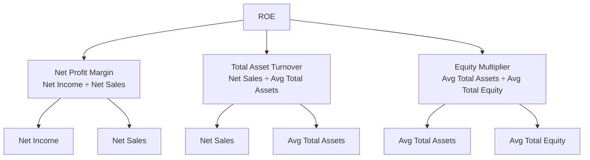

import Tabs from '@theme/Tabs';
import TabItem from '@theme/TabItem';

# Financial Ratio Analysis

Financial ratio analysis is one of the most practical tools tested on the FAR section of the CPA exam. Ratios transform raw financial statement numbers into comparable metrics that reveal a company's liquidity, efficiency, leverage, and profitability. On exam day you may be asked to **calculate** a ratio, **interpret** what a change in a ratio means, or **identify** the correct formula. This chapter covers every ratio you need to know, with formulas, explanations, and worked examples.

Ratios are typically grouped into four main categories:

1. **Liquidity** — ability to meet short-term obligations
2. **Activity (Efficiency)** — how effectively the company uses its assets
3. **Solvency (Leverage)** — ability to meet long-term obligations and overall financial risk
4. **Profitability** — ability to generate earnings

:::info Exam Tip

The CPA exam loves to test whether you use **average** balances (for balance-sheet items paired with income-statement items) versus **ending** balances. When a ratio compares an income-statement figure to a balance-sheet figure, use averages unless the question specifies otherwise.

:::
---

## Liquidity Ratios

Liquidity ratios measure whether a company can pay its bills as they come due.

### Current Ratio

Measures a company's ability to pay off its short-term liabilities with its current assets.

$$
\text{Current Ratio} = \frac{\text{Current Assets}}{\text{Current Liabilities}}
$$

A current ratio above 1.0 means the company has more current assets than current liabilities. Creditors generally prefer a higher current ratio, but an excessively high ratio may signal inefficient use of assets.

**Example — Bear Co.:** Bear Co. reports current assets of \$480,000 and current liabilities of \$300,000.

$$
\frac{\$480{,}000}{\$300{,}000} = 1.60
$$

Bear Co. has \$1.60 of current assets for every \$1.00 of current liabilities.

### Quick Ratio (Acid-Test Ratio)

Measures the ability to meet short-term obligations with the **most liquid** assets — excluding inventory and prepaid expenses.

$$
\text{Quick Ratio} = \frac{\text{Cash} + \text{Marketable Securities} + \text{Net Accounts Receivable}}{\text{Current Liabilities}}
$$

A quick ratio below 1.0 is a warning sign that the company may struggle to cover near-term debts without selling inventory.

**Example — Gies Co.:** Cash \$50,000; Marketable Securities \$20,000; Net A/R \$80,000; Current Liabilities \$200,000.

$$
\frac{\$50{,}000 + \$20{,}000 + \$80{,}000}{\$200{,}000} = 0.75
$$

Gies Co.'s quick ratio of 0.75 suggests potential short-term liquidity pressure.

### Operating Cash Flow Ratio

Shows whether operating cash flows alone can cover current liabilities.

$$
\text{Operating Cash Flow Ratio} = \frac{\text{Cash Flow from Operations}}{\text{Ending Current Liabilities}}
$$

This ratio uses **ending** current liabilities (not average) because it focuses on the ability to pay obligations that exist right now.

**Example — MAS Inc.:** Cash flow from operations \$270,000; ending current liabilities \$300,000.

$$
\frac{\$270{,}000}{\$300{,}000} = 0.90
$$

MAS Inc. generates \$0.90 of operating cash for every \$1.00 of current liabilities.

:::tip

The operating cash flow ratio is a great complement to the current ratio because it relies on **actual cash generated**, not accrual-based current assets that may include slow-moving inventory.

:::
---

## Activity (Efficiency) Ratios

These "turnover" ratios measure how quickly a company converts assets into cash or sales.

### Accounts Receivable Turnover

Measures how many times, on average, receivables are collected during a period.

$$
\text{A/R Turnover} = \frac{\text{Net Credit Sales}}{\text{Average Net Accounts Receivable}}
$$

A higher number means the company collects cash faster.

**Example — Bear Co.:** Net credit sales \$1,200,000; beginning A/R \$90,000; ending A/R \$110,000.

$$
\frac{\$1{,}200{,}000}{(\$90{,}000 + \$110{,}000)/2} = \frac{\$1{,}200{,}000}{\$100{,}000} = 12.0\text{ times}
$$

### Days Sales Outstanding (DSO)

Average number of days to collect cash from a credit sale.

$$
\text{DSO} = \frac{365}{\text{A/R Turnover}}
$$

A lower number is better — it means cash is collected more quickly.

**Example — Bear Co.:** Using the A/R turnover of 12.0 computed above:

$$
\frac{365}{12.0} \approx 30.4 \text{ days}
$$

### Inventory Turnover

How many times the company sells and replaces its inventory in a period.

$$
\text{Inventory Turnover} = \frac{\text{Cost of Goods Sold}}{\text{Average Inventory}}
$$

A higher number generally indicates strong sales and less risk of obsolete inventory.

**Example — BIF Partners:** COGS \$730,000; beginning inventory \$160,000; ending inventory \$200,000.

$$
\frac{\$730{,}000}{(\$160{,}000 + \$200{,}000)/2} = \frac{\$730{,}000}{\$180{,}000} \approx 4.06 \text{ times}
$$

### Days in Inventory

Average number of days inventory is held before being sold.

$$
\text{Days in Inventory} = \frac{365}{\text{Inventory Turnover}}
$$

**Example — BIF Partners:**

$$
\frac{365}{4.06} \approx 89.9 \text{ days}
$$

### Days of Payables Outstanding (DPO)

Average number of days a company takes to pay its suppliers.

$$
\text{DPO} = \frac{\text{Ending Accounts Payable}}{\text{COGS} / 365}
$$

A higher DPO means the company holds onto cash longer, but too high may signal strained supplier relationships.

**Example — BIF Partners:** Ending A/P \$95,000; COGS \$730,000.

$$
\frac{\$95{,}000}{\$730{,}000 / 365} = \frac{\$95{,}000}{\$2{,}000} = 47.5 \text{ days}
$$

### Cash Conversion Cycle (CCC)

The total number of days it takes a company to convert its investment in inventory into cash receipts from customers.

$$
\text{CCC} = \text{Days in Inventory} + \text{DSO} - \text{DPO}
$$

A shorter cycle is better — it means the company turns inventory into cash faster.

:::warning

The CPA exam may give you raw data and ask you to compute the CCC in one problem. You must compute all three sub-components first. Watch the order of operations!

:::
**Example — BIF Partners:** BIF Partners also has net credit sales of \$1,460,000 and average A/R of \$120,000, giving an A/R turnover of 12.17 and a DSO of 30.0 days. Using the values computed above for Days in Inventory (89.9) and DPO (47.5):

$$
89.9 + 30.0 - 47.5 = 72.4 \text{ days}
$$

### Total Asset Turnover

Measures how efficiently a company uses **all** of its assets to generate sales.

$$
\text{Total Asset Turnover} = \frac{\text{Net Sales}}{\text{Average Total Assets}}
$$

**Example — Kingfisher Industries:** Net sales \$5,000,000; average total assets \$2,500,000.

$$
\frac{\$5{,}000{,}000}{\$2{,}500{,}000} = 2.0 \text{ times}
$$

### Fixed Asset Turnover

Measures how efficiently a company uses its **property, plant, and equipment** to generate sales.

$$
\text{Fixed Asset Turnover} = \frac{\text{Net Sales}}{\text{Average Net Fixed Assets}}
$$

**Example — Kingfisher Industries:** Net sales \$5,000,000; average net PP\&E \$1,250,000.

$$
\frac{\$5{,}000{,}000}{\$1{,}250{,}000} = 4.0 \text{ times}
$$

:::note

Fixed asset turnover is especially useful for capital-intensive industries (manufacturing, utilities). A low ratio may indicate over-investment in plant assets or underutilized capacity.

:::
---

## Solvency (Leverage) Ratios 🏛️

These ratios measure long-term financial health and the degree to which a company relies on debt financing.

### Debt-to-Assets Ratio

The percentage of total assets financed by debt.

$$
\text{Debt-to-Assets} = \frac{\text{Total Liabilities}}{\text{Total Assets}}
$$

A lower number is less risky. A ratio of 0.6 means 60% of assets are funded by creditors.

**Example — Illini Entertainment:** Total liabilities \$600,000; total assets \$1,000,000.

$$
\frac{\$600{,}000}{\$1{,}000{,}000} = 0.60
$$

### Debt-to-Equity Ratio

Compares total obligations to owners' equity.

$$
\text{Debt-to-Equity} = \frac{\text{Total Liabilities}}{\text{Total Equity}}
$$

A ratio of 1.0 means debt and equity are equal. Higher values indicate greater financial risk.

**Example — Illini Entertainment:** Total liabilities \$600,000; total equity \$400,000.

$$
\frac{\$600{,}000}{\$400{,}000} = 1.50
$$

### Equity Multiplier

Shows how many dollars of assets are supported by each dollar of equity. It is a key component of the DuPont framework.

$$
\text{Equity Multiplier} = \frac{\text{Average Total Assets}}{\text{Average Total Equity}}
$$

**Example — Illini Entertainment:** Average total assets \$1,000,000; average total equity \$400,000.

$$
\frac{\$1{,}000{,}000}{\$400{,}000} = 2.50
$$

An equity multiplier of 2.50 means the company uses \$2.50 of assets for every \$1.00 of equity — the rest is financed by debt.

### Times Interest Earned (TIE) Ratio

Measures the ability to cover interest payments from operating profit.

$$
\text{TIE} = \frac{\text{EBIT}}{\text{Interest Expense}}
$$

A higher number is safer. A TIE of 5 means operating profit can cover interest five times over.

**Example — Illini Security:** EBIT \$250,000; interest expense \$50,000.

$$
\frac{\$250{,}000}{\$50{,}000} = 5.0 \text{ times}
$$

:::caution

EBIT is **not** the same as net income. You must add back interest expense and income tax expense to net income to arrive at EBIT: $\text{EBIT} = \text{Net Income} + \text{Interest Expense} + \text{Income Tax Expense}$.

:::
---

## Profitability Ratios 📈

These ratios measure how well the company generates profit from its operations.

### Gross Profit Margin

The percentage of each sales dollar remaining after paying for the goods themselves.

$$
\text{Gross Profit Margin} = \frac{\text{Net Sales} - \text{COGS}}{\text{Net Sales}}
$$

**Example — Bear Co.:** Net sales \$1,200,000; COGS \$720,000.

$$
\frac{\$1{,}200{,}000 - \$720{,}000}{\$1{,}200{,}000} = \frac{\$480{,}000}{\$1{,}200{,}000} = 40\%
$$

### Net Profit Margin

The percentage of each sales dollar that becomes profit after **all** expenses.

$$
\text{Net Profit Margin} = \frac{\text{Net Income}}{\text{Net Sales}}
$$

**Example — Bear Co.:** Net income \$120,000; net sales \$1,200,000.

$$
\frac{\$120{,}000}{\$1{,}200{,}000} = 10\%
$$

### Return on Assets (ROA)

Measures how efficiently management uses assets to generate profit.

$$
\text{ROA} = \frac{\text{Net Income}}{\text{Average Total Assets}}
$$

**Example — Gies Co.:** Net income \$90,000; average total assets \$600,000.

$$
\frac{\$90{,}000}{\$600{,}000} = 15\%
$$

### Return on Equity (ROE)

Measures the return generated for shareholders.

$$
\text{ROE} = \frac{\text{Net Income}}{\text{Average Total Equity}}
$$

**Example — Gies Co.:** Net income \$90,000; average total equity \$300,000.

$$
\frac{\$90{,}000}{\$300{,}000} = 30\%
$$

### Earnings Per Share (Basic EPS)

The portion of net income allocated to each outstanding share of common stock.

$$
\text{Basic EPS} = \frac{\text{Net Income} - \text{Preferred Dividends}}{\text{Weighted Average Common Shares Outstanding}}
$$

:::info

If there are no preferred shares, preferred dividends are zero. The exam will tell you the weighted average share count — do **not** confuse it with ending shares outstanding.

:::
**Example — MAS Inc.:** Net income \$500,000; preferred dividends \$20,000; weighted average common shares 120,000.

$$
\frac{\$500{,}000 - \$20{,}000}{120{,}000} = \frac{\$480{,}000}{120{,}000} = \$4.00 \text{ per share}
$$

---

## DuPont Analysis 🔍

The DuPont model decomposes **Return on Equity** into three drivers so you can pinpoint *why* ROE changed.

$$
\text{ROE} = \underbrace{\frac{\text{Net Income}}{\text{Net Sales}}}_{\text{Net Profit Margin}} \times \underbrace{\frac{\text{Net Sales}}{\text{Average Total Assets}}}_{\text{Total Asset Turnover}} \times \underbrace{\frac{\text{Average Total Assets}}{\text{Average Total Equity}}}_{\text{Equity Multiplier}}
$$

<Tabs>
  <TabItem value="bear" label="Bear Co." default>

| Component | Calculation | Result |
|-----------|------------|--------|
| Net Profit Margin | \$120,000 ÷ \$1,200,000 | 10.0% |
| Total Asset Turnover | \$1,200,000 ÷ \$800,000 | 1.50× |
| Equity Multiplier | \$800,000 ÷ \$500,000 | 1.60× |
| **ROE** | 10.0% × 1.50 × 1.60 | **24.0%** |

  </TabItem>
  <TabItem value="gies" label="Gies Co.">

| Component | Calculation | Result |
|-----------|------------|--------|
| Net Profit Margin | \$90,000 ÷ \$900,000 | 10.0% |
| Total Asset Turnover | \$900,000 ÷ \$600,000 | 1.50× |
| Equity Multiplier | \$600,000 ÷ \$300,000 | 2.00× |
| **ROE** | 10.0% × 1.50 × 2.00 | **30.0%** |

  </TabItem>
  <TabItem value="kingfisher" label="Kingfisher Industries">

| Component | Calculation | Result |
|-----------|------------|--------|
| Net Profit Margin | \$400,000 ÷ \$5,000,000 | 8.0% |
| Total Asset Turnover | \$5,000,000 ÷ \$2,500,000 | 2.00× |
| Equity Multiplier | \$2,500,000 ÷ \$1,000,000 | 2.50× |
| **ROE** | 8.0% × 2.00 × 2.50 | **40.0%** |

  </TabItem>
</Tabs>

:::tip Why DuPont matters on the exam

If ROE increases, DuPont analysis tells you **which lever** moved — better margins, more efficient asset use, or higher leverage. The CPA exam may ask you to identify which component drove a change in ROE.

:::
---

## Comprehensive Worked Example — Illini Entertainment

Below is a condensed set of financial data for **Illini Entertainment** for the year ended December 31, 2024. All ratios are computed from this single data set.

| Item | Amount |
|------|--------|
| Cash | \$80,000 |
| Marketable Securities | \$20,000 |
| Net Accounts Receivable (ending) | \$150,000 |
| Net Accounts Receivable (beginning) | \$130,000 |
| Inventory (ending) | \$200,000 |
| Inventory (beginning) | \$180,000 |
| Other Current Assets | \$50,000 |
| **Total Current Assets** | **\$500,000** |
| Net Fixed Assets (ending) | \$700,000 |
| Net Fixed Assets (beginning) | \$600,000 |
| **Total Assets (ending)** | **\$1,200,000** |
| **Total Assets (beginning)** | **\$1,000,000** |
| Accounts Payable (ending) | \$100,000 |
| Other Current Liabilities | \$150,000 |
| **Total Current Liabilities** | **\$250,000** |
| Long-Term Debt | \$350,000 |
| **Total Liabilities** | **\$600,000** |
| **Total Equity (ending)** | **\$600,000** |
| **Total Equity (beginning)** | **\$500,000** |
| Net Credit Sales | \$2,000,000 |
| COGS | \$1,200,000 |
| EBIT | \$300,000 |
| Interest Expense | \$40,000 |
| Income Tax Expense | \$60,000 |
| **Net Income** | **\$200,000** |
| Cash Flow from Operations | \$280,000 |
| Preferred Dividends | \$10,000 |
| Weighted Avg Common Shares | 100,000 |

### Computed Ratios

| Ratio | Formula | Calculation | Result |
|-------|---------|-------------|--------|
| Current Ratio | CA ÷ CL | \$500,000 ÷ \$250,000 | **2.00** |
| Quick Ratio | (Cash + Mkt Sec + A/R) ÷ CL | (\$80k + \$20k + \$150k) ÷ \$250k | **1.00** |
| Operating Cash Flow Ratio | CFO ÷ Ending CL | \$280,000 ÷ \$250,000 | **1.12** |
| A/R Turnover | Net Credit Sales ÷ Avg A/R | \$2,000k ÷ \$140k | **14.29×** |
| DSO | 365 ÷ A/R Turnover | 365 ÷ 14.29 | **25.5 days** |
| Inventory Turnover | COGS ÷ Avg Inventory | \$1,200k ÷ \$190k | **6.32×** |
| Days in Inventory | 365 ÷ Inv Turnover | 365 ÷ 6.32 | **57.8 days** |
| DPO | Ending A/P ÷ (COGS ÷ 365) | \$100k ÷ \$3,288 | **30.4 days** |
| Cash Conversion Cycle | DII + DSO − DPO | 57.8 + 25.5 − 30.4 | **52.9 days** |
| Total Asset Turnover | Net Sales ÷ Avg Total Assets | \$2,000k ÷ \$1,100k | **1.82×** |
| Fixed Asset Turnover | Net Sales ÷ Avg Net Fixed Assets | \$2,000k ÷ \$650k | **3.08×** |
| Debt-to-Assets | Total Liabilities ÷ Total Assets | \$600k ÷ \$1,200k | **0.50** |
| Debt-to-Equity | Total Liabilities ÷ Total Equity | \$600k ÷ \$600k | **1.00** |
| Equity Multiplier | Avg Total Assets ÷ Avg Total Equity | \$1,100k ÷ \$550k | **2.00** |
| TIE | EBIT ÷ Interest Expense | \$300k ÷ \$40k | **7.50×** |
| Gross Profit Margin | (Sales − COGS) ÷ Sales | \$800k ÷ \$2,000k | **40.0%** |
| Net Profit Margin | Net Income ÷ Net Sales | \$200k ÷ \$2,000k | **10.0%** |
| ROA | Net Income ÷ Avg Total Assets | \$200k ÷ \$1,100k | **18.2%** |
| ROE | Net Income ÷ Avg Total Equity | \$200k ÷ \$550k | **36.4%** |
| Basic EPS | (NI − Pfd Div) ÷ Wtd Avg Shares | \$190k ÷ 100k | **\$1.90** |
| DuPont ROE | NPM × TAT × EM | 10.0% × 1.82 × 2.00 | **36.4%** |

:::note DuPont Check

The DuPont ROE of 36.4% matches the direct ROE calculation — a useful self-check on the exam.

:::
---

## Summary Reference Table

| Ratio | Formula | "Good" Direction |
|-------|---------|-----------------|
| Current Ratio | Current Assets ÷ Current Liabilities | Higher (≥ 1.0) |
| Quick Ratio | (Cash + Mkt Sec + Net A/R) ÷ Current Liabilities | Higher (≥ 1.0) |
| Operating Cash Flow Ratio | CFO ÷ Ending Current Liabilities | Higher (≥ 1.0) |
| A/R Turnover | Net Credit Sales ÷ Avg Net A/R | Higher |
| DSO | 365 ÷ A/R Turnover | Lower |
| Inventory Turnover | COGS ÷ Avg Inventory | Higher |
| Days in Inventory | 365 ÷ Inventory Turnover | Lower |
| DPO | Ending A/P ÷ (COGS ÷ 365) | Higher (within reason) |
| Cash Conversion Cycle | DII + DSO − DPO | Lower |
| Total Asset Turnover | Net Sales ÷ Avg Total Assets | Higher |
| Fixed Asset Turnover | Net Sales ÷ Avg Net Fixed Assets | Higher |
| Debt-to-Assets | Total Liabilities ÷ Total Assets | Lower |
| Debt-to-Equity | Total Liabilities ÷ Total Equity | Lower |
| Equity Multiplier | Avg Total Assets ÷ Avg Total Equity | Lower (less leverage) |
| TIE | EBIT ÷ Interest Expense | Higher (≥ 3.0) |
| Gross Profit Margin | (Net Sales − COGS) ÷ Net Sales | Higher |
| Net Profit Margin | Net Income ÷ Net Sales | Higher |
| ROA | Net Income ÷ Avg Total Assets | Higher |
| ROE | Net Income ÷ Avg Total Equity | Higher |
| Basic EPS | (NI − Preferred Dividends) ÷ Wtd Avg Shares | Higher |

:::warning Common Exam Traps

- **Average vs. ending:** Use average balance-sheet amounts when pairing with an income-statement figure (ROA, ROE, turnover ratios). Use ending balances only where specified (operating cash flow ratio, DPO).
- **Net credit sales vs. net sales:** A/R turnover technically uses net *credit* sales. If the question only gives net sales, use that.
- **Preferred dividends in EPS:** Always subtract preferred dividends from net income in the numerator of basic EPS.
- **EBIT ≠ net income:** TIE uses EBIT, not net income. Don't forget to add back interest and taxes.

:::
---

## Variance Analysis (Actual vs. Plan)

Beyond ratio analysis, companies routinely compare **actual results** against their **annual budget** (or business plan) to identify favorable and unfavorable variances. This process helps management understand where performance exceeded or fell short of expectations.

### How Variances Work

A **variance** is the difference between the actual amount and the budgeted (planned) amount for a given line item.

| Variance Type | Favorable (F) | Unfavorable (U) |
|---|---|---|
| **Revenue** | Actual > Budget | Actual < Budget |
| **Expense / Cost** | Actual < Budget | Actual > Budget |

:::info

A favorable variance improves net income relative to plan; an unfavorable variance reduces net income relative to plan. A "favorable" label does **not** necessarily mean the result is good — for instance, significantly lower-than-planned advertising spending might be favorable on the cost side but could indicate underinvestment.

:::
### Example — Budget Variance Analysis

Kingfisher Industries budgeted the following for the quarter and compared to actual results:

| Line Item | Budget | Actual | Variance | F / U |
|---|---:|---:|---:|:---:|
| Sales revenue | \$500,000 | \$475,000 | \$(25,000) | U |
| Cost of goods sold | \$300,000 | \$280,000 | \$20,000 | F |
| **Gross profit** | **\$200,000** | **\$195,000** | **\$(5,000)** | **U** |
| Operating expenses | \$120,000 | \$130,000 | \$(10,000) | U |
| **Operating income** | **\$80,000** | **\$65,000** | **\$(15,000)** | **U** |

**Analysis:** Although COGS was favorable by \$20,000 (spending less than planned), the revenue shortfall (\$25,000 unfavorable) and overspending on operating expenses (\$10,000 unfavorable) combined to produce a \$15,000 unfavorable variance in operating income.

### Limitations of Variance Analysis

- Variances depend entirely on the **quality of the budget** — an unrealistic budget produces misleading variances
- A single-period comparison does not reveal **trends**
- Variances do not explain **why** results differed from plan; further investigation is needed
- Combining favorable and unfavorable variances can mask material issues

:::tip Exam Tip

FAR exam questions on variance analysis are typically straightforward: compute the difference between actual and budgeted amounts and label each as favorable or unfavorable. Remember that revenue variances and cost variances have **opposite** directional meanings.

:::