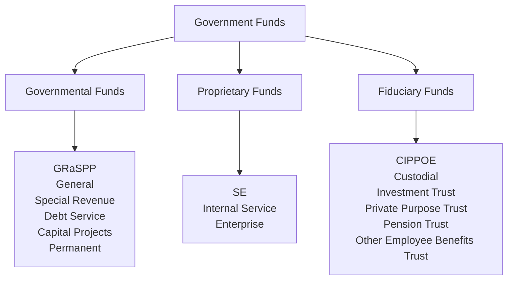

# Governmental Accounting

## Introduction

Governmental accounting applies to **state and local governments**, including cities, counties, school districts, and special-purpose entities. Some hospitals and universities that are government-run also follow governmental accounting standards. The primary standard-setter is the **Governmental Accounting Standards Board (GASB)**.

:::info[Key Concept]

The fundamental purpose of governmental accounting is to demonstrate **accountability** — showing that public resources are used in compliance with laws, regulations, and budgetary authority. This contrasts with for-profit accounting, which focuses on profitability.

:::

## Fund Accounting

Governments use **fund accounting** to segregate resources for specific purposes. A fund is a **self-balancing set of accounts** used to track resources dedicated to a particular activity or objective.
Fund accounting serves three purposes:

1. **Monitoring compliance** with legal and contractual requirements
2. **Tracking spending** by purpose
3. **Budgetary control** over appropriations

## Three Categories of Funds



:::tip[CPA Exam Tip]

Memorize the fund mnemonics: **GRaSPP** (Governmental), **SE** (Proprietary), and **CIPPOE** (Fiduciary). The exam frequently tests which fund category a transaction belongs to.

:::

## Governmental Funds (GRaSPP)

Governmental funds use the **modified accrual basis** of accounting and the **current financial resources measurement focus**. They report only current assets and current liabilities — no long-term assets or long-term debt.
| Fund | Purpose |
|---|---|
| **General Fund** | Accounts for all resources not required to be in another fund; the "catch-all" fund |
| **Special Revenue Fund** | Accounts for resources legally restricted or committed for specific purposes (e.g., gas tax for roads) |
| **Debt Service Fund** | Accounts for accumulation of resources for payment of general long-term debt principal and interest |
| **Capital Projects Fund** | Accounts for resources used to acquire or construct major capital facilities |
| **Permanent Fund** | Accounts for resources that are legally restricted so that only earnings (not principal) may be used for government programs |

### Modified Accrual Basis

Under modified accrual:

- **Revenues** are recognized when they are **measurable and available**
- **Available** means collectible within the current period or soon enough thereafter to pay current liabilities (typically **60 days** after year-end)
- **Expenditures** (not expenses) are recognized when the fund liability is incurred, except for certain items like debt service (recognized when due/mature)

  :::warning
  Governmental funds report **expenditures**, not expenses. An expenditure is recognized when a liability is incurred. There is **no depreciation** in governmental funds because capital assets are not reported at the fund level.
  :::

### Revenue Recognition Example

Panda Industries, a city government, levies \$5,000,000 in property taxes. Of this amount, \$4,800,000 is expected to be collected within 60 days of year-end, and \$150,000 is expected to be collected between 61 and 120 days. The remaining \$50,000 is estimated uncollectible.

```journal
Dr. Property taxes receivable       5,000,000
    Cr. Allowance for uncollectible taxes       50,000
    Cr. Property tax revenue                 4,800,000
    Cr. Deferred inflows of resources          150,000
```

When the deferred portion is collected within the availability period of the next year:

```journal
Dr. Cash                              150,000
    Cr. Deferred inflows of resources          150,000
Dr. Deferred inflows of resources      150,000
    Cr. Property tax revenue                   150,000
```

## Budgetary Accounting

Governments are **legally required** to adopt budgets for governmental funds (especially the General Fund). Budget entries are recorded at the **beginning** of the fiscal year and reversed at **year-end**.

### Recording the Budget

Bear Co. City Council adopts an annual budget with estimated revenues of \$10,000,000 and appropriations (authorized spending) of \$9,500,000.

```journal
Dr. Estimated revenues              10,000,000
    Cr. Appropriations                       9,500,000
    Cr. Budgetary fund balance                 500,000
```

:::note

- **Estimated revenues** is a budgetary debit account (not real revenue)
- **Appropriations** is a budgetary credit account (authorized spending limit)
- **Budgetary fund balance** is the plug — a credit indicates an expected surplus; a debit indicates an expected deficit
  :::

### Closing the Budget at Year-End

The entry is reversed at year-end:

```journal
Dr. Appropriations                   9,500,000
Dr. Budgetary fund balance             500,000
    Cr. Estimated revenues                  10,000,000
```

## Encumbrance Accounting

Governments use **encumbrances** to track outstanding purchase orders and commitments. This prevents overspending appropriations.

### Step 1: Record the Encumbrance (Purchase Order Issued)

Polar Co. School District orders \$200,000 of textbooks:

```journal
Dr. Encumbrances                     200,000
    Cr. Budgetary fund balance reserved for encumbrances   200,000
```

### Step 2: Reverse Encumbrance and Record Expenditure (Goods Received)

The textbooks arrive with an invoice for \$195,000:

```journal
Dr. Budgetary fund balance reserved for encumbrances   200,000
    Cr. Encumbrances                                         200,000
Dr. Expenditures                     195,000
    Cr. Vouchers payable                     195,000
```

:::tip[CPA Exam Tip]

Encumbrances are **always** reversed at the **estimated** amount, not the actual amount. The expenditure is recorded at the **actual** amount. Any difference flows through the available fund balance.

:::

### Outstanding Encumbrances at Year-End

If purchase orders are still outstanding at year-end, the encumbrances may be:

- **Closed** and re-established the following year, or
- **Left open** as a reservation of fund balance
  Either way, outstanding encumbrances are reported as part of **restricted, committed, or assigned fund balance** — never as expenditures or liabilities.

## Proprietary Funds (SE)

Proprietary funds operate like **businesses** within government. They use the **full accrual basis** of accounting and the **economic resources measurement focus**.
| Fund | Purpose |
|---|---|
| **Internal Service Fund** | Provides goods/services to **other departments** within the government (e.g., motor pool, IT, printing) |
| **Enterprise Fund** | Provides goods/services to the **general public** on a user-charge basis (e.g., water, sewer, electric utilities, airports) |

### Proprietary Fund Financial Statements

- **Statement of Net Position** (balance sheet)
- **Statement of Revenues, Expenses, and Changes in Net Position** (income statement)
- **Statement of Cash Flows** (uses **direct method** — required, not optional)

  :::warning
  Unlike for-profit entities, proprietary fund cash flow statements must use the **direct method**. Also, proprietary funds classify cash flows into **four** categories: operating, noncapital financing, capital financing, and investing.
  :::

### Enterprise Fund Example

Sloth Security, a government-run utility, bills customers \$3,000,000 for water services:

```journal
Dr. Accounts receivable             3,000,000
    Cr. Charges for services (operating revenue)   3,000,000
```

The utility purchases a new water treatment facility for \$8,000,000:

```journal
Dr. Capital assets — equipment       8,000,000
    Cr. Cash                                     8,000,000
```

Annual depreciation of \$400,000:

```journal
Dr. Depreciation expense               400,000
    Cr. Accumulated depreciation                   400,000
```

## Fiduciary Funds (CIPPOE)

Fiduciary funds account for resources held by the government **in a trust or custodial capacity** for others. They use the **full accrual basis** of accounting.
| Fund | Purpose |
|---|---|
| **Custodial Fund** | Resources held temporarily for other entities (tax collection for other governments) |
| **Investment Trust Fund** | External portion of investment pools managed by the government |
| **Private Purpose Trust** | Trust arrangements where principal and income benefit external parties |
| **Pension Trust Fund** | Resources held for employee pension plans |
| **Other Employee Benefits Trust** | Resources held for OPEB and similar plans |

:::danger

Fiduciary fund resources belong to **others**, not the government. They are **excluded** from the government-wide financial statements.

:::

## GASB 34 Reporting Model

GASB Statement No. 34 established the minimum reporting requirements for state and local governments:

### Government-Wide Financial Statements

Report the government as a **whole** using the **full accrual basis** and **economic resources measurement focus**:
| Statement | Content |
|---|---|
| **Statement of Net Position** | All assets, deferred outflows, liabilities, deferred inflows, and net position |
| **Statement of Activities** | Expenses by function, program revenues, general revenues, and change in net position |
The Statement of Activities uses a **net cost format**:

$$
\text{Net (Expense) Revenue} = \text{Program Revenues} - \text{Direct Expenses}
$$

Program revenues include: charges for services, operating grants, and capital grants.

### Fund-Based Financial Statements

Report individual funds using the measurement focus and basis appropriate to each fund type:

- **Governmental funds**: Modified accrual; report current financial resources
- **Proprietary funds**: Full accrual; report economic resources
- **Fiduciary funds**: Full accrual; report economic resources

### Reconciliation

A reconciliation is required between fund-based governmental fund statements and the government-wide statements. Major differences include:
| Item | Governmental Funds | Government-Wide |
|---|---|---|
| Capital assets | Not reported (expenditure when purchased) | Capitalized and depreciated |
| Long-term debt | Not reported | Reported as liability |
| Accrued interest | Not reported until due | Accrued |
| Internal service funds | Separate reporting | Blended into governmental activities |

## Fund Balance Classifications (GASB 54)

Governmental fund balance is classified into five categories (most to least constrained):
| Classification | Constraint Level | Set By |
|---|---|---|
| **Nonspendable** | Cannot be spent (inventory, prepaid, permanent fund principal) | Nature of the resource |
| **Restricted** | Externally imposed or by law | Creditors, grantors, laws |
| **Committed** | Self-imposed by highest decision-making authority | Government's governing body |
| **Assigned** | Intended use set by authorized body/official | Governing body or designee |
| **Unassigned** | Residual; only in General Fund (may be negative in other funds) | N/A |

:::tip[CPA Exam Tip]

Remember the order: **N-R-C-A-U** (Nonspendable, Restricted, Committed, Assigned, Unassigned). The spending order is generally from most restricted to least restricted unless the government has a different policy.

:::

## Measurement Focus Comparison

| Feature             | Modified Accrual (Governmental)      | Full Accrual (Proprietary / Gov-Wide) |
| ------------------- | ------------------------------------ | ------------------------------------- |
| Revenue recognition | Measurable and available             | Earned                                |
| Expense/expenditure | When liability is incurred (current) | When incurred (all)                   |
| Capital assets      | Not reported                         | Capitalized and depreciated           |
| Long-term debt      | Not reported                         | Reported                              |
| Focus               | Current financial resources          | Economic resources                    |

## Summary

| Topic                          | Key Rule                                                     |
| ------------------------------ | ------------------------------------------------------------ |
| Standard-setter                | GASB                                                         |
| Fund types                     | Governmental (GRaSPP), Proprietary (SE), Fiduciary (CIPPOE)  |
| Governmental basis             | Modified accrual, current financial resources                |
| Proprietary basis              | Full accrual, economic resources                             |
| Available period               | Within 60 days of year-end                                   |
| Budget entry accounts          | Estimated Revenues, Appropriations, Budgetary Fund Balance   |
| Encumbrances                   | Reversed at estimated amount; actual recorded as expenditure |
| Government-wide statements     | Full accrual for all activities                              |
| Fiduciary funds                | Excluded from government-wide statements                     |
| Cash flow method (proprietary) | Direct method required                                       |

:::warning[Final Exam Reminder]

The CPA exam heavily tests the **differences** between modified accrual and full accrual. Make sure you can convert governmental fund statements to government-wide statements by adding back capital assets, long-term debt, and accrued items.

:::
