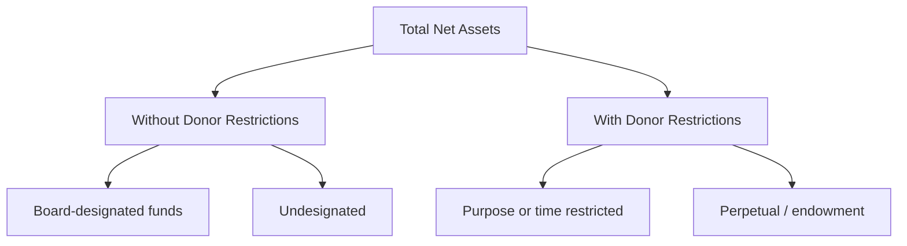
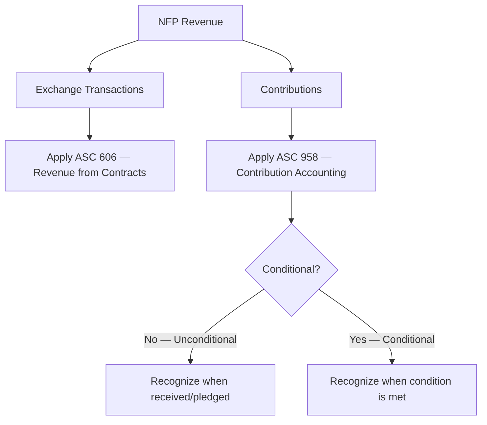
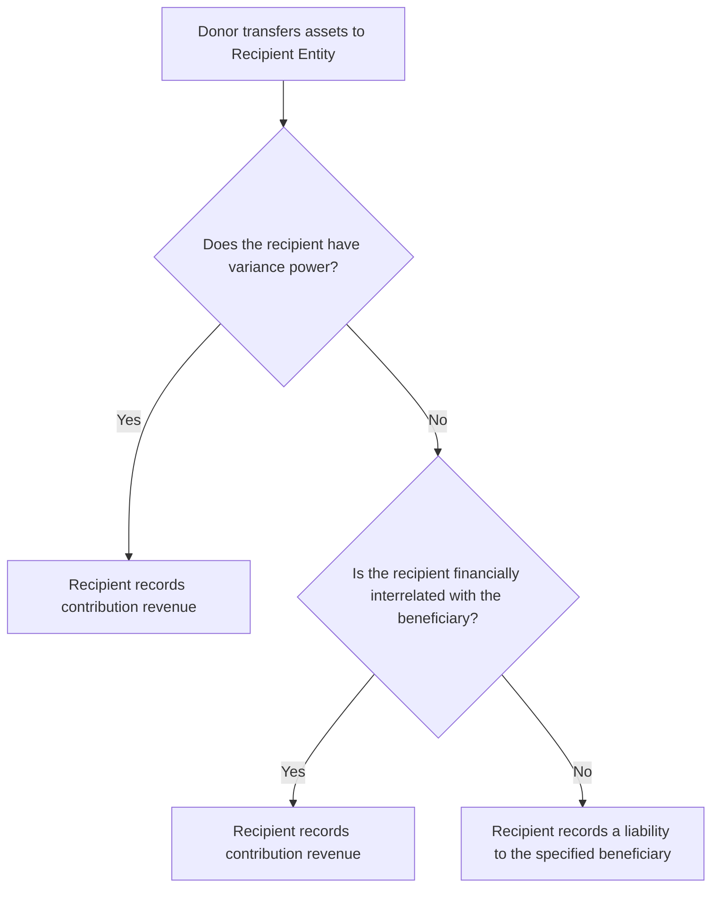

import Tabs from '@theme/Tabs';
import TabItem from '@theme/TabItem';

# Not-for-Profit Accounting

Not-for-profit (NFP) accounting is a **high-frequency FAR topic** that tests your ability to distinguish NFP financial statements from commercial ones, classify net assets, recognize contributions, and handle specialized revenue streams. NFP entities — hospitals, universities, museums, charitable organizations — follow GAAP under FASB ASC guidance and use the **full accrual basis** of accounting.

---

## Financial Statements Overview

NFPs prepare three required financial statements (compared to four for commercial entities):

| NFP Statement | Commercial Equivalent |
|---|---|
| Statement of Financial Position | Balance Sheet |
| Statement of Activities | Income Statement |
| Statement of Cash Flows | Statement of Cash Flows |

:::tip Exam rule
NFPs do **not** prepare a statement of stockholders' equity. They have no owners — net assets replace equity.
:::

There is no separate "Statement of Functional Expenses" requirement for all NFPs, but **voluntary health and welfare organizations** (VHWOs) must present expenses by both functional and natural classification. Other NFPs may present this information on the face of the statement of activities, in the notes, or as a separate schedule.

### Functional vs. Natural Classification

| Classification Type | Examples |
|---|---|
| **Functional** (what the money was spent on) | Program services, management and general, fundraising |
| **Natural** (what type of cost) | Salaries, rent, depreciation, supplies |

---

## Statement of Financial Position

The statement of financial position reports assets, liabilities, and **net assets**. Net assets are divided into two categories:



### Net Assets Without Donor Restrictions

These are resources with **no donor-imposed restrictions**. The governing board may internally earmark funds (called **board-designated** or **quasi-endowment** funds), but these are still classified as without donor restrictions because the board can reverse the designation at any time.

:::info
Board-designated funds are **not** donor-restricted. They remain in the "without donor restrictions" class, though they may be disclosed separately.
:::

### Net Assets With Donor Restrictions

These are resources subject to **donor-imposed** stipulations that are either:

- **Time or purpose restrictions** — the donor specifies when or how the funds may be used (e.g., "use for scholarships in 2026").
- **Perpetual restrictions** — the donor requires that the principal be maintained indefinitely (endowments). Only the investment return may be spent, subject to any additional restrictions.

### Reclassification of Net Assets

When a donor restriction is satisfied (by passage of time or by fulfilling the stated purpose), the NFP reclassifies the amount:

```journal
Dr. Net assets with donor restrictions[e] 50,000
    Cr. Net assets without donor restrictions[e] 50,000
```

This entry appears on the statement of activities as "**Net assets released from restrictions**."

:::warning
If a contribution is received and the restriction is satisfied in the **same reporting period**, the NFP may report it as without donor restrictions (an accounting policy election that must be disclosed).
:::

---

## Statement of Activities

The statement of activities reports the change in each class of net assets and the change in total net assets. It is organized around **revenues, expenses, gains, and losses**.

| Line Item | Description |
|---|---|
| Change in net assets without donor restrictions | Unrestricted revenues and gains minus expenses |
| Change in net assets with donor restrictions | Restricted contributions, investment returns, less reclassifications out |
| Change in total net assets | Sum of both classes |

### Program Services vs. Support Services

Expenses are reported by **function**:

| Category | Examples |
|---|---|
| **Program services** | Direct mission activities — education, patient care, research |
| **Support services — Management & general** | Accounting, HR, executive office |
| **Support services — Fundraising** | Donor solicitation, special events, grant writing |

### Combined Costs Allocation

When a single activity serves both program and support functions (e.g., a direct-mail campaign that educates the public and solicits donations), the cost must be allocated. The allocation is acceptable only if the criteria of **purpose**, **audience**, and **content** are all met.

<Tabs>
  <TabItem value="icf" label="Illini Community Foundation" default>

Illini Community Foundation mails 100,000 brochures about childhood literacy (program purpose) that also include a donation envelope (fundraising purpose). Total cost is \$200,000. The foundation determines that 60% relates to the educational content and 40% to fundraising.

| Function | Allocation |
|---|---|
| Program — Education | \$120,000 |
| Fundraising | \$80,000 |

  </TabItem>
  <TabItem value="bear" label="Bear Valley Hospital">

Bear Valley Hospital sends a health-awareness mailer that also asks for annual fund contributions. Total cost is \$75,000, allocated 70% program / 30% fundraising.

| Function | Allocation |
|---|---|
| Program — Community health | \$52,500 |
| Fundraising | \$22,500 |

  </TabItem>
</Tabs>

---

## Statement of Cash Flows

NFPs follow the same **ASC 230** rules as commercial entities. Cash flows are classified as operating, investing, or financing.

| Activity | Examples |
|---|---|
| **Operating** | Cash received from service recipients, contributions used for operations, interest and dividends received |
| **Investing** | Purchase/sale of investments, purchase of equipment |
| **Financing** | Proceeds from borrowing, donor-restricted contributions for long-term purposes |

:::tip Exam rule
Contributions that donors restrict for the **acquisition of long-lived assets** are classified as **financing activities**, not operating. However, **board-designated** contributions for construction with **no donor restriction** remain **operating activities**.
:::

**Example:** Gies University receives a \$500,000 unrestricted donation. The board votes to set it aside for a new library wing. On the statement of cash flows, the \$500,000 is an **operating** cash inflow because the restriction is internal, not donor-imposed.

---

## Revenue Recognition for NFPs

NFP revenue falls into two broad buckets: **exchange transactions** and **contributions**.



### Exchange Transactions

An exchange transaction is one in which each party receives and gives up approximately **equal value** (e.g., tuition, patient fees, membership dues with substantial benefits). These follow the same revenue recognition rules as commercial entities — revenue is recognized when it is **realized or realizable and earned**.

Exchange revenue is generally classified as **without donor restrictions**.

### Contributions — General Rules

A **contribution** is a voluntary, unconditional, nonreciprocal transfer in which a resource provider does not receive equal value in return. Key rules:

| Concept | Rule |
|---|---|
| Unconditional promise (pledge) | Recognize as **revenue** when the pledge is made, net of estimated uncollectible amounts |
| Conditional promise | Do **not** recognize until the condition is substantially met |
| Cash contributions | Recognize at amount received |
| Noncash contributions | Recognize at **fair value** on the date of the gift |

:::info Conditional vs. Unconditional
A **condition** requires both a **barrier** (something the recipient must do or that must occur) and a **right of return** or **right of release** if the barrier is not met. A mere restriction on how to use the funds is **not** a condition.
:::

### Unconditional Promises to Give (Pledges)

When a donor makes an unconditional pledge, the NFP records a receivable and revenue immediately.

**Example:** On November 15, a donor pledges \$100,000 to Illini Community Foundation, payable in full on March 1 of the following year. The foundation estimates 3% will be uncollectible.

```journal
Nov 15
Dr. Pledges receivable[a] 100,000
    Cr. Contribution revenue — with donor restrictions[e] 100,000
```

```journal
Nov 15
Dr. Bad debt expense 3,000
    Cr. Allowance for uncollectible pledges[ca] 3,000
```

Long-term pledges are recorded at the **present value** of estimated future cash flows.

### Conditional Promises

A conditional promise is **not** recognized as revenue or a receivable until the condition is substantially met.

**Example:** BIF Partners pledges \$200,000 to Bear Valley Hospital on the condition that the hospital raises \$500,000 in matching funds by December 31. Until the hospital reaches the \$500,000 threshold, no revenue or receivable is recorded. Once the condition is met:

```journal
Dr. Pledges receivable[a] 200,000
    Cr. Contribution revenue[e] 200,000
```

### Donated Services

Donated services are recognized as both a **revenue** and an **expense** only if **either** of these criteria is met:

1. The services **create or enhance a nonfinancial asset** (e.g., a contractor builds a wall for a charity), **or**
2. **All three** of the following are true: the services require **specialized skills**, the person providing them **possesses those skills**, and the services would typically need to be **purchased** if not donated (e.g., an attorney donates legal work).

:::warning
Volunteer time at a soup kitchen or gift shop generally does **not** meet recognition criteria because the services are not specialized and do not enhance a nonfinancial asset.
:::

<Tabs>
  <TabItem value="recognize" label="Recognized" default>

A licensed CPA donates 40 hours of audit services to Gies University. The CPA's normal billing rate is \$250/hour.

```journal
Dr. Accounting expense 10,000
    Cr. Contribution revenue — donated services[e] 10,000
```

  </TabItem>
  <TabItem value="not" label="Not Recognized">

Fifteen volunteers donate 200 total hours sorting donations at the Illini Community Foundation warehouse. Although valuable, the services do not require specialized skills and do not enhance a nonfinancial asset. **No journal entry** is recorded.

  </TabItem>
</Tabs>

### Donated Collection Items

Works of art, historical treasures, and similar items **need not be capitalized** if all three conditions are met:

1. The items are **held for public exhibition, education, or research**.
2. The items are **protected, kept unencumbered, cared for, and preserved**.
3. Proceeds from any sale of items are used to acquire **other collection items**.

If the NFP elects not to capitalize, neither an asset nor revenue is recorded. The policy must be applied consistently and disclosed.

### Donated Materials and Supplies

Donated materials that are **significant** are recognized at **fair value** as both an asset (or expense, if used immediately) and contribution revenue.

```journal
Dr. Inventory — donated supplies[a] 15,000
    Cr. Contribution revenue — donated materials[e] 15,000
```

### Donor-Imposed Restrictions

Contributions with donor restrictions are recognized as **revenue with donor restrictions** in the period **received or pledged** — not deferred until the restriction is met.

$$
\text{Revenue recognition timing} = \text{Date of gift or pledge (if unconditional)}
$$

When the restriction is later satisfied, a reclassification moves the amount to "without donor restrictions."

---

## Fundraising Activities

When an NFP runs a fundraising campaign that provides donors with a premium (e.g., a tote bag, dinner, or concert ticket):

| Component | Treatment |
|---|---|
| Cost of the premium | **Fundraising expense** |
| Difference between donation and FV of premium | **Contribution revenue** |
| FV of the premium received by donor | **Exchange revenue** |

**Example:** MAS Inc. (an NFP) holds a gala dinner. Tickets cost \$500 each. The fair value of the dinner is \$120. For each ticket sold:

- Contribution revenue = \$500 − \$120 = **\$380**
- Exchange revenue = **\$120**

```journal
Dr. Cash[a] 500
    Cr. Contribution revenue[e] 380
    Cr. Special event revenue[e] 120
```

The cost of the dinner (say \$80 per plate) is recorded as fundraising expense:

```journal
Dr. Fundraising expense 80
    Cr. Cash[a] 80
```

---

## NFP Educational Institutions

Tuition revenue at NFP colleges and universities is displayed at **gross**, with scholarships treated as either:

- A **contra-revenue** (allowance) reducing gross tuition, **or**
- An **expense** if the student performs a service (e.g., a teaching assistantship).

**Example:** Gies University bills \$10,000,000 in tuition. It awards \$1,500,000 in merit-based scholarships (no service required) and \$400,000 in assistantship stipends (service required).

| Item | Amount |
|---|---|
| Gross tuition revenue | \$10,000,000 |
| Less: scholarship allowance | (\$1,500,000) |
| Net tuition revenue | \$8,500,000 |
| Assistantship expense | \$400,000 |

---

## NFP Health Care Organizations

NFP health care entities (hospitals, clinics) have specialized revenue presentation rules:

| Item | Treatment |
|---|---|
| **Patient service revenue** | Reported at **gross** charges, then shown **net of contractual adjustments and discounts** on one line |
| **Charity care** | **Not recorded** as revenue at all — disclosed in the notes only |
| **Bad debts** | Reported as an **operating expense** or as a deduction from revenue, depending on whether the patient was assessed for ability to pay |
| **Other operating revenue** | Cafeteria, parking, gift shop |
| **Nonoperating revenue** | Unrestricted gifts, investment income, gains on sale of assets |

:::tip Exam rule
Charity care is **never** recognized as revenue. The NFP discloses the level of charity care provided (measured at cost or at charges foregone) in the **notes** to the financial statements.
:::

**Example:** Bear Valley Hospital provides services with gross charges of \$5,000,000. Contractual adjustments total \$1,200,000. Charity care at standard rates would have been \$300,000. Bad debts are estimated at \$150,000.

| Line | Amount |
|---|---|
| Patient service revenue (gross) | \$5,000,000 |
| Less: contractual adjustments | (\$1,200,000) |
| Net patient service revenue | \$3,800,000 |
| Provision for bad debts | (\$150,000) |
| Net patient revenue after bad debts | \$3,650,000 |

The \$300,000 of charity care is **excluded** from revenue and disclosed in the notes.

---

## Transfers of Assets to Other Entities

When a donor makes a contribution **through an intermediary** (such as a community foundation), the accounting depends on two key factors:



### Key Definitions

| Term | Meaning |
|---|---|
| **Variance power** | The recipient can redirect the assets to a beneficiary other than the one specified by the donor |
| **Financially interrelated** | The recipient and beneficiary have (1) the ability of one to **influence the operating and financial decisions** of the other, **and** (2) an **ongoing economic interest** in the other's net assets |
| **Specified beneficiary** | The entity the donor intends to ultimately receive the assets |

### Recipient Entity Accounting

<Tabs>
  <TabItem value="variance" label="With Variance Power" default>

Kingfisher Industries donates \$300,000 to Illini Community Foundation, specifying Bear Valley Hospital as the beneficiary. The foundation has **variance power** and may redirect the funds.

The foundation records **contribution revenue**:

```journal
Dr. Cash[a] 300,000
    Cr. Contribution revenue[e] 300,000
```

  </TabItem>
  <TabItem value="interrelated" label="Financially Interrelated">

Kingfisher Industries donates \$300,000 to Illini Community Foundation for Bear Valley Hospital. The foundation has **no variance power** but is financially interrelated with the hospital.

The foundation records **contribution revenue**:

```journal
Dr. Cash[a] 300,000
    Cr. Contribution revenue[e] 300,000
```

  </TabItem>
  <TabItem value="liability" label="Neither">

Kingfisher Industries donates \$300,000 to Illini Community Foundation for Bear Valley Hospital. The foundation has **no variance power** and is **not** financially interrelated with the hospital.

The foundation records a **liability**, not revenue:

```journal
Dr. Cash[a] 300,000
    Cr. Liability to Bear Valley Hospital[l] 300,000
```

  </TabItem>
</Tabs>

### Specified Beneficiary Accounting

The specified beneficiary (e.g., Bear Valley Hospital) recognizes a **right to the assets** (a receivable and contribution revenue) **unless** the recipient entity has been granted variance power.

---

## Financial Instruments and Investments

NFPs report **debt and equity investments** at **fair value** on the statement of financial position (with limited exceptions for certain equity method or consolidation situations).

### Gains and Losses

| Type | Reporting |
|---|---|
| Realized gains/losses | Statement of activities |
| Unrealized gains/losses | Statement of activities |
| Default classification | Without donor restrictions, unless the donor or law restricts investment returns |

:::info
Both realized and unrealized gains and losses flow through the **statement of activities** — there is no OCI concept for NFPs.
:::

### Investment Return Reporting

Investment returns (interest, dividends, realized and unrealized gains/losses) are reported **net of external and direct internal investment expenses**.

$$
\text{Net investment return} = \text{Interest + Dividends + Realized G/L + Unrealized G/L} - \text{Investment expenses}
$$

### Underwater Endowments

An endowment is **underwater** when its current fair value falls **below the original gift amount** (the historic dollar value).

**Example:** A donor gave \$1,000,000 to Illini Community Foundation as a permanent endowment. Due to market declines, the endowment's fair value drops to \$920,000 — an unrealized loss of \$80,000.

```journal
Dr. Unrealized loss on endowment investments 80,000
    Cr. Investment in endowment[a] 80,000
```

The \$80,000 loss is reported in **net assets with donor restrictions** (staying with the endowment). The endowment continues to be classified as net assets with donor restrictions even though it is underwater.

:::caution
Underwater endowments require specific **disclosures**: the fair value of underwater funds, the original gift amounts, and the aggregate amount by which they are underwater. The governing board's policy on spending from underwater endowments must also be disclosed.
:::

---

## Comprehensive Example

Illini Community Foundation reports the following activity for the year ended December 31:

| Transaction | Amount | Classification |
|---|---|---|
| Unrestricted contributions received | \$800,000 | Without donor restrictions |
| Donor-restricted contribution for scholarships | \$200,000 | With donor restrictions |
| Scholarships awarded (satisfying restriction) | \$120,000 | Reclassification |
| Unrestricted investment return, net of fees | \$45,000 | Without donor restrictions |
| Unrealized loss on endowment (underwater) | \$30,000 | With donor restrictions |
| Program services expense | \$600,000 | Without donor restrictions |
| Management and general expense | \$110,000 | Without donor restrictions |
| Fundraising expense | \$55,000 | Without donor restrictions |

**Statement of Activities (simplified):**

| | Without Donor Restrictions | With Donor Restrictions | Total |
|---|---|---|---|
| Contributions | \$800,000 | \$200,000 | \$1,000,000 |
| Investment return | 45,000 | (30,000) | 15,000 |
| Net assets released from restrictions | 120,000 | (120,000) | — |
| **Total revenues and gains** | **965,000** | **50,000** | **1,015,000** |
| Program services | (600,000) | — | (600,000) |
| Management and general | (110,000) | — | (110,000) |
| Fundraising | (55,000) | — | (55,000) |
| **Change in net assets** | **\$200,000** | **\$50,000** | **\$250,000** |

:::note Key takeaway
Expenses are **always** reported in the "without donor restrictions" column. When restricted funds are spent, the reclassification entry moves the amount into "without donor restrictions" first.
:::

---

## Summary of Key Exam Points

1. NFPs use **two net asset classes**: without donor restrictions and with donor restrictions.
2. Board-designated funds remain **without donor restrictions**.
3. Unconditional pledges are recognized as **revenue when pledged**; conditional pledges wait until the condition is met.
4. Donated services require **specialized skills** or must **enhance a nonfinancial asset** to be recognized.
5. Charity care is **never** recorded as revenue — notes disclosure only.
6. Contributions with restrictions are recognized as **revenue when received**, not when spent.
7. All investment gains/losses (realized and unrealized) go through the **statement of activities**.
8. Underwater endowments remain in **net assets with donor restrictions** with required disclosures.
9. Recipient entities record a **liability** when they lack both variance power and financial interrelation with the beneficiary.
10. Donor-restricted contributions for long-lived asset purchases are **financing activities** on the cash flow statement.
