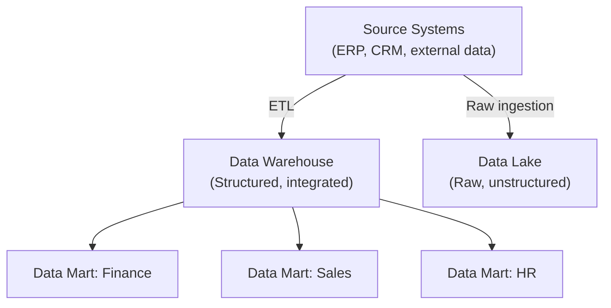
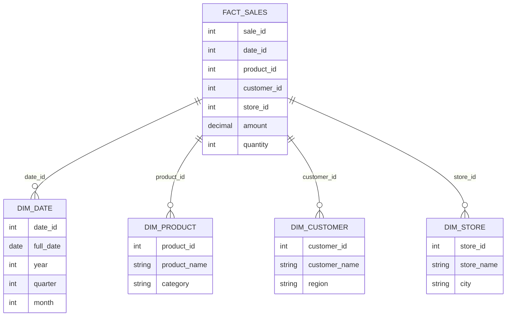

# Data Management

Data is one of the most valuable assets in any modern organization. CPAs must understand how data is **extracted, stored, queried, and integrated** to support financial analysis, operational decisions, and audit procedures. The ISC exam tests your knowledge of the full **data life cycle** — from creation through active use, storage, and final disposition — as well as your ability to work with relational databases, SQL queries, and business process models.

This section covers **data extraction methods**, **data storage types and database schemas**, the **data life cycle**, **relational database structure** (integrity rules, data dictionaries, normalization), **SQL queries**, **data integration from multiple sources**, and **business process models**.

:::info

Data management is tested across all three skill levels on the ISC exam. You must be able to define storage types and summarize the data life cycle (Remembering and Understanding), examine database structure and SQL queries (Application), and investigate business process models to identify improvements (Analysis).

:::

---

## Data Extraction Methods and Techniques

**Data extraction** is the process of retrieving data from one or more sources for further processing, analysis, or storage. CPAs encounter data extraction in contexts such as audit data analytics, financial reporting, and system migrations.

Common data extraction methods include:

| Method | Description | Example |
|---|---|---|
| **Manual extraction** | Users export data from a system using built-in reporting or export features | Exporting a trial balance from an accounting application to a spreadsheet |
| **Query-based extraction** | Using a query language (typically SQL) to retrieve specific data from a database | Writing a SQL query to extract all journal entries over $100,000 from the general ledger |
| **API-based extraction** | Using application programming interfaces to programmatically retrieve data from systems | Pulling transaction data from a SaaS application via its REST API |
| **ETL (Extract, Transform, Load)** | An automated process that extracts data from source systems, transforms it into a consistent format, and loads it into a target system (e.g., data warehouse) | Nightly ETL job that extracts sales data from three regional systems and loads it into a centralized data warehouse |

:::tip[Exam Tip]

The ETL process is a foundational concept in data management. Remember the three steps: **Extract** (pull data from sources), **Transform** (clean, validate, and format the data), and **Load** (insert the data into the target system). If any step has a control weakness — for example, the transform step does not validate data completeness — the resulting data may be unreliable.

:::

---

## Data Storage Types

Organizations use different types of data storage depending on their analytical needs, data volume, and performance requirements:

| Storage Type | Description | Purpose | Characteristics |
|---|---|---|---|
| **Data warehouse** | A centralized repository that stores integrated data from multiple sources in a structured, query-optimized format | Enterprise-wide reporting and analytics | Historical data, structured, optimized for read-heavy queries |
| **Data lake** | A large storage repository that holds raw data in its native format until it is needed for analysis | Storing unstructured, semi-structured, and structured data at scale | Raw data, flexible schema, supports diverse data types |
| **Data mart** | A subset of a data warehouse that focuses on a specific business function or department | Departmental reporting and analysis | Narrower scope than a data warehouse, faster queries for specific use cases |



**Example:** **Polar Inc.** uses a data warehouse to consolidate financial data from its ERP system, CRM system, and external market data feeds. The finance department accesses a **data mart** that contains only the financial data relevant to their reporting needs, which provides faster query performance than querying the full data warehouse.

---

## Database Schemas

A **database schema** defines the logical structure of a database — how tables are organized and how they relate to each other. Two common schema designs used in data warehouses are the **star schema** and **snowflake schema**.

### Star Schema

A **star schema** organizes data around a central **fact table** (which contains quantitative data such as sales amounts, quantities, or transaction counts) surrounded by **dimension tables** (which contain descriptive attributes such as date, product, customer, or location).



**Characteristics:**

- Simple structure, easy to understand and query
- Dimension tables are **denormalized** (may contain redundant data)
- Faster query performance due to fewer joins

### Snowflake Schema

A **snowflake schema** is a variation of the star schema where dimension tables are **normalized** — broken into additional sub-tables to reduce redundancy.

**Characteristics:**

- More complex structure with additional tables and joins
- Dimension tables are **normalized**, reducing data redundancy
- Slower query performance due to more joins, but more efficient storage

:::note

For the ISC exam, you should understand the structural difference between star and snowflake schemas. The star schema trades storage efficiency for query simplicity, while the snowflake schema trades query simplicity for storage efficiency.

:::

---

## The Data Life Cycle

The **data life cycle** describes the stages that data passes through from its creation to its eventual disposal. Understanding the data life cycle is essential for implementing appropriate controls at each stage.

| Stage | Description | Key Controls |
|---|---|---|
| **Creation / Collection** | Data is generated or collected from internal or external sources | Input validation, authorization, data quality checks |
| **Storage** | Data is stored in databases, data warehouses, or other repositories | Access controls, encryption, backup and recovery |
| **Active Use** | Data is accessed, processed, and analyzed for business purposes | Access controls, processing integrity, audit trails |
| **Sharing / Distribution** | Data is shared with internal or external parties | Authorization, encryption in transit, data classification |
| **Archival** | Data that is no longer actively used but must be retained is moved to long-term storage | Retention policies, access controls, retrieval procedures |
| **Disposition / Destruction** | Data that is no longer needed is securely destroyed | Secure deletion methods, documentation of destruction, compliance with retention policies |

:::warning

Data disposition is often overlooked but is critically important, especially for sensitive data. Simply deleting a file does not securely destroy it — data may be recoverable from storage media unless overwritten or the media is physically destroyed. The exam may test whether you can identify a deficiency in an organization's data disposition practices.

:::

---

## Relational Database Structure

A **relational database** organizes data into **tables** (also called relations), where each table consists of **rows** (records) and **columns** (fields). Understanding relational database concepts is essential for examining database integrity and writing SQL queries.

### Data Integrity Rules

Relational databases enforce several types of data integrity:

| Integrity Type | Description | Example |
|---|---|---|
| **Entity integrity** | Every table must have a **primary key**, and no primary key value can be null | Each customer in the Customers table has a unique, non-null CustomerID |
| **Referential integrity** | **Foreign key** values must match a primary key value in the related table (or be null) | An OrderID in the Orders table must correspond to a valid CustomerID in the Customers table |
| **Domain integrity** | Values in a column must conform to defined data types, formats, and allowable ranges | A DateOfBirth column must contain a valid date; a State column must contain a valid two-letter state code |

### Data Dictionary

A **data dictionary** (also called a metadata repository) is a centralized record that describes the structure, content, and characteristics of the data in a database. It typically includes:

- Table names and descriptions
- Column names, data types, and constraints
- Primary key and foreign key relationships
- Valid values and business rules
- Data ownership and stewardship

The data dictionary is an essential tool for auditors because it provides a map of the database structure and helps verify that the database is properly designed and documented.

### Normalization

**Normalization** is the process of organizing data in a relational database to **reduce redundancy** and **improve data integrity**. Normalization involves decomposing tables into smaller, related tables and defining relationships between them.

| Normal Form | Rule | Purpose |
|---|---|---|
| **First Normal Form (1NF)** | Each column contains only atomic (indivisible) values; no repeating groups | Eliminate repeating groups |
| **Second Normal Form (2NF)** | 1NF + every non-key column depends on the **entire** primary key (not just part of it) | Eliminate partial dependencies |
| **Third Normal Form (3NF)** | 2NF + every non-key column depends **only** on the primary key (not on other non-key columns) | Eliminate transitive dependencies |

**Example:** If **Bear Co.**'s Employees table contains columns for EmployeeID, EmployeeName, DepartmentID, and DepartmentName, the DepartmentName depends on DepartmentID (not on EmployeeID). To achieve 3NF, DepartmentName should be moved to a separate Departments table, with DepartmentID as the link.

---

## Structured Query Language (SQL)

**SQL (Structured Query Language)** is the standard language for interacting with relational databases. The ISC exam tests your ability to **examine a SQL query** and determine whether the retrieved data set is **relevant and complete**.

### Common SQL Commands

| Command | Purpose | Example |
|---|---|---|
| `SELECT` | Retrieves data from one or more tables | `SELECT CustomerName, Balance FROM Customers` |
| `FROM` | Specifies the table(s) to query | `FROM Customers` |
| `WHERE` | Filters rows based on a condition | `WHERE Balance > 10000` |
| `JOIN` | Combines rows from two or more tables based on a related column | `JOIN Orders ON Customers.CustomerID = Orders.CustomerID` |
| `INSERT` | Adds new rows to a table | `INSERT INTO Customers (CustomerID, CustomerName) VALUES (101, 'Bear Co.')` |
| `UPDATE` | Modifies existing data in a table | `UPDATE Customers SET Balance = 15000 WHERE CustomerID = 101` |
| `DELETE` | Removes rows from a table | `DELETE FROM Customers WHERE CustomerID = 101` |

### Common SQL Clauses and Operators

| Clause / Operator | Purpose | Example |
|---|---|---|
| `ORDER BY` | Sorts the result set | `ORDER BY Balance DESC` |
| `GROUP BY` | Groups rows that share a value for aggregate calculations | `GROUP BY DepartmentID` |
| `HAVING` | Filters groups (used with `GROUP BY`) | `HAVING SUM(Amount) > 50000` |
| `AND` / `OR` | Combines multiple conditions | `WHERE Status = 'Active' AND Balance > 0` |
| `IN` | Matches any value in a list | `WHERE State IN ('IL', 'NY', 'CA')` |
| `BETWEEN` | Matches values within a range | `WHERE PostDate BETWEEN '2025-01-01' AND '2025-12-31'` |
| `LIKE` | Pattern matching with wildcards | `WHERE CustomerName LIKE 'Bear%'` |
| `IS NULL` | Tests for null values | `WHERE ApprovalDate IS NULL` |

### Aggregate Functions

| Function | Purpose | Example |
|---|---|---|
| `COUNT()` | Counts the number of rows | `SELECT COUNT(*) FROM Transactions` |
| `SUM()` | Calculates the sum of a numeric column | `SELECT SUM(Amount) FROM Transactions` |
| `AVG()` | Calculates the average of a numeric column | `SELECT AVG(Amount) FROM Transactions` |
| `MAX()` | Returns the maximum value | `SELECT MAX(Amount) FROM Transactions` |
| `MIN()` | Returns the minimum value | `SELECT MIN(Amount) FROM Transactions` |

### String Functions

| Function | Purpose | Example |
|---|---|---|
| `UPPER()` / `LOWER()` | Converts text to uppercase or lowercase | `SELECT UPPER(CustomerName) FROM Customers` |
| `TRIM()` | Removes leading and trailing whitespace | `SELECT TRIM(CustomerName) FROM Customers` |
| `SUBSTRING()` | Extracts a portion of a string | `SELECT SUBSTRING(AccountCode, 1, 3) FROM Accounts` |
| `CONCAT()` | Combines two or more strings | `SELECT CONCAT(FirstName, ' ', LastName) FROM Employees` |
| `LENGTH()` / `LEN()` | Returns the length of a string | `SELECT LENGTH(CustomerName) FROM Customers` |

### Examining a SQL Query for Relevance and Completeness

When the ISC exam presents a SQL query and asks whether the retrieved data set is relevant and complete, consider:

- **Relevance** — Does the `WHERE` clause filter the data to the correct population? Are the correct columns selected?
- **Completeness** — Does the query include all necessary records? Could the `WHERE` clause be inadvertently excluding relevant data? Are `JOIN` conditions correct (an `INNER JOIN` excludes records with no match, while a `LEFT JOIN` includes all records from the left table)?
- **Accuracy** — Are aggregate functions applied correctly? Is the `GROUP BY` clause grouping data at the right level?

**Example:** An auditor at **Bear Co.** needs to extract all journal entries posted to revenue accounts during 2025. The following query is proposed:

```sql
SELECT JournalID, PostDate, AccountCode, Amount
FROM JournalEntries
WHERE AccountCode LIKE '4%'
  AND PostDate BETWEEN '2025-01-01' AND '2025-12-31'
  AND Amount > 0
```

Is this query complete? Not necessarily. The `Amount > 0` condition excludes credit entries (negative amounts), which could include revenue reversals and adjustments. Removing this condition would make the query more complete.

---

## Data Integration

**Data integration** is the process of combining data from different sources to provide a unified view for analysis and decision-making. Organizations often have data scattered across multiple systems — ERP, CRM, spreadsheets, external data feeds — and need to bring this data together.

### Integration Challenges

| Challenge | Description |
|---|---|
| **Data format inconsistencies** | Different systems may store the same data in different formats (e.g., date formats, currency codes) |
| **Duplicate records** | The same entity (customer, vendor, employee) may exist in multiple systems with different identifiers |
| **Data quality issues** | Missing values, incorrect entries, and outdated records can compromise the integrated data set |
| **Timeliness** | Data from different sources may be updated at different frequencies, leading to inconsistencies |
| **Semantic differences** | The same term may have different meanings in different systems (e.g., "revenue" may be defined differently in the sales system vs. the accounting system) |

### Integration Approaches

| Approach | Description |
|---|---|
| **ETL (Extract, Transform, Load)** | Data is extracted from source systems, transformed into a consistent format, and loaded into a central repository |
| **Data virtualization** | Data remains in its source systems but is accessed through a unified interface that presents an integrated view |
| **API integration** | Systems exchange data in real time through application programming interfaces |
| **Manual consolidation** | Data is exported from individual systems and combined manually (e.g., in spreadsheets) — highest risk of error |

---

## Business Process Models

A **business process model** is a visual representation of the steps, decisions, data flows, and actors in a business process. The ISC exam tests your ability to investigate a business process model and identify potential improvements.

### Types of Business Process Models

| Model Type | Description | Key Use |
|---|---|---|
| **Flowchart** | A diagram that shows the sequential steps in a process, including decision points and document flows | Documenting transaction processing steps and control points |
| **Data Flow Diagram (DFD)** | A diagram that shows how data moves through a system, including data sources, processes, data stores, and data destinations | Understanding data inputs, outputs, and transformations |
| **Business Process Model and Notation (BPMN) diagram** | A standardized graphical notation for modeling business processes, including events, activities, gateways, and flows | Detailed process modeling with industry-standard notation |

### Identifying Improvements

When investigating a business process model, look for:

- **Redundant steps** — Activities that are performed multiple times without adding value
- **Manual processes** that could be automated (e.g., using RPA or system integration)
- **Missing controls** — Points in the process where authorization, validation, or reconciliation should occur but does not
- **Bottlenecks** — Steps that create delays due to capacity constraints or sequential dependencies
- **Unnecessary handoffs** — Points where data or documents are transferred between people or systems, increasing the risk of errors or delays

**Example:** **Illini Entertainment** has a process model for its accounts payable cycle. The model shows that vendor invoices are first entered into a spreadsheet by a clerk, then manually re-entered into the ERP system by a different clerk. This redundant manual data entry step is a candidate for elimination — the invoice could be entered directly into the ERP system or captured through automated invoice processing.

---

## Summary

| Topic | Key Takeaway |
|---|---|
| Data extraction | Methods include manual export, SQL queries, API calls, and ETL processes |
| Data storage types | Data warehouses (structured, integrated), data lakes (raw, flexible), data marts (departmental subsets) |
| Database schemas | Star schema (denormalized, fast queries) and snowflake schema (normalized, less redundancy) |
| Data life cycle | Creation, storage, active use, sharing, archival, and disposition — controls are needed at each stage |
| Relational databases | Tables with rows and columns; enforce entity, referential, and domain integrity |
| SQL | Standard language for querying databases; examine queries for relevance, completeness, and accuracy |
| Data integration | Combining data from multiple sources; ETL is the most common approach |
| Business process models | Flowcharts, DFDs, and BPMN diagrams; investigate for redundancies, missing controls, and improvement opportunities |

---

## Practice Questions

1. **Bear Co.** maintains a data warehouse that is loaded nightly from its ERP system using an ETL process. The finance team notices that the data warehouse contains duplicate customer records — the same customer appears with slightly different names (e.g., "Bear Co." and "Bear Company"). At which step of the ETL process should this issue be addressed?

2. An auditor is reviewing the following SQL query used by **Polar Inc.** to identify high-value unpaid invoices:

   ```sql
   SELECT InvoiceID, VendorName, Amount
   FROM Invoices
   INNER JOIN Vendors ON Invoices.VendorID = Vendors.VendorID
   WHERE Amount > 50000
     AND PaymentDate IS NULL
   ```

   A vendor recently changed its name in the Vendors table, but the corresponding invoices still reference the old VendorID, which was deleted from the Vendors table. Will those invoices appear in the query results? Why or why not?

3. **Bear Co.** is considering implementing a data lake alongside its existing data warehouse. What is the primary difference between a data warehouse and a data lake, and when would each be more appropriate?

:::tip[Answers]

1. The **Transform** step. During the Transform phase of the ETL process, data should be cleansed, standardized, and deduplicated. This includes matching and merging records for the same customer that appear with different name variations.

2. **No.** The query uses an `INNER JOIN`, which only returns rows where there is a matching record in both tables. If the old VendorID was deleted from the Vendors table, the invoices referencing that VendorID will have no match and will be excluded from the results. To include these invoices, the auditor should use a `LEFT JOIN` instead, which returns all rows from the Invoices table even if there is no matching Vendor record.

3. A **data warehouse** stores structured, integrated data that has been cleaned and organized (typically through an ETL process) and is optimized for reporting and analytics. A **data lake** stores raw data in its native format — including unstructured and semi-structured data — and imposes structure only when the data is queried. A data warehouse is more appropriate when the organization needs consistent, reliable data for financial reporting. A data lake is more appropriate when the organization needs to store large volumes of diverse data for exploratory analysis or machine learning.

:::
