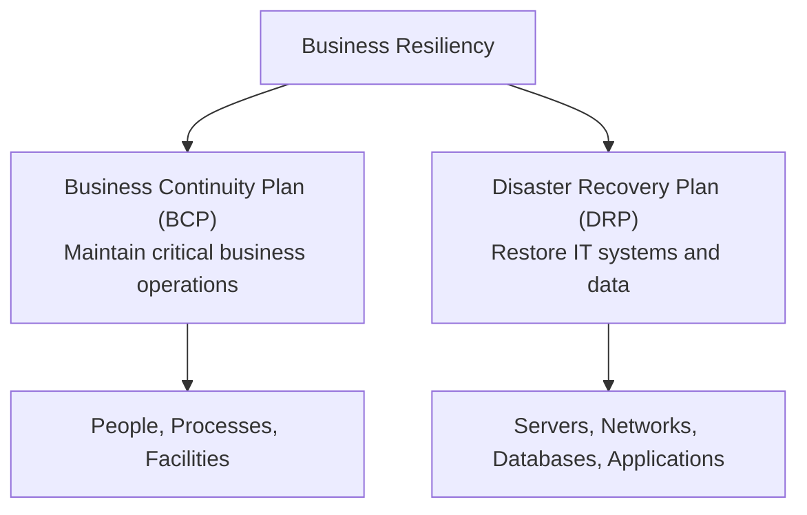
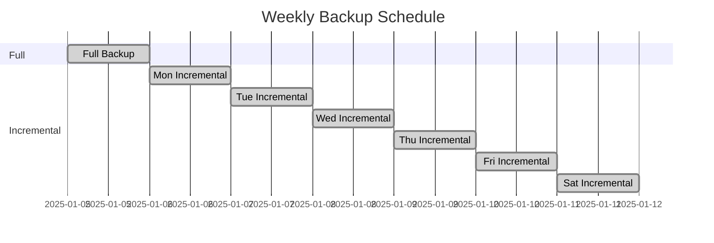

# Availability

System **availability** refers to the ability of an information system to be operational and accessible when needed. For organizations that rely on their IT systems to process financial transactions, serve customers, and produce reports, even brief periods of downtime can result in lost revenue, regulatory penalties, and reputational damage. CPAs performing IT audit and advisory services must understand how organizations plan for disruptions, maintain availability, and recover from failures.

This section covers **business resiliency**, **disaster recovery and business continuity plans**, **mirroring and replication**, **business impact analysis**, **measures of system availability**, **data backup types**, and the **evaluation of availability controls in a SOC 2® engagement**.

:::info

The ISC exam tests availability concepts at the Remembering and Understanding level (recall scope, purpose, and key considerations) and at the Application and Analysis levels (determine the appropriateness of backup strategies and detect deficiencies in availability controls during SOC 2® engagements).

:::

---

## Business Resiliency

**Business resiliency** is the ability of an organization to anticipate, prepare for, respond to, and adapt to incremental change and sudden disruptions in order to survive and prosper. It is a broader concept than disaster recovery — it encompasses the organization's entire approach to maintaining operations in the face of any disruption, whether a cyberattack, natural disaster, equipment failure, or pandemic.

Business resiliency depends on two key plans:

- **Business Continuity Plan (BCP)** — a comprehensive plan that identifies critical business functions and the procedures needed to maintain or resume those functions during and after a disruption
- **Disaster Recovery Plan (DRP)** — a subset of the BCP that focuses specifically on restoring IT infrastructure, systems, and data after a disruption

### Relationship Between BCP and DRP

| Plan | Scope | Focus | Example |
|---|---|---|---|
| **BCP** | Entire organization | Maintaining critical business functions | How does **Bear Co.** continue processing payroll if its primary office is destroyed by a flood? |
| **DRP** | IT systems and data | Restoring technology infrastructure | How does **Bear Co.** restore its ERP system and database from backups after a server failure? |

### Key Considerations

When evaluating an organization's BCP and DRP, consider:

- **Scope** — Does the plan cover all critical business functions and IT systems?
- **Roles and responsibilities** — Are personnel assigned to specific recovery tasks?
- **Communication** — Does the plan include a communication protocol for notifying employees, customers, and regulators?
- **Testing** — Is the plan tested regularly (e.g., tabletop exercises, simulation tests, full interruption tests)?
- **Maintenance** — Is the plan updated when the organization's systems, processes, or personnel change?

:::warning

A BCP or DRP that has never been tested provides a false sense of security. The exam may present a scenario where an organization has a well-documented plan that fails during an actual disruption because it was never validated through testing. Regular testing is a critical control.

:::

---

## Mirroring and Replication

**Mirroring** and **replication** are techniques used to maintain copies of data and systems so that operations can continue — or be quickly resumed — if the primary system fails.

| Technique | Description | Recovery Time |
|---|---|---|
| **Mirroring** | Maintains an exact, real-time copy of data on a separate storage device or system; both copies are updated simultaneously | Near-instantaneous failover |
| **Replication** | Copies data from one system to another at scheduled intervals (synchronous or asynchronous); the copy may lag behind the primary | Depends on replication frequency; slight data loss possible with asynchronous replication |

### Objectives of Mirroring and Replication

- **Minimize downtime** by enabling rapid failover to a secondary system
- **Protect against data loss** by maintaining copies at a geographically separate location
- **Support high availability** requirements for mission-critical systems
- **Facilitate load balancing** by distributing read requests across multiple copies

**Example:** **Kingfisher Industries** mirrors its financial database to a secondary data center 200 miles away. If the primary data center experiences a power outage, the secondary data center can take over within minutes, ensuring that the accounting system remains available for end-of-month closing.

---

## Business Impact Analysis (BIA)

A **business impact analysis (BIA)** is a systematic process used to identify and evaluate the potential effects of a disruption on an organization's critical business functions. The BIA drives decisions about what to protect, how quickly to recover, and how much investment in resiliency is appropriate.

### Steps in a Business Impact Analysis

1. **Identify critical business functions** — Determine which business processes are essential to the organization's operations and financial reporting
2. **Assess the impact of disruption** — For each critical function, estimate the financial, operational, legal, and reputational impact if the function becomes unavailable
3. **Determine recovery time objectives (RTOs)** — The maximum acceptable time to restore a function after a disruption
4. **Determine recovery point objectives (RPOs)** — The maximum acceptable amount of data loss measured in time (e.g., the last 4 hours of transactions)
5. **Identify resource requirements** — Determine the technology, personnel, and facilities needed to recover each function within its RTO and RPO
6. **Prioritize recovery efforts** — Rank functions by criticality and allocate resources accordingly

### Key BIA Metrics

| Metric | Definition | Example |
|---|---|---|
| **Recovery Time Objective (RTO)** | Maximum acceptable downtime before a critical function must be restored | Bear Co.'s payroll system has an RTO of 24 hours |
| **Recovery Point Objective (RPO)** | Maximum acceptable data loss measured in time | Bear Co.'s financial database has an RPO of 1 hour, meaning backups must occur at least hourly |
| **Maximum Tolerable Downtime (MTD)** | The total time a function can be unavailable before causing irreversible damage to the organization | Bear Co.'s online sales system has an MTD of 72 hours |

:::tip[Exam Tip]

RTOs and RPOs drive backup and recovery strategy. If an organization has an RPO of 1 hour, it must perform backups at least every hour. If the RTO is 4 hours, the recovery process must be capable of restoring the system within 4 hours. The exam may present a scenario where the backup frequency does not meet the RPO, which would be a control deficiency.

:::

---

## Measures of System Availability

System availability is typically measured using quantitative metrics defined in **service level agreements (SLAs)** between the organization and its IT service providers or internal IT department.

### Common Availability Measures

| Measure | Description |
|---|---|
| **Agreed service time** | The total time during which the system is expected to be available (e.g., 24/7, business hours only) |
| **Downtime** | The total time during which the system is unavailable within the agreed service period |
| **Availability percentage** | Calculated as: $$\frac{\text{Agreed Service Time} - \text{Downtime}}{\text{Agreed Service Time}} \times 100$$ |
| **Mean Time Between Failures (MTBF)** | The average time between system failures — higher is better |
| **Mean Time to Repair (MTTR)** | The average time to restore a system after a failure — lower is better |

**Example:** **Gies Co.** has an SLA with its cloud provider that guarantees 99.9% availability. Over a 30-day month (720 hours), this allows a maximum of 0.72 hours (approximately 43 minutes) of downtime. If the system is down for 2 hours during month-end close, the CSP has violated the SLA.

---

## Data Backup Types

Data backups are a fundamental control for protecting against data loss. The choice of backup type affects the **time required to perform the backup**, the **storage space consumed**, and the **time required to restore data**.

| Backup Type | What Is Backed Up | Backup Speed | Restore Speed | Storage Required |
|---|---|---|---|---|
| **Full backup** | All data | Slowest | Fastest (only one backup set needed) | Most |
| **Incremental backup** | Only data that has changed since the **last backup of any type** | Fastest | Slowest (requires full backup + all subsequent incrementals) | Least |
| **Differential backup** | Only data that has changed since the **last full backup** | Moderate | Moderate (requires full backup + last differential) | Moderate |

### Backup Strategy Example

**Example:** **MAS Inc.** performs a full backup every Sunday night and incremental backups every other night. If the system fails on Thursday morning, the recovery process requires restoring Sunday's full backup and then applying Monday, Tuesday, and Wednesday's incremental backups — in order. If MAS Inc. used differential backups instead, it would only need Sunday's full backup and Wednesday's differential backup.

### Recovery Considerations

When evaluating an organization's backup strategy, consider:

- **Does the backup frequency meet the RPO?** If the RPO is 4 hours but backups run nightly, there is a gap
- **Are backups stored offsite or in a separate location?** A backup stored on the same server as the primary data does not protect against site-level disasters
- **Are backups tested regularly?** An untested backup may be corrupted, incomplete, or unrestorable
- **Are backups encrypted?** Backup media containing sensitive data should be encrypted to protect confidentiality
- **Is there a documented restoration procedure?** Personnel must know how to perform a recovery, and the procedure must be tested

:::caution

The most common backup-related deficiency on the ISC exam is a mismatch between the organization's recovery objectives and its actual backup practices. If **Illini Security** claims an RPO of 1 hour but performs backups only once per day, that is a control deficiency — the backup strategy is not suitably designed to meet the stated objective.

:::

---

## Availability Controls in a SOC 2® Engagement

In a SOC 2® engagement, the auditor evaluates controls related to a service organization's **availability service commitments and system requirements** using the Trust Services Criteria. The availability criteria require that the system is available for operation and use as committed or agreed.

### Evaluating Availability Controls

The auditor considers:

- **Suitability of design** — Are the controls designed to achieve the availability commitments? For example, does the organization have documented BCP/DRP procedures, adequate backup strategies, and monitoring tools to detect availability issues?
- **Operating effectiveness** — Are the controls operating as designed? For example, are backups performed on schedule, are recovery tests conducted regularly, and are availability incidents investigated and resolved?

### Common Availability Deficiencies

| Deficiency Type | Example |
|---|---|
| **Design deficiency** | The organization's DRP does not address the failure of its primary cloud service provider |
| **Operating deviation** | The DRP requires quarterly recovery testing, but no tests have been performed in the past 12 months |
| **Design deficiency** | Backups are stored in the same physical location as the production systems |
| **Operating deviation** | The SLA requires 99.9% availability, but monitoring shows actual availability of 99.5% with no corrective action taken |

---

## Summary

| Topic | Key Takeaway |
|---|---|
| Business resiliency | The organization's overall ability to maintain operations during disruptions, supported by BCP and DRP |
| Mirroring and replication | Techniques for maintaining copies of data and systems to enable rapid failover |
| Business impact analysis | Systematic process to identify critical functions and determine RTOs, RPOs, and resource requirements |
| Availability measures | Quantitative metrics (uptime percentage, MTBF, MTTR) that track system availability |
| Data backup types | Full, incremental, and differential backups — the choice affects backup time, storage, and recovery time |
| SOC 2® availability controls | Controls must be suitably designed and operating effectively to meet availability commitments |

---

## Practice Questions

1. **Bear Co.** performs a full backup every Sunday and differential backups Monday through Saturday. The system crashes on Friday morning. Which backups are needed to restore the system?

2. **Gies Co.** has a financial reporting system with an RPO of 2 hours and an RTO of 8 hours. The IT department performs full backups nightly at midnight and stores them on a separate server in the same building. The DRP has not been tested in two years. Identify **two** deficiencies in Gies Co.'s backup and recovery strategy.

3. **Illini Entertainment** receives a SOC 2® Type 2 report from its cloud hosting provider. The report states that the provider's disaster recovery plan was tested once during the 12-month examination period, and the test revealed that the recovery process took 6 hours instead of the targeted 2 hours. No remediation was documented. What type of deficiency does this represent?

:::tip[Answers]

1. Sunday's **full backup** and Thursday's **differential backup**. A differential backup captures all changes since the last full backup, so only the most recent differential is needed (not all the intermediate ones as with incremental backups).

2. **Deficiency 1:** The RPO is 2 hours, but backups are performed only once daily (at midnight). This means up to 24 hours of data could be lost, far exceeding the 2-hour RPO. **Deficiency 2:** The DRP has not been tested in two years. Without regular testing, there is no assurance that the recovery process will work within the 8-hour RTO. (Storing backups in the same building is also a deficiency — a site-level disaster would destroy both the primary system and the backups.)

3. This is an **operating deviation**. The disaster recovery control exists and was tested (the design is in place), but the test revealed that the control did not operate as intended (6 hours vs. the 2-hour target), and no corrective action was taken. The lack of remediation compounds the deficiency.

:::
