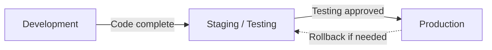

# Change Management

Information systems are not static. Organizations regularly modify their hardware, software, and configurations to fix bugs, add features, address security vulnerabilities, and meet evolving business requirements. Without a structured process for managing these changes, organizations risk introducing errors, creating security holes, or disrupting critical business operations. **Change management** is the set of processes and controls that govern how changes to information systems are requested, evaluated, approved, tested, implemented, and monitored.

This section covers the **purpose of change management**, the **tools and documentation** used, the **environments** involved, the **types of testing** performed, **system conversion approaches**, **patch management**, and how to **test change control policies** — including in organizations that use continuous integration and continuous deployment (CI/CD).

:::info

The ISC exam tests change management across all three skill levels. You must be able to explain the purpose and components of change management (Remembering and Understanding), test the design and implementation of change control policies (Application), and perform walkthroughs to compare observed procedures against documented requirements (Application).

:::

---

## Purpose of Change Management

Change management ensures that modifications to an organization's information systems are:

- **Authorized** — Only approved changes are implemented
- **Tested** — Changes are verified to work correctly before deployment
- **Documented** — A complete record of what was changed, by whom, and when is maintained
- **Controlled** — Changes follow a defined process that includes appropriate segregation of duties
- **Reversible** — Rollback procedures exist in case a change causes unexpected problems

Without effective change management:

- Unauthorized changes can introduce vulnerabilities or errors into production systems
- Untested changes can corrupt data or disrupt business processes
- Undocumented changes make it impossible to trace the cause of problems
- Lack of segregation of duties allows developers to modify production code without oversight

:::warning

Change management failures are among the most commonly tested deficiencies on the ISC exam. A scenario where a developer can move code directly into production without testing or approval represents a breakdown in multiple control principles — authorization, segregation of duties, and testing.

:::

---

## Change Management Tools and Documentation

Effective change management relies on a combination of tools and documentation to track, control, and verify changes:

### Tools

| Tool | Purpose |
|---|---|
| **Change tracking / ticketing systems** | Record change requests, approvals, and implementation status (e.g., Jira, ServiceNow) |
| **Version control systems** | Track all modifications to source code, enabling comparison of versions and rollback to previous versions (e.g., Git) |
| **Test libraries** | Store test cases, test scripts, and test results for regression and acceptance testing |
| **Build automation tools** | Automate the process of compiling, packaging, and deploying code changes (e.g., Jenkins, Azure DevOps) |
| **Monitoring and logging tools** | Track system behavior before and after changes are deployed to detect unexpected effects |

### Documentation

| Document | Purpose |
|---|---|
| **System component inventory** | A complete list of all hardware, software, and configuration items in the environment |
| **Baseline configuration** | The approved, documented configuration of a system at a specific point in time; changes are measured against this baseline |
| **Change requests** | Formal requests that describe the proposed change, its justification, risk assessment, and required approvals |
| **Ticketing records** | Track the lifecycle of each change from request through approval, testing, implementation, and closure |
| **Rollback procedures** | Documented steps for reverting a change if it causes unexpected problems after deployment |

---

## Environments

A properly controlled change management process uses **separate environments** to isolate changes at different stages of development:

| Environment | Purpose | Who Has Access |
|---|---|---|
| **Development** | Where developers write and modify code | Developers |
| **Staging (Testing / QA)** | Where changes are tested before deployment to production; mirrors the production environment as closely as possible | Testers, QA personnel |
| **Production** | The live environment used by the organization for actual business operations | End users; developers should have **no direct access** |

### Segregation of Environments

**Segregation of environments** is a critical control principle:

- Developers should **not** have access to the production environment
- Changes must be promoted from development to staging to production through a controlled process
- Production data should **not** be used in development or testing environments unless it is anonymized or masked

**Example:** At **MAS Inc.**, a developer creates a fix for a billing calculation error in the development environment. The fix is then promoted to the staging environment, where the QA team tests it against a defined set of test cases. Only after testing is approved does the change manager promote the fix to production. The developer never directly accesses the production system.

:::tip[Exam Tip]

If an exam question describes a scenario where developers have direct access to the production environment, this is a **segregation of duties deficiency**. The correct answer will typically involve restricting developer access to production and requiring a separate individual or team to promote changes.

:::

---

## Types of Testing

Before a change is deployed to production, it must be tested to verify that it works as intended and does not break existing functionality. The ISC exam expects you to understand the following types of testing:

| Test Type | Scope | Purpose |
|---|---|---|
| **Unit testing** | Individual components or modules | Verify that each component functions correctly in isolation |
| **Integration testing** | Interactions between components | Verify that components work correctly when combined |
| **System testing** | The entire system | Verify that the complete system meets its specifications |
| **Acceptance testing** | Business requirements | Verify that the system meets the needs of its users and stakeholders (often the final step before deployment) |

### Regression Testing

**Regression testing** is performed whenever a change is made to verify that the change has not inadvertently broken existing functionality. It involves re-running previously successful tests to confirm they still pass.

---

## System Conversion Approaches

When an organization replaces or significantly upgrades an information system, it must choose an approach for transitioning from the old system to the new one. Each approach involves different levels of risk, cost, and complexity:

| Approach | Description | Risk Level | Cost |
|---|---|---|---|
| **Direct (cutover)** | The old system is shut down and the new system goes live immediately | **Highest** — no fallback if the new system fails | Lowest |
| **Parallel** | Both the old and new systems run simultaneously for a period; results are compared to verify the new system is working correctly | **Lowest** — the old system is available as a fallback | Highest (running two systems) |
| **Pilot** | The new system is deployed to a small group or department first; once validated, it is rolled out to the entire organization | **Moderate** — limited exposure, but issues may not surface until full deployment | Moderate |
| **Phased** | The new system is implemented in stages (e.g., one module or location at a time) | **Moderate** — reduces risk through incremental deployment | Moderate |

**Example:** **Kingfisher Industries** is replacing its legacy accounting system with a new ERP platform. Management chooses a **parallel approach**, running both systems for three months and comparing the financial outputs. This allows the accounting team to verify that the new system produces accurate results before decommissioning the old system.

:::caution

The **direct cutover** approach carries the highest risk because there is no fallback option if the new system fails. The exam may test whether you can identify the risk associated with each approach and recommend the most appropriate one based on the organization's risk tolerance and the criticality of the system.

:::

---

## Patch Management

**Patch management** is the process of acquiring, testing, and deploying patches (software updates that fix bugs, close security vulnerabilities, or improve functionality) to an organization's systems. Because unpatched systems are a primary target for cyber-attacks, patch management is a critical component of both change management and security.

### Patch Management Process

1. **Monitoring** — Continuously monitor for available patches from software vendors and security advisories
2. **Prioritizing** — Assess the criticality of each patch based on the severity of the vulnerability it addresses and the systems affected
3. **Testing** — Test the patch in a non-production environment to verify it does not cause compatibility issues or break existing functionality
4. **Scheduling** — Plan the deployment window, considering business impact and system availability requirements
5. **Deploying** — Apply the patch to production systems according to the approved schedule
6. **Validating** — Verify that the patch was applied successfully and the system is functioning correctly
7. **Documenting** — Record the patch, the systems it was applied to, and the results

:::note

Emergency patches (e.g., for critical zero-day vulnerabilities) may require an expedited process that bypasses normal testing timelines. However, even emergency patches should be documented and reviewed after deployment to ensure they did not introduce new issues.

:::

---

## Testing Change Control Policies

The ISC exam tests your ability to evaluate whether an organization's change control policies are suitably designed and operating effectively. This includes organizations that have adopted modern software development practices such as **continuous integration (CI)** and **continuous deployment (CD)**.

### Key Change Control Policies to Evaluate

| Policy | What to Test |
|---|---|
| **Acceptance criteria** | Are there defined criteria that a change must meet before it can be promoted to production? |
| **Authorization** | Is every change formally approved by an appropriate authority before deployment? |
| **Code review** | Is source code reviewed by someone other than the developer before deployment? |
| **Testing requirements** | Are all required tests (unit, integration, system, acceptance) completed and documented? |
| **Logging and monitoring** | Are all changes logged, and are post-deployment monitoring procedures in place? |
| **Separation of duties** | Is the person who develops the change different from the person who approves and deploys it? |
| **Access restrictions** | Is access to the production environment restricted to authorized deployment personnel? |

### CI/CD Considerations

Organizations using CI/CD pipelines automate the build, test, and deployment process. While automation improves speed and consistency, it introduces new control considerations:

- **Automated testing gates** — The CI/CD pipeline should include automated tests that must pass before code can be promoted to the next stage
- **Approval workflows** — Even in automated pipelines, human approval should be required before deployment to production
- **Access to pipeline configuration** — The CI/CD pipeline configuration is itself a critical asset; changes to the pipeline should be controlled
- **Audit trail** — The pipeline should maintain a complete log of all builds, tests, approvals, and deployments

**Example:** **Illini Security** uses a CI/CD pipeline that automatically runs unit tests and integration tests whenever a developer commits code. However, the pipeline is configured to deploy directly to production without a manual approval step. This represents a change control deficiency — the pipeline lacks a human authorization gate before production deployment.

---

## Performing a Walkthrough of Change Management Procedures

A walkthrough involves selecting a specific change and tracing it through the entire change management process to verify that the documented policies were followed. The walkthrough procedure typically includes:

1. **Select a change** from the change tracking system
2. **Review the change request** — Was it properly documented and justified?
3. **Verify authorization** — Was the change approved by an appropriate authority?
4. **Confirm testing** — Were all required tests performed and documented?
5. **Check environment segregation** — Was the change developed, tested, and deployed through separate environments?
6. **Verify deployment** — Was the change deployed by an authorized individual (not the developer)?
7. **Review post-deployment monitoring** — Was the change monitored after deployment for unexpected effects?
8. **Compare to documented policy** — Does the observed procedure match the documented change management policy?

Discrepancies between the observed procedure and the documented policy represent **control deviations** that must be reported.

---

## Summary

| Topic | Key Takeaway |
|---|---|
| Purpose of change management | Ensure changes are authorized, tested, documented, controlled, and reversible |
| Tools and documentation | Change tracking, version control, test libraries, build automation, baseline configurations, and rollback procedures |
| Environment segregation | Development, staging, and production environments must be separate with controlled access |
| Types of testing | Unit, integration, system, and acceptance testing verify changes before deployment |
| Conversion approaches | Direct (highest risk), parallel (lowest risk), pilot, and phased approaches |
| Patch management | Monitor, prioritize, test, schedule, deploy, validate, and document patches |
| CI/CD controls | Automated pipelines still require testing gates, human approvals, access controls, and audit trails |

---

## Practice Questions

1. **Bear Co.** is replacing its payroll system. The HR director wants to minimize risk because payroll errors would affect all employees. Which system conversion approach should Bear Co. use, and why?

2. **Gies Co.** uses a CI/CD pipeline for its accounting application. The pipeline runs automated unit tests, but the test results are not reviewed before the code is deployed to production. A developer recently committed a change that passed unit tests but introduced a calculation error that was not caught until month-end close. What change control deficiency does this scenario illustrate?

3. During a walkthrough at **MAS Inc.**, you observe that the same individual who developed a change to the inventory module also approved the change and deployed it to production. What specific control deficiency has occurred?

:::tip[Answers]

1. **Parallel approach.** Running the old and new payroll systems simultaneously allows Bear Co. to compare payroll outputs and verify accuracy before decommissioning the old system. This provides a fallback option and is the lowest-risk approach for a critical system like payroll.

2. The deficiency is the **lack of a human review and approval gate** before production deployment. While automated unit tests are valuable, they may not catch all errors (such as business logic errors). The pipeline should include additional testing types (integration and acceptance testing) and require human review of test results and formal approval before deployment.

3. **Separation of duties deficiency.** The same individual should not develop, approve, and deploy a change. These responsibilities should be divided among different people to prevent unauthorized or untested changes from reaching production.

:::
