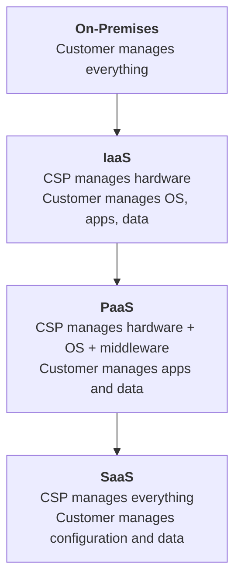

# IT Infrastructure

Every modern organization depends on information technology to initiate, record, process, and report financial transactions. Before evaluating specific controls or testing the integrity of business processes, a CPA must understand the **IT infrastructure** that supports those processes. IT infrastructure includes the hardware, software, networking components, and cloud services that form the foundation of an organization's information systems.

This section covers the **key components of IT architecture**, **cloud computing models and deployment options**, the **role and responsibilities of cloud service providers**, and how the **COSO frameworks address cloud computing governance**.

:::info

The ISC exam tests IT infrastructure concepts primarily at the Remembering and Understanding level. You should be able to explain the purpose of key architecture components, distinguish among cloud computing models, and summarize how governance frameworks apply to cloud environments.

:::

---

## Key Components of IT Architecture

IT architecture refers to the overall design and structure of an organization's technology environment. Understanding its major components is essential for evaluating how information flows through an enterprise and where controls exist — or are missing.

### Operating Systems

An **operating system (OS)** is the software that manages a computer's hardware resources and provides services for application programs. Common examples include Windows, macOS, Linux, and mobile operating systems such as iOS and Android.

From an audit and advisory perspective, the operating system is significant because:

- It controls **user authentication and access** to the system
- It manages **file permissions and security settings**
- It provides the **logging and monitoring** capabilities auditors rely on to evaluate control activities
- Vulnerabilities in the OS (unpatched software, default configurations) can expose the entire system to attack

**Example:** If **Bear Co.** runs its accounting software on a Windows Server operating system, the auditor must evaluate whether the OS is patched to current security standards, whether user accounts follow least-privilege principles, and whether audit logging is enabled.

### Servers

A **server** is a computer or program that provides services, data, or resources to other computers (clients) over a network. Servers can be physical machines in an on-premises data center or virtual machines hosted in a cloud environment.

Common types of servers in an enterprise environment include:

| Server Type | Purpose | Example |
|---|---|---|
| **Application server** | Hosts business applications (e.g., ERP, CRM) | Runs the accounting module that processes journal entries |
| **Database server** | Stores and manages data accessed by applications | Holds the general ledger database |
| **Web server** | Serves web-based applications and content to users | Hosts the customer-facing e-commerce portal |
| **File server** | Provides centralized storage for documents and files | Stores financial reports and audit workpapers |
| **Mail server** | Manages email communication | Handles company email including sensitive financial correspondence |

### Network Infrastructure

**Network infrastructure** encompasses the hardware and software components that enable communication between devices. Key elements include:

- **Routers** — direct network traffic between different networks (e.g., between an organization's internal network and the internet)
- **Switches** — connect devices within the same network and manage data traffic
- **Firewalls** — enforce security policies by controlling incoming and outgoing network traffic based on predetermined rules
- **Load balancers** — distribute network traffic across multiple servers to ensure availability and performance
- **Wireless access points** — enable wireless connectivity for devices within the network

:::tip[Exam Tip]

The CPA exam does not expect you to configure network hardware. However, you must understand what each component does and why it matters for controls. For example, a **firewall** is a critical preventive control that restricts unauthorized access to the network. If **MAS Inc.** does not have a properly configured firewall, external threat actors may gain access to financial systems.

:::

### End-User Devices

**End-user devices** include desktops, laptops, tablets, smartphones, and any other devices used by employees to access the organization's information systems. These devices represent a significant control risk because they are often the **entry point** for cyber-attacks (phishing, malware) and the **exit point** for data breaches (lost devices, unauthorized data transfers).

Controls over end-user devices include:

- Device encryption
- Mobile device management (MDM) software
- Endpoint detection and response (EDR) tools
- Acceptable use policies
- Automatic screen locking and remote wipe capabilities

---

## Cloud Computing

**Cloud computing** delivers IT resources — computing power, storage, databases, networking, software, and more — over the internet ("the cloud") on a pay-as-you-go basis. Rather than owning and maintaining physical data centers and servers, organizations can access technology services from a **cloud service provider (CSP)** such as Amazon Web Services (AWS), Microsoft Azure, or Google Cloud Platform (GCP).

Cloud computing has transformed how organizations build and manage their IT infrastructure. For CPAs, understanding cloud computing is critical because it affects how controls are designed, implemented, and tested — and it shifts certain responsibilities from the organization to the cloud service provider.

### Cloud Computing Models

Cloud computing services are categorized into three primary models, each offering a different level of abstraction and control:

| Model | Full Name | What the CSP Provides | What the Customer Manages | Example |
|---|---|---|---|---|
| **IaaS** | Infrastructure as a Service | Virtualized hardware (servers, storage, networking) | Operating systems, middleware, applications, data | AWS EC2, Azure Virtual Machines |
| **PaaS** | Platform as a Service | IaaS + operating system, middleware, and development tools | Applications and data | Azure App Service, Google App Engine |
| **SaaS** | Software as a Service | Complete application delivered via web browser | User configuration and data entry | Salesforce, Microsoft 365, QuickBooks Online |

:::tip[Exam Tip]

A common exam question format describes a scenario and asks you to identify which cloud model is being used. The key is to determine **who manages what**. If **Illini Entertainment** rents virtual servers and installs its own software on them, that is IaaS. If it uses a pre-configured development platform to build a custom app, that is PaaS. If it subscribes to a hosted accounting application, that is SaaS.

:::

### Cloud Deployment Models

In addition to the service model, organizations must choose a **deployment model** that determines who has access to the cloud environment:

| Deployment Model | Description | Use Case |
|---|---|---|
| **Public cloud** | Cloud infrastructure is shared among multiple organizations and operated by a third-party CSP | Cost-effective for standard workloads; used by organizations of all sizes |
| **Private cloud** | Cloud infrastructure is dedicated to a single organization, either on-premises or hosted by a third party | Used by organizations with strict regulatory or security requirements |
| **Hybrid cloud** | Combines public and private cloud environments, allowing data and applications to move between them | Enables organizations to keep sensitive data in a private cloud while using the public cloud for less sensitive workloads |

**Example:** **Gies Co.** might use a public cloud for its customer relationship management (CRM) system but maintain a private cloud for its core financial reporting database, which contains sensitive data subject to regulatory requirements. This hybrid approach balances cost efficiency with data security.

### Role and Responsibilities of Cloud Service Providers

When an organization moves to the cloud, certain control responsibilities shift from the organization to the CSP. Understanding this **shared responsibility model** is critical for IT audit and advisory work.

| Responsibility | On-Premises | IaaS | PaaS | SaaS |
|---|---|---|---|---|
| Physical security of data centers | Customer | **CSP** | **CSP** | **CSP** |
| Network infrastructure | Customer | **CSP** | **CSP** | **CSP** |
| Operating system patching | Customer | Customer | **CSP** | **CSP** |
| Application security | Customer | Customer | Customer | **CSP** |
| Data classification and access | Customer | Customer | Customer | Customer |
| Identity and access management | Customer | Customer | Customer | Customer |

Key points about CSP responsibilities:

- The CSP is responsible for the **security of the cloud** (physical infrastructure, hypervisor, networking)
- The customer is responsible for **security in the cloud** (data, access management, application configuration)
- The division of responsibility depends on the service model (IaaS, PaaS, or SaaS)
- Organizations should review the CSP's **SOC reports** (SOC 1® or SOC 2®) to evaluate the effectiveness of controls the CSP manages

:::warning

Moving to the cloud does not eliminate the organization's responsibility for controls. The organization must still ensure that its data is protected, access is properly managed, and the CSP's controls are evaluated — typically through a SOC 2® report. When evaluating **Kingfisher Industries**' cloud environment, you would review the CSP's SOC report, assess complementary user entity controls (CUECs), and verify that Kingfisher has implemented all controls that remain its responsibility.

:::

---

## COSO Frameworks and Cloud Computing Governance

The **Committee of Sponsoring Organizations of the Treadway Commission (COSO)** has published guidance specifically addressing how its frameworks apply to cloud computing environments. Two publications are particularly relevant for the ISC exam:

### Enterprise Risk Management for Cloud Computing

This COSO publication addresses the risks associated with cloud adoption and how the ERM framework can be applied to identify, assess, and manage those risks. Key considerations include:

- **Strategic alignment** — Does the cloud strategy support the organization's overall objectives?
- **Vendor risk** — What are the risks of dependence on a specific CSP, including vendor lock-in and service disruptions?
- **Data sovereignty** — Where is the data physically stored, and does the location comply with applicable laws and regulations?
- **Regulatory compliance** — Does the cloud deployment meet the requirements of relevant regulations (e.g., HIPAA, GDPR)?
- **Business continuity** — What happens if the CSP experiences an outage or goes out of business?

### Blockchain and Internal Control: The COSO Perspective

This COSO publication examines how blockchain technology affects internal control. While blockchain is an emerging technology, it is relevant to financial reporting because it can serve as a **distributed ledger** that records transactions in an immutable and transparent manner.

Key internal control considerations for blockchain include:

- **Processing integrity** — How does the consensus mechanism ensure that transactions are recorded accurately?
- **Access controls** — Who has permission to initiate, validate, and view transactions on the blockchain?
- **Change management** — How are updates to the blockchain protocol or smart contracts controlled?
- **Data governance** — Who is responsible for the data recorded on the blockchain, and how is it validated?

:::note

The ISC exam tests blockchain at a conceptual level within the COSO framework context. You are not expected to understand the technical details of blockchain protocols, but you should be able to explain how the COSO internal control framework can be used to evaluate risks related to the use of blockchain in financial reporting.

:::

---

## Summary

| Topic | Key Takeaway |
|---|---|
| IT architecture components | Understand the purpose of operating systems, servers, network infrastructure, and end-user devices |
| Cloud computing models | IaaS provides raw infrastructure, PaaS adds a development platform, SaaS delivers a complete application |
| Cloud deployment models | Public (shared), private (dedicated), hybrid (combination) — the choice depends on cost, security, and regulatory requirements |
| Shared responsibility | The CSP manages the cloud infrastructure; the customer manages data, access, and application configuration |
| COSO and cloud governance | COSO frameworks provide a structured approach to evaluating cloud-related risks, including vendor risk, data sovereignty, and regulatory compliance |

---

## Practice Questions

1. **Illini Security** is considering moving its financial reporting system to a cloud environment where the CSP will provide the hardware, operating system, and middleware. Illini Security will develop and deploy its own custom application on this platform. Which cloud computing model is being described?

2. **MAS Inc.** uses a SaaS-based accounting application. A new employee in the accounting department requests administrative access to the application. Under the shared responsibility model, who is responsible for granting or denying this access — MAS Inc. or the cloud service provider?

3. **Bear Co.** is evaluating its cloud service provider's controls. What type of report should Bear Co. request from the CSP to obtain assurance over the design and operating effectiveness of the CSP's controls related to security, availability, and processing integrity?

:::tip[Answers]

1. **PaaS (Platform as a Service).** The CSP provides hardware, OS, and middleware, and the customer develops its own application — this is the defining characteristic of PaaS.

2. **MAS Inc.** Even in a SaaS model, identity and access management remains the customer's responsibility. MAS Inc. must evaluate whether the employee needs administrative access and configure the user's permissions accordingly.

3. A **SOC 2® Type 2 report.** This report provides an opinion on the design and operating effectiveness of controls related to the Trust Services Criteria categories (security, availability, processing integrity, confidentiality, and privacy) over a specified period.

:::
