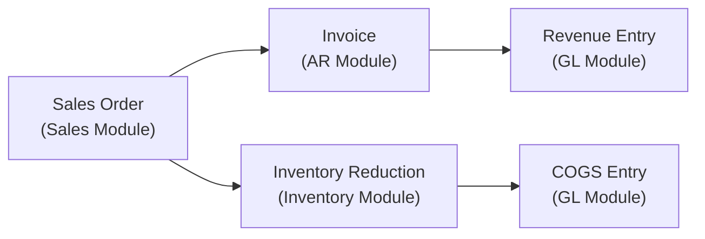

# Enterprise and Accounting Information Systems

Modern organizations rely on integrated information systems to manage their business processes and produce reliable financial information. **Enterprise Resource Planning (ERP) systems** and **accounting information systems (AIS)** form the backbone of these operations — connecting procurement, production, sales, human resources, treasury, and financial reporting into a unified platform. For CPAs performing IT audit and advisory services, understanding how these systems work, how they interact, and how controls ensure processing integrity is essential.

This section covers **ERP and accounting information systems**, the **business processes they enable**, **controls over processing integrity**, the use of **blockchain** in financial reporting contexts, opportunities for **process improvement** (including robotic process automation), and how to **reconcile actual processes to documented procedures**.

:::info

The ISC exam tests this topic across all three skill levels. You must be able to summarize what ERP and AIS systems encompass (Remembering and Understanding), determine potential improvements to business processes (Application), and detect deficiencies in processing integrity controls in a SOC 2® engagement (Analysis).

:::

---

## Enterprise Resource Planning (ERP) Systems

An **enterprise resource planning (ERP) system** is an integrated software platform that manages and automates core business processes across an organization. Rather than operating separate systems for finance, human resources, procurement, and manufacturing, an ERP system consolidates these functions into a single database and user interface.

### What ERP Systems Encompass

A typical ERP system includes modules for:

| Module | Business Functions |
|---|---|
| **Financial Accounting** | General ledger, accounts payable, accounts receivable, fixed assets, financial reporting |
| **Management Accounting** | Cost center accounting, profit center analysis, product costing |
| **Human Resources** | Payroll, benefits administration, time tracking, workforce planning |
| **Procurement** | Purchase requisitions, purchase orders, vendor management, receiving |
| **Sales and Distribution** | Sales orders, pricing, shipping, billing, customer management |
| **Production Planning** | Bill of materials, production scheduling, capacity planning, quality management |
| **Treasury** | Cash management, bank reconciliation, investment management |

### How ERP Modules Interact

The power of an ERP system lies in its **integration**. When a transaction is entered in one module, it automatically updates related modules:

**Example:** When **Polar Inc.** enters a sales order in the sales module, the ERP system automatically creates an accounts receivable entry, reduces inventory quantities, recognizes cost of goods sold, and posts the corresponding journal entries to the general ledger — all from a single transaction initiation.

This integration eliminates the need for manual data re-entry between systems, reduces the risk of transcription errors, and ensures that financial data is updated in real time. However, it also means that an error or control weakness in one module can propagate throughout the entire system.

:::tip[Exam Tip]

ERP integration is a double-edged sword for controls. On one hand, automated posting reduces manual errors. On the other hand, if the sales module allows unauthorized price overrides, the resulting revenue, receivables, and inventory entries will all be incorrect. When evaluating an ERP system, consider how a control failure in one module affects downstream processes.

:::

---

## Accounting Information Systems (AIS)

An **accounting information system (AIS)** is the component of an organization's information system that collects, records, stores, and processes financial data to produce information for decision makers. An AIS may be a module within an ERP system or a standalone application.

### Key Business Processes in an AIS

The ISC exam expects you to understand the following key business processes and the controls associated with each:

| Business Process | Key Activities | Key Documents/Records |
|---|---|---|
| **Sales / Revenue** | Order entry, credit approval, shipping, billing, revenue recognition | Sales orders, shipping documents, invoices |
| **Cash Collections** | Receiving payments, recording deposits, applying cash to receivables | Remittance advices, deposit slips, bank statements |
| **Purchasing** | Requisitioning, vendor selection, purchase order creation, receiving | Purchase requisitions, purchase orders, receiving reports |
| **Disbursements** | Invoice processing, three-way match, payment authorization, check signing | Vendor invoices, payment vouchers, checks/EFTs |
| **Human Resources / Payroll** | Employee onboarding, time tracking, payroll processing, tax withholding | Timesheets, payroll registers, tax filings |
| **Production** | Work order creation, material issuance, labor tracking, cost allocation | Work orders, material requisitions, production reports |
| **Treasury** | Cash forecasting, investment management, debt management, bank reconciliation | Cash flow projections, bank confirmations |
| **Fixed Assets** | Asset acquisition, depreciation, impairment testing, disposal | Asset registers, depreciation schedules |
| **General Ledger / Reporting** | Journal entry processing, trial balance, financial statement preparation | Journal entries, trial balance, financial statements |

### Documenting Business Processes

Organizations document their business processes using several formats. The ISC exam may ask you to reconcile the actual steps in a process against the documented procedure:

- **Flowcharts** — visual diagrams that depict the sequence of steps, decision points, and the flow of documents and information in a process
- **Business process diagrams** — similar to flowcharts but often use standardized notation such as Business Process Model and Notation (BPMN)
- **Narratives** — written descriptions of the process steps, controls, and personnel involved

**Example:** During a SOC 2® engagement at **Bear Co.**, the auditor walks through the purchasing process and observes that the actual process includes an unauthorized purchasing agent approving orders above their authority limit. Comparing this to the documented flowchart — which requires manager approval for orders above $5,000 — reveals a control deviation.

---

## Controls Over Processing Integrity

**Processing integrity** means that system processing is complete, valid, accurate, timely, and authorized. The AICPA Trust Services Criteria define processing integrity as one of the five categories evaluated in SOC 2® engagements.

### Types of Processing Controls

| Control Type | Purpose | Examples |
|---|---|---|
| **Input controls** | Ensure data entered into the system is complete, accurate, and authorized | Validation checks, input masks, authorization requirements, batch totals |
| **Processing controls** | Ensure data is processed correctly and completely | Run-to-run totals, sequence checks, limit checks, reasonableness tests |
| **Output controls** | Ensure output is complete, accurate, and distributed to authorized recipients | Report reconciliation, distribution lists, output logging |

### Common Input Validation Controls

| Control | Description | Example |
|---|---|---|
| **Validity check** | Verifies that entered data matches a list of valid values | Customer ID must exist in the customer master file |
| **Range check** | Ensures a value falls within an acceptable range | Hourly wage must be between $7.25 and $500.00 |
| **Completeness check** | Verifies that all required fields have been populated | Invoice cannot be submitted without a purchase order number |
| **Check digit** | Uses a mathematical algorithm to verify the accuracy of an identification number | Validates the check digit in a bank routing number |
| **Batch totals** | Compares control totals (hash totals, record counts, financial totals) before and after processing | Total of invoices entered must match the batch control total |
| **Duplicate check** | Prevents the same transaction from being entered twice | System rejects a second payment for the same invoice number |

:::warning

Processing integrity controls are a high-priority topic on the ISC exam, particularly in the context of SOC 2® engagements. You must be able to identify specific controls, explain their purpose, and — at the Analysis level — detect deficiencies in their design or operation.

:::

---

## Blockchain in the Context of Financial Reporting

**Blockchain** is a distributed ledger technology that records transactions across a network of computers in a way that makes the records difficult to alter retroactively. Each block contains a set of transactions, a timestamp, and a cryptographic hash of the previous block, creating an immutable chain.

### COSO Internal Control Framework and Blockchain

The COSO publication *Blockchain and Internal Control: The COSO Perspective* provides a framework for evaluating blockchain-related risks and designing controls to address them. Key considerations include:

| COSO Component | Blockchain Consideration |
|---|---|
| **Control Environment** | Does management understand blockchain technology and its implications for financial reporting? |
| **Risk Assessment** | What risks does blockchain introduce (e.g., smart contract errors, consensus failures, key management)? |
| **Control Activities** | Are controls in place to authorize transactions, validate smart contract logic, and manage cryptographic keys? |
| **Information and Communication** | Is blockchain-related data integrated into financial reporting systems, and are discrepancies identified? |
| **Monitoring** | Are blockchain systems monitored for performance, errors, and security events? |

**Example:** **Kingfisher Industries** is piloting a blockchain-based system for tracking inventory across its supply chain. Using the COSO framework, the auditor would evaluate whether Kingfisher has controls to ensure that inventory transactions recorded on the blockchain are complete, accurate, and properly reflected in its financial statements.

---

## Process Improvement Opportunities

The ISC exam tests your ability to determine potential changes to business processes that could improve the performance of an accounting information system. Common improvement opportunities include:

### Robotic Process Automation (RPA)

**Robotic process automation (RPA)** uses software "robots" to automate repetitive, rule-based tasks that were previously performed manually. RPA is particularly well suited for accounting processes such as:

- **Invoice processing** — Extracting data from vendor invoices and matching it to purchase orders and receiving reports
- **Bank reconciliation** — Comparing bank statement transactions to general ledger entries and flagging exceptions
- **Journal entry posting** — Preparing and posting standard recurring journal entries
- **Report generation** — Compiling financial reports from multiple data sources

**Benefits of RPA:**

- Reduces manual errors and increases processing speed
- Frees up staff for higher-value analytical work
- Provides a complete audit trail of automated actions
- Operates 24/7 without fatigue

**Risks of RPA:**

- Automating a flawed process amplifies the flaw
- Bots must be monitored and updated when underlying systems change
- Access controls must ensure bots have only the permissions needed for their tasks

### Outsourcing

Organizations may outsource certain business processes (e.g., payroll processing, IT hosting) to a service organization. When evaluating outsourcing decisions, consider:

- The impact on the organization's control environment
- The need for a SOC report to evaluate the service organization's controls
- The organization's responsibility for complementary user entity controls (CUECs)

### System Changes

Upgrading or replacing an accounting information system can address performance issues, improve integration, and enhance control capabilities. System changes are covered in detail in the **Change Management** topic.

---

## Reconciling Actual Processes to Documented Procedures

A critical skill for IT audit and advisory work is the ability to **walk through** an actual business process and compare what is observed to the documented procedure (such as a flowchart, business process diagram, or narrative). This reconciliation can reveal:

- **Control deviations** — instances where the actual process does not follow the documented control procedure
- **Design deficiencies** — cases where the documented procedure lacks a necessary control
- **Unauthorized process changes** — modifications to the process that were not approved through formal change management

### Walkthrough Procedures

When performing a walkthrough, the auditor typically:

1. Selects a single transaction or event from each major class of transactions
2. Traces the transaction from initiation through processing, recording, and reporting
3. Asks the personnel who perform each step to describe what they do and what controls they apply
4. Compares the observed process to the documented procedure
5. Evaluates whether the controls described are suitably designed and have been implemented

**Example:** During a SOC 2® engagement at **Illini Entertainment**, the auditor selects a customer subscription transaction and traces it from the sales order through billing, revenue recognition, and financial reporting. The auditor observes that the revenue recognition step does not include a review for multiple performance obligations, even though the documented procedure requires it. This is a processing integrity control deficiency.

---

## Detecting Deficiencies in a SOC 2® Engagement

In the context of a SOC 2® engagement, the auditor evaluates controls related to processing integrity using the **Trust Services Criteria**. The processing integrity criteria require that system processing is complete, valid, accurate, timely, and authorized to meet the entity's objectives.

When detecting deficiencies, the auditor considers:

- **Suitability of design** — Is the control designed to effectively address the applicable trust services criterion? A design deficiency exists when a necessary control is missing or is not designed to achieve the control objective.
- **Operating effectiveness** — Is the control operating as designed? An operating deficiency (deviation) exists when the control exists but is not followed consistently.

:::note

The distinction between a design deficiency and an operating deviation is critical for the ISC exam. A design deficiency means the control *would not work even if performed as intended*. An operating deviation means the control is *well designed but not consistently performed*. Both can result in processing integrity failures.

:::

---

## Summary

| Topic | Key Takeaway |
|---|---|
| ERP systems | Integrated platforms that connect all business functions; a control failure in one module can propagate to others |
| Accounting information systems | Collect, record, store, and process financial data; key business processes include sales, purchasing, payroll, and reporting |
| Processing integrity controls | Input, processing, and output controls ensure completeness, accuracy, and authorization |
| Blockchain and COSO | The COSO framework provides a structured approach to evaluating blockchain risks in financial reporting |
| RPA and process improvement | Automation can improve efficiency but requires controls over bot access, monitoring, and change management |
| Reconciling processes | Walk through actual processes and compare to documented procedures to detect deviations and design deficiencies |

---

## Practice Questions

1. **Bear Co.** uses an ERP system where sales orders automatically generate accounts receivable entries and reduce inventory. A sales representative enters a sales order for a product that has been discontinued and removed from inventory. However, the ERP system does not reject the order. What type of input control is missing?

2. **Polar Inc.** has documented its cash disbursement process in a flowchart that requires two approvals for payments over $10,000. During a walkthrough, the auditor observes that the second approval is routinely bypassed for payments to established vendors. Is this a design deficiency or an operating deviation?

3. **Bear Co.** implements an RPA bot to automate bank reconciliations. The bot is configured with read-only access to the bank statement data and write access to the reconciliation workpaper. Six months later, the underlying bank statement format changes, and the bot begins misclassifying transactions. What control over the RPA bot has failed?

:::tip[Answers]

1. A **validity check**. The system should verify that the product ID in the sales order exists in the current active inventory master file. A validity check would reject orders for discontinued products.

2. This is an **operating deviation** (not a design deficiency). The control is properly designed (two approvals for payments over $10,000), but it is not being consistently followed. The bypass for established vendors represents a failure in operating effectiveness.

3. **Monitoring and change management controls** over the RPA bot have failed. RPA bots must be monitored for errors when underlying systems change, and updates to the bot should go through formal change management procedures.

:::
