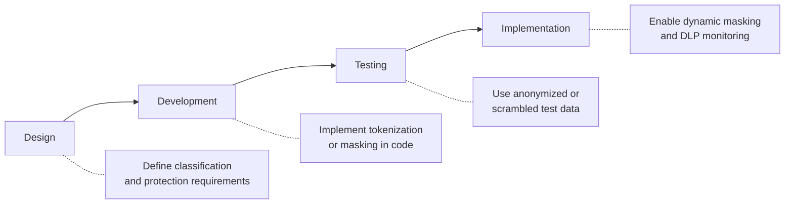

# Confidentiality and Privacy

Protecting sensitive information and respecting individual privacy rights are foundational obligations for every organization. For CPAs, these concepts are central to SOC 2® engagements, IT risk assessments, and advisory services — particularly as data breaches grow in frequency and regulatory penalties intensify. Whether you are evaluating encryption controls, assessing a client's DLP program, or testing confidentiality commitments under the Trust Services Criteria, you must understand how organizations safeguard data throughout its lifecycle.
This section covers **encryption fundamentals and techniques**, **the distinction between confidentiality and privacy**, **data protection methods (obfuscation, tokenization, anonymization)**, **Data Loss Prevention (DLP)**, **financial and operational implications of a data breach**, **data lifecycle controls**, **SOC 2® confidentiality and privacy criteria**, and **walkthrough procedures for confidentiality and privacy controls**.
:::info
The ISC exam tests confidentiality and privacy at the Remembering & Understanding, Application, and Analysis levels. You should be able to explain encryption techniques, distinguish confidentiality from privacy, identify data protection methods, determine appropriate controls for the data lifecycle, and detect deficiencies in SOC 2® engagements.
:::

---

## Encryption Fundamentals

**Encryption** transforms readable data (plaintext) into an unreadable format (ciphertext) using an algorithm and a key. Only authorized parties with the correct key can decrypt the data back to plaintext.

### Symmetric vs. Asymmetric Encryption

| Feature               | Symmetric Encryption                            | Asymmetric Encryption                                |
| --------------------- | ----------------------------------------------- | ---------------------------------------------------- |
| **Keys used**         | Single shared key for encryption and decryption | Key pair — public key encrypts, private key decrypts |
| **Speed**             | Fast; efficient for large data volumes          | Slower; computationally intensive                    |
| **Key distribution**  | Challenge — must securely share the key         | Easier — public key can be freely distributed        |
| **Common algorithms** | AES, DES, 3DES                                  | RSA, ECC                                             |
| **Typical use cases** | Encrypting data at rest, bulk data transfer     | Digital signatures, key exchange, email encryption   |

:::tip[Exam Tip]
Remember: **Symmetric = Same key** (one key shared by both parties). **Asymmetric = A pair** (public + private). AES-256 is the current industry standard for symmetric encryption. RSA and ECC are the most common asymmetric algorithms.
:::

### Hashing

**Hashing** is a one-way function that produces a fixed-length output (hash or digest) from any input. Unlike encryption, hashing cannot be reversed. It verifies data integrity rather than providing confidentiality.
| Algorithm | Output Length | Status |
|---|---|---|
| **MD5** | 128 bits | Deprecated — collision vulnerabilities |
| **SHA-1** | 160 bits | Deprecated — collision vulnerabilities |
| **SHA-256** | 256 bits | Current standard |
| **SHA-3** | Variable | Newest standard |

### Public Key Infrastructure (PKI) and Digital Certificates

**PKI** provides the framework for managing digital certificates and public-key encryption. Components include:

- **Certificate Authority (CA)** — Issues and signs digital certificates
- **Registration Authority (RA)** — Verifies identity before certificate issuance
- **Digital certificate** — Binds a public key to an entity's identity
- **Certificate Revocation List (CRL)** — Lists revoked certificates

### Encryption at Rest vs. In Transit

| State          | Description                                    | Common Controls                            |
| -------------- | ---------------------------------------------- | ------------------------------------------ |
| **At rest**    | Data stored on disk, database, or backup media | AES-256 full-disk encryption, database TDE |
| **In transit** | Data moving across a network                   | TLS 1.2+, IPsec VPN, HTTPS                 |

## **TLS (Transport Layer Security)** replaced the deprecated SSL protocol and secures data in transit by establishing an encrypted channel between two endpoints using both asymmetric (for key exchange) and symmetric (for bulk data) encryption.

## Confidentiality vs. Privacy

Although related, confidentiality and privacy address different concerns:
| Dimension | Confidentiality | Privacy |
|---|---|---|
| **Definition** | Protecting sensitive information from unauthorized access or disclosure | An individual's right to control the collection, use, and sharing of their personal information |
| **Focus** | The data itself — trade secrets, financial records, IP | The data subject — customers, employees, patients |
| **Obligation** | Contractual or organizational (e.g., NDA, policy) | Legal and regulatory (e.g., GDPR, HIPAA, CCPA) |
| **TSC category** | Confidentiality (C1) | Privacy (P1–P8) |
| **Example** | Preventing unauthorized access to **Bear Co.**'s merger plans | Ensuring **Bear Co.** obtains consent before collecting customer emails |
:::note
All privacy protections require confidentiality controls, but not all confidential information involves personal data. A company's proprietary formula is confidential but does not trigger privacy regulations.
:::

---

## Data Protection Methods

Organizations employ various techniques to protect confidential data during the design, development, testing, and implementation of applications.
| Method | Description | Reversible? | Use Case |
|---|---|---|---|
| **Data masking** | Replaces sensitive characters with substitutes (e.g., XXX-XX-1234) | No (static) / Yes (dynamic) | Displaying partial data in UIs |
| **Data scrambling** | Randomly rearranges characters within a field | Yes (with key) | Non-production test environments |
| **Tokenization** | Replaces sensitive data with a non-sensitive token; original stored in a secure vault | Yes (via vault lookup) | Payment card processing (PCI DSS) |
| **Anonymization** | Irreversibly removes identifying information | No | Research datasets, analytics |
| **Pseudonymization** | Replaces identifiers with artificial ones; re-identification possible with a separate key | Yes (with key) | GDPR-compliant processing |

### When to Apply During the SDLC

## **Example:** **MAS Inc.** builds a new payroll application. During testing, developers must never use real employee SSNs. The security team provides **tokenized** test data so that the application logic can be validated without exposing actual sensitive values.

## Data Loss Prevention (DLP)

**Data Loss Prevention (DLP)** refers to the set of tools, processes, and policies that detect and prevent unauthorized transmission or leakage of sensitive data outside the organization.

### Types of DLP

| Type             | Deployment                                | What It Monitors                          |
| ---------------- | ----------------------------------------- | ----------------------------------------- |
| **Network DLP**  | Monitors network traffic at egress points | Email, web uploads, FTP transfers         |
| **Endpoint DLP** | Installed on workstations and laptops     | USB copies, print jobs, clipboard actions |
| **Cloud DLP**    | Integrates with SaaS/IaaS platforms       | Cloud storage sharing, API data flows     |

### How DLP Works

1. **Content inspection** — Scans data for patterns (credit card numbers, SSNs, keywords)
2. **Contextual analysis** — Evaluates sender, recipient, time, destination
3. **Policy enforcement** — Blocks, quarantines, encrypts, or alerts based on rule matches
   :::warning
   DLP is only effective when policies are kept current and aligned with data classification. A DLP system that cannot identify newly classified confidential data will fail to prevent its exfiltration.
   :::
   **Example:** **Illini Security** configures its network DLP to flag any outbound email containing more than 10 records matching a SSN pattern (XXX-XX-XXXX). When an employee attempts to email a spreadsheet with 500 customer SSNs to a personal account, the DLP system blocks the transmission and alerts the security team.

---

## Financial and Operational Implications of a Data Breach

| Impact Category      | Examples                                                                       | Typical Cost Drivers                                                                           |
| -------------------- | ------------------------------------------------------------------------------ | ---------------------------------------------------------------------------------------------- |
| **Financial**        | Regulatory fines, legal settlements, credit monitoring, forensic investigation | GDPR fines up to €20M or 4% of global revenue; HIPAA fines up to \$1.5M per violation category |
| **Operational**      | Business disruption, system downtime, diverted IT resources                    | Incident response labor, emergency patching, overtime                                          |
| **Reputational**     | Loss of customer trust, negative media coverage, stock price decline           | Customer churn, reduced new business, investor confidence                                      |
| **Legal/Regulatory** | Lawsuits, consent decrees, mandatory audits                                    | Attorney fees, ongoing compliance monitoring                                                   |
| **Insurance**        | Cyber liability premiums increase, coverage disputes                           | Policy deductibles, exclusions for negligence                                                  |

:::note
The average cost of a data breach exceeds \$4 million globally. Organizations with mature encryption and DLP programs experience significantly lower breach costs due to reduced data exposure.
:::
**Example:** **Kingfisher Industries** suffers a breach exposing 200,000 customer payment records. Direct costs include \$2M in notification and credit monitoring, \$1.5M in forensic investigation, and a \$3M regulatory fine. Indirect costs — customer attrition and brand damage — exceed \$5M over two years.

---

## Data Lifecycle Controls

Organizations must implement controls at every stage of the data lifecycle:
| Stage | Key Controls |
|---|---|
| **Collection** | Consent mechanisms, data minimization, input validation, classification at point of entry |
| **Processing** | Role-based access control (RBAC), least privilege, audit logging, data quality checks |
| **Storage** | Encryption at rest (AES-256), access control lists, data classification labels, backup encryption |
| **Transmission** | TLS 1.2+, VPN tunnels, encrypted email (S/MIME or PGP), secure file transfer (SFTP) |
| **Deletion** | Crypto-shredding, secure wipe (NIST 800-88), certificate of destruction, retention policy enforcement |

### Data Classification

| Level            | Description                   | Example                            |
| ---------------- | ----------------------------- | ---------------------------------- |
| **Public**       | No harm if disclosed          | Marketing materials                |
| **Internal**     | Minor harm if disclosed       | Internal memos                     |
| **Confidential** | Significant harm if disclosed | Financial statements (pre-release) |
| **Restricted**   | Severe harm if disclosed      | PII, PHI, trade secrets            |

### Secure Destruction Methods

- **Crypto-shredding** — Destroying encryption keys renders data unrecoverable without physically destroying media
- **Degaussing** — Magnetically erasing data from magnetic media
- **Physical destruction** — Shredding, incineration, or disintegration of storage media
- **Secure overwrite** — Writing random patterns over data multiple times (per NIST SP 800-88)

---

## SOC 2® Confidentiality and Privacy Controls

In a SOC 2® engagement, auditors evaluate an organization's controls against the **Trust Services Criteria (TSC)**. Confidentiality and privacy are two of the five TSC categories.

### Confidentiality Criteria (C1)

The confidentiality category evaluates whether the entity protects information designated as confidential:
| Criterion | Focus Area |
|---|---|
| **C1.1** | Confidential information is identified and protected |
| **C1.2** | Confidential information is disposed of securely |

### Privacy Criteria (P1–P8)

| Criterion | Principle                    | Description                                                                           |
| --------- | ---------------------------- | ------------------------------------------------------------------------------------- |
| **P1**    | Notice                       | The entity provides notice about its privacy practices                                |
| **P2**    | Choice and consent           | The entity obtains consent for collection and use of personal information             |
| **P3**    | Collection                   | Personal information is collected only for identified purposes                        |
| **P4**    | Use, retention, and disposal | Personal information is used, retained, and disposed of per stated policies           |
| **P5**    | Access                       | Data subjects can access and update their personal information                        |
| **P6**    | Disclosure and notification  | Personal information is disclosed only as authorized; breach notification is provided |
| **P7**    | Quality                      | The entity maintains accurate, complete personal information                          |
| **P8**    | Monitoring and enforcement   | The entity monitors compliance with its privacy commitments                           |

### Design Deficiencies vs. Operating Deviations

| Issue Type              | Definition                                                                                                          | Example                                                                                                           |
| ----------------------- | ------------------------------------------------------------------------------------------------------------------- | ----------------------------------------------------------------------------------------------------------------- |
| **Design deficiency**   | A control is missing or improperly designed such that even if it operates as intended, it cannot meet the criterion | **Gies Co.** has no policy requiring encryption of confidential data at rest — the control simply does not exist  |
| **Operating deviation** | A properly designed control fails to operate as intended during the examination period                              | **Gies Co.** has an encryption policy but an administrator bypassed it for three months due to a system migration |

---

## Confidentiality and Privacy Walkthroughs

A **walkthrough** is a procedure in which the auditor traces a transaction or process from initiation to completion, observing actual procedures and comparing them to documented policies.

### Walkthrough Procedure Steps

1. **Select the process** — Choose a confidentiality or privacy-relevant process (e.g., customer data collection, data disposal)
2. **Obtain documentation** — Gather written policies and procedure documents
3. **Trace through the system** — Follow data from input through processing to output/destruction
4. **Observe personnel** — Watch employees perform the process in real time
5. **Inquire** — Ask operators clarifying questions about exceptions and controls
6. **Compare** — Evaluate observed procedure against documented requirements

### Areas to Evaluate

| Area                       | What to Look For                                                          |
| -------------------------- | ------------------------------------------------------------------------- |
| **IT risk management**     | Risk assessments include confidentiality and privacy threats              |
| **Human resources**        | Background checks, termination procedures revoke access promptly          |
| **Training and education** | Employees receive privacy awareness training annually                     |
| **Incident response**      | Breach notification procedures align with regulatory timelines            |
| **Vendor management**      | Third-party contracts include confidentiality and data protection clauses |

## **Example:** **Illini Entertainment** documents a policy requiring employee access to customer PII to be revoked within 24 hours of termination. During a walkthrough, the auditor discovers that two terminated employees retained access for 15 days. This is an **operating deviation** — the policy is properly designed but was not consistently executed.

## Summary

| Topic                       | Key Takeaway                                                                                                                       |
| --------------------------- | ---------------------------------------------------------------------------------------------------------------------------------- |
| Encryption fundamentals     | Symmetric (AES) is fast for bulk data; asymmetric (RSA/ECC) enables secure key exchange; hashing verifies integrity                |
| Confidentiality vs. privacy | Confidentiality protects data from unauthorized access; privacy protects individuals' rights over their personal data              |
| Data protection methods     | Tokenization, masking, anonymization, and pseudonymization protect data during SDLC — choose based on reversibility needs          |
| Data Loss Prevention        | DLP tools monitor network, endpoint, and cloud channels using content inspection and contextual analysis to prevent data leakage   |
| Data breach implications    | Breaches cause financial (fines, remediation), operational (downtime), reputational (churn), and legal consequences                |
| Data lifecycle controls     | Apply classification, encryption, access controls, and secure destruction at each stage — collection through deletion              |
| SOC 2® criteria             | Confidentiality (C1) and Privacy (P1–P8) criteria define the benchmarks; distinguish design deficiencies from operating deviations |
| Walkthroughs                | Trace processes end-to-end, observe personnel, and compare actual practices to documented policies                                 |

---

## Practice Questions

1. **Bear Co.** stores customer payment data in a cloud database encrypted with AES-256. When transmitting this data to a payment processor, the connection uses TLS 1.3. A new developer proposes using MD5 hashes to verify data integrity during transfer. Should the security team approve this approach, and why or why not?
2. **MAS Inc.** is undergoing a SOC 2® engagement. The auditor reviews the company's confidentiality controls and finds that the data retention policy requires deletion of client files 90 days after engagement completion. However, when the auditor examines the file server, client files from 8 months ago remain accessible. Is this a design deficiency or an operating deviation? Explain.
3. **Illini Security** implements a new DLP solution. During configuration, the team sets rules to block outbound emails containing credit card numbers but does not create rules for Social Security numbers, health records, or proprietary source code. Six months later, an employee emails a file containing 1,000 patient health records to an unauthorized external recipient without triggering any alert. What type of DLP failure is this, and what should the team have done differently?
   :::tip[Answers]
4. The security team should **reject MD5** for integrity verification. MD5 is cryptographically broken — known collision vulnerabilities allow attackers to craft two different inputs with the same hash. Bear Co. should use **SHA-256** or higher for integrity checks. While TLS 1.3 already provides message integrity via its built-in HMAC, any additional application-layer integrity check must use a current algorithm.
5. This is an **operating deviation**, not a design deficiency. The control (90-day retention policy with deletion requirement) is properly designed and, if followed, would satisfy the confidentiality criterion. The failure is in execution — personnel did not perform the scheduled deletion. The auditor should report this as a deviation in control operation during the examination period.
6. This is a **policy coverage failure** — the DLP rules were incomplete. DLP effectiveness depends on comprehensive policies aligned with the organization's data classification scheme. Illini Security should have: (a) mapped all categories of sensitive data (PCI, PII, PHI, IP) to DLP rules, (b) conducted a data classification exercise before configuring rules, and (c) tested detection patterns for each data category. A DLP system can only prevent leakage of data types it is configured to recognize.
   :::
