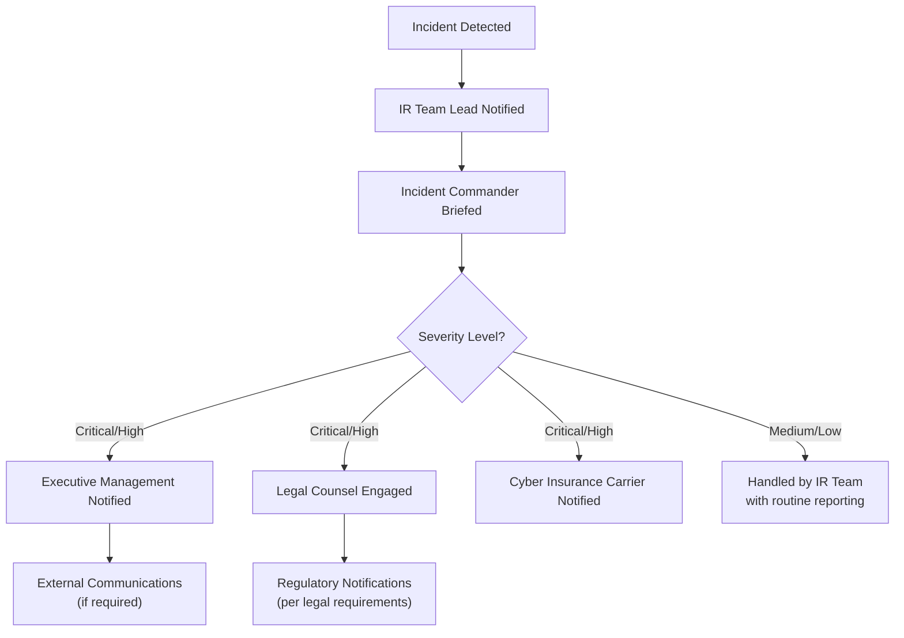
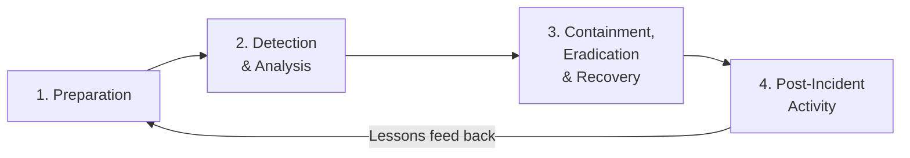

# Incident Response

When a cybersecurity breach occurs, an organization's ability to respond quickly and effectively determines the extent of damage, legal liability, and reputational harm. Incident response is the structured approach to detecting, containing, and recovering from security incidents — and it is a critical area for CPAs performing IT audit, advisory, and SOC engagements. Understanding how organizations prepare for and respond to incidents allows CPAs to evaluate whether response plans are adequate, whether the entity followed its own procedures, and whether appropriate risk transfer mechanisms (such as cyber insurance) are in place.
This section covers **the distinction between security events and incidents**, **cyber insurance as a risk transfer strategy**, **incident response plan components (roles, responsibilities, methods, steps, and timelines)**, **the phases of incident response**, and **procedures to test whether an entity responded to incidents in accordance with its plan**.
:::info
The ISC exam tests incident response at the Remembering and Understanding level (recall differences between events and incidents, explain cyber insurance, summarize IR plan contents) and at the Application level (perform procedures to test whether the entity responded to incidents in accordance with its plan).
:::

---

## Security Events vs. Security Incidents

Not every security-related occurrence warrants a full response. Organizations must distinguish between **events** (routine occurrences) and **incidents** (occurrences that actually compromise or threaten to compromise the confidentiality, integrity, or availability of information).

### Definitions

| Term                  | Definition                                                                                      | Examples                                                                                                                 |
| --------------------- | ----------------------------------------------------------------------------------------------- | ------------------------------------------------------------------------------------------------------------------------ |
| **Security event**    | Any observable occurrence in an information system or network                                   | A user logging in, a firewall blocking a port scan, an antivirus flagging a file, a failed login attempt                 |
| **Security incident** | An event or series of events that actually compromises or threatens to compromise the CIA triad | A confirmed data breach, successful ransomware deployment, unauthorized access to financial records, exfiltration of PII |

:::caution
Not every event is an incident, but every incident begins as an event. The key distinction is whether the occurrence **actually compromises or threatens** the organization's information assets. A single failed login attempt is an event; 500 failed login attempts against an executive's account followed by a successful login from an unknown IP address is an incident.
:::

### Classification Criteria

Organizations use defined criteria to classify events and determine whether escalation to incident status is warranted:
| Criterion | Description |
|---|---|
| **Impact on CIA** | Does the event compromise confidentiality, integrity, or availability of systems or data? |
| **Scope** | How many systems, users, or data records are affected? |
| **Data sensitivity** | Does the event involve PII, PHI, financial data, or trade secrets? |
| **Regulatory implications** | Does the event trigger notification requirements under GDPR, HIPAA, or state breach laws? |
| **Business impact** | Does the event disrupt operations, revenue generation, or customer service? |

### Severity Levels

| Level        | Description                                                                        | Example                                                 | Response                          |
| ------------ | ---------------------------------------------------------------------------------- | ------------------------------------------------------- | --------------------------------- |
| **Critical** | Confirmed compromise of sensitive data or systems with significant business impact | Ransomware encrypts production database servers         | Immediate full IR team activation |
| **High**     | Likely compromise or active threat with potential for significant damage           | Attacker gains access to a privileged account           | IR team activation within 1 hour  |
| **Medium**   | Suspicious activity requiring investigation but no confirmed compromise            | Unusual outbound data transfer patterns detected        | Investigation within 4 hours      |
| **Low**      | Minor events handled through routine security operations                           | Single failed login attempt, routine malware quarantine | Logged and monitored              |

> **Example:** **Bear Co.**'s SIEM generates 10,000 security events per day. The security operations team uses automated correlation rules to filter these events. When the system detects 200 failed authentication attempts against the CFO's account from a foreign IP address followed by a successful login, it automatically escalates the event to a **high-severity incident** and notifies the incident response team.

## Cyber Insurance

**Cyber insurance** (also called cyber liability insurance) is a risk **transfer** mechanism that helps organizations offset the financial impact of security incidents and data breaches. It does not prevent incidents — it mitigates the financial consequences after an incident occurs.

### Coverage Categories

| Category                 | Type                                           | What It Covers                                                                                                                                                                                                     |
| ------------------------ | ---------------------------------------------- | ------------------------------------------------------------------------------------------------------------------------------------------------------------------------------------------------------------------ |
| **First-party coverage** | Direct costs to the insured organization       | Forensic investigation, breach notification costs, credit monitoring for affected individuals, legal counsel, business interruption losses, data recovery, ransomware payments (where legal), crisis management/PR |
| **Third-party coverage** | Claims made against the organization by others | Liability to affected customers, regulatory defense costs, regulatory fines and penalties (where insurable), payment card industry (PCI) fines, media liability                                                    |

### Common Policy Exclusions

Cyber insurance policies typically **do not** cover:

- Acts of war or nation-state attacks (war exclusion)
- Incidents arising from known but unpatched vulnerabilities
- Losses from failure to maintain minimum security standards
- Prior known incidents or ongoing breaches before policy inception
- Intentional or fraudulent acts by the insured
- Infrastructure failures unrelated to cyber events

### Relationship to Incident Response

| Consideration                 | Description                                                                                                                    |
| ----------------------------- | ------------------------------------------------------------------------------------------------------------------------------ |
| **Pre-incident requirements** | Many policies require the insured to maintain specific controls (MFA, endpoint protection, backups) as a condition of coverage |
| **Approved vendor panels**    | Insurers often require use of pre-approved forensics firms, legal counsel, and breach notification vendors                     |
| **Notification timelines**    | Policies require prompt notification to the insurer — delays can void coverage                                                 |
| **Coordination with IR plan** | The IR plan should reference the cyber insurance policy and include insurer notification in its communication protocols        |
| **Coverage limits**           | Policies have aggregate limits and sub-limits per category; organizations must ensure limits align with risk exposure          |

**Example:** **MAS Inc.** purchases a cyber insurance policy with $5 million aggregate coverage. When a ransomware attack encrypts its accounting systems, the insurer covers forensic investigation ($250,000), business interruption losses ($800,000), and breach notification costs ($150,000). However, the insurer denies the claim for data recovery because MAS Inc. failed to maintain the offline backup requirement specified in the policy — illustrating that insurance is not a substitute for adequate controls.
:::warning
Cyber insurance is a **supplement** to — not a replacement for — an effective security program. Insurers increasingly require evidence of robust controls before issuing policies, and failure to maintain those controls can void coverage when a claim is filed.
:::

---

## Incident Response Plan Contents

An **incident response plan (IRP)** is a documented set of procedures that defines how an organization detects, responds to, contains, and recovers from security incidents. The plan should be approved by senior management, tested regularly, and updated based on lessons learned.

### Common Components

| Component                             | Description                                                                                 |
| ------------------------------------- | ------------------------------------------------------------------------------------------- |
| **Purpose and scope**                 | Defines what constitutes an incident, which systems are covered, and the plan's objectives  |
| **Roles and responsibilities**        | Identifies team members and their specific duties during an incident                        |
| **Classification and prioritization** | Criteria for determining incident severity and escalation triggers                          |
| **Detection and analysis methods**    | Tools and procedures for identifying and confirming incidents (SIEM, IDS/IPS, log analysis) |
| **Containment strategies**            | Short-term and long-term actions to limit incident spread                                   |
| **Eradication procedures**            | Steps to remove the threat from the environment                                             |
| **Recovery procedures**               | Steps to restore systems and data to normal operations                                      |
| **Communication protocols**           | Internal and external notification requirements and escalation paths                        |
| **Documentation requirements**        | What must be recorded during and after an incident (timeline, actions, evidence)            |
| **Timelines**                         | Maximum response times for each severity level and regulatory notification deadlines        |
| **Post-incident review**              | Procedures for lessons-learned analysis and plan updates                                    |

### Roles and Responsibilities

| Role                     | Responsibilities                                                                          |
| ------------------------ | ----------------------------------------------------------------------------------------- |
| **Incident Commander**   | Overall authority during the incident; makes escalation and resource decisions            |
| **IR Team Lead**         | Coordinates technical response activities; manages the hands-on response                  |
| **IT/Security Analysts** | Perform detection, containment, eradication, and recovery procedures                      |
| **Legal Counsel**        | Advises on regulatory notification requirements, evidence preservation, liability         |
| **Communications/PR**    | Manages external communications, media inquiries, and customer notifications              |
| **Executive Management** | Receives briefings, approves major decisions (e.g., paying ransom, shutting down systems) |
| **Human Resources**      | Involved when insider threats are identified or disciplinary action is required           |
| **Third-party vendors**  | Forensics firms, outside legal counsel, breach notification services                      |

### Communication Protocols

---

## Incident Response Phases

The NIST Cybersecurity Framework (SP 800-61) defines four phases of incident response. These phases are not strictly linear — organizations often cycle between detection and containment as new information emerges.

### Phase Details

| Phase                                      | Objective                                               | Key Activities                                                                                                                                                   |
| ------------------------------------------ | ------------------------------------------------------- | ---------------------------------------------------------------------------------------------------------------------------------------------------------------- |
| **1. Preparation**                         | Establish capability to respond before incidents occur  | Develop IR plan, assign roles, acquire tools, conduct training and tabletop exercises, establish communication channels, obtain cyber insurance                  |
| **2. Detection & Analysis**                | Identify and confirm that an incident has occurred      | Monitor alerts (SIEM, IDS), analyze logs, correlate events, determine scope and severity, document initial findings                                              |
| **3. Containment, Eradication & Recovery** | Limit damage, remove the threat, and restore operations | Isolate affected systems, preserve evidence, remove malware, patch vulnerabilities, restore from backups, verify system integrity before returning to production |
| **4. Post-Incident Activity**              | Learn from the incident and improve future response     | Conduct lessons-learned meeting, update IR plan, identify control gaps, produce incident report, update detection rules                                          |

> **Example:** **Illini Entertainment** detects unusual database queries against its customer PII table (Phase 2). The IR team isolates the affected database server from the network (Phase 3 — containment), identifies that an attacker exploited an unpatched SQL injection vulnerability (Phase 3 — eradication involves patching), restores verified clean data from backups (Phase 3 — recovery), and conducts a lessons-learned review that results in implementing automated patch management for database servers (Phase 4).

## Testing Incident Response Plan Compliance

CPAs performing IT audit or SOC engagements must evaluate whether an organization **actually followed** its incident response plan when real incidents occurred. This is an **application-level** skill — you must be able to design and perform procedures to assess compliance.

### Procedures to Test IR Plan Compliance

| Procedure                              | Purpose                                                                    | Evidence Obtained                                                                     |
| -------------------------------------- | -------------------------------------------------------------------------- | ------------------------------------------------------------------------------------- |
| **Review incident logs and tickets**   | Verify that incidents were documented per plan requirements                | Incident tickets, SIEM alerts, timestamps, severity classifications                   |
| **Trace incidents through plan steps** | Confirm that actual response activities followed the documented phases     | Containment actions, eradication steps, recovery records compared to plan             |
| **Interview IR team personnel**        | Assess awareness of roles and whether escalation procedures were followed  | Interview notes, knowledge of plan contents and responsibilities                      |
| **Evaluate timeliness**                | Determine whether response times met plan-defined thresholds               | Timestamps for detection, notification, containment, and resolution compared to SLAs  |
| **Assess documentation completeness**  | Verify that required records were maintained throughout the incident       | Incident reports, chain-of-custody logs, communication records, evidence preservation |
| **Review post-incident reports**       | Confirm lessons learned were identified and incorporated into plan updates | Post-mortem reports, plan revision history, updated detection rules                   |
| **Inspect regulatory notifications**   | Verify required notifications were made within mandated timeframes         | Notification letters, regulatory filings, timestamps                                  |

### Common Findings

| Finding                                      | Implication                                                                           |
| -------------------------------------------- | ------------------------------------------------------------------------------------- |
| Incidents not classified per severity matrix | Organization cannot demonstrate consistent prioritization                             |
| Response times exceeded plan thresholds      | Potential for increased damage; SLA non-compliance                                    |
| No evidence of post-incident review          | Organization is not learning from incidents; same vulnerabilities may be re-exploited |
| Key personnel unaware of their IR roles      | Plan exists on paper but is not operationalized                                       |
| Regulatory notifications missed or late      | Potential fines, legal liability, and loss of customer trust                          |
| Insurer not notified within policy timeframe | Coverage may be denied for the incident                                               |

> **Example:** **Gies Co.**'s incident response plan requires containment actions within 2 hours of a critical incident being declared. During the IT audit, the CPA selects three critical incidents from the past year and traces each through the plan's documented steps. For one incident, the CPA finds that containment did not occur until 8 hours after declaration because the on-call analyst was unreachable and no backup contact was defined in the plan. The CPA reports this as a **design deficiency** in the escalation procedures and an **operating deviation** in the specific incident response.

## Summary

| Topic                 | Key Takeaway                                                                                                                                                                       |
| --------------------- | ---------------------------------------------------------------------------------------------------------------------------------------------------------------------------------- |
| Events vs. incidents  | An event is any observable occurrence; an incident actually compromises or threatens CIA — not every event is an incident                                                          |
| Cyber insurance       | Risk transfer mechanism covering first-party (forensics, notification, business interruption) and third-party (liability, regulatory) costs; not a substitute for controls         |
| IR plan contents      | Includes roles, responsibilities, classification criteria, detection methods, containment/eradication/recovery steps, communication protocols, timelines, and post-incident review |
| IR phases (NIST)      | Preparation → Detection & Analysis → Containment/Eradication/Recovery → Post-Incident Activity; phases are cyclical                                                                |
| Testing IR compliance | Trace actual incidents through plan steps; evaluate timeliness, documentation, escalation, post-incident review, and regulatory notifications                                      |

---

## Practice Questions

1. **Kingfisher Industries** receives 50,000 security events per day from its SIEM system. A security analyst notices that 3,000 failed login attempts occurred against the payroll system within a 10-minute window, followed by a successful authentication from an IP address not associated with any employee. The analyst is unsure whether to classify this as an event or an incident. How should the analyst classify this situation, and what criteria support that classification?
2. **Bear Co.** filed a cyber insurance claim after a ransomware attack. The insurer denied coverage, citing that Bear Co. failed to implement multi-factor authentication — a requirement stated in the policy. Bear Co.'s IT director argues that the insurance should cover the loss regardless because premiums were paid on time. Explain why the insurer's denial is likely valid and identify **two** lessons for organizations regarding cyber insurance.
3. **Illini Security** experienced a data breach six months ago. During a SOC 2® engagement, the CPA is asked to evaluate whether the organization responded in accordance with its incident response plan. Describe **three** specific procedures the CPA should perform and what evidence each procedure would produce.
   :::tip[Answers]
4. This should be classified as a **security incident**, not merely an event. The criteria supporting this classification include: (a) **impact on CIA** — a successful authentication from an unknown IP following a brute-force attack indicates potential unauthorized access to payroll data (confidentiality compromise); (b) **data sensitivity** — payroll systems contain PII and financial data; (c) **scope** — the successful login means the attacker potentially has access to all records in the payroll system; and (d) **pattern of activity** — the 3,000 failed attempts followed by a success is consistent with a credential-stuffing or brute-force attack, not routine user behavior. The analyst should immediately escalate per the severity matrix — this likely qualifies as a high or critical incident.
5. The insurer's denial is likely valid because cyber insurance policies contain **conditions precedent** — specific security controls the insured must maintain as a condition of coverage. MFA is a common requirement because it significantly reduces the likelihood of credential-based attacks. Paying premiums does not waive these conditions. **Lesson 1:** Organizations must carefully review policy requirements and ensure they maintain all specified controls throughout the policy period — security requirements are contractual obligations, not suggestions. **Lesson 2:** The incident response plan should reference the cyber insurance policy, including specific control requirements and insurer notification procedures, so that the organization maintains awareness of what is required to preserve coverage.
6. **Procedure 1: Trace the incident through the plan's documented steps.** The CPA should obtain the incident timeline and compare actual response activities (detection, containment, eradication, recovery) to the steps outlined in the IRP. Evidence: incident tickets, SIEM logs, containment records, and recovery documentation compared against the plan's required procedures. **Procedure 2: Evaluate timeliness of response and notifications.** The CPA should compare timestamps for key response milestones (detection, escalation, containment, regulatory notification) against the plan's defined thresholds and applicable legal deadlines. Evidence: timestamp records, notification letters, regulatory filings, and plan-defined SLAs. **Procedure 3: Review the post-incident report and assess whether lessons learned were incorporated.** The CPA should obtain the post-mortem report, verify that root causes were identified, and confirm that the IRP was updated to address gaps revealed by the incident. Evidence: post-incident review documentation, IRP revision history, updated detection rules, and evidence of corrective actions implemented.
   :::
