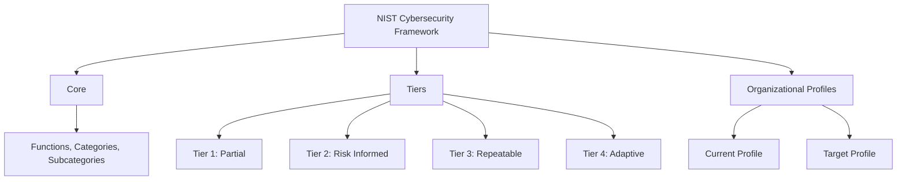
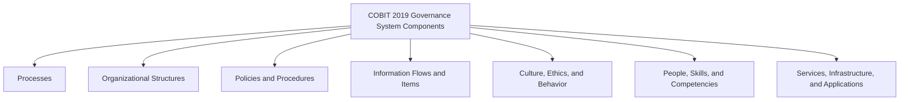

# Regulations, Standards, and Frameworks
Organizations operating in today's digital environment must comply with a complex web of regulations, standards, and frameworks that govern how they protect information, maintain privacy, and manage cybersecurity risk. For CPAs — particularly those performing IT audit, advisory, and SOC engagements — understanding these requirements is essential. A single organization may simultaneously be subject to HIPAA, GDPR, and PCI DSS while voluntarily adopting NIST and CIS frameworks to structure its security program.
This section covers **HIPAA** (Security and Privacy Rules), **GDPR** (scope, principles, and key concepts), **PCI DSS** (requirements and compliance levels), the **NIST Cybersecurity Framework**, the **NIST Privacy Framework**, **NIST SP 800-53** (security and privacy control catalog), the **CIS Controls**, and **COBIT 2019** (governance system and framework principles).
:::info
The ISC exam tests this topic at the **Remembering and Understanding** skill level. You must be able to recall the key provisions, scope, and structure of each regulation, standard, and framework covered below. No application or analysis is required — focus on memorizing the components, principles, and organizational structures.
:::
---
## HIPAA — Health Insurance Portability and Accountability Act
The **Health Insurance Portability and Accountability Act (HIPAA)** establishes national standards for the protection of individually identifiable health information (known as **Protected Health Information** or **PHI**).
### Covered Entities
HIPAA applies to three categories of **covered entities**:
| Covered Entity | Description | Examples |
|---|---|---|
| **Health Plans** | Entities that provide or pay for medical care | Health insurance companies, HMOs, employer-sponsored health plans, Medicare, Medicaid |
| **Health Care Clearinghouses** | Entities that process nonstandard health information into standard formats | Billing services, repricing companies, community health information systems |
| **Health Care Providers** | Providers who transmit health information electronically | Hospitals, physicians, dentists, pharmacies, chiropractors |
### Business Associates
A **business associate** is any person or entity that performs functions or activities on behalf of a covered entity that involve the use or disclosure of PHI. Examples include cloud hosting providers, billing companies, and IT consultants. Business associates must sign a **Business Associate Agreement (BAA)** and comply with applicable HIPAA rules.
### Permitted Uses and Disclosures
The **Privacy Rule** permits covered entities to use and disclose PHI without individual authorization for the following purposes:
| Permitted Use/Disclosure | Description |
|---|---|
| **Treatment** | Providing, coordinating, or managing health care |
| **Payment** | Billing, claims management, and collection activities |
| **Health care operations** | Quality assessment, training, accreditation, auditing |
| **Public interest activities** | Required by law, public health, victims of abuse, judicial proceedings |
| **Limited data set** | Research, public health, or health care operations (with a data use agreement) |
:::tip[Exam Tip]
Remember the acronym **TPO** — Treatment, Payment, and Operations. These are the three primary permitted uses of PHI that do not require patient authorization. All other disclosures generally require written patient consent.
:::
### The Three HIPAA Rules
| Rule | Purpose | Key Requirements |
|---|---|---|
| **Privacy Rule** | Establishes standards for when PHI can be used and disclosed | Minimum necessary standard, patient rights (access, amendment, accounting of disclosures), Notice of Privacy Practices |
| **Security Rule** | Establishes standards for protecting electronic PHI (ePHI) | Administrative, physical, and technical safeguards |
| **Breach Notification Rule** | Requires notification when unsecured PHI is breached | Notify individuals within 60 days, notify HHS, notify media if breach affects 500+ individuals |
### Security Rule Safeguards
| Safeguard Category | Examples |
|---|---|
| **Administrative** | Risk analysis, workforce training, security management process, contingency planning, business associate agreements |
| **Physical** | Facility access controls, workstation use policies, device and media controls |
| **Technical** | Access controls, audit controls, integrity controls, transmission security (encryption) |
---
## GDPR — General Data Protection Regulation
The **General Data Protection Regulation (GDPR)** is a European Union regulation that governs the collection, processing, storage, and transfer of personal data belonging to individuals in the EU.
### Scope
The GDPR applies to:
- Organizations **established in the EU**, regardless of where processing occurs
- Organizations **outside the EU** that offer goods or services to individuals in the EU or monitor the behavior of individuals in the EU
**Example:** **Illini Security**, a U.S.-based cybersecurity firm, provides monitoring services to clients in Germany. Even though Illini Security has no physical presence in the EU, it must comply with the GDPR because it processes personal data of EU residents.
### Six Principles of Data Processing
The GDPR establishes six principles that govern all processing of personal data:
| # | Principle | Description |
|---|---|---|
| 1 | **Lawfulness, Fairness, and Transparency** | Data must be processed lawfully, fairly, and in a transparent manner |
| 2 | **Purpose Limitation** | Data must be collected for specified, explicit, and legitimate purposes and not processed in a manner incompatible with those purposes |
| 3 | **Data Minimization** | Data collected must be adequate, relevant, and limited to what is necessary |
| 4 | **Accuracy** | Data must be accurate and kept up to date; inaccurate data must be erased or rectified without delay |
| 5 | **Storage Limitation** | Data must be kept in a form that permits identification of data subjects for no longer than necessary |
| 6 | **Integrity and Confidentiality** | Data must be processed with appropriate security, including protection against unauthorized processing, accidental loss, destruction, or damage |
:::warning
The GDPR principle of **data minimization** is frequently tested. It does not mean "collect no data" — it means collect only what is **adequate, relevant, and limited to what is necessary** for the stated purpose.
:::
### Key GDPR Concepts
| Concept | Definition |
|---|---|
| **Data Subject** | An identified or identifiable natural person whose personal data is processed |
| **Data Controller** | The entity that determines the purposes and means of processing personal data |
| **Data Processor** | The entity that processes personal data on behalf of the controller |
| **Data Protection Officer (DPO)** | A designated individual responsible for overseeing GDPR compliance; required for public authorities and organizations conducting large-scale monitoring |
| **Right to Erasure ("Right to Be Forgotten")** | Data subjects can request deletion of their personal data when it is no longer necessary |
| **Consent** | Must be freely given, specific, informed, and unambiguous; can be withdrawn at any time |
| **Data Portability** | Data subjects have the right to receive their data in a structured, commonly used, machine-readable format |
| **72-Hour Breach Notification** | Data controllers must notify the supervisory authority within 72 hours of becoming aware of a personal data breach |
---
## PCI DSS — Payment Card Industry Data Security Standard
The **Payment Card Industry Data Security Standard (PCI DSS)** is a set of security requirements designed to ensure that all entities that store, process, or transmit payment card data maintain a secure environment.
### Scope
PCI DSS applies to **any entity** that stores, processes, or transmits cardholder data or sensitive authentication data — including merchants, processors, acquirers, issuers, and service providers.
### The 12 Requirements (Organized by 6 Goals)
| Goal | Requirement | Description |
|---|---|---|
| **Build and Maintain a Secure Network and Systems** | 1 | Install and maintain network security controls |
| | 2 | Apply secure configurations to all system components |
| **Protect Account Data** | 3 | Protect stored account data |
| | 4 | Protect cardholder data with strong cryptography during transmission over open, public networks |
| **Maintain a Vulnerability Management Program** | 5 | Protect all systems and networks from malicious software |
| | 6 | Develop and maintain secure systems and software |
| **Implement Strong Access Control Measures** | 7 | Restrict access to system components and cardholder data by business need to know |
| | 8 | Identify users and authenticate access to system components |
| | 9 | Restrict physical access to cardholder data |
| **Regularly Monitor and Test Networks** | 10 | Log and monitor all access to system components and cardholder data |
| | 11 | Test security of systems and networks regularly |
| **Maintain an Information Security Policy** | 12 | Support information security with organizational policies and programs |
### Merchant Levels and Validation
| Level | Transaction Volume (Annual) | Validation Requirement |
|---|---|---|
| **Level 1** | Over 6 million transactions | Annual on-site assessment by a Qualified Security Assessor (QSA) |
| **Level 2** | 1–6 million transactions | Annual Self-Assessment Questionnaire (SAQ) + quarterly network scan |
| **Level 3** | 20,000–1 million e-commerce transactions | Annual SAQ + quarterly network scan |
| **Level 4** | Fewer than 20,000 e-commerce or up to 1 million other transactions | Annual SAQ + quarterly network scan (recommended) |
:::note
The distinction between a **Self-Assessment Questionnaire (SAQ)** and an **external audit by a QSA** is determined by merchant level. Only Level 1 merchants are required to undergo an on-site assessment conducted by a Qualified Security Assessor.
:::
---
## NIST Cybersecurity Framework (CSF)
The **NIST Cybersecurity Framework (CSF)** — published by the National Institute of Standards and Technology — provides a voluntary, risk-based approach to managing cybersecurity risk. The framework is organized into three main parts.
### Three Parts of the NIST CSF

### CSF Core — Six Functions
The Core consists of six concurrent and continuous **functions** that provide a high-level strategic view of cybersecurity risk management:
| Function | Purpose | Example Activities |
|---|---|---|
| **Govern (GV)** | Establish and monitor the organization's cybersecurity risk management strategy, expectations, and policy | Define risk appetite, assign roles and responsibilities, oversee supply chain risk |
| **Identify (ID)** | Understand the organization's assets, risks, and environment | Asset management, risk assessment, business environment analysis |
| **Protect (PR)** | Implement safeguards to ensure delivery of critical services | Access control, awareness training, data security, protective technology |
| **Detect (DE)** | Identify the occurrence of a cybersecurity event | Continuous monitoring, anomaly detection, security event analysis |
| **Respond (RS)** | Take action regarding a detected cybersecurity incident | Response planning, communications, analysis, mitigation, improvements |
| **Recover (RC)** | Restore capabilities or services impaired by a cybersecurity incident | Recovery planning, improvements, communications |
:::tip[Exam Tip]
The **Govern** function was added in CSF 2.0 (2024). Previously the framework had five functions. Remember the mnemonic: **G-I-P-D-R-R** (Govern, Identify, Protect, Detect, Respond, Recover).
:::
### CSF Tiers
Tiers describe the degree to which an organization's cybersecurity risk management practices exhibit the characteristics defined in the framework:
| Tier | Name | Characteristics |
|---|---|---|
| **Tier 1** | Partial | Ad hoc, reactive; limited awareness of cybersecurity risk; risk management is not formalized |
| **Tier 2** | Risk Informed | Risk management practices are approved by management but may not be organization-wide policy |
| **Tier 3** | Repeatable | Formally approved policies; practices are regularly updated based on risk assessments |
| **Tier 4** | Adaptive | Organization adapts cybersecurity practices based on lessons learned and predictive indicators; continuous improvement |
### CSF Organizational Profiles
An **Organizational Profile** describes an organization's current or desired cybersecurity posture in terms of the CSF Core outcomes:
- **Current Profile** — The cybersecurity outcomes the organization is currently achieving
- **Target Profile** — The desired cybersecurity outcomes the organization aims to achieve
The gap between the Current Profile and the Target Profile helps prioritize improvement actions and resource allocation.
---
## NIST Privacy Framework
The **NIST Privacy Framework** is a voluntary tool for improving privacy through enterprise risk management. It is designed to be used in conjunction with the NIST CSF and has a parallel structure.
### Three Parts of the NIST Privacy Framework
| Part | Description |
|---|---|
| **Framework Core** | A set of privacy protection activities and outcomes organized into functions, categories, and subcategories |
| **Framework Profiles** | Represent an organization's current or target privacy activities (analogous to CSF Profiles) |
| **Framework Implementation Tiers** | Describe the degree to which an organization's privacy risk management practices exhibit defined characteristics (Tiers 1–4, same as CSF) |
### Privacy Framework Core — Five Functions
| Function | ID | Purpose |
|---|---|---|
| **Identify-P** | ID-P | Develop organizational understanding of privacy risk to individuals arising from data processing |
| **Govern-P** | GV-P | Develop and implement organizational governance structure for ongoing privacy risk management |
| **Control-P** | CT-P | Develop and implement activities for data management to enable organizations and individuals to manage data with sufficient granularity |
| **Communicate-P** | CM-P | Develop and implement activities to enable organizations and individuals to have a reliable understanding of data processing practices and associated privacy risks |
| **Protect-P** | PR-P | Develop and implement data protection activities to address privacy risk |
:::note
The NIST Privacy Framework and NIST CSF share the **Protect** function. The Privacy Framework's Protect-P function focuses specifically on data processing safeguards, while the CSF's Protect function addresses cybersecurity broadly. Organizations can use both frameworks together for a comprehensive approach.
:::
---
## NIST SP 800-53
**NIST Special Publication 800-53** (*Security and Privacy Controls for Information Systems and Organizations*) provides a comprehensive catalog of security and privacy controls that organizations can implement to protect their operations, assets, and personnel.
### Purpose
NIST SP 800-53 provides a structured catalog of controls to:
- Protect organizational operations, assets, individuals, and the nation from a wide range of threats
- Ensure compliance with applicable laws, regulations, and policies
- Support risk management decisions by offering a flexible and customizable control selection process
### Applicability
| Audience | Applicability |
|---|---|
| **Federal information systems** | Mandatory for all U.S. federal agencies under FISMA |
| **Private sector organizations** | Widely adopted voluntarily as a comprehensive security control reference |
| **State and local government** | Frequently used as a baseline for state cybersecurity programs |
| **Critical infrastructure operators** | Referenced by sector-specific standards and regulations |
### Target Audience
NIST SP 800-53 is intended for:
- System owners and authorizing officials
- Security and privacy professionals
- System engineers and architects
- Auditors and assessors
- Chief Information Officers (CIOs) and Chief Information Security Officers (CISOs)
### Control Families
NIST SP 800-53 organizes controls into **20 control families**:
| Family ID | Family Name | Family ID | Family Name |
|---|---|---|---|
| AC | Access Control | PE | Physical and Environmental Protection |
| AT | Awareness and Training | PL | Planning |
| AU | Audit and Accountability | PM | Program Management |
| CA | Assessment, Authorization, and Monitoring | PS | Personnel Security |
| CM | Configuration Management | PT | PII Processing and Transparency |
| CP | Contingency Planning | RA | Risk Assessment |
| IA | Identification and Authentication | SA | System and Services Acquisition |
| IR | Incident Response | SC | System and Communications Protection |
| MA | Maintenance | SI | System and Information Integrity |
| MP | Media Protection | SR | Supply Chain Risk Management |
### Organizational Responsibilities
Organizations using NIST SP 800-53 are responsible for:
- **Selecting** appropriate controls based on risk assessments and system categorization
- **Implementing** the selected controls within their information systems and environments
- **Assessing** control effectiveness through testing and evaluation
- **Monitoring** controls on an ongoing basis to ensure continued effectiveness
---
## CIS Controls (v8.1)
The **Center for Internet Security (CIS) Controls** are a prioritized set of actions that collectively form a defense-in-depth set of best practices to mitigate the most common attacks against systems and networks.
### Overview of the 18 CIS Controls
| Control # | Control Name | Description |
|---|---|---|
| 1 | **Inventory and Control of Enterprise Assets** | Actively manage all enterprise assets connected to the network |
| 2 | **Inventory and Control of Software Assets** | Actively manage all software on the network to ensure only authorized software is installed |
| 3 | **Data Protection** | Develop processes and technical controls to identify, classify, securely handle, retain, and dispose of data |
| 4 | **Secure Configuration of Enterprise Assets and Software** | Establish and maintain secure configuration standards for all assets and software |
| 5 | **Account Management** | Use processes and tools to assign and manage authorization to credentials for user accounts |
| 6 | **Access Control Management** | Use processes and tools to create, assign, manage, and revoke access credentials and privileges |
| 7 | **Continuous Vulnerability Management** | Develop a plan to continuously assess and remediate vulnerabilities |
| 8 | **Audit Log Management** | Collect, alert, review, and retain audit logs of events |
| 9 | **Email and Web Browser Protections** | Improve protections and detection of threats from email and web vectors |
| 10 | **Malware Defenses** | Prevent or control the installation and execution of malicious software |
| 11 | **Data Recovery** | Establish and maintain data recovery practices sufficient to restore in-scope enterprise assets to a pre-incident trusted state |
| 12 | **Network Infrastructure Management** | Establish and maintain the management and security of network infrastructure |
| 13 | **Network Monitoring and Defense** | Operate processes and tools to establish and maintain comprehensive network monitoring and defense |
| 14 | **Security Awareness and Skills Training** | Establish and maintain a security awareness program to influence workforce behavior |
| 15 | **Service Provider Management** | Develop a process to evaluate service providers who hold sensitive data or are responsible for critical platforms |
| 16 | **Application Software Security** | Manage the security life cycle of in-house developed, hosted, or acquired software |
| 17 | **Incident Response Management** | Establish a program to develop and maintain an incident response capability |
| 18 | **Penetration Testing** | Test the effectiveness and resiliency of enterprise assets through identifying and exploiting weaknesses in controls |
### Implementation Groups
CIS Controls are organized into three **Implementation Groups (IGs)** based on organizational resources and risk profile:
| Group | Target Organization | Scope |
|---|---|---|
| **IG1** | Small organizations with limited IT expertise; essential cyber hygiene | A subset of controls that every organization should implement — the minimum standard of information security |
| **IG2** | Organizations with moderate IT complexity managing sensitive data | Includes all IG1 controls plus additional controls for organizations with greater risk exposure |
| **IG3** | Large organizations or those subject to regulatory oversight with dedicated security teams | Includes all IG1 and IG2 controls plus advanced controls for comprehensive defense |
:::tip[Exam Tip]
Think of CIS Implementation Groups as maturity levels: **IG1 = essential hygiene** (everyone should do this), **IG2 = intermediate** (organizations with more risk), **IG3 = advanced** (organizations with dedicated security teams and regulatory requirements).
:::
---
## COBIT 2019
**COBIT 2019** (Control Objectives for Information and Related Technologies) is a governance and management framework for enterprise information and technology published by ISACA. It helps organizations create optimal value from IT by maintaining a balance between realizing benefits and optimizing risk levels and resource use.
### Governance System Principles (6)
COBIT 2019 defines six principles for a **governance system**:
| # | Principle | Description |
|---|---|---|
| 1 | **Provide Stakeholder Value** | The governance system satisfies stakeholder needs and generates value from the use of I&T |
| 2 | **Holistic Approach** | The governance system is built from several components that can be of different types and work together in a holistic manner |
| 3 | **Dynamic Governance System** | The governance system should be flexible, adjusting to changes in design factors |
| 4 | **Governance Distinct from Management** | Governance ensures stakeholder needs are evaluated, directing and monitoring; management plans, builds, runs, and monitors activities |
| 5 | **Tailored to Enterprise Needs** | The governance system is customized using design factors to align with enterprise context |
| 6 | **End-to-End Governance System** | The governance system covers the enterprise end-to-end, not just the IT function |
### Governance Framework Principles (3)
COBIT 2019 is built on three principles that define the requirements for the **governance framework** itself:
| # | Principle | Description |
|---|---|---|
| 1 | **Based on a Conceptual Model** | The framework is grounded in a research-based conceptual model that forms the foundation for its content |
| 2 | **Open and Flexible** | The framework allows addition of new content and addresses issues in an open way, accommodating emerging technologies |
| 3 | **Aligned to Major Standards** | The framework aligns with relevant major standards, frameworks, and regulations (e.g., ITIL, ISO/IEC 27001, TOGAF) |
### Components of a Governance System
COBIT 2019 identifies **seven components** that collectively support the governance and management system:

| Component | Description |
|---|---|
| **Processes** | Organized sets of practices and activities to achieve objectives and produce outputs |
| **Organizational Structures** | Key decision-making entities in the organization (e.g., boards, committees, roles) |
| **Policies and Procedures** | Translate desired behavior into practical guidance for day-to-day management |
| **Information Flows and Items** | Information produced and used by the governance system (e.g., reports, budgets, plans) |
| **Culture, Ethics, and Behavior** | Individual and organizational culture, ethics, and behavior patterns affecting governance |
| **People, Skills, and Competencies** | Required human capabilities to execute governance and management activities |
| **Services, Infrastructure, and Applications** | Technology and tools that support the governance and management of enterprise I&T |
:::warning
Do not confuse COBIT's **governance system principles** (6 principles about how the system should work) with its **governance framework principles** (3 principles about how the COBIT framework itself is designed). The exam may test this distinction.
:::
---
## Summary
| Topic | Key Takeaway |
|---|---|
| HIPAA | Applies to covered entities (health plans, clearinghouses, providers) and business associates; permits TPO disclosures; requires administrative, physical, and technical safeguards |
| GDPR | Applies to any entity processing EU personal data; six principles govern data processing; 72-hour breach notification required |
| PCI DSS | 12 requirements under 6 goals; applies to any entity handling payment card data; Level 1 merchants require QSA audit |
| NIST CSF | Three parts: Core (6 functions: G-I-P-D-R-R), Tiers (1–4), and Organizational Profiles (current vs. target) |
| NIST Privacy Framework | Three parts: Core (5 functions: Identify-P, Govern-P, Control-P, Communicate-P, Protect-P), Profiles, and Implementation Tiers |
| NIST SP 800-53 | Comprehensive control catalog; mandatory for federal systems; 20 control families; organizations select, implement, assess, and monitor controls |
| CIS Controls | 18 prioritized controls; three Implementation Groups (IG1 = essential, IG2 = intermediate, IG3 = advanced) |
| COBIT 2019 | 6 governance system principles, 3 framework principles, and 7 components of a governance system |
---
## Practice Questions
1. **Bear Co.** is a health insurance company that contracts with a cloud hosting provider to store patient records. The cloud provider recently experienced a data breach affecting 1,200 patients. Under HIPAA, which rule requires Bear Co. to notify affected individuals, and within what timeframe must notification occur?
2. **Kingfisher Industries** is a U.S.-based manufacturer that sells products through its website to customers in France and Germany. A privacy consultant advises Kingfisher that it must comply with the GDPR. Kingfisher's CEO argues that since the company has no offices in Europe, the GDPR does not apply. Is the CEO correct? Explain which GDPR principle requires the company to collect only necessary customer data.
3. **MAS Inc.** is implementing the NIST Cybersecurity Framework and has completed a Current Profile assessment. The CISO presents the results to the board and recommends developing a Target Profile. The board asks what the difference is between a Tier and a Profile. How should the CISO explain the distinction?
:::tip[Answers]
1. The **Breach Notification Rule** requires Bear Co. to notify affected individuals. Because the breach affected more than 500 individuals, Bear Co. must also notify the U.S. Department of Health and Human Services (HHS) and prominent media outlets serving the affected area. Notification to individuals must occur **within 60 days** of discovering the breach. Additionally, because the cloud provider is a business associate, it must notify Bear Co. of the breach without unreasonable delay (and no later than as specified in the BAA).
2. The CEO is **incorrect**. The GDPR applies to organizations outside the EU that offer goods or services to individuals in the EU. Because Kingfisher sells products to customers in France and Germany through its website, it is processing personal data of EU residents and must comply with the GDPR regardless of its physical location. The **data minimization** principle (Principle 3) requires Kingfisher to collect only personal data that is adequate, relevant, and limited to what is necessary for processing the transaction — for example, collecting a shipping address is necessary, but collecting a customer's date of birth for a product purchase likely is not.
3. The CISO should explain that **Tiers** and **Profiles** serve different purposes. **Tiers** (1–4: Partial, Risk Informed, Repeatable, Adaptive) describe the maturity of the organization's cybersecurity risk management *processes* — how sophisticated and integrated those practices are. **Profiles** describe the specific cybersecurity *outcomes* the organization is achieving (Current Profile) or wants to achieve (Target Profile) relative to the CSF Core functions and categories. An organization at Tier 2 (Risk Informed) might have a Current Profile that shows strong outcomes in Protect and Detect but weak outcomes in Respond and Recover. The Tier tells you about the rigor of the process; the Profile tells you what you are accomplishing.
:::
