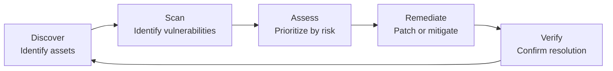
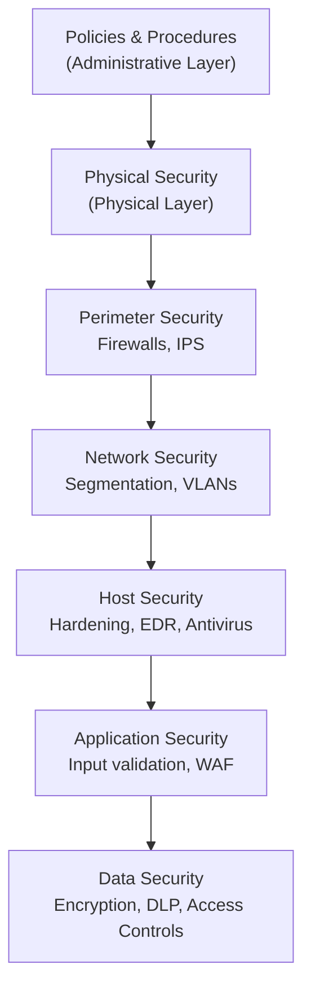
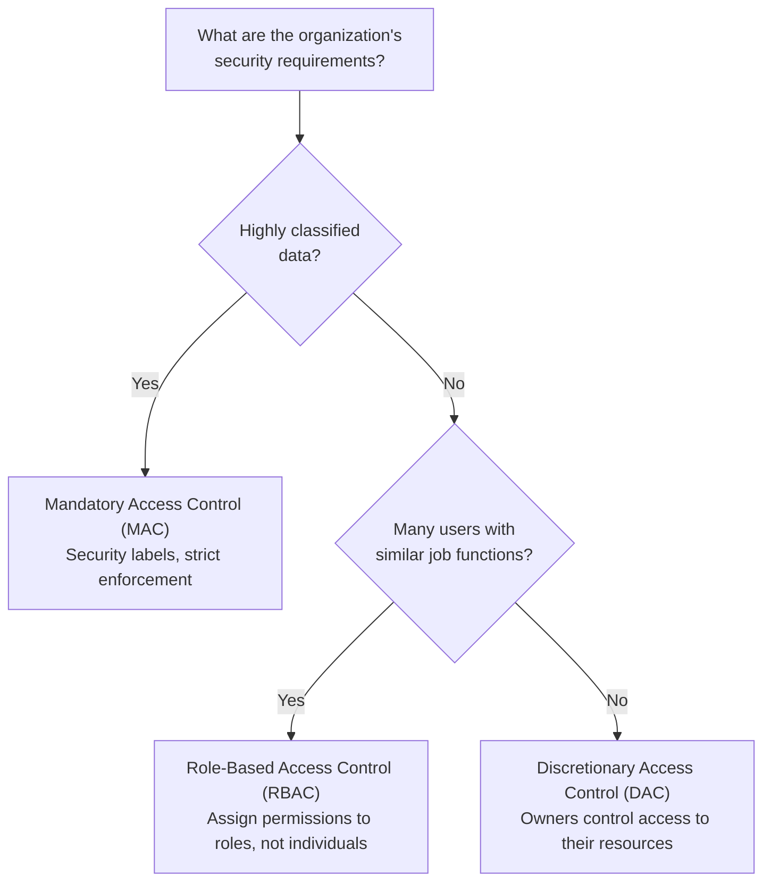

# Security Mitigation

Protecting an organization's information systems requires more than identifying threats — it demands a comprehensive, layered approach to **preventing, detecting, and correcting** security events. CPAs performing IT audit and advisory services must understand the controls and strategies organizations use to reduce cybersecurity risk to an acceptable level. From network segmentation to multi-factor authentication, security mitigation encompasses the people, processes, and technologies that stand between a threat actor and an organization's critical assets.
This section covers **network protection and remote access security**, **vulnerability management**, **layered security and defense-in-depth**, **least-privilege, zero-trust, whitelisting, and need-to-know principles**, **technology acceptable use policies**, **COSO frameworks for cyber risk assessment**, **preventive, detective, and corrective controls**, **identification and authentication techniques**, and **authorization models**.
:::info
The ISC exam tests security mitigation concepts at the Remembering and Understanding level (recall definitions, explain concepts) and at the Application level (determine appropriate controls, authentication techniques, and authorization models for specific scenarios).
:::

---

## Network Protection and Remote Access Security

Organizations must protect both their internal networks and the remote connections employees use to access those networks. The following controls and technologies form the foundation of network security.

### Network Segmentation and Isolation

**Network segmentation** divides a network into smaller, isolated sub-networks (segments or zones). Each segment has its own access controls, limiting an attacker's ability to move laterally across the network after gaining initial access.
| Technique | Description | Example |
|---|---|---|
| **VLANs** | Virtual LANs logically separate traffic within the same physical network | Accounting systems on VLAN 10, guest Wi-Fi on VLAN 50 |
| **DMZ (Demilitarized Zone)** | A perimeter network that separates external-facing services from the internal network | Web servers in the DMZ; database servers on the internal network |
| **Air gap** | Complete physical isolation of a network with no connection to other networks or the internet | Classified government systems, critical SCADA/ICS environments |
| **Microsegmentation** | Granular segmentation at the workload or application level, often in cloud environments | Individual containers or VMs with their own security policies |
**Example:** **Kingfisher Industries** segments its network so that the finance department's systems are isolated from the manufacturing floor. If malware infects a machine on the factory network, segmentation prevents it from spreading to systems containing financial data.

### Virtual Private Networks (VPN)

A **VPN** creates an encrypted tunnel over a public network (typically the internet), allowing remote users or branch offices to securely access the organization's internal resources.
| VPN Type | Description | Use Case |
|---|---|---|
| **Remote access VPN** | Connects individual users to the organization's network | Employees working from home |
| **Site-to-site VPN** | Connects two entire networks (e.g., headquarters and a branch office) | Linking geographically separate offices |
VPN security considerations include strong encryption protocols (e.g., IPsec, TLS), multi-factor authentication for VPN access, split tunneling risks, and regular review of connected users.

### Wireless Network Security

Wireless networks introduce unique vulnerabilities because signals extend beyond physical walls. Key controls include:

- **WPA3 encryption** — the current standard for wireless security, replacing the weaker WPA2
- **Hidden SSIDs** — not broadcasting the network name (provides minimal security but adds a layer of obscurity)
- **MAC address filtering** — allowing only pre-approved device hardware addresses to connect
- **802.1X authentication** — requiring users to authenticate through a RADIUS server before gaining network access
- **Separate guest networks** — isolating guest traffic from the corporate network

### Endpoint Security

**Endpoint security** protects the individual devices (laptops, desktops, mobile devices, servers) that connect to the network:
| Control | Purpose |
|---|---|
| **Endpoint Detection and Response (EDR)** | Continuously monitors endpoints for suspicious activity and provides automated response capabilities |
| **Antivirus/Anti-malware** | Detects and removes known malicious software using signature-based and heuristic methods |
| **Host-based firewall** | Controls network traffic to and from the individual device |
| **Device encryption** | Protects data at rest if the device is lost or stolen (e.g., BitLocker, FileVault) |
| **Mobile Device Management (MDM)** | Enforces security policies on mobile devices, including remote wipe capabilities |

### System Hardening

**System hardening** is the process of reducing a system's attack surface by eliminating unnecessary functions, services, and access points:

- Disable unnecessary services and ports
- Remove default accounts and change default passwords
- Apply secure configuration baselines (e.g., CIS Benchmarks)
- Remove unnecessary software and applications
- Enable audit logging and monitoring
- Restrict administrative privileges
  **Example:** **Polar Inc.** deploys new servers using a hardened image that disables all non-essential services, removes default accounts, and applies the latest security patches before connecting to the production network.

### Intrusion Prevention Systems (IPS) vs. Intrusion Detection Systems (IDS)

| Feature              | IDS                                          | IPS                                             |
| -------------------- | -------------------------------------------- | ----------------------------------------------- |
| **Primary function** | Detects and alerts on suspicious activity    | Detects and **blocks** suspicious activity      |
| **Position**         | Passive — monitors a copy of network traffic | Inline — sits directly in the traffic path      |
| **Response**         | Generates alerts for human review            | Automatically drops or blocks malicious traffic |
| **Risk**             | May miss attacks (false negatives)           | May block legitimate traffic (false positives)  |

Both IDS and IPS can use:

- **Signature-based detection** — compares traffic against a database of known attack patterns (effective against known threats)
- **Anomaly-based detection** — establishes a baseline of normal behavior and alerts on deviations (effective against zero-day attacks but higher false positive rate)
  :::tip[Exam Tip]
  Remember the key distinction: an IDS **detects and alerts** (detective control), while an IPS **detects and blocks** (preventive control). If a question asks which control would **prevent** an attack in progress, the answer is IPS. If the question asks which control would **notify** the security team of suspicious activity, the answer is IDS.
  :::

---

## Vulnerability Management

**Vulnerability management** is the ongoing process of identifying, classifying, prioritizing, remediating, and mitigating security vulnerabilities in an organization's systems and software. Its purpose is to reduce the window of opportunity for attackers to exploit known weaknesses.

### Vulnerability Management Lifecycle

### Vulnerability Scanning vs. Penetration Testing

| Activity                   | Description                                                 | Approach                                       | Frequency                          |
| -------------------------- | ----------------------------------------------------------- | ---------------------------------------------- | ---------------------------------- |
| **Vulnerability scanning** | Automated tool scans systems for known vulnerabilities      | Non-intrusive; identifies potential weaknesses | Frequent (weekly, monthly)         |
| **Penetration testing**    | Skilled testers actively attempt to exploit vulnerabilities | Intrusive; simulates real-world attacks        | Periodic (annually, semi-annually) |

### CVE and CVSS

- **CVE (Common Vulnerabilities and Exposures)** — a standardized identifier for publicly known vulnerabilities (e.g., CVE-2024-1234)
- **CVSS (Common Vulnerability Scoring System)** — a numerical score (0.0–10.0) that rates the severity of a vulnerability
  | CVSS Score | Severity Rating |
  |---|---|
  | 0.0 | None |
  | 0.1–3.9 | Low |
  | 4.0–6.9 | Medium |
  | 7.0–8.9 | High |
  | 9.0–10.0 | Critical |

### Patch Management

Patch management is closely linked to vulnerability management. Once a vulnerability is identified, the vendor typically releases a **patch** (software update) to fix it. Organizations must have a process to test and deploy patches promptly without disrupting operations.
:::warning
Unpatched systems are one of the most common attack vectors. The exam may present a scenario where an organization was breached because a critical patch was available but not applied. **Bear Co.** should have a documented patch management policy that defines timelines for deploying critical patches (e.g., within 72 hours of release).
:::

---

## Layered Security and Defense-in-Depth

**Defense-in-depth** is a security strategy that employs multiple layers of controls so that if one layer fails, additional layers continue to protect the organization's assets. No single control is considered sufficient on its own.

### The Three Layers

| Layer                   | Type                                                 | Examples                                                             |
| ----------------------- | ---------------------------------------------------- | -------------------------------------------------------------------- |
| **Physical**            | Controls that protect the physical environment       | Locked doors, security guards, surveillance cameras, biometric entry |
| **Technical (Logical)** | Controls implemented through technology              | Firewalls, encryption, access controls, IDS/IPS, antivirus           |
| **Administrative**      | Controls implemented through policies and procedures | Security policies, training, background checks, separation of duties |

### Defense-in-Depth Diagram

**Example:** **Illini Security** protects its financial data with defense-in-depth: physical locks on the server room (physical), a firewall blocking unauthorized traffic (technical), encryption on the database (technical), role-based access controls (technical), a security awareness training program (administrative), and a security policy requiring annual access reviews (administrative). If an attacker bypasses the firewall, they still face encryption, access controls, and monitoring.
:::note
Defense-in-depth does not mean duplicating the same control. It means implementing **different types** of controls at **different layers** so that a failure in one area does not result in a complete compromise.
:::

---

## Least-Privilege, Zero-Trust, Whitelisting, and Need-to-Know

These foundational security principles guide how organizations grant and restrict access to systems and data.
| Principle | Definition | Application |
|---|---|---|
| **Least privilege** | Users and systems are granted only the minimum access necessary to perform their assigned functions | An accounts payable clerk can view and process invoices but cannot approve payments or access payroll |
| **Zero trust** | No user, device, or network is trusted by default — every access request must be verified regardless of location | Even users inside the corporate network must authenticate and be authorized for each resource they access |
| **Whitelisting (allowlisting)** | Only explicitly approved entities (applications, IP addresses, email senders) are permitted; everything else is denied by default | Only approved software on the whitelist can execute on company workstations |
| **Need-to-know** | Access to information is restricted to individuals who require that specific information to perform their job duties | A tax accountant at **Bear Co.** can access client tax returns but not audit engagement files |

### Zero Trust Architecture

Traditional security models assume that users inside the network perimeter are trusted ("castle and moat" approach). **Zero trust** eliminates this assumption:

- **Verify explicitly** — always authenticate and authorize based on all available data points (identity, location, device, service)
- **Use least-privilege access** — limit access with just-in-time and just-enough-access policies
- **Assume breach** — minimize the blast radius of a breach through segmentation, encryption, and continuous monitoring
  :::tip[Exam Tip]
  Zero trust is not a single product — it is a **philosophy and architecture**. The exam may describe a scenario and ask which principle is being applied. If the scenario describes verifying every access request regardless of whether the user is inside or outside the corporate network, the answer is **zero trust**.
  :::

---

## Technology Acceptable Use Policies

A **technology acceptable use policy (AUP)** defines the rules and guidelines for how employees and other authorized users may use the organization's technology resources, including computers, networks, email, internet access, and mobile devices.

### Purpose of an AUP

- Establish clear expectations for technology use
- Protect the organization from legal liability
- Reduce security risks from inappropriate use
- Provide a basis for disciplinary action if the policy is violated
- Ensure compliance with laws and regulations

### Typical AUP Contents

| Section                       | Coverage                                                                                            |
| ----------------------------- | --------------------------------------------------------------------------------------------------- |
| **Scope**                     | Who the policy applies to (employees, contractors, vendors) and what systems are covered            |
| **Permitted use**             | Acceptable activities (business use, limited personal use)                                          |
| **Prohibited activities**     | Activities that are not allowed (illegal downloads, harassment, unauthorized software installation) |
| **Security requirements**     | Password standards, locking workstations, reporting incidents                                       |
| **Monitoring disclosure**     | Notice that the organization may monitor usage                                                      |
| **Consequences of violation** | Disciplinary actions for policy violations                                                          |

### BYOD and Mobile Technology Considerations

**Bring Your Own Device (BYOD)** policies address the use of personal devices for work purposes. BYOD introduces additional risks because the organization has less control over personally owned devices.
| BYOD Risk | Mitigation |
|---|---|
| Data leakage from lost/stolen personal devices | Require device encryption and remote wipe capabilities |
| Mixing personal and corporate data | Use containerization to separate work data from personal data |
| Unpatched or insecure personal devices | Require minimum OS version and security updates before granting access |
| Unauthorized apps accessing corporate data | Restrict corporate data access to approved applications only |
| Employee privacy concerns | Clearly define what the organization can and cannot access on personal devices |
**Example:** **Illini Entertainment** allows employees to use personal smartphones for email and calendar. Its BYOD policy requires enrollment in the company's MDM solution, a minimum passcode of six digits, encryption enabled, and automatic remote wipe if the device is reported lost or if the employee is terminated.

---

## COSO Frameworks for Cyber Risk Assessment

The **Committee of Sponsoring Organizations of the Treadway Commission (COSO)** frameworks provide a structured approach for organizations to assess and manage cybersecurity risks.

### COSO Internal Control – Integrated Framework (2013)

The five components of COSO internal control apply directly to cybersecurity:
| COSO Component | Cybersecurity Application |
|---|---|
| **Control Environment** | Management's commitment to cybersecurity, tone at the top, security-aware culture |
| **Risk Assessment** | Identifying and evaluating cyber threats and vulnerabilities relative to financial reporting objectives |
| **Control Activities** | Implementing preventive, detective, and corrective controls (firewalls, access controls, patch management) |
| **Information & Communication** | Communicating security policies, incident reporting procedures, and threat intelligence |
| **Monitoring Activities** | Continuous monitoring of security controls, vulnerability scanning, penetration testing, log review |

### COSO Enterprise Risk Management (ERM) Framework

The ERM framework takes a broader view, helping organizations manage cybersecurity risk in the context of their overall risk appetite and business strategy:

- **Governance & Culture** — Board oversight of cybersecurity, establishing risk appetite for cyber risk
- **Strategy & Objective-Setting** — Aligning cybersecurity investments with business objectives
- **Performance** — Identifying, assessing, and prioritizing cyber risks; implementing responses
- **Review & Revision** — Evaluating whether cybersecurity controls remain effective as threats evolve
- **Information, Communication & Reporting** — Reporting on cybersecurity posture to the board and stakeholders
  :::note
  The exam may ask how COSO frameworks can be used to evaluate cybersecurity controls. The key point is that COSO provides a **structured methodology** — the same framework used for financial reporting controls applies to cybersecurity controls. This allows management and auditors to evaluate cyber risks using a consistent, well-understood approach.
  :::

---

## Preventive, Detective, and Corrective Controls

Security controls are classified by **when** they act relative to a security event:
| Control Type | Purpose | Timing | Examples |
|---|---|---|---|
| **Preventive** | Stop a security event from occurring | Before the event | Firewalls, access controls, encryption, IPS, system hardening, security training |
| **Detective** | Identify that a security event has occurred | During or after the event | IDS, log analysis, security monitoring, audit trails, anomaly detection |
| **Corrective** | Restore systems and remediate damage after an event | After the event | Virus quarantining, patches, data restoration from backups, incident response procedures |

### Common Controls Classification Table

| Control                           | Preventive | Detective | Corrective |
| --------------------------------- | ---------- | --------- | ---------- |
| Firewall                          | ✓          |           |            |
| Intrusion Prevention System (IPS) | ✓          |           |            |
| Intrusion Detection System (IDS)  |            | ✓         |            |
| Antivirus/anti-malware            | ✓          | ✓         | ✓          |
| System hardening                  | ✓          |           |            |
| Log analysis and SIEM             |            | ✓         |            |
| Patches and updates               |            |           | ✓          |
| Virus quarantining                |            |           | ✓          |
| Encryption                        | ✓          |           |            |
| Security awareness training       | ✓          |           |            |
| Access control lists              | ✓          |           |            |
| Backup and recovery               |            |           | ✓          |

:::tip[Exam Tip]
A single control can serve multiple purposes. Antivirus software **prevents** known malware from executing (preventive), **detects** malware that is already present (detective), and **quarantines** infected files to prevent further spread (corrective). When an exam question asks for the _primary_ classification, consider the control's main function.
:::
**Example:** **Bear Co.** experienced a ransomware attack. Its preventive controls (firewall, email filtering) failed to block the initial phishing email. However, its detective controls (EDR, SIEM) identified the encryption activity within minutes, and its corrective controls (network isolation, backup restoration) limited data loss to less than one hour of transactions.

---

## Identification and Authentication

**Identification** is the process of claiming an identity (e.g., entering a username). **Authentication** is the process of proving that claimed identity is legitimate. Together, they form the first step in access control.

### Authentication Factors

| Factor                 | Category                      | Examples                                                                      |
| ---------------------- | ----------------------------- | ----------------------------------------------------------------------------- |
| **Something you know** | Knowledge factor              | Passwords, PINs, security questions                                           |
| **Something you have** | Possession factor             | Smart cards, hardware tokens, mobile authenticator apps, digital certificates |
| **Something you are**  | Inherence factor (biometrics) | Fingerprints, facial recognition, iris scans, voice recognition               |

**Multi-factor authentication (MFA)** requires two or more factors from **different categories**. Using a password and a PIN is _not_ MFA because both are "something you know."

### Authentication Technologies

| Technology                      | Description                                                                                      | Factor(s)                        |
| ------------------------------- | ------------------------------------------------------------------------------------------------ | -------------------------------- |
| **Password management**         | Policies for complexity, length, expiration, and history; use of password managers               | Something you know               |
| **Single sign-on (SSO)**        | Users authenticate once and gain access to multiple applications without re-entering credentials | Depends on underlying mechanism  |
| **Multi-factor authentication** | Combines two or more authentication factors                                                      | Multiple factors                 |
| **PIN management**              | Short numeric codes used alone or in combination with another factor (e.g., ATM card + PIN)      | Something you know               |
| **Digital signatures**          | Use public key cryptography to verify the identity of the sender and integrity of the message    | Something you have (private key) |
| **Smart cards**                 | Physical cards with embedded chips that store authentication credentials                         | Something you have               |
| **Biometrics**                  | Unique physical or behavioral characteristics used for verification                              | Something you are                |

### Biometric Considerations

| Metric                          | Definition                                                                  |
| ------------------------------- | --------------------------------------------------------------------------- |
| **False Acceptance Rate (FAR)** | Percentage of unauthorized users incorrectly granted access                 |
| **False Rejection Rate (FRR)**  | Percentage of authorized users incorrectly denied access                    |
| **Crossover Error Rate (CER)**  | The point where FAR equals FRR — lower CER indicates a more accurate system |

> **Example:** **Illini Security** requires employees to authenticate using a password (something you know) and a fingerprint scan (something you are) before accessing the financial reporting system. This two-factor authentication significantly reduces the risk of unauthorized access even if a password is compromised.

## Authorization Models

Once a user is authenticated, **authorization** determines what resources and actions they are permitted to access. Organizations implement authorization through formal models and specific control mechanisms.

### Access Control Models

| Model                                  | Description                                                                               | Who Sets Permissions                         | Best For                                          |
| -------------------------------------- | ----------------------------------------------------------------------------------------- | -------------------------------------------- | ------------------------------------------------- |
| **Discretionary Access Control (DAC)** | Resource owners decide who can access their resources                                     | Individual resource owners                   | Flexible environments; small organizations        |
| **Role-Based Access Control (RBAC)**   | Access is assigned based on the user's role within the organization                       | System administrators based on job functions | Most enterprise environments; CPA firms           |
| **Mandatory Access Control (MAC)**     | Access is determined by security labels (classifications) assigned to both users and data | Security policy; system enforces rules       | Government, military, highly regulated industries |

### Authorization Controls

| Control                       | Description                                                                         | Example                                                                                        |
| ----------------------------- | ----------------------------------------------------------------------------------- | ---------------------------------------------------------------------------------------------- |
| **Access Control List (ACL)** | A list specifying which users or systems are granted or denied access to a resource | A file server ACL that grants read access to the finance group and denies access to all others |
| **Account restrictions**      | Limits placed on user accounts to reduce risk                                       | Login time restrictions, concurrent session limits, account lockout after failed attempts      |
| **Physical barriers**         | Physical controls that restrict access to sensitive areas                           | Badge readers, mantraps, locked server rooms, security guards                                  |

### Choosing an Authorization Model

**Example:** **Polar Inc.** uses RBAC for its accounting system. The "Staff Accountant" role has permission to enter journal entries but not to approve them. The "Controller" role can approve entries but cannot modify the chart of accounts. This enforces separation of duties through the authorization model.
:::caution
DAC is the most flexible but least secure model because individual owners may grant excessive access without oversight. MAC is the most restrictive but may be impractical for typical business environments. RBAC provides a balance — it is the most common model in enterprise IT environments and the one most likely tested on the CPA exam.
:::

---

## Summary

| Topic                          | Key Takeaway                                                                                                                              |
| ------------------------------ | ----------------------------------------------------------------------------------------------------------------------------------------- |
| Network protection             | Segmentation, VPN, wireless security, endpoint security, system hardening, and IDS/IPS work together to secure networks and remote access |
| Vulnerability management       | Ongoing process of scanning, prioritizing, patching, and verifying — reduces the window of exploitation                                   |
| Defense-in-depth               | Multiple overlapping layers (physical, technical, administrative) ensure no single point of failure                                       |
| Least privilege and zero trust | Grant minimum necessary access; verify every request regardless of network location                                                       |
| Acceptable use policies        | Define expectations, address BYOD/mobile risks, and provide a foundation for enforcement                                                  |
| COSO and cyber risk            | COSO IC and ERM frameworks provide structured approaches to identifying and managing cybersecurity risks                                  |
| Control classification         | Preventive (stop), detective (identify), corrective (remediate) — select based on risk and timing                                         |
| Authentication                 | Combine knowledge, possession, and inherence factors; MFA requires factors from different categories                                      |
| Authorization models           | DAC (owner-controlled), RBAC (role-based), MAC (label-based) — choose based on security requirements                                      |

---

## Practice Questions

1. **Kingfisher Industries** is implementing a new security architecture. The security team proposes requiring all users — whether inside the corporate office or working remotely — to authenticate and be authorized for each resource they access, with no implicit trust based on network location. Which security principle is being applied, and how does it differ from the traditional perimeter-based approach?
2. **Bear Co.** recently experienced a breach in which an attacker exploited a known vulnerability that had a CVSS score of 9.2. A patch had been available for 45 days but was not applied. The IT director claims the intrusion detection system should have prevented the attack. Identify **two** problems with Bear Co.'s security posture described in this scenario.
3. **Bear Co.** needs to implement access controls for its new ERP system. The system has 200 users across 15 departments. Each department has specific functions (e.g., accounts payable, accounts receivable, payroll). Which authorization model is most appropriate, and what additional control should Bear Co. implement to enforce separation of duties?
   :::tip[Answers]
4. **Zero trust** is being applied. Unlike the traditional "castle and moat" perimeter-based approach (which trusts all users inside the network), zero trust requires verification of every access request regardless of location. This means an employee sitting in the office is treated with the same scrutiny as a remote worker — both must authenticate, have their device posture checked, and receive only the minimum access necessary for their role.
5. **Problem 1:** Bear Co. failed to apply a critical patch (CVSS 9.2) within a reasonable timeframe — 45 days is excessive for a critical vulnerability. This represents a failure in the vulnerability management and patch management process. **Problem 2:** The IT director mischaracterizes the IDS. An intrusion **detection** system is a detective control — it alerts on suspicious activity but does not prevent attacks. An intrusion **prevention** system (IPS) would be needed to block the exploit. Even an IPS might not stop exploitation of an unpatched vulnerability if no signature exists for the specific attack.
6. **Role-Based Access Control (RBAC)** is the most appropriate model. With 200 users across 15 departments performing defined job functions, RBAC allows Bear Co. to assign permissions to roles (e.g., "AP Clerk," "AR Manager," "Payroll Specialist") rather than to individual users. To enforce separation of duties, Bear Co. should ensure that conflicting permissions are not assigned to the same role — for example, the ability to create a vendor and the ability to approve payments should reside in separate roles so that no single individual can perform both functions.
   :::
