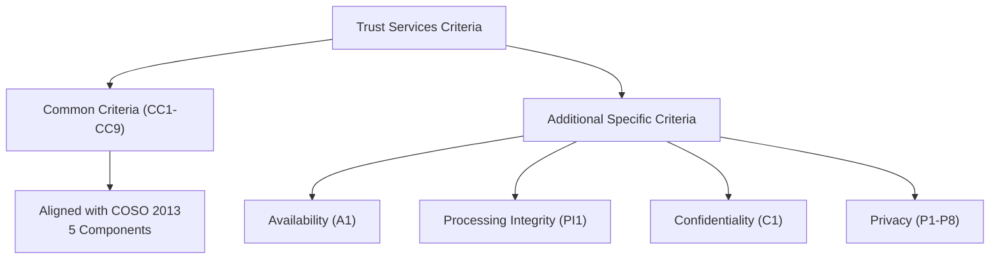
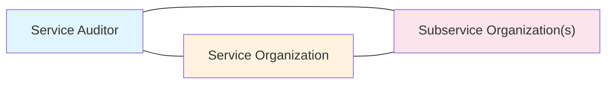
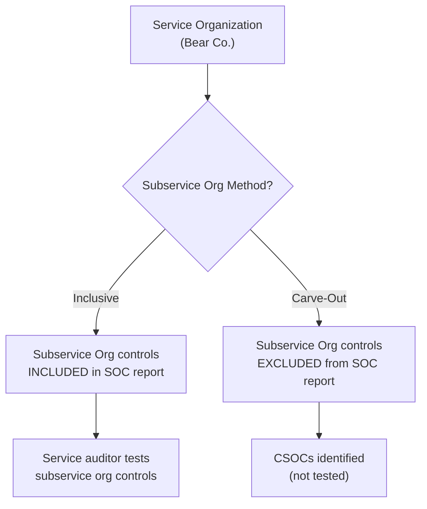

# Planning and Performing SOC Engagements

System and Organization Controls (SOC) engagements are among the most critical attestation services CPAs perform in the information systems domain. As organizations increasingly rely on third-party service providers for cloud hosting, payroll processing, data center operations, and other outsourced functions, user entities and their auditors need assurance that those service organizations have effective controls. SOC reports provide that assurance through a structured attestation framework governed by AICPA professional standards.
This section covers the **Trust Services Criteria** (purpose, organization, and alignment with COSO), **types of SOC reports** (SOC 1®, SOC 2®, SOC 3®, SOC for Cybersecurity, and SOC for Supply Chain), **management assertions**, **independence considerations**, **materiality**, **risk assessment**, **subservice organizations** (inclusive vs. carve-out methods), **service commitments and system requirements**, **subsequently discovered facts**, **system descriptions**, **complementary user entity controls (CUECs)**, **management representations**, **system boundaries**, **reporting mechanisms**, and **subsequent events**.
:::info
The ISC exam tests this topic at the **Remembering and Understanding** and **Application** skill levels for most tasks, with one task tested at the **Analysis** level (determining the effect of subsequent events). You must be able to recall definitions, purposes, and distinctions among SOC report types; identify management assertions; explain materiality, risk assessment, and subservice organization considerations; and apply procedures to understand system boundaries and compare system descriptions to criteria.
:::

---

## Trust Services Criteria (TSC)

The **Trust Services Criteria** are a set of professional standards developed by the AICPA that service auditors use to evaluate and report on controls at a service organization. The TSC provide the benchmarks against which a service organization's controls are assessed in SOC 2® and SOC 3® engagements.

### Purpose

The TSC serve as the **criteria** (i.e., the measuring stick) for evaluating whether a service organization's controls are suitably designed and operating effectively to meet its service commitments and system requirements related to security, availability, processing integrity, confidentiality, and privacy.

### Organization and Alignment with COSO

The TSC are organized around the **COSO Internal Control — Integrated Framework (2013)**, which provides the foundational structure for the **Common Criteria**:
| COSO Component | Common Criteria | Description |
|---|---|---|
| **Control Environment** | CC1 (CC1.1–CC1.5) | Integrity, ethical values, board oversight, organizational structure, accountability |
| **Communication and Information** | CC2 (CC2.1–CC2.3) | Internal and external communication of information necessary for controls to function |
| **Risk Assessment** | CC3 (CC3.1–CC3.4) | Identification and analysis of risks to achieving objectives, including fraud risk |
| **Monitoring Activities** | CC4 (CC4.1–CC4.2) | Ongoing evaluations and communication of control deficiencies |
| **Control Activities** | CC5 (CC5.1–CC5.3) | Policies and procedures that help ensure management directives are carried out |
| **Logical and Physical Access Controls** | CC6 (CC6.1–CC6.8) | Security controls over logical and physical access to system resources |
| **System Operations** | CC7 (CC7.1–CC7.5) | Detection of anomalies, monitoring of system components, incident response |
| **Change Management** | CC8 (CC8.1) | Controls over changes to infrastructure, data, software, and procedures |
| **Risk Mitigation** | CC9 (CC9.1–CC9.2) | Risk mitigation through business continuity and vendor management |

### Additional Specific Criteria

Beyond the Common Criteria (which apply to **all** TSC engagements because security is always in scope), additional criteria address specific trust service categories:
| Category | Criteria | Focus |
|---|---|---|
| **Availability** | A1 (A1.1–A1.3) | System availability for operation and use as committed |
| **Processing Integrity** | PI1 (PI1.1–PI1.5) | System processing is complete, valid, accurate, timely, and authorized |
| **Confidentiality** | C1 (C1.1–C1.2) | Confidential information is protected as committed |
| **Privacy** | P1–P8 | Notice, choice/consent, collection, use/retention/disposal, access, disclosure, quality, monitoring/enforcement |

### Supplemental Criteria

**Supplemental criteria** are additional points of focus that help the service auditor evaluate whether each criterion is met. They are not separate criteria themselves but provide guidance on what to consider. For example, a supplemental criterion under CC6.1 might address multi-factor authentication as a point of focus for access controls.

:::tip[Exam Tip]
**Security** (Common Criteria CC1–CC9) is **always** included in a SOC 2® engagement. The additional categories (availability, processing integrity, confidentiality, privacy) are included only when relevant to the service organization's commitments. You cannot have a SOC 2® report without security.
:::

---

## Types of SOC Reports

### SOC 1® — Internal Control over Financial Reporting (ICFR)

| Attribute          | Description                                                                                                                   |
| ------------------ | ----------------------------------------------------------------------------------------------------------------------------- |
| **Standard**       | SSAE 18 / AT-C Section 320                                                                                                    |
| **Focus**          | Controls at a service organization relevant to user entities' internal control over financial reporting                       |
| **Intended Users** | Management of the service organization, user entities, and user entity auditors (restricted use)                              |
| **Purpose**        | Helps user entity auditors assess the effect of the service organization's controls on the user entity's financial statements |

### SOC 2® — Trust Services Criteria

| Attribute          | Description                                                                                                                            |
| ------------------ | -------------------------------------------------------------------------------------------------------------------------------------- |
| **Standard**       | AT-C Section 205 (Examination Engagements)                                                                                             |
| **Focus**          | Controls related to security, availability, processing integrity, confidentiality, and/or privacy based on the Trust Services Criteria |
| **Intended Users** | Management of the service organization, user entities, business partners, and other specified parties (restricted use)                 |
| **Purpose**        | Provides detailed information about controls relevant to security and, where applicable, other TSC categories                          |

### SOC 3® — General Use Report

| Attribute          | Description                                                                                                          |
| ------------------ | -------------------------------------------------------------------------------------------------------------------- |
| **Standard**       | AT-C Section 205                                                                                                     |
| **Focus**          | Same criteria as SOC 2® (Trust Services Criteria)                                                                    |
| **Intended Users** | **General use** — anyone (can be posted publicly on a website)                                                       |
| **Purpose**        | Provides a high-level opinion without the detailed system description or control testing results (seal of assurance) |

### SOC for Cybersecurity

| Attribute          | Description                                                                                                                                 |
| ------------------ | ------------------------------------------------------------------------------------------------------------------------------------------- |
| **Focus**          | Organization-wide cybersecurity risk management program                                                                                     |
| **Intended Users** | General use (board of directors, analysts, investors, business partners)                                                                    |
| **Purpose**        | Reports on whether the entity's cybersecurity risk management program is effective using suitable description criteria and control criteria |

### SOC for Supply Chain

| Attribute          | Description                                                                                                                             |
| ------------------ | --------------------------------------------------------------------------------------------------------------------------------------- |
| **Focus**          | Controls over the production and distribution of goods                                                                                  |
| **Intended Users** | Customers, business partners, and other stakeholders in the supply chain                                                                |
| **Purpose**        | Addresses risks in the supply chain including security, availability, processing integrity, and confidentiality of supply chain systems |

### Type 1 vs. Type 2

| Attribute            | Type 1                                                      | Type 2                                                                         |
| -------------------- | ----------------------------------------------------------- | ------------------------------------------------------------------------------ |
| **Reporting Date**   | As of a **point in time** (specific date)                   | Throughout a **period of time** (typically 6–12 months)                        |
| **Scope of Testing** | Design and implementation of controls                       | Design, implementation, **and operating effectiveness** of controls            |
| **Testing Approach** | Inquiry, observation, inspection at a single date           | Inquiry, observation, inspection, re-performance, sampling over the period     |
| **Opinion**          | Controls are suitably designed (and implemented for SOC 2®) | Controls are suitably designed and operating effectively throughout the period |

:::warning
A Type 1 report does **not** test operating effectiveness. It only addresses whether controls are suitably designed and, in the case of SOC 2®, implemented. A user entity auditor relying on a SOC 1® report typically needs a **Type 2** report to support their assessment of control risk.
:::

---

## Management Assertions

Management of the service organization makes specific assertions depending on the type of SOC engagement:

### SOC 1® Assertions

| Report Type | Management Asserts That...                                                                                                                                                                                                                                                                                                      |
| ----------- | ------------------------------------------------------------------------------------------------------------------------------------------------------------------------------------------------------------------------------------------------------------------------------------------------------------------------------- |
| **Type 1**  | (a) The system description fairly presents the system as designed and implemented as of the specified date; (b) The controls related to the control objectives are suitably designed to provide reasonable assurance that the control objectives would be achieved if the controls operated effectively                         |
| **Type 2**  | (a) The system description fairly presents the system as designed and implemented throughout the specified period; (b) The controls related to the control objectives were suitably designed and operated effectively throughout the specified period to provide reasonable assurance that the control objectives were achieved |

### SOC 2® Assertions

| Report Type | Management Asserts That...                                                                                                                                                                                                                                                                                                                                  |
| ----------- | ----------------------------------------------------------------------------------------------------------------------------------------------------------------------------------------------------------------------------------------------------------------------------------------------------------------------------------------------------------- |
| **Type 1**  | (a) The system description is presented in accordance with the description criteria; (b) The controls stated in the description were suitably designed to meet the applicable trust services criteria as of the specified date                                                                                                                              |
| **Type 2**  | (a) The system description is presented in accordance with the description criteria; (b) The controls stated in the description were suitably designed throughout the specified period to meet the applicable trust services criteria; (c) The controls operated effectively throughout the specified period to meet the applicable trust services criteria |

### SOC 3® Assertions

In a SOC 3® engagement, management asserts that the system was effective in meeting the applicable trust services criteria throughout the period (Type 2 only — SOC 3® reports are always Type 2).

## Independence Considerations

The service auditor must be **independent** of the service organization and any subservice organizations included in the scope of the engagement. Independence requirements follow the AICPA Code of Professional Conduct.

### Key Independence Relationships

| Relationship                                                 | Requirement                                                                                                    |
| ------------------------------------------------------------ | -------------------------------------------------------------------------------------------------------------- |
| Service auditor → Service organization                       | Must be independent in both fact and appearance                                                                |
| Service auditor → Subservice organization (inclusive method) | Must be independent when the subservice organization's controls are included in scope                          |
| Service auditor → Subservice organization (carve-out method) | Independence from the subservice organization is **not required** because its controls are excluded from scope |

### Common Threats to Independence

| Threat                       | Example                                                                                                     |
| ---------------------------- | ----------------------------------------------------------------------------------------------------------- |
| **Self-review**              | Auditor designs controls that will later be tested in the SOC engagement                                    |
| **Advocacy**                 | Auditor promotes the service organization's SOC report to prospective customers                             |
| **Familiarity**              | Long-standing personal relationships between auditor and service organization management                    |
| **Management participation** | Auditor performs management functions (e.g., operating or monitoring controls) for the service organization |

> **Example:** **Illini Security** performs penetration testing and vulnerability assessments for **Bear Co.**, a cloud hosting provider. If Illini Security is also engaged to perform the SOC 2® examination for Bear Co., a **self-review threat** exists because Illini Security would be evaluating control environments it helped design or test.

## Materiality in SOC Engagements

Materiality guides the service auditor's planning and evaluation of results, but it applies differently in SOC 1® and SOC 2® engagements.

### SOC 1® Materiality

| Aspect             | Application                                                                                                                                                  |
| ------------------ | ------------------------------------------------------------------------------------------------------------------------------------------------------------ |
| **Basis**          | Primarily **quantitative** — based on the financial significance of transactions processed                                                                   |
| **Focus**          | Whether control deviations could result in a material misstatement of user entities' financial statements                                                    |
| **Considerations** | Volume and dollar value of transactions processed, nature of processing (e.g., initiating vs. recording), significance to user entities' financial reporting |

### SOC 2® Materiality

| Aspect             | Application                                                                                                               |
| ------------------ | ------------------------------------------------------------------------------------------------------------------------- |
| **Basis**          | Primarily **qualitative** — based on the nature and significance of controls relative to the trust services criteria      |
| **Focus**          | Whether a control deficiency or combination of deficiencies is significant enough to conclude that a criterion is not met |
| **Considerations** | Nature of the criterion, sensitivity of data, potential impact on users, whether compensating controls exist              |

:::note
In SOC 2® engagements, materiality is more **qualitative** than quantitative because the criteria relate to operational and security matters rather than financial statement amounts. A single access control failure might be material even if it involves no dollar amount.
:::

---

## Risk Assessment

### Service Organization's Risk Assessment Obligations

The service organization must perform its own risk assessment as part of its internal control framework. This includes:

- Identifying risks that threaten the achievement of control objectives (SOC 1®) or trust services criteria (SOC 2®)
- Assessing the likelihood and impact of identified risks
- Designing controls to mitigate identified risks to an acceptable level
- Considering fraud risk in the risk assessment process
- Periodically reassessing risks as the environment changes

### Service Auditor's Risk Assessment Procedures

The service auditor performs risk assessment to plan the nature, timing, and extent of testing:
| Procedure | Purpose |
|---|---|
| Obtain understanding of the service organization's system | Identify components, boundaries, and control environment |
| Evaluate inherent risk factors | Consider complexity of processing, volume of transactions, manual vs. automated controls |
| Assess control risk | Determine the risk that controls are not suitably designed or not operating effectively |
| Identify significant risks | Focus testing on areas with higher assessed risk |
| Consider IT risks | Evaluate risks specific to information technology (e.g., cybersecurity threats, change management weaknesses) |
| Consider fraud risk | Assess the risk of intentional misstatement in the system description or manipulation of controls |

---

## Subservice Organizations

### Definition

A **subservice organization** is an organization that provides services to the service organization that are part of the service organization's system and are likely to be relevant to user entities' controls. Not every vendor qualifies — only those whose services are part of the **information system** used to provide services to user entities.

### Criteria for a Vendor to Be a Subservice Organization

A vendor is considered a subservice organization when:
| Criterion | Description |
|---|---|
| **Part of the system** | The vendor's services are part of the service organization's information system |
| **Relevant to user entities** | The services are likely to be relevant to user entities and their auditors |
| **Controls required** | The vendor implements controls that are necessary to meet control objectives (SOC 1®) or trust services criteria (SOC 2®) |
| **Interconnected operations** | The vendor's operations are interrelated with the service organization's operations in providing services to user entities |
**Example:** **Bear Co.** provides payroll processing services to hundreds of small businesses. Bear Co. uses **Kingfisher Industries** for data center hosting — all payroll data is stored and processed in Kingfisher's facilities. Kingfisher is a subservice organization because its hosting services are part of Bear Co.'s system and its physical and environmental controls are relevant to user entities.

### Inclusive vs. Carve-Out Method

| Method        | Description                                                                                                               | System Description                                                                                              | Testing                                                                                            |
| ------------- | ------------------------------------------------------------------------------------------------------------------------- | --------------------------------------------------------------------------------------------------------------- | -------------------------------------------------------------------------------------------------- |
| **Inclusive** | Subservice organization's controls are **included** in the scope of the service organization's SOC report                 | Includes a description of the subservice organization's relevant controls                                       | Service auditor tests the subservice organization's controls                                       |
| **Carve-Out** | Subservice organization's controls are **excluded** from the scope; only the service organization's controls are in scope | Describes the nature of services provided by the subservice organization but does **not** describe its controls | Service auditor does **not** test the subservice organization's controls; identifies CSOCs instead |

### Complementary Subservice Organization Controls (CSOCs)

When the **carve-out method** is used, the service organization identifies **CSOCs** — controls that the subservice organization is expected to implement for the overall control environment to be effective. CSOCs are disclosed in the system description but are not tested by the service auditor.
**Example:** If **Bear Co.** carves out **Kingfisher Industries**, the system description would state that Kingfisher is expected to implement physical access controls, environmental controls, and backup procedures (CSOCs). The service auditor would not test those controls — instead, user entities would need to obtain their own assurance (e.g., Kingfisher's separate SOC report).

:::tip[Exam Tip]
Remember: **Inclusive = In scope** (service auditor tests subservice controls). **Carve-out = Cut out** (subservice controls are NOT tested; CSOCs are identified instead). The inclusive method requires the service auditor to be independent of the subservice organization.
:::

---

## Service Commitments and System Requirements

### Definitions

| Term                    | Definition                                                                                                                                                                         |
| ----------------------- | ---------------------------------------------------------------------------------------------------------------------------------------------------------------------------------- |
| **Service Commitments** | Declarations made by service organization management to user entities about the system — typically documented in service level agreements (SLAs), contracts, or published policies |
| **System Requirements** | Specifications that the system must meet to support the service commitments — including security policies, operational procedures, and controls that management has established    |

### Relationship to Trust Services Criteria

Service commitments and system requirements represent the **entity's objectives** as referenced in the Trust Services Criteria. The TSC evaluate whether the service organization's controls are adequate to meet its stated commitments and requirements.
| TSC Concept | SOC 2® Equivalent |
|---|---|
| Entity's objectives related to security | Service commitments and system requirements related to security |
| Entity's objectives related to availability | Service commitments and system requirements related to availability (e.g., 99.9% uptime SLA) |
| Entity's objectives related to processing integrity | Service commitments and system requirements related to accuracy and completeness of processing |
| Entity's objectives related to confidentiality | Service commitments and system requirements related to protection of confidential data |
| Entity's objectives related to privacy | Service commitments and system requirements related to personal information handling |
**Example:** **Polar Inc.** operates a cloud accounting platform and commits to 99.95% uptime in its SLA (service commitment). To support this commitment, Polar Inc. has system requirements including redundant data centers, automated failover, and 24/7 monitoring. The SOC 2® engagement evaluates whether Polar Inc.'s controls are sufficient to meet these commitments and requirements relative to the availability criterion (A1).

---

## Subsequently Discovered Facts

**Subsequently discovered facts** are facts that become known to the service auditor **after the report has been issued** that, had they been known earlier, might have caused the auditor to revise the report.

### Impact on the SOC Engagement

| Consideration                                 | Action Required                                                                                       |
| --------------------------------------------- | ----------------------------------------------------------------------------------------------------- |
| **Facts existed during the reporting period** | Service auditor evaluates whether the report needs to be revised or supplemented                      |
| **Report already distributed**                | Service auditor discusses with management the need to disclose the facts to known users of the report |
| **Management refuses to cooperate**           | Service auditor considers notifying known users that the report should no longer be relied upon       |
| **Significance of the facts**                 | Auditor evaluates whether the facts are significant enough to affect user entities' decisions         |

### Service Auditor Responsibilities

1. Discuss the matter with service organization management
2. Determine whether the report would have been affected had the facts been known
3. If significant, request that management notify known report users
4. Consider the effect on the auditor's report and whether revision is necessary
5. If management does not take appropriate action, consider legal counsel and notification obligations

---

## System Description

### Purpose

The system description provides report users with information about the service organization's system that is relevant to understanding the scope and boundaries of the engagement. It is prepared by **management** of the service organization and is a key component of SOC 1® and SOC 2® reports.

### Common Sections

| Section                                       | SOC 1® | SOC 2® | Content                                                                    |
| --------------------------------------------- | ------ | ------ | -------------------------------------------------------------------------- |
| Nature of services provided                   | ✓      | ✓      | Types of services, principal service commitments                           |
| Components of the system                      | —      | ✓      | Infrastructure, software, people, procedures, data                         |
| System boundaries                             | ✓      | ✓      | Clear delineation of what is included in scope                             |
| Control objectives / Criteria                 | ✓      | ✓      | SOC 1®: control objectives; SOC 2®: applicable TSC categories              |
| Controls                                      | ✓      | ✓      | Specific controls in place to meet objectives/criteria                     |
| Complementary user entity controls (CUECs)    | ✓      | ✓      | Controls user entities are expected to implement                           |
| Complementary subservice org controls (CSOCs) | ✓      | ✓      | Controls subservice organizations are expected to implement (carve-out)    |
| Subservice organizations                      | ✓      | ✓      | Identification and description of subservice organizations and method used |
| Relevant aspects of the control environment   | ✓      | —      | Organizational structure, governance, HR policies                          |
| Service commitments and system requirements   | —      | ✓      | Commitments to user entities and requirements for the system               |
| Incidents                                     | —      | ✓      | Disclosure of significant incidents during the period                      |

---

## Complementary User Entity Controls (CUECs)

### Definition and Purpose

**Complementary User Entity Controls (CUECs)** are controls that the service organization's system is designed to assume will be implemented by **user entities**. The service organization identifies these controls in its system description because the overall control environment cannot achieve its objectives without them.

### Key Characteristics

| Characteristic                               | Description                                                                                    |
| -------------------------------------------- | ---------------------------------------------------------------------------------------------- |
| **Identified by management**                 | Service organization management determines which controls must be implemented by user entities |
| **Disclosed in system description**          | CUECs are listed in the system description so user entities and their auditors are aware       |
| **Not tested by service auditor**            | The service auditor does not test CUECs — they are outside the service organization's control  |
| **User entity responsibility**               | Each user entity must evaluate whether it has implemented the identified CUECs                 |
| **Affects user entity auditor's assessment** | The user entity auditor considers whether CUECs are in place when assessing control risk       |

### Common Examples

| CUEC Category             | Example                                                                                     |
| ------------------------- | ------------------------------------------------------------------------------------------- |
| **Access management**     | User entities are responsible for managing their own user accounts and passwords            |
| **Segregation of duties** | User entities should establish appropriate segregation of duties for approving transactions |
| **Reconciliation**        | User entities should reconcile output reports to source documents                           |
| **Timely notification**   | User entities should notify the service organization promptly when employees are terminated |
| **Physical security**     | User entities are responsible for physical security of devices used to access the system    |

> **Example:** **Illini Entertainment** uses **Bear Co.**'s cloud platform for customer data management. Bear Co.'s SOC 2® report lists a CUEC stating that user entities are responsible for terminating user access promptly when an employee leaves the organization. If Illini Entertainment fails to disable departed employees' access, a control gap exists — but it is Illini Entertainment's responsibility, not Bear Co.'s.

## Management's Written Representations

### Requirements

The service auditor is required to obtain **written representations** from service organization management in every SOC 1® and SOC 2® engagement. These representations are typically obtained in a management representation letter dated as of the service auditor's report date.

### Content of Representations

| Representation Topic                      | Description                                                                                                                           |
| ----------------------------------------- | ------------------------------------------------------------------------------------------------------------------------------------- |
| **System description**                    | Management confirms the system description is fairly presented (SOC 1®) or presented in accordance with description criteria (SOC 2®) |
| **Control design**                        | Controls are suitably designed to meet control objectives (SOC 1®) or trust services criteria (SOC 2®)                                |
| **Operating effectiveness** (Type 2 only) | Controls operated effectively throughout the specified period                                                                         |
| **Completeness**                          | All relevant information has been provided to the service auditor                                                                     |
| **Known deficiencies**                    | Management has disclosed all known control deficiencies                                                                               |
| **Subsequent events**                     | Management has disclosed all subsequent events that could affect the system description or controls                                   |
| **Fraud and noncompliance**               | Management has disclosed all known instances of fraud or noncompliance                                                                |
| **Subservice organizations**              | Disclosures about subservice organizations are complete and accurate                                                                  |
| **Incidents** (SOC 2®)                    | Management has disclosed any incidents during the period that could affect the trust services criteria                                |

### Timing

Written representations must be dated as of the **date of the service auditor's report**. If management refuses to provide written representations, the service auditor must consider the effect on the engagement — which may result in a qualified opinion, adverse opinion, or withdrawal from the engagement.

## System Boundaries

### Understanding the System

In a SOC 2® engagement, the service auditor must obtain an understanding of the system, including the **boundaries** as defined by service organization management. The system is composed of five components:
| Component | Description | Example |
|---|---|---|
| **Infrastructure** | Physical and virtual resources (servers, networks, facilities) | Cloud servers, firewalls, data centers |
| **Software** | Programs and operating software | Application software, operating systems, middleware |
| **People** | Personnel involved in system operations | IT staff, security team, customer support |
| **Procedures** | Manual and automated procedures | Incident response procedures, change management workflows |
| **Data** | Information used and processed by the system | Transaction data, configuration data, log files |

### Identifying Boundaries

The service auditor evaluates whether the boundaries defined by management are appropriate and clearly delineated. Boundaries define what is **in scope** and what is **out of scope** for the examination.
| In Scope | Out of Scope |
|---|---|
| Services described in the system description | Services not covered by the engagement |
| Infrastructure owned/operated by the service org | User entity environments |
| Subservice org controls (inclusive method only) | Subservice org controls (carve-out method) |
| Controls implemented by the service org | CUECs (implemented by user entities) |

---

## Reporting Mechanisms for Failures and Incidents

The service auditor must perform procedures to understand how the service organization provides its personnel and external users information about how to report:

- **System failures** (e.g., outages, performance degradation)
- **Security incidents** (e.g., unauthorized access, data breaches)
- **Concerns and complaints** (e.g., privacy concerns, processing errors)
- **Other matters** affecting the system

### Typical Reporting Mechanisms

| Mechanism                               | Description                                                                      |
| --------------------------------------- | -------------------------------------------------------------------------------- |
| **Help desk / Service desk**            | Centralized point of contact for reporting issues                                |
| **Incident reporting portal**           | Web-based system for logging security incidents                                  |
| **Whistleblower hotline**               | Anonymous reporting mechanism for ethics and compliance concerns                 |
| **Contractual notification procedures** | SLA-defined processes for escalating failures to user entities                   |
| **Automated monitoring alerts**         | Systems that automatically detect and report anomalies                           |
| **Published policies**                  | Security policies and acceptable use policies that define reporting expectations |

---

## Comparing System Description to Criteria

### SOC 1® — Comparison to Suitable Criteria

The service auditor prepares a comparison of management's system description to **suitable criteria** established in AT-C 320. The auditor evaluates whether:

- The description fairly presents the service organization's system
- The description includes all relevant control objectives
- The description addresses the nature of services, controls, and complementary controls
- The description is not misleading (does not omit or overstate material information)

### SOC 2® — Comparison to Description Criteria

The service auditor compares management's system description to the **description criteria** established by the AICPA. The description criteria specify what a SOC 2® system description should include:
| Description Criterion | Evaluates Whether Description Addresses... |
|---|---|
| DC1 | The types of services provided |
| DC2 | The components of the system (infrastructure, software, people, procedures, data) |
| DC3 | The boundaries of the system |
| DC4 | How the system captures and addresses significant events and conditions |
| DC5 | The process for preparing and delivering reports |
| DC6 | Identified control objectives and controls |
| DC7 | Complementary user entity controls (CUECs) |
| DC8 | Complementary subservice organization controls (CSOCs) and the method used (inclusive/carve-out) |
| DC9 | Relevant specific criteria disclosures (availability, processing integrity, confidentiality, privacy) |

---

## Subsequent Events

### Definition

**Subsequent events** are events that occur between the end of the reporting period (or as-of date) and the date of the service auditor's report. The service auditor must evaluate subsequent events and determine their effect on the SOC report.

### Types of Subsequent Events

| Type                        | Description                                                                                              | Effect on Report                                                                           |
| --------------------------- | -------------------------------------------------------------------------------------------------------- | ------------------------------------------------------------------------------------------ |
| **Type I (Adjusting)**      | Events that provide additional evidence about conditions that existed at the end of the reporting period | May require modification of the system description, auditor's opinion, or both             |
| **Type II (Non-adjusting)** | Events that are indicative of conditions arising after the reporting period                              | May require disclosure in the report but do not affect the opinion on the reporting period |

### Service Auditor Procedures

| Procedure                                      | Purpose                                                                      |
| ---------------------------------------------- | ---------------------------------------------------------------------------- |
| Inquire of management about subsequent events  | Identify events occurring after the period end                               |
| Read board minutes and internal communications | Detect events that could affect the system or controls                       |
| Review subsequent changes to the system        | Determine if any changes affect the reporting period conclusions             |
| Evaluate the significance of identified events | Determine whether disclosure or modification is required                     |
| Consider the effect on the opinion             | Decide if the event is a Type I (adjusting) or Type II (non-adjusting) event |

**Example:** **Polar Inc.**'s SOC 2® report covers January 1 – December 31, 2024. On January 15, 2025 (before the report date of February 28, 2025), Polar Inc. discovers that a privileged user account was compromised during November 2024 but was not detected until January. This is a **Type I (adjusting) event** because it provides evidence of a condition that existed during the reporting period. The service auditor would evaluate whether this affects the opinion on the operating effectiveness of access controls.
Conversely, if Polar Inc. migrated to a completely new data center on January 20, 2025, this would be a **Type II (non-adjusting) event** — it reflects a condition arising after the period and does not affect the assessment of controls during the reporting period but may warrant disclosure.
:::warning
The service auditor's responsibility for subsequent events extends from the end of the reporting period to the **date of the service auditor's report**. After the report date, the auditor has no obligation to perform additional procedures — unless subsequently discovered facts come to attention.
:::

---

## Summary

| Topic                            | Key Takeaway                                                                                                                                                       |
| -------------------------------- | ------------------------------------------------------------------------------------------------------------------------------------------------------------------ |
| Trust Services Criteria          | Common Criteria (CC1–CC9) aligned with COSO; additional criteria for availability, processing integrity, confidentiality, and privacy; security is always in scope |
| SOC 1®                           | ICFR focus, restricted use, user entity auditors are primary users, governed by AT-C 320                                                                           |
| SOC 2®                           | TSC focus, restricted use, detailed system description and control testing, governed by AT-C 205                                                                   |
| SOC 3®                           | Same criteria as SOC 2® but general use, no detailed description — suitable for public distribution                                                                |
| Type 1 vs. Type 2                | Type 1 = point in time (design only); Type 2 = period of time (design + operating effectiveness)                                                                   |
| Management Assertions            | Vary by report type; always include fair presentation of system description and suitability of control design                                                      |
| Independence                     | Required from service org; required from subservice org only under inclusive method                                                                                |
| Materiality                      | SOC 1® = quantitative/financial; SOC 2® = qualitative/controls-focused                                                                                             |
| Subservice Organizations         | Inclusive = controls in scope and tested; Carve-out = controls excluded, CSOCs identified                                                                          |
| Service Commitments/Requirements | Represent entity's objectives in TSC; documented in SLAs and policies                                                                                              |
| Subsequently Discovered Facts    | Facts learned after report issuance; auditor evaluates need for revision or user notification                                                                      |
| System Description               | Prepared by management; includes services, components, boundaries, controls, CUECs, and CSOCs                                                                      |
| CUECs                            | Controls user entities must implement; identified by service org; not tested by service auditor                                                                    |
| Management Representations       | Written representations required; dated as of report date; refusal may lead to modified opinion                                                                    |
| System Boundaries                | Five components (infrastructure, software, people, procedures, data); defined by management                                                                        |
| Subsequent Events                | Type I (adjusting) affects opinion; Type II (non-adjusting) may require disclosure only                                                                            |

---

## Practice Questions

1. **Bear Co.** is a payroll processing service organization undergoing a SOC 2® Type 2 examination for the period January 1 – December 31, 2024. Bear Co. uses **Kingfisher Industries** for data center hosting and applies the carve-out method. During the engagement, the service auditor notes that Kingfisher's physical access controls are essential for the security criterion to be met. How should this situation be addressed in the SOC 2® report, and what are the implications for user entities?
2. **Polar Inc.** provides cloud-based accounting services and is preparing for its first SOC 2® engagement. The engagement partner asks Polar Inc.'s management to define the system boundaries. Management excludes the customer support ticketing system from scope, arguing it does not affect security. However, the ticketing system is the primary mechanism through which users report security incidents and system failures. Should the service auditor accept management's boundary definition? Explain the significance of reporting mechanisms in a SOC 2® engagement.
3. **Bear Co.** completed its SOC 1® Type 2 report covering April 1 – September 30, 2024, and the report was issued on November 15, 2024. On December 5, 2024, the service auditor discovers that a key reconciliation control was not actually operating from July through September due to a staffing shortage — the evidence previously examined had been fabricated by a departing employee. Classify this as either a subsequently discovered fact or a subsequent event, and explain what steps the service auditor should take.
   :::tip[Answers]
4. Because Bear Co. uses the **carve-out method**, Kingfisher Industries' controls are **excluded** from the scope of the SOC 2® examination. The service auditor does not test Kingfisher's physical access controls. Instead, the system description must: (a) identify Kingfisher as a subservice organization, (b) describe the nature of services Kingfisher provides, (c) state that the carve-out method is used, and (d) identify **Complementary Subservice Organization Controls (CSOCs)** — specifically, that Kingfisher is expected to implement physical access controls, environmental controls, and other relevant controls. The implication for user entities is that they cannot rely solely on Bear Co.'s SOC 2® report for assurance over physical security. User entities (or their auditors) must separately obtain assurance that Kingfisher's controls are effective — typically by obtaining Kingfisher's own SOC report.
5. The service auditor should **not** simply accept management's boundary definition without evaluating its appropriateness. Under the Trust Services Criteria, the service auditor must perform procedures to understand how the service organization provides personnel and external users information on how to report failures, incidents, concerns, and complaints (CC2 and CC7 criteria). If the customer support ticketing system is the **primary reporting mechanism** for security incidents and system failures, excluding it from scope could mean the system description does not fairly represent the system or that critical controls related to incident detection and communication are not evaluated. The service auditor should discuss with management whether the boundaries should be expanded to include the ticketing system or, at minimum, ensure that controls related to reporting mechanisms within the defined boundaries are adequately described and tested.
6. This is a **subsequently discovered fact**, not a subsequent event. A subsequent event occurs between the period end and the report date. This situation involves facts that became known to the auditor **after the report was issued** (report issued November 15; facts discovered December 5). The fabricated evidence means the original conclusion about operating effectiveness was incorrect. The service auditor should: (1) discuss the matter with Bear Co.'s management immediately; (2) determine that the report would have been different had the facts been known — specifically, the reconciliation control was not operating effectively for three of the six months, which would likely result in a qualified or adverse opinion; (3) request that management notify all known users of the report that it should no longer be relied upon; (4) if management refuses to cooperate, the service auditor should consider notifying known users directly and seek legal counsel; and (5) consider whether a revised report should be issued reflecting the correct facts.
   :::
