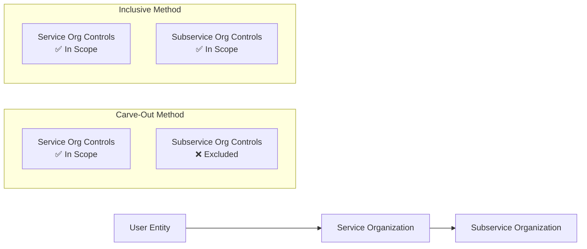

# Reporting on SOC Engagements

Once a SOC engagement is planned and performed, the service auditor must communicate results through a structured report. The reporting phase is where the auditor determines the form and content of the report, evaluates deficiencies, documents test results, addresses complementary user entity controls (CUECs), and decides how subservice organizations are presented. Understanding SOC reporting is essential for the ISC section of the CPA exam because CPAs must be able to prepare and interpret these reports in practice.
This section covers the **effect of CUECs on SOC reports**, the **carve-out vs. inclusive method** for reporting on subservice organizations (CSOCs), **types of opinions and report modifications**, **preparing test results for SOC 2® reports** (including handling exceptions), and the **form and content of SOC 1® and SOC 2® reports**.
:::info
The ISC exam tests this topic at the **Remembering and Understanding** level (explaining CUECs, summarizing carve-out vs. inclusive, explaining opinion types) and the **Application** level (preparing test results and determining appropriate report form and content). You must recall how CUECs affect reliance, distinguish between report methods for subservice organizations, identify when each opinion type applies, and construct SOC 2® test result entries.
:::

---

## Effect of CUECs on the SOC Report

**Complementary User Entity Controls (CUECs)** are controls that the service organization's system is designed to assume will be implemented by user entities. The service organization's controls alone may not achieve the control objectives or meet the trust services criteria without these complementary controls operating effectively at the user entity.

### How CUECs Appear in the Report

| Report Component                          | Treatment of CUECs                                                                                        |
| ----------------------------------------- | --------------------------------------------------------------------------------------------------------- |
| **System Description (Section III)**      | CUECs are listed and described — typically as assumptions about controls at user entities                 |
| **Service Auditor's Report (Section I)**  | The opinion references that achieving control objectives/criteria depends in part on CUECs being in place |
| **Control Objectives / TSC (Section IV)** | CUECs are identified alongside the service organization's own controls                                    |

### Key Principles

- The **service auditor does not test CUECs** — they are outside the scope of the examination.
- CUECs are **identified by management** of the service organization in the system description.
- The service auditor's opinion is **not modified** solely because CUECs exist; their existence is a normal feature of SOC reports.
- **User entity auditors** must evaluate whether their client has implemented the CUECs when relying on the SOC report.

### SOC 1® vs. SOC 2® Differences

| Aspect                  | SOC 1®                                                                              | SOC 2®                                                                        |
| ----------------------- | ----------------------------------------------------------------------------------- | ----------------------------------------------------------------------------- |
| **Terminology**         | Complementary User Entity Controls                                                  | Complementary User Entity Controls                                            |
| **Relevance**           | Needed to achieve control objectives relevant to user entities' financial reporting | Needed to meet trust services criteria (security, availability, etc.)         |
| **User Auditor Action** | User auditor tests CUECs as part of the audit of financial statements               | User auditor or management evaluates whether CUECs support the applicable TSC |

:::tip
**Bear Co.** outsources payroll processing to **Polar Inc.** The SOC 1® report from Polar Inc. identifies a CUEC: "User entities should reconcile payroll reports to their general ledger monthly." Bear Co.'s external auditor must test whether Bear Co. actually performs this reconciliation before relying on Polar Inc.'s controls.
:::

---

## Carve-Out vs. Inclusive Method for CSOCs

When a service organization uses a **subservice organization** (another third party) to perform some of its services, the service auditor must determine how to report on the subservice organization's controls. There are two methods:

### Comparison Table

| Feature                       | Carve-Out Method                                                                                                                   | Inclusive Method                                                                   |
| ----------------------------- | ---------------------------------------------------------------------------------------------------------------------------------- | ---------------------------------------------------------------------------------- |
| **Scope of examination**      | Subservice organization's controls are **excluded** from scope                                                                     | Subservice organization's controls are **included** in scope                       |
| **System description**        | Describes the nature of services provided by subservice org; identifies **Complementary Subservice Organization Controls (CSOCs)** | Describes both the service org's and subservice org's systems and controls         |
| **Testing**                   | Service auditor does **not** test subservice org controls                                                                          | Service auditor **tests** subservice org controls (or uses another auditor's work) |
| **Report coverage**           | Opinion covers only the service organization's controls                                                                            | Opinion covers both service org and subservice org controls                        |
| **User auditor implications** | User auditor may need a separate SOC report from the subservice org or perform alternative procedures                              | User auditor can rely on a single report for the entire chain                      |

### When Each Method Is Used

| Method        | Typical Scenario                                                                                                                                |
| ------------- | ----------------------------------------------------------------------------------------------------------------------------------------------- |
| **Carve-out** | Subservice org is unwilling or unable to participate; the service org wants a narrower scope; most common in practice                           |
| **Inclusive** | Service org and subservice org have a close relationship (e.g., same corporate family); subservice org agrees to participate in the examination |

:::warning
Under the **carve-out method**, the system description must clearly identify **CSOCs** — controls that the subservice organization is expected to implement. These are analogous to CUECs but apply to the subservice organization rather than the user entity.
:::

---

## Types of Opinions and Report Modifications

The service auditor issues an opinion on whether (1) the system description is fairly presented, (2) controls are suitably designed, and (for Type 2 reports) (3) controls operated effectively during the period.

### Opinion Types

| Opinion Type                 | When Issued                                                                                                                |
| ---------------------------- | -------------------------------------------------------------------------------------------------------------------------- |
| **Unqualified (Unmodified)** | No material exceptions; controls are suitably designed and (for Type 2) operated effectively                               |
| **Qualified**                | A specific, identified area has a material deficiency or scope limitation, but the remainder of the report is not affected |
| **Adverse**                  | Pervasive material control deficiencies exist, or the system description is materially misstated                           |
| **Disclaimer**               | Scope limitations are so significant the auditor cannot form an opinion                                                    |

### Causes of Report Modifications

| Cause                                                        | Likely Result                   |
| ------------------------------------------------------------ | ------------------------------- |
| Material deficiency in control design (Type 1 or Type 2)     | Qualified or adverse opinion    |
| Material deficiency in operating effectiveness (Type 2 only) | Qualified or adverse opinion    |
| Material misstatement in the system description              | Qualified or adverse opinion    |
| Scope limitation (inability to obtain sufficient evidence)   | Qualified opinion or disclaimer |
| Pervasive deficiencies or misstatements                      | Adverse opinion                 |

### Type 1 vs. Type 2 Considerations

| Report Type | What Is Evaluated                                    | Effect of Deficiency                                                                                  |
| ----------- | ---------------------------------------------------- | ----------------------------------------------------------------------------------------------------- |
| **Type 1**  | Suitability of design at a point in time             | Deficiency in design → modification of opinion on design                                              |
| **Type 2**  | Design **and** operating effectiveness over a period | Deficiency in design or operations → modification of opinion on design and/or operating effectiveness |

:::note
A **qualified opinion** on a SOC 2® Type 2 report might state: "Except for the deficiency described in the basis for qualified opinion paragraph, controls were suitably designed and operated effectively..." The deficiency is isolated and does not pervade the entire system.
:::

---

## Preparing Test Results for SOC 2® Reports

Section IV of a SOC 2® Type 2 report includes detailed results of the service auditor's testing. Each control is presented with the test applied and the results obtained.

### Structure of Test Results

Each entry in Section IV typically includes:
| Column | Description |
|---|---|
| **Trust Services Criteria** | The specific criterion (e.g., CC6.1) being addressed |
| **Control Activity** | Description of the control implemented by the service organization |
| **Test Applied** | The procedure the service auditor performed (inquiry, observation, inspection, re-performance) |
| **Test Results** | Whether the control operated effectively or an exception was identified |

### Testing Methodologies

| Method             | Description                                                                 | Example                                                                        |
| ------------------ | --------------------------------------------------------------------------- | ------------------------------------------------------------------------------ |
| **Inquiry**        | Questioning personnel about their understanding and performance of controls | Asked the IT manager about the access review process                           |
| **Observation**    | Watching a process or procedure being performed                             | Observed the quarterly access review meeting                                   |
| **Inspection**     | Examining documents, records, or configurations                             | Inspected access review sign-off documentation for a sample of 25 reviews      |
| **Re-performance** | Independently executing the control procedure                               | Re-performed the user access provisioning process for a sample of 20 new hires |

### Sample Test Results — No Exceptions

| TSC   | Control                                                                 | Test Applied                                                              | Results             |
| ----- | ----------------------------------------------------------------------- | ------------------------------------------------------------------------- | ------------------- |
| CC6.1 | Access to production systems requires multi-factor authentication (MFA) | Inspected system configuration settings for all production servers        | No exceptions noted |
| CC7.2 | Security events are monitored via a SIEM tool with alerts for anomalies | Inspected SIEM alert configurations and observed the monitoring dashboard | No exceptions noted |

### Sample Test Results — Exception Identified

| TSC   | Control                                                  | Test Applied                                                                               | Results                                                                                                                                                                                            |
| ----- | -------------------------------------------------------- | ------------------------------------------------------------------------------------------ | -------------------------------------------------------------------------------------------------------------------------------------------------------------------------------------------------- |
| CC6.3 | Terminated employees have access removed within 24 hours | Inspected access removal records for a sample of 30 terminated employees during the period | **Exception:** 3 of 30 (10%) sampled terminations had access removed after 24 hours (range: 2–5 days). Management remediated by implementing automated termination triggers effective September 1. |

### Handling Exceptions

When exceptions are identified, the service auditor documents:

1. **Nature** — What specifically went wrong (e.g., late access removal)
2. **Frequency** — How many exceptions out of the sample (e.g., 3 of 30)
3. **Impact** — Whether the exception represents a control deficiency and its severity
4. **Management response** — Any corrective actions taken (optional but common)
   :::tip
   **Bear Co.** is preparing the SOC 2® Type 2 report for **Illini Security**, a managed security services provider. During testing of CC6.3, the auditor found that 2 of 25 sampled access removals exceeded the 24-hour SLA. The test results entry states: "Exception: 2 of 25 sampled terminations had access removed between 25 and 48 hours after termination. Management implemented an automated workflow on July 15 to address the delay." This exception alone does not automatically result in a modified opinion — the auditor evaluates whether it constitutes a material deficiency.
   :::

---

## Form and Content of SOC 1® and SOC 2® Reports

### SOC 1® Report Structure

| Section | Title                                                       | Contents                                                                                                                                       |
| ------- | ----------------------------------------------------------- | ---------------------------------------------------------------------------------------------------------------------------------------------- |
| **I**   | Independent Service Auditor's Report                        | Opinion on fairness of description, suitability of design, and (Type 2) operating effectiveness; scope, responsibilities, inherent limitations |
| **II**  | Management's Assertion                                      | Management's written assertion regarding the system description and controls                                                                   |
| **III** | Description of the Service Organization's System            | System boundaries, infrastructure, software, people, procedures, data; CUECs and CSOCs identified                                              |
| **IV**  | Control Objectives, Related Controls, and Tests of Controls | (Type 1) Control objectives and related controls; (Type 2) adds tests of controls and results                                                  |
| **V**   | Other Information Provided by Management                    | Optional — not covered by the service auditor's opinion (e.g., future plans, additional context)                                               |

### SOC 2® Report Structure

| Section | Title                                                         | Contents                                                                                                                   |
| ------- | ------------------------------------------------------------- | -------------------------------------------------------------------------------------------------------------------------- |
| **I**   | Independent Service Auditor's Report                          | Opinion on fairness of description, suitability of design, and (Type 2) operating effectiveness relative to TSC            |
| **II**  | Management's Assertion                                        | Management's assertion that the description is presented in accordance with the description criteria and controls meet TSC |
| **III** | Description of the Service Organization's System              | Principal service commitments, system requirements, components, boundaries, CUECs, CSOCs                                   |
| **IV**  | Trust Services Criteria, Related Controls, Tests, and Results | (Type 1) Criteria and related controls; (Type 2) adds tests and results for each criterion                                 |
| **V**   | Other Information Provided by Management                      | Optional — not covered by the service auditor's opinion                                                                    |

### Key Differences Between SOC 1® and SOC 2®

| Dimension                     | SOC 1®                                             | SOC 2®                                                           |
| ----------------------------- | -------------------------------------------------- | ---------------------------------------------------------------- |
| **Standards**                 | SSAE 18 (AT-C 320)                                 | SSAE 18 (AT-C 205 + TSC)                                         |
| **Criteria**                  | Control objectives relevant to user entities' ICFR | Trust Services Criteria (security + optional categories)         |
| **Primary audience**          | User entity auditors and management                | Broad stakeholders (regulators, customers, partners, management) |
| **Section IV focus**          | Control objectives and related controls            | TSC criteria and related controls                                |
| **Restricted use**            | Yes (Type 1 and Type 2)                            | Yes for Type 2; SOC 3® is the general-use version                |
| **Financial reporting focus** | Yes — directly supports ICFR audit                 | No — focuses on operational controls related to TSC              |

:::info
**Kingfisher Industries** receives both a SOC 1® report and a SOC 2® report from its cloud hosting provider. The SOC 1® is used by Kingfisher's external auditor to evaluate controls relevant to financial reporting (e.g., automated journal entry controls). The SOC 2® is used by Kingfisher's IT governance team to assess security, availability, and confidentiality controls.
:::

---

## Summary

| Topic                  | Key Takeaway                                                                                               |
| ---------------------- | ---------------------------------------------------------------------------------------------------------- |
| CUECs                  | Controls user entities must implement; service auditor does not test them; disclosed in system description |
| Carve-out method       | Subservice org controls excluded from scope; CSOCs identified; most common approach                        |
| Inclusive method       | Subservice org controls included and tested; single report covers the chain                                |
| Unqualified opinion    | No material exceptions in design or (for Type 2) operating effectiveness                                   |
| Qualified opinion      | Isolated material deficiency or scope limitation                                                           |
| Adverse opinion        | Pervasive material deficiencies or misstatements                                                           |
| Disclaimer             | Unable to obtain sufficient evidence to form an opinion                                                    |
| Test results structure | TSC criterion → control → test applied → results (including exceptions)                                    |
| SOC 1® focus           | Control objectives relevant to user entities' ICFR                                                         |
| SOC 2® focus           | Trust Services Criteria (security, availability, processing integrity, confidentiality, privacy)           |

---

## Practice Questions

**1.** **Illini Entertainment** relies on a SOC 1® Type 2 report from its payroll service provider. The report identifies a CUEC stating that user entities must review and approve payroll exception reports weekly. What action should Illini Entertainment's external auditor take?
A. Accept the SOC 1® report without further testing since the service auditor issued an unqualified opinion
B. Request that the service auditor test the CUEC in the next engagement
C. Test whether Illini Entertainment actually reviews and approves payroll exception reports weekly
D. Issue a qualified opinion because a CUEC exists
**2.** A service organization uses a cloud infrastructure provider as a subservice organization and reports using the **carve-out method**. Which of the following best describes how the subservice organization appears in the SOC 2® report?
A. The subservice organization's controls are tested and included in Section IV
B. The subservice organization is not mentioned anywhere in the report
C. The system description identifies the subservice organization and lists CSOCs, but its controls are not tested
D. The service auditor issues a separate opinion on the subservice organization
**3.** During a SOC 2® Type 2 engagement, the service auditor inspected access removal records for 40 terminated employees and found that 12 had access removed more than 72 hours after termination, violating the organization's 24-hour policy. What is the most likely effect on the report?
A. No effect — exceptions under 50% do not impact the report
B. The exception is noted in the test results, but the opinion remains unqualified because management remediated the issue
C. The service auditor evaluates whether the 30% exception rate represents a material deficiency that warrants a qualified or adverse opinion
D. The service auditor must issue a disclaimer of opinion
:::tip[Answers]

1. **C.** The user entity auditor must test whether the CUEC is implemented at their client. CUECs are outside the scope of the service auditor's testing, but they are necessary for the control objectives to be achieved. The user auditor cannot simply rely on the unqualified opinion without confirming the CUEC is in place.
2. **C.** Under the carve-out method, the subservice organization is identified in the system description and CSOCs are listed, but the subservice organization's controls are excluded from the scope of testing. The service auditor's opinion covers only the service organization's own controls.
3. **C.** A 30% exception rate (12 of 40) is significant. The service auditor must evaluate whether this represents a material deficiency in operating effectiveness. If material, the opinion would be qualified (if the deficiency is isolated to this control) or adverse (if pervasive). The auditor does not automatically disclaim and does not ignore high exception rates.
   :::
