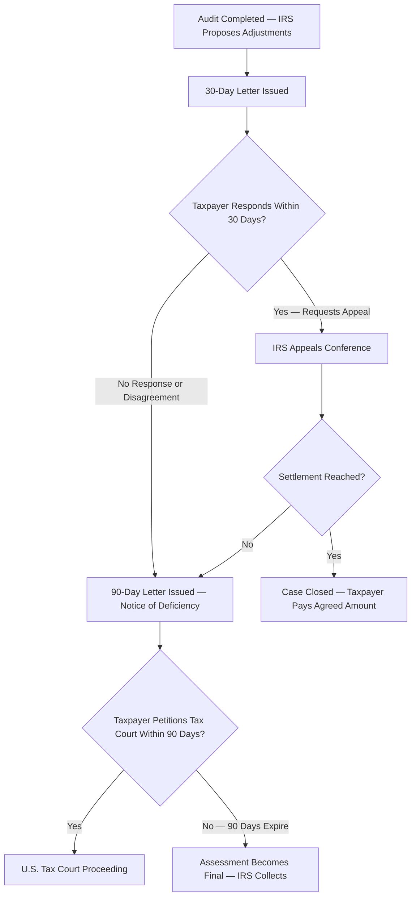

# Federal Tax Procedures

## Tax Return Preparers

### 1. What is a "Tax Return Preparer"?

Under Internal Revenue Code (IRC) Section 7701(a)(36), a **Tax Return Preparer (TRP)** is defined as any person who prepares for compensation, or who employs one or more persons to prepare for compensation, all or a substantial portion of any tax return or claim for refund.

**Key elements of this definition for the exam:**

- **Compensation is mandatory:** If someone prepares a tax return for a friend or family member for free, they are *not* legally considered a TRP.

- **Substantial portion:** A professional does not have to prepare the entire return to be classified as a TRP. If they prepare a schedule or provide tax advice on an entry that represents a "substantial portion" of the overall tax liability, they fall under the TRP rules and are subject to preparer penalties.

- **Exclusions:** A person is strictly *not* a TRP if they only provide mechanical or clerical assistance (like typing, formatting, or basic data entry), if they prepare a return for their regular, continuous employer, or if they prepare a return while acting as a fiduciary (like an executor of an estate).

---

### 2. Can More Than One Preparer Work on a Tax Return?

Absolutely. In professional accounting environments, it is standard practice. A single Form 1040 might be handled by a junior associate doing initial entry, a senior accountant handling complex flow-through schedules (like K-1s), and a tax manager reviewing the final product.

Because multiple professionals often work on a single return, the IRS divides TRPs into two distinct categories:

- **Signing Preparers:** The individual who formally signs the return.

- **Nonsigning Preparers:** Individuals who prepare all or a substantial portion of the return for compensation but do not sign it. It is critical to note that nonsigning preparers are still considered TRPs and are subject to IRS penalties if they take unreasonable tax positions.

---

### 3. Multiple Preparers: Who Signs the Form 1040?

When multiple preparers collaborate on a return, the IRS has a strict rule dictating whose signature must go on the final document. Under Treasury Regulations, the **signing tax return preparer** must be the individual TRP who has the **primary responsibility for the overall substantive accuracy** of the preparation of the return.

This signature requirement does not simply default to the person who spent the most billable hours on the file, nor does it automatically go to the highest-ranking partner in the firm. It goes to the specific individual who reviews the collective work, makes the final technical decisions, ensures all tax laws were appropriately applied, and takes ultimate responsibility for the return's correctness before it is presented to the taxpayer.

---

### 4. Representation Rights

Not all tax return preparers have the same ability to represent taxpayers before the IRS.

| **Category** | **Who Qualifies** | **Rights** |
| --- | --- | --- |
| **Unlimited Representation** | CPAs, attorneys, enrolled agents (EAs) | May represent any taxpayer before the IRS on any matter, including audits, appeals, and collections |
| **Limited Representation** | Annual Filing Season Program (AFSP) participants | May represent only taxpayers whose returns they signed and prepared, and only before revenue agents and customer service representatives |

:::tip

For the CPA exam, remember that CPAs, attorneys, and EAs have **unlimited** representation rights. All other preparers (including AFSP participants) have limited or no representation rights.

:::

---

### Application in Practice: The Tax Firm Scenario

> **Example: CPA Bear Tax Services**
> CPA Bear Tax Services, a firm located in Champaign, Illinois, is preparing a complex Form 1040 for a new client.
>
> - **Alex** (an intern) enters all the W-2s, 1099s, and basic demographic data into the firm's tax software.
>
> - **Taylor** (a senior tax associate) prepares the Schedule C for the client's sole proprietorship and calculates the MACRS depreciation for several newly acquired assets, which constitutes a substantial portion of the return.
>
> - **Morgan** (the tax manager) performs a comprehensive review of Alex and Taylor's work, verifies that all tax positions meet the "substantial authority" threshold, resolves a complex question regarding a passive activity loss, and finalizes the return for filing.

**Analysis:**

- **Is Alex a Tax Return Preparer?** No. Alex is merely providing mechanical and data entry assistance.

- **Is Taylor a Tax Return Preparer?** Yes. Even though Taylor doesn't sign the return, Taylor prepared a substantial portion of it for compensation. Taylor is classified as a **nonsigning tax return preparer**.

- **Who signs the Form 1040?** Morgan. As the manager who conducted the final review, resolved the technical issues, and finalized the tax positions, Morgan holds the primary responsibility for the overall substantive accuracy of the return. Morgan is the **signing tax return preparer**.

---

## Tax Return Preparer Compliance Penalties

When a preparer takes an improper position on a return, the IRS imposes graduated penalties under IRC §6694. The severity depends on the preparer's level of culpability.

### IRC §6694(a) — Unreasonable Position

A penalty applies when a preparer takes a position on a return that the IRS later determines was **unreasonable**.

| **Scenario** | **Standard Required** |
| --- | --- |
| **Undisclosed position** | Must meet the **substantial authority** standard |
| **Disclosed position** (Form 8275 or 8275-R filed) | Must have a **reasonable basis** |
| **Tax shelter or reportable transaction** | Must meet the **more-likely-than-not** standard (>50% likelihood of being sustained) |

**Penalty amount:** The **greater of \$1,000 or 50%** of the income derived (or to be derived) by the preparer with respect to the return.

> **Example:** Marcus, a CPA at Bear Co., prepares a return and claims an aggressive deduction without disclosing it. The position does not meet the substantial authority standard. Marcus earned a \$3,000 fee for preparing the return. His penalty is the greater of \$1,000 or 50% × \$3,000 = **\$1,500**.

### IRC §6694(b) — Willful or Reckless Conduct

This more severe penalty applies when a preparer's conduct rises to the level of **willful understatement** of tax liability or **reckless or intentional disregard** of rules and regulations.

**Penalty amount:** The **greater of \$5,000 or 75%** of the income derived (or to be derived) by the preparer with respect to the return.

> **Example:** Sarah, a preparer at Polar Co., intentionally ignores Treasury Regulations and fabricates deductions to reduce a client's tax liability. She earned a \$10,000 fee. Her penalty is the greater of \$5,000 or 75% × \$10,000 = **\$7,500**.

:::caution

The §6694(b) penalty is reduced by any §6694(a) penalty already assessed on the same return. The two penalties are not stacked on top of each other.

:::

---

## Tax Return Preparer Penalties for Unethical Behavior

Beyond taking unreasonable positions, preparers face separate penalties for failing to meet basic compliance and ethical obligations.

| **Violation** | **Penalty** | **IRC Section** |
| --- | --- | --- |
| Failure to provide a copy of the return to the taxpayer | \$50 per failure (max \$27,000/year) | §6695(a) |
| Failure to sign the return | \$50 per failure (max \$27,000/year) | §6695(b) |
| Failure to furnish a Preparer Tax Identification Number (PTIN) | \$50 per failure (max \$27,000/year) | §6695(c) |
| Failure to retain copies or a list of returns prepared (must keep for **3 years**) | \$50 per failure (max \$27,000/year) | §6695(d) |
| Failure to file correct information returns | \$50 per failure (max \$27,000/year) | §6695(e) |
| Endorsing or negotiating a client's refund check | \$530 per check | §6695(f) |
| Failure to exercise due diligence for credits (EITC, CTC, AOTC, HOH status) | \$560 per failure per return | §6695(g) |

:::info

A preparer must **never** endorse or cash a client's refund check. Even depositing the check into a client trust account is a violation. The only permissible arrangement is having the refund direct-deposited into the client's own bank account.

:::

> **Example:** Jamie, a preparer at Kodiak Inc., files 600 returns during the tax season. On 10 of those returns, Jamie fails to include the PTIN. The total penalty is 10 × \$50 = **\$500**.

---

## Other Preparer Penalties

### Aiding and Abetting Understatement — IRC §6701

Any person (not limited to TRPs) who aids or assists in preparing any portion of a return, claim, or other document knowing it will be used in connection with a **material understatement of tax** is subject to a penalty of:

- **\$1,000** per return for individual taxpayer returns
- **\$10,000** per return for corporate taxpayer returns

### Wrongful Disclosure or Use of Tax Return Information — IRC §6713 / §7216

Tax return preparers have a duty to protect client information. Unauthorized disclosure or use of tax return information triggers:

- **Civil penalty (§6713):** \$250 per disclosure (max \$10,000/year)
- **Criminal penalty (§7216):** Up to \$1,000 fine and/or up to 1 year imprisonment per violation

> **Example:** Derek, a tax preparer at Honey Security, shares a client's financial data with a mortgage broker without the client's written consent. Derek faces a \$250 civil penalty under §6713 and potential criminal prosecution under §7216.

---

## Audit Process

### The Self-Assessment System

The U.S. tax system operates on a **voluntary compliance (self-assessment)** model. Taxpayers are responsible for calculating their own tax liability, filing returns, and paying the amount due. The IRS then has the authority to examine (audit) those returns to verify accuracy.

### Methods of Selecting Returns for Audit

The IRS uses several methods to select returns for examination:

| **Method** | **Description** |
| --- | --- |
| **Discriminant Information Function (DIF) scoring** | Statistical models that assign a score based on the likelihood that a return contains errors; higher scores are more likely to be selected |
| **Random selection** | Returns chosen at random for the National Research Program to maintain compliance data |
| **Prior audit history** | Taxpayers with a history of noncompliance are more likely to be reexamined |
| **Information matching** | IRS computers match W-2s, 1099s, and K-1s against filed returns to identify discrepancies |
| **Related examinations** | A return may be selected because a related party (e.g., business partner, employer) is already under audit |
| **Excessive deductions** | Deductions that are disproportionately large relative to income may trigger scrutiny |

### Types of Audits

| **Audit Type** | **Description** | **Complexity** |
| --- | --- | --- |
| **Correspondence audit** | Conducted entirely by mail; the IRS sends a letter requesting documentation for a specific item (e.g., charitable contributions) | Simplest |
| **Office audit** | The taxpayer is asked to appear at a local IRS office with records; typically covers a few specific issues | Moderate |
| **Field audit** | An IRS revenue agent visits the taxpayer's home or place of business to conduct a comprehensive examination of books and records | Most complex |

> **Example:** Panda Industries, a mid-size manufacturer, reported unusually high cost of goods sold relative to revenue. The IRS DIF score flagged the return, and a revenue agent was assigned to conduct a **field audit** at Panda's corporate offices.

---

## Appeals Process

If a taxpayer disagrees with the results of an IRS audit, a structured appeals process is available before the matter reaches a court.

### Step-by-Step Appeals Timeline

### Key Documents

- **30-Day Letter:** A preliminary letter informing the taxpayer of proposed changes and their right to appeal within 30 days. This is *not* a statutory notice — it is an administrative courtesy.

- **IRS Appeals Conference:** An informal meeting with an IRS Appeals Officer. The Appeals Office is independent from the examination division and has authority to settle cases based on the **hazards of litigation** (the likelihood that the IRS would win in court).

- **90-Day Letter (Notice of Deficiency):** A **statutory notice** that is legally required before the IRS can assess additional tax. The taxpayer has exactly **90 days** (150 days if the taxpayer is outside the United States) to file a petition with the U.S. Tax Court.

:::warning

If the taxpayer does **not** petition the Tax Court within the 90-day window, the proposed deficiency becomes final and the IRS may proceed with collection. This deadline is strictly enforced and cannot be extended.

:::

---

## Federal Judicial Process

When a tax dispute cannot be resolved administratively, the taxpayer may litigate in one of three trial-level courts. Each court has different rules regarding prepayment of tax and jury availability.

### Trial Courts

| **Court** | **Prepayment Required?** | **Jury Trial Available?** | **Key Features** |
| --- | --- | --- | --- |
| **U.S. Tax Court** | **No** — taxpayer does not pay the deficiency before trial | **No** | Specialized tax court; judges are tax experts; most common forum for tax disputes; petition must be filed within 90 days of the notice of deficiency |
| **U.S. District Court** | **Yes** — taxpayer must pay the full amount and then sue for a refund | **Yes** — the only forum where a jury trial is available | General jurisdiction; applies the law of the circuit in which it sits |
| **U.S. Court of Federal Claims** | **Yes** — taxpayer must pay and sue for a refund | **No** | Sits in Washington, D.C.; applies Federal Circuit law; no jury |

:::tip[Exam Tip]

The **U.S. Tax Court** is the only forum where the taxpayer does **not** have to pay the disputed tax before going to trial. If a question asks "where can a taxpayer litigate without prepaying?" the answer is always the Tax Court.

:::

### Appellate Courts

- **U.S. Courts of Appeals (Circuit Courts):** Appeals from the Tax Court and District Courts go to the circuit court for the taxpayer's geographic area. Appeals from the Court of Federal Claims go to the U.S. Court of Appeals for the Federal Circuit.

- **U.S. Supreme Court:** The final court of appeal. The Supreme Court hears tax cases only on a discretionary basis through a **writ of certiorari** and accepts very few tax cases each term.

> **Example:** Priya, a sole proprietor, receives a notice of deficiency for \$45,000. She disagrees with the IRS but cannot afford to pay upfront. Priya's best option is to petition the **U.S. Tax Court** within 90 days, where she can litigate without prepaying the disputed amount.

---

## Taxpayer Penalties

The IRS imposes a variety of penalties on taxpayers who fail to comply with filing, payment, and accuracy requirements.

### Filing and Payment Penalties

| **Penalty** | **Rate** | **Details** |
| --- | --- | --- |
| **Failure-to-file (FTF)** | **5% per month** (or partial month) of the tax due, up to a **maximum of 25%** | Minimum penalty for returns filed more than 60 days late: the **lesser of \$510 or 100% of tax due** |
| **Failure-to-pay (FTP)** | **0.5% per month** (or partial month) of the tax due, up to a **maximum of 25%** | Rate increases to 1% per month if the IRS issues a notice of intent to levy and the taxpayer does not pay within 10 days |

:::info

When both FTF and FTP penalties apply in the same month, the FTF penalty is **reduced** by the FTP penalty. So the combined rate is still 5% per month (4.5% FTF + 0.5% FTP), not 5.5%.

:::

### Accuracy-Related Penalties — IRC §6662

All accuracy-related penalties under §6662 are assessed at a rate of **20% of the underpayment** attributable to the violation.

| **Penalty** | **Trigger** |
| --- | --- |
| **Negligence or disregard** | Failure to make a reasonable attempt to comply with tax law; failure to keep adequate books and records |
| **Substantial understatement** | Understatement exceeds the **greater of 10% of the correct tax or \$5,000** (individuals); for C corporations, the greater of 10% or \$10,000 |
| **Substantial valuation misstatement** | The value or adjusted basis of any property claimed on the return is **150% or more** of the correct amount; penalty increases to **40%** for a **gross valuation misstatement** (200% or more) |

### Fraud Penalties

| **Type** | **Penalty** | **Burden of Proof** |
| --- | --- | --- |
| **Civil fraud (§6663)** | **75%** of the underpayment attributable to fraud | IRS must prove fraud by **clear and convincing evidence** |
| **Criminal fraud (§7201 — Tax Evasion)** | Up to **\$250,000 fine** and/or **5 years imprisonment** (individuals) | Government must prove guilt **beyond a reasonable doubt** |

:::caution

The civil fraud penalty and the accuracy-related penalty under §6662 **cannot** be imposed on the same portion of an underpayment. If fraud is established, §6663 supersedes §6662 for that amount.

:::

### Other Taxpayer Penalties

| **Penalty** | **Description** |
| --- | --- |
| **Estimated tax underpayment** | Applies when a taxpayer fails to make adequate quarterly estimated tax payments; the penalty is calculated as interest on the underpaid amount for the period of underpayment |
| **Erroneous claim for refund or credit** | 20% of the excessive amount claimed, if the excessive amount exceeds the greater of \$5,000 or the correct refund/credit |
| **EITC denial** | If the IRS denies the Earned Income Tax Credit due to reckless or intentional disregard, the taxpayer cannot claim the EITC for **2 years**; if due to fraud, the ban is **10 years** |

> **Example:** Bear Co. files its corporate tax return 3 months late. The tax due is \$100,000. The failure-to-file penalty is 5% × 3 months = 15% × \$100,000 = **\$15,000**. The failure-to-pay penalty is 0.5% × 3 months = 1.5% × \$100,000 = **\$1,500**. However, because both penalties apply simultaneously, the FTF is reduced by the FTP amount each month, so the combined total is (4.5% + 0.5%) × 3 months × \$100,000 = **\$15,000** total (not \$16,500).

---

## Substantiation and Disclosure

### Levels of Authority for Tax Positions

When a taxpayer or preparer takes a position on a return, the IRS evaluates the position against a hierarchy of legal standards. The higher the standard met, the more protection the taxpayer has against penalties.

| **Standard** | **Approximate Confidence Level** | **Description** |
| --- | --- | --- |
| **Not frivolous** | ~10% | The position is not patently improper; this is the lowest possible standard and offers virtually no penalty protection |
| **Reasonable basis** | ~20% | The position is arguable but relatively unlikely to be sustained; meets the threshold for a **disclosed** position under §6694(a) |
| **Substantial authority** | ~40% | The position is supported by significant legal authority; this is the standard for an **undisclosed** position under §6694(a) and also the threshold for avoiding the substantial understatement penalty for individuals |
| **More-likely-than-not** | >50% | The position has a greater than 50% chance of being sustained on its merits; required for tax shelters and reportable transactions |

### Penalty Avoidance Through Disclosure

A taxpayer can reduce the standard required to avoid the substantial understatement penalty by adequately disclosing the uncertain position:

- **Without disclosure:** The position must meet the **substantial authority** standard
- **With disclosure** (using Form 8275 or 8275-R): The position need only meet the **reasonable basis** standard

:::tip

Disclosure does **not** protect a taxpayer who has no reasonable basis at all, and it does **not** protect against the negligence penalty if the taxpayer has no reasonable basis for the position.

:::

### Reasonable Cause / Good Faith Defense

Even if a penalty would otherwise apply, the taxpayer may avoid accuracy-related penalties (but **not** the fraud penalty) by demonstrating that:

1. There was **reasonable cause** for the underpayment, **and**
2. The taxpayer acted in **good faith**

Factors the IRS considers include the taxpayer's efforts to determine the correct tax, the complexity of the issue, and whether the taxpayer relied on professional advice from a competent tax advisor.

---

## Substantial Authority

The substantial authority standard is an objective standard. The taxpayer does not need to disclose a position if there is substantial authority for it. The following are considered authorities for purposes of determining whether substantial authority exists:

- Internal Revenue Code (IRC) and prior tax statutes
- Treasury Regulations (proposed, temporary, and final)
- Revenue Rulings and Revenue Procedures
- Tax treaties and their official explanations
- Court cases (Supreme Court, Courts of Appeals, Tax Court, District Courts, Court of Federal Claims)
- Congressional intent as reflected in committee reports
- Joint Committee on Taxation explanations (the "Blue Book")
- Private letter rulings (to the taxpayer only)
- IRS Notices and Announcements
- General Explanations of Tax Legislation

:::note

Conclusions reached in treatises, legal periodicals, and tax opinions from law firms are **not** considered substantial authority. A CPA firm's internal position paper, no matter how well-reasoned, does not constitute substantial authority.

:::

---

## Reporting Requirements for Foreign Bank Accounts

### FBAR — FinCEN Report 114

U.S. persons (citizens, residents, and domestic entities) who have a financial interest in or signature authority over **foreign financial accounts** must file a Report of Foreign Bank and Financial Accounts (FBAR) if the **aggregate value of all foreign accounts exceeds \$10,000 at any time during the calendar year**.

**Key rules:**

- The FBAR is filed with the **Financial Crimes Enforcement Network (FinCEN)**, not the IRS, though the IRS administers enforcement
- The filing deadline is **April 15** with an automatic extension to **October 15**
- The \$10,000 threshold is based on the **aggregate** of all foreign accounts, not each individual account

### Penalties for FBAR Violations

| **Violation** | **Penalty** |
| --- | --- |
| **Non-willful failure to file** | Up to **\$10,000** per violation |
| **Willful failure to file** | The **greater of \$100,000 or 50% of the account balance** at the time of the violation |
| **Criminal penalties** | Up to **\$250,000 fine** and/or **5 years imprisonment** |

> **Example:** Priya, a U.S. citizen, maintains two bank accounts in India — one with a peak balance of \$7,000 and another with a peak balance of \$5,000. Although neither account individually exceeds \$10,000, the **aggregate** peak value is \$12,000. Priya must file an FBAR.

:::warning

FBAR requirements are frequently tested on the CPA exam. Remember that the threshold is based on the **aggregate** of all foreign accounts, and the filing is with **FinCEN**, not the IRS.

:::
