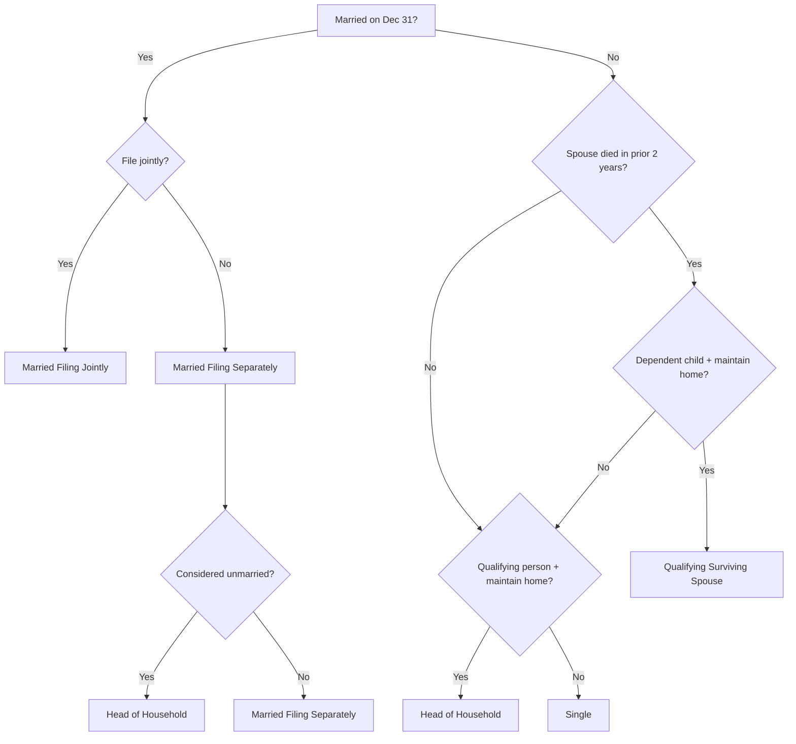

# Filing Status and Dependency

## Introduction

A taxpayer's filing status is the gateway to nearly every tax computation — it determines the applicable tax brackets, standard deduction amount, eligibility for credits, and phase-out thresholds. Under **IRC §1**, five filing statuses exist, each with distinct requirements and benefits. Because filing status also depends on whether the taxpayer has **dependents** (as defined under **IRC §152**), the dependency rules are inextricably linked to the filing-status determination.

This page provides a dedicated, focused treatment of filing status and dependency. For broader coverage of gross income categories and filing thresholds, see the [Gross Income](./gross-income.md) page.

---

## Determining Marital Status — The December 31 Rule

Marital status is determined on the **last day of the taxable year** (December 31 for calendar-year taxpayers).

| Situation | Marital Status |
|---|---|
| Married on December 31 | Married (even if separated but not divorced) |
| Divorce finalized on or before December 31 | Unmarried |
| Legal separation under a decree of separate maintenance | Unmarried |
| Spouse dies during the year | Married for that year (may file jointly) |
| Annulment | Unmarried retroactively (must amend prior joint returns) |

:::info

An **interlocutory decree** (i.e., a divorce that is not yet final) does **not** make a taxpayer unmarried. The decree must be final by December 31.

:::

---

## The Five Filing Statuses

### 1. Married Filing Jointly (MFJ)

MFJ offers the widest tax brackets and the largest standard deduction. Both spouses report **all** income and deductions on a single return, and both are **jointly and severally liable** for the tax.

| Element | 2024 Approximate Amount |
|---|---|
| Standard deduction | \$29,200 |
| Top of 12% bracket | \$94,050 |

**Requirements:**
- Married on December 31 **or** surviving spouse filing for the year of death.
- Both spouses must agree to file jointly (both must sign the return).
- Neither spouse may be a nonresident alien at any time during the year (unless both elect to treat the NRA as a resident under IRC §6013(g)).

> **Example:** Bear Co. employee Jordan marries Alex on December 30, 2024. Despite being married for only two days, Jordan and Alex may file MFJ for the entire 2024 tax year.

:::warning

Joint and several liability means **each spouse** is responsible for the **entire** tax due, not just their share. Relief may be available under IRC §6015 (innocent spouse relief).

:::

### 2. Qualifying Surviving Spouse (QSS)

QSS allows a surviving spouse to use the same brackets and standard deduction as MFJ for **two years** following the year of the spouse's death.

**Requirements:**
1. Spouse died in one of the **two preceding** tax years.
2. Taxpayer has **not remarried** before the close of the current tax year.
3. Taxpayer maintains a household that is the principal residence of a **dependent child** (qualifying child) for the entire year.
4. Taxpayer paid more than half the cost of maintaining the household.

> **Example:** Kingfisher Industries' CFO, Maria, lost her spouse in March 2023. For 2023, Maria files MFJ (year of death). For 2024 and 2025, she qualifies as QSS if she maintains a home for her dependent son and does not remarry.

:::tip[Exam Tip]

QSS is available only for **two years** after the year of death. In the year of death itself, the surviving spouse files MFJ (not QSS).

:::

### 3. Head of Household (HoH)

HoH provides wider brackets and a larger standard deduction than Single or MFS.

| Element | 2024 Approximate Amount |
|---|---|
| Standard deduction | \$21,900 |
| Top of 12% bracket | \$63,100 |

**Three requirements:**

1. **Unmarried** (or "considered unmarried") on December 31.
2. **Paid more than half** the cost of maintaining a home for the year.
3. A **qualifying person** lived with the taxpayer for more than half the year.

#### Costs of Maintaining a Home

Qualifying costs include rent, mortgage interest, property taxes, insurance, repairs, utilities, and food consumed on the premises. They do **not** include clothing, education, medical care, vacations, or life insurance.

#### Qualifying Persons for HoH

| Qualifying Person | Must Live with Taxpayer? |
|---|---|
| Qualifying child (unmarried) | Yes — more than half the year |
| Married qualifying child claimed as dependent | Yes — more than half the year |
| Qualifying relative who is the taxpayer's **parent** | **No** — taxpayer must pay > 50% of parent's household costs |
| Qualifying relative (other than parent) | Yes — more than half the year |

:::caution

A **boyfriend/girlfriend** who lives with the taxpayer all year may be a qualifying relative for dependency purposes, but they are **not** a qualifying person for HoH. The person must be **related** to the taxpayer.

:::

#### "Considered Unmarried" Rules

A **married** taxpayer can qualify as HoH if **all** of the following are met:

1. Filed a **separate** return (not MFJ).
2. Paid more than half the cost of maintaining the home for the year.
3. Spouse did **not** live in the home during the **last six months** of the year.
4. Home was the principal residence of a **qualifying child** for more than half the year.
5. The taxpayer can claim the child as a dependent (or could claim the child but for a custody agreement releasing the exemption to the other parent).

> **Example:** MAS Inc. marketing director Robin is married but has lived apart from spouse Casey since March 1. Robin maintains the family home for their daughter for the entire year and pays 100% of the household costs. Because Casey was absent for the last six months, Robin is "considered unmarried" and qualifies as HoH.

### 4. Single

The default filing status for unmarried taxpayers who do not qualify for HoH or QSS.

| Element | 2024 Approximate Amount |
|---|---|
| Standard deduction | \$14,600 |
| Top of 12% bracket | \$47,150 |

### 5. Married Filing Separately (MFS)

Either spouse may elect MFS. This status has the **narrowest** tax brackets and forfeits many deductions and credits.

**Consequences of MFS:**
- Standard deduction is half of MFJ (\$14,600 for 2024).
- Cannot claim the Earned Income Credit, Child and Dependent Care Credit (in most cases), or education credits.
- If one spouse itemizes, the other **must** itemize as well.
- Social Security benefits may be up to 85% taxable regardless of income.
- Capital loss deduction limited to \$1,500 (vs. \$3,000 for other statuses).
- Phase-outs for many credits begin at lower income levels.

:::note

MFS can still be advantageous when one spouse has **large medical expenses** (the 7.5% AGI floor is easier to exceed with a lower individual AGI) or to limit liability exposure.

:::

---

## Filing Status Selection Flowchart

---

## Dependency and Its Relationship to Filing Status

Claiming a dependent does **not** provide a personal exemption deduction (the exemption amount is \$0 for 2018–2025 under TCJA), but dependency status controls eligibility for:

- **Head of Household** filing status
- **Qualifying Surviving Spouse** filing status
- **Child Tax Credit** (IRC §24)
- **Earned Income Credit** (IRC §32)
- **Child and Dependent Care Credit** (IRC §21)
- **Education credits** (IRC §25A)

For the detailed qualifying child (CARES test) and qualifying relative tests, see [Gross Income — Dependency Exemptions](./gross-income.md#dependency-exemptions).

### Key Dependency Rules Affecting Filing Status

| Rule | Impact on Filing Status |
|---|---|
| A dependent who files a joint return with their spouse generally cannot be claimed | May disqualify HoH for the taxpayer |
| A qualifying child must be younger than the taxpayer | A sibling of the same age cannot be a qualifying child |
| Tiebreaker rules (IRC §152(c)(4)) | When two taxpayers can claim the same child, the tiebreaker applies (parent > non-parent; higher AGI parent wins) |
| Custodial parent may release claim via Form 8332 | Non-custodial parent gets CTC but custodial parent retains HoH, EIC, and dependent care credit |

:::warning

When a **custodial parent** signs Form 8332 releasing the dependency exemption to the non-custodial parent, the custodial parent **still** qualifies for HoH and the Earned Income Credit. The non-custodial parent receives only the Child Tax Credit.

:::

---

## Impact of Filing Status on Deductions, Credits, and Phase-Outs

| Provision | How Filing Status Matters |
|---|---|
| Standard deduction | Varies by status: MFJ \$29,200 → Single \$14,600 → MFS \$14,600 (2024) |
| Child Tax Credit phase-out | MFJ begins at \$400,000 AGI; all others at \$200,000 |
| Earned Income Credit | Not available for MFS |
| Student loan interest deduction | Not available for MFS |
| IRA deduction phase-outs | Different MAGI ranges for each status |
| Adoption credit | Not available for MFS |
| Net Investment Income Tax (3.8%) | MFJ threshold \$250,000; Single/HoH \$200,000; MFS \$125,000 |
| Capital loss deduction | \$3,000 limit (\$1,500 for MFS) |

---

## Common Exam Scenarios and Traps

> **Scenario 1:** Illini Entertainment employee Pat is unmarried and supports her 70-year-old mother who lives in a separate apartment. Pat pays 100% of her mother's rent and living expenses. **Filing status:** HoH — a dependent parent **need not** live with the taxpayer.

> **Scenario 2:** Gies Co. accountant Sam's spouse died in November 2023. Sam has no children. In 2024, Sam is **Single** — QSS requires a dependent child.

> **Scenario 3:** Bear Co. employee Dana is married but separated (no divorce decree). Dana maintained a home for a dependent child and spouse moved out on May 15. **Filing status:** MFS (not HoH) — the spouse must have been absent for the **last six months**, and May 15 to December 31 is more than six months, but the standard requires the spouse to not live in the home during the last six months. Since the spouse left May 15, they were in the home for parts of June. If the spouse left June 30 or earlier, the last six months (July–December) would be satisfied.

> **Scenario 4:** Illini Security payroll manager Lee is unmarried with no dependents. Lee's adult brother (age 30, earning \$50,000) lives with Lee. **Filing status:** Single — the brother's gross income exceeds the qualifying relative threshold and he does not meet the qualifying child age test.

---

## Summary

| Filing Status | Marital Requirement | Dependent Requirement | Standard Deduction (2024) | Key Advantage |
|---|---|---|---|---|
| **MFJ** | Married on Dec 31 | None | \$29,200 | Widest brackets; most credits available |
| **QSS** | Spouse died within prior 2 years | Dependent child in home | \$29,200 | MFJ brackets for 2 years after death |
| **HoH** | Unmarried or considered unmarried | Qualifying person | \$21,900 | Better brackets than Single |
| **Single** | Unmarried | None | \$14,600 | Default for unmarried, no dependents |
| **MFS** | Married on Dec 31 | None | \$14,600 | Limits liability; helps with medical deduction |
