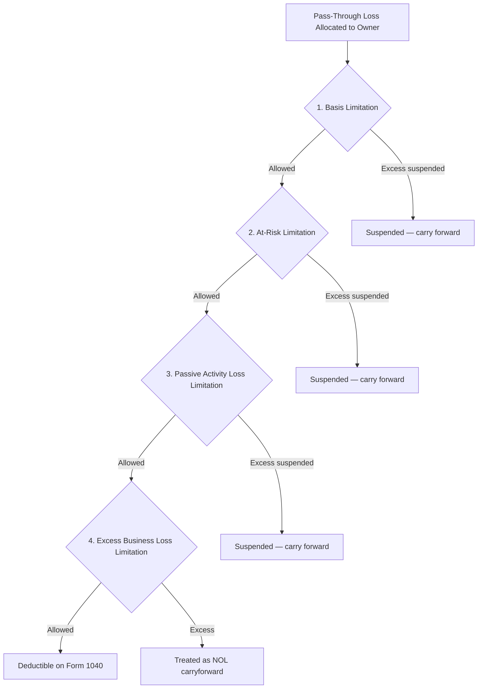

# Loss Limitations

## Introduction

While the tax code generally allows taxpayers to deduct losses, several provisions limit the **timing** and **amount** of losses an individual may claim. These limitations prevent taxpayers from sheltering other income with economic losses they have not truly borne or with activities that lack a profit motive. The major loss-limitation regimes are found in **IRC §1211** (capital losses), **IRC §465** (at-risk), **IRC §469** (passive activities), **IRC §461(l)** (excess business losses), **IRC §183** (hobby losses), and **IRC §1091** (wash sales).

Mastering the **ordering rules** for pass-through entity losses is one of the highest-yield topics on the CPA exam REG section.

---

## Capital Loss Limitations

### Netting Capital Gains and Losses

Capital gains and losses are first netted within their **holding-period group**, then netted across groups.

| Step | Procedure |
|---|---|
| 1 | Net all **short-term** capital gains and losses → Net Short-Term Capital Gain (Loss) |
| 2 | Net all **long-term** capital gains and losses → Net Long-Term Capital Gain (Loss) |
| 3 | If one group is a net gain and the other is a net loss, offset them against each other |

> **Example:** Gies Co. employee Pat has the following 2024 transactions: STCG \$8,000, STCL (\$3,000), LTCG \$2,000, LTCL (\$10,000). Step 1: Net ST = \$5,000 gain. Step 2: Net LT = (\$8,000) loss. Step 3: Net overall = (\$3,000) capital loss.

### Annual Deduction Limit

| Filing Status | Maximum Capital Loss Deduction Against Ordinary Income |
|---|---|
| Single, MFJ, HoH, QSS | **\$3,000** per year |
| Married Filing Separately | **\$1,500** per year |

:::info
Net capital losses exceeding the annual limit are **carried forward indefinitely** and retain their character (short-term or long-term). There is no carryback for individual capital losses.
:::

### Ordering of Capital Loss Carryforwards

When applied in a future year, carryforward losses are combined with that year's gains and losses in the netting process. Short-term carryforwards remain short-term; long-term carryforwards remain long-term.

---

## Pass-Through Entity Loss Limitations — The Four Hurdles

Losses from partnerships and S corporations must clear **four sequential hurdles** before they can reduce a taxpayer's other income. The order matters — a loss stopped at an earlier hurdle never reaches the next one.

### Hurdle 1: Basis Limitation

A taxpayer cannot deduct losses in excess of their **tax basis** in the entity.

| Entity | Basis Includes |
|---|---|
| **S corporation** (stock basis) | Initial investment + income allocations + additional contributions − distributions − loss allocations |
| **Partnership** (outside basis) | Same as S corp **plus** the partner's share of entity **liabilities** (a critical difference) |

:::warning
Partnership basis includes the partner's share of **recourse and nonrecourse liabilities**, but S corporation basis does **not** include entity-level debt. S corp shareholders may increase basis through **direct loans** from the shareholder to the corporation, but not through third-party loans to the entity.
:::

> **Example:** Bear Co. shareholder Lee invested \$50,000 in an S corporation and has received no distributions. The S corp allocates a \$70,000 loss to Lee. Lee may deduct only \$50,000 (basis limitation). The remaining \$20,000 is suspended and carried forward indefinitely until Lee restores basis.

### Hurdle 2: At-Risk Limitation (IRC §465)

After the basis test, the deductible loss is further limited to the amount the taxpayer has **at risk** in the activity.

**At-risk amount** generally includes:
- Cash and the adjusted basis of property contributed
- Amounts borrowed for use in the activity for which the taxpayer is **personally liable**
- Amounts borrowed secured by property **not used in the activity**
- Qualified nonrecourse financing (real estate only)

:::note
**Nonrecourse debt** generally does **not** increase the at-risk amount (except qualified nonrecourse financing in real estate activities). This is another common exam distinction between basis and at-risk.
:::

### Hurdle 3: Passive Activity Loss Limitation (IRC §469)

Losses from **passive activities** can only offset **passive income**. An activity is passive if the taxpayer does not **materially participate**.

#### Material Participation — Seven Tests (Reg. §1.469-5T)

A taxpayer materially participates if they satisfy **any one** of the following:

| Test | Description |
|---|---|
| 1 | More than **500 hours** of participation during the year |
| 2 | Taxpayer's participation constitutes **substantially all** of the participation |
| 3 | More than **100 hours** and not less than any other individual |
| 4 | Activity is a **significant participation activity** and aggregate participation in all SPAs exceeds 500 hours |
| 5 | Materially participated in **any 5 of the prior 10** tax years |
| 6 | Activity is a **personal service activity** and taxpayer participated in any 3 prior years |
| 7 | Based on all facts and circumstances, taxpayer participated on a **regular, continuous, and substantial** basis (must be > 100 hours) |

:::tip Exam Tip
The **500-hour test** (Test 1) is the most commonly tested. If a question states the taxpayer "worked full-time" or "devoted 600 hours," material participation is met.
:::

#### Special \$25,000 Rental Real Estate Allowance

Under IRC §469(i), individuals who **actively participate** in rental real estate may deduct up to **\$25,000** of passive rental losses against nonpassive income.

| Condition | Rule |
|---|---|
| AGI ≤ \$100,000 | Full \$25,000 allowance |
| AGI \$100,000–\$150,000 | Reduced by 50% of excess over \$100,000 |
| AGI > \$150,000 | No allowance |
| MFS (lived together) | No allowance |

> **Example:** Illini Security employee Sam actively participates in a rental property and has a \$30,000 rental loss with AGI of \$120,000. The allowance is reduced by 50% × (\$120,000 − \$100,000) = \$10,000, leaving a \$15,000 allowance. Sam deducts \$15,000 and suspends \$15,000.

#### Disposition of Passive Activity

When a taxpayer makes a **fully taxable disposition** of an entire passive activity to an unrelated party, **all suspended losses** from that activity are released and become deductible.

### Hurdle 4: Excess Business Loss Limitation (IRC §461(l))

After passing through the first three hurdles, aggregate net business losses exceeding a **threshold amount** are disallowed and treated as a net operating loss (NOL) carryforward.

| Filing Status | 2024 Threshold (Indexed) |
|---|---|
| Single / HoH | ~\$305,000 |
| MFJ | ~\$610,000 |

> **Example:** Kingfisher Industries partner Morgan has \$800,000 of net business losses (after basis, at-risk, and passive limitations) and files MFJ. The excess business loss disallowed is \$800,000 − \$610,000 = \$190,000, which becomes an NOL carryforward.

---

## Hobby Loss Rules (IRC §183)

If an activity is **not engaged in for profit**, losses are not deductible against other income.

### Nine Factors for Profit Motive

The IRS considers these factors (no single factor is determinative):

1. Manner in which the activity is carried on (businesslike?)
2. Expertise of the taxpayer or advisors
3. Time and effort expended
4. Expectation of asset appreciation
5. Success in similar activities
6. History of income or losses
7. Amount of occasional profits
8. Financial status of the taxpayer
9. Elements of personal pleasure or recreation

:::info
A **presumption of profit motive** exists if the activity is profitable in **3 of the last 5 years** (2 of 7 years for horse breeding/racing). This is a rebuttable presumption — the IRS can still challenge the activity.
:::

### Hobby Income and Expense Treatment (Post-TCJA)

| Item | Treatment |
|---|---|
| **Hobby income** | Fully taxable as other income (Form 1040, Schedule 1) |
| **Hobby expenses** | **Not deductible** (TCJA suspended miscellaneous itemized deductions through 2025) |

> **Example:** MAS Inc. controller Alex breeds show dogs as a hobby, earning \$8,000 in puppy sales and incurring \$15,000 in expenses. Alex must report \$8,000 as income but may deduct **\$0** of the expenses, resulting in \$8,000 of taxable income from the hobby.

:::caution
Before TCJA, hobby expenses were deductible as miscellaneous itemized deductions (subject to the 2% AGI floor) up to the amount of hobby income. Under TCJA (2018–2025), they are **completely nondeductible**.
:::

---

## Wash Sale Rule (IRC §1091)

A **wash sale** occurs when a taxpayer sells or trades a security at a loss and acquires **substantially identical** securities within **30 days before or after** the sale.

| Rule | Detail |
|---|---|
| **Window** | 61-day total period (30 days before + sale date + 30 days after) |
| **Effect** | Loss is **disallowed** |
| **Basis adjustment** | Disallowed loss is added to the basis of the replacement security |
| **Holding period** | Tacks — the holding period of the old security carries over |

> **Example:** On November 10, Bear Co. employee Jordan sells 100 shares of XYZ Corp. stock for a \$4,000 loss. On November 28, Jordan repurchases 100 shares of XYZ Corp. for \$6,000. The \$4,000 loss is disallowed under the wash sale rule, and Jordan's basis in the new shares is \$6,000 + \$4,000 = **\$10,000**.

:::tip Exam Tip
The wash sale rule applies only to **losses**, not gains. Also, it does not apply to sales of securities held in a **trade or business** by a dealer.
:::

---

## Personal-Use Asset Losses

Losses on the sale of **personal-use property** (e.g., personal residence, personal automobile, personal jewelry) are **never deductible**.

| Property Type | Gain Treatment | Loss Treatment |
|---|---|---|
| Personal-use | Taxable (capital gain) | **Not deductible** |
| Investment | Taxable (capital gain) | Deductible (capital loss) |
| Business | Taxable (§1231 / ordinary) | Deductible (§1231 / ordinary) |

> **Example:** Illini Entertainment employee Taylor sells a personal boat for \$5,000 that originally cost \$20,000. The \$15,000 loss is **nondeductible**. If instead Taylor sold it for \$25,000, the \$5,000 gain would be taxable as a capital gain.

---

## Net Operating Loss (NOL) Rules for Individuals

When total deductions exceed gross income, the individual has a **net operating loss**.

### Post-TCJA NOL Rules (2021 and Later)

| Rule | Detail |
|---|---|
| **Carryback** | Generally **no carryback** (limited exceptions for farming losses) |
| **Carryforward** | **Indefinite** carryforward |
| **Limitation** | NOL deduction limited to **80%** of taxable income (before NOL deduction) |
| **Ordering** | NOLs from pre-2018 years (unlimited) are used before post-2017 NOLs (80% limited) |

> **Example:** Gies Co. consultant Morgan has a 2024 NOL carryforward of \$100,000. In 2025, Morgan has \$80,000 of taxable income before the NOL deduction. The NOL deduction is limited to 80% × \$80,000 = **\$64,000**. The remaining \$36,000 carries forward to 2026.

:::warning
The 80% limitation does **not** apply to NOLs arising in tax years beginning **before January 1, 2018**. Those older NOLs can offset 100% of taxable income. This creates a complex ordering computation when a taxpayer has both pre-2018 and post-2017 NOLs.
:::

---

## Summary

| Loss Limitation | IRC Section | Key Rule |
|---|---|---|
| **Capital losses** | §1211 | \$3,000 annual limit (\$1,500 MFS); indefinite carryforward |
| **Basis limitation** | §1366 / §704 | Cannot deduct losses exceeding tax basis in entity |
| **At-risk limitation** | §465 | Limited to amounts personally at risk |
| **Passive activity losses** | §469 | Passive losses offset only passive income; \$25,000 rental exception |
| **Excess business loss** | §461(l) | Losses exceeding threshold become NOL carryforward |
| **Hobby losses** | §183 | No deduction for expenses; income is fully taxable |
| **Wash sale** | §1091 | Loss disallowed if substantially identical security acquired within 30 days |
| **Personal-use losses** | — | Never deductible |
| **Net operating loss** | §172 | 80% of taxable income limit; indefinite carryforward |
