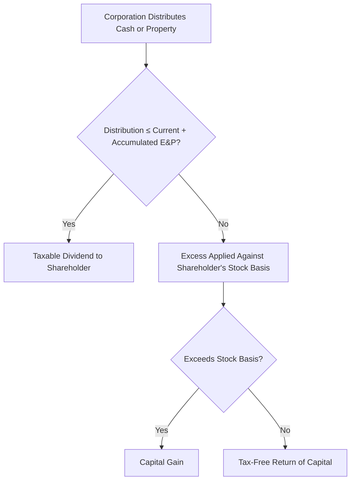

# C Corporations

## Introduction

C corporations are taxed as **separate entities** under Subchapter C of the Internal Revenue Code. Unlike pass-through entities, a C corporation pays tax at the entity level, and shareholders are taxed again when they receive distributions — the well-known **double taxation** problem. The TCP section of the CPA exam tests C corporation compliance at a deeper level than REG, focusing on net operating loss (NOL) and capital loss utilization, shareholder-corporation transactions (contributions, distributions, and loans), consolidated returns, and international tax issues. The emphasis is on calculating gains, losses, and basis — and understanding the tax consequences on both sides of each transaction.

---

## Net Operating Loss (NOL) Utilization

### NOL Computation and Carryforward

A C corporation generates an NOL when its allowable deductions exceed its gross income for the tax year. Under current rules, NOLs arising in tax years beginning after December 31, 2017 may be carried forward **indefinitely** but may only offset up to **80%** of taxable income in any future year.

| Rule | Detail |
|---|---|
| **Carryback** | Generally **no carryback** for NOLs arising after 2017 (limited exceptions for farming losses and certain insurance companies) |
| **Carryforward** | Indefinite carryforward |
| **Limitation** | NOL deduction limited to **80%** of taxable income (before the NOL deduction) in the carryforward year |

> **Example:** Bear Co. (a C corporation) has a \$500,000 NOL carryforward from 2023. In 2024, Bear Co. has taxable income of \$400,000 before the NOL deduction. The NOL deduction is limited to 80% × \$400,000 = **\$320,000**. Bear Co.'s 2024 taxable income is \$80,000, and the remaining \$180,000 NOL carries forward to 2025.

### Section 382 Limitation on Ownership Change

When a C corporation undergoes an **ownership change** (generally, a greater-than-50-percentage-point change in ownership by 5% shareholders over a three-year testing period), **IRC §382** limits the amount of pre-change NOLs that can be used annually.

| Component | Calculation |
|---|---|
| **Annual §382 limitation** | FMV of the loss corporation's stock immediately before the ownership change × the long-term tax-exempt rate |
| **Effect** | Pre-change NOLs can only offset income up to the §382 limitation per year |
| **Unused limitation** | May be carried forward to increase the limitation in a subsequent year |

:::warning

The §382 limitation can dramatically reduce the value of a corporation's NOL carryforwards after a merger, acquisition, or significant stock purchase. The exam may test whether a given transaction triggers an ownership change and how to calculate the annual limitation.

:::

---

## Capital Loss Utilization

C corporations have unique capital loss rules compared to individuals.

| Rule | C Corporation | Individual (for comparison) |
|---|---|---|
| **Capital losses offset** | Only **capital gains** — cannot offset ordinary income | Capital gains + up to \$3,000 of ordinary income |
| **Carryback** | **3 years** (carried back as short-term capital loss) | No carryback |
| **Carryforward** | **5 years** (carried forward as short-term capital loss) | Indefinite |

> **Example:** Gies Co. has \$200,000 of ordinary income and a \$50,000 net capital loss in 2024, with no capital gains. Gies Co. cannot use the capital loss to offset ordinary income. The \$50,000 capital loss is carried back 3 years (to 2021 first) to offset capital gains in those years. Any remaining loss is carried forward up to 5 years.

:::tip[Exam Tip]

Remember that C corporation capital losses carried back or forward are always treated as **short-term capital losses**, regardless of whether the original loss was short-term or long-term.

:::

---

## Transactions Between Shareholder and Corporation

### Contributions of Property (IRC §351)

When a shareholder transfers property to a corporation solely in exchange for stock and the transferor(s) are in **control** (80% or more) of the corporation immediately after the exchange, the transaction is **nonrecognition** under IRC §351.

| Element | Rule |
|---|---|
| **Control** | Transferor(s) must own ≥ 80% of total voting power and ≥ 80% of all other classes of stock immediately after the exchange |
| **Shareholder's basis in stock** | Adjusted basis of property transferred − boot received + gain recognized |
| **Corporation's basis in property** | Carryover basis from shareholder + gain recognized by shareholder |
| **Boot received** | Gain is recognized to the extent of boot received (but not in excess of realized gain) |

> **Example:** Jordan transfers equipment (FMV \$100,000, adjusted basis \$60,000) and \$10,000 cash to MAS Inc. in exchange for 100% of MAS Inc. stock plus \$15,000 cash (boot). Jordan's realized gain is \$100,000 + \$10,000 − \$60,000 − \$10,000 = \$40,000. Jordan recognizes gain equal to boot received: \$15,000. Jordan's basis in the stock: \$60,000 − \$15,000 + \$15,000 = \$60,000. MAS Inc.'s basis in the equipment: \$60,000 + \$15,000 = \$75,000.

#### Assumption of Liabilities

If the corporation assumes a liability of the contributing shareholder, the liability is generally treated as boot **only if** the total liabilities assumed exceed the total adjusted basis of all property transferred. In that case, the excess is recognized as gain.

:::caution

If a liability assumption lacks a bona fide business purpose or is motivated by tax avoidance, the **entire** amount of the liability is treated as boot under IRC §357(b), not just the excess.

:::

### Nonliquidating Distributions

A nonliquidating distribution from a C corporation is treated differently depending on whether the corporation has sufficient **Earnings and Profits (E&P)**.

| Layer | Tax Treatment to Shareholder |
|---|---|
| **1. Current and accumulated E&P** | **Dividend income** (ordinary income, potentially qualified) |
| **2. Return of basis** | **Tax-free** reduction of shareholder's stock basis |
| **3. Excess over basis** | **Capital gain** (long-term if stock held > 1 year) |

#### Distribution of Noncash Property

When a C corporation distributes appreciated property to a shareholder:

| Party | Tax Consequence |
|---|---|
| **Corporation** | Recognizes **gain** as if the property were sold at FMV (but does **not** recognize loss on depreciated property distributions) |
| **Shareholder** | Receives a distribution equal to the **FMV** of the property; taxed under the E&P ordering rules above |
| **Shareholder's basis in property** | **FMV** on the date of distribution |

> **Example:** Kingfisher Industries distributes land (FMV \$80,000, adjusted basis \$30,000) to shareholder Alex as a nonliquidating distribution. Kingfisher recognizes a \$50,000 gain. Alex receives an \$80,000 distribution taxed as a dividend to the extent of E&P. Alex's basis in the land is \$80,000.

### Cash Distributions in Excess of E&P

When a corporation's accumulated and current E&P are both exhausted, additional cash distributions are treated as a **return of capital** reducing the shareholder's stock basis. Once basis reaches zero, further distributions are **capital gain**.

> **Example:** Bear Co. distributes \$150,000 to sole shareholder Dana. Bear Co. has \$90,000 of current and accumulated E&P. Dana's stock basis is \$40,000. The first \$90,000 is a taxable dividend. The next \$40,000 reduces Dana's stock basis to zero. The remaining \$20,000 is capital gain.

### Liquidating Distributions

In a complete liquidation, the corporation distributes all assets and ceases to exist.

| Party | Tax Consequence |
|---|---|
| **Corporation** | Recognizes gain or loss as if it sold all assets at FMV (with certain limitations on loss recognition to related parties) |
| **Shareholder** | Treats the distribution as payment in exchange for stock — recognizes **capital gain or loss** (FMV of assets received − stock basis) |
| **Shareholder's basis in property received** | **FMV** on the date of distribution |

:::info

Under **IRC §332**, a parent corporation that owns ≥ 80% of a subsidiary recognizes **no gain or loss** on a complete liquidation of the subsidiary. The parent takes a **carryover basis** in the subsidiary's assets. This is a key exception to the general liquidation rules.

:::

### Loans Between Corporation and Shareholder

Loans between a C corporation and its shareholders must reflect **arm's-length terms** to avoid recharacterization.

| Issue | Consequence |
|---|---|
| **Below-market loan from corporation to shareholder** | IRS may impute interest under IRC §7872; imputed interest is compensation (employee-shareholder) or a distribution (non-employee shareholder) |
| **Shareholder loan to corporation lacks debt characteristics** | IRS may recharacterize the loan as an equity contribution — interest payments become nondeductible dividends |
| **Thin capitalization** | Excessive debt-to-equity ratio may cause the IRS to treat debt as equity |

Factors that support **bona fide debt** treatment:

- Written promissory note with a stated maturity date
- Reasonable interest rate
- Fixed repayment schedule
- Arm's-length terms comparable to third-party lending
- Debt-to-equity ratio within reasonable limits

---

## Consolidated Tax Returns

### Filing Requirements

An **affiliated group** of corporations may elect to file a consolidated Form 1120. Once elected, the group must continue filing on a consolidated basis unless the group terminates or the IRS grants permission to discontinue.

| Requirement | Detail |
|---|---|
| **Common parent** | Must own directly ≥ 80% of the voting power and ≥ 80% of the value of at least one includible corporation |
| **Affiliated group** | A chain of includible corporations connected through ≥ 80% stock ownership with a common parent |
| **Excluded corporations** | Tax-exempt organizations, foreign corporations, REITs, RICs, S corporations, and certain others are **not** includible |
| **Election** | All members must consent; the election is binding |

### Consolidated Taxable Income

Consolidated taxable income is computed by combining the separate taxable incomes of all group members, with adjustments for **intercompany transactions**.

| Adjustment | Treatment |
|---|---|
| **Intercompany sales of inventory** | Defer profit until the buying member sells to an outside party |
| **Intercompany sales of depreciable property** | Defer gain; recognize as the buying member depreciates the asset |
| **Intercompany dividends** | **Eliminated** — 100% dividends-received deduction within the group |
| **Intercompany interest** | Income to the lending member and expense to the borrowing member — **netted** in consolidation |

> **Example:** Bear Co. (parent) sells inventory to its 100%-owned subsidiary for \$200,000 (cost basis \$150,000). On the consolidated return, the \$50,000 intercompany profit is **deferred** until the subsidiary resells the inventory to a third party.

:::tip[Exam Tip]

Consolidated return questions typically test your ability to eliminate intercompany transactions. Focus on the concept of deferral — the gain is not permanently eliminated, only deferred until a transaction with an outside party occurs.

:::

---

## International Tax Issues

### Income Sourcing

The source of income (U.S. or foreign) determines which country has the primary right to tax that income.

| Income Type | Source Rule |
|---|---|
| **Compensation for services** | Where the services are **performed** |
| **Rental and royalty income** | Where the property is **located or used** |
| **Interest income** | **Residence** of the payor |
| **Dividend income** | **Country of incorporation** of the paying corporation |
| **Sale of inventory** | Where **title passes** (or based on production activities for property produced in one country and sold in another) |
| **Sale of personal property (non-inventory)** | **Residence** of the seller |

### Foreign Corporation with U.S. Operations — Withholding

A foreign corporation earning certain types of U.S.-source income that is not effectively connected with a U.S. trade or business is subject to a **30% withholding tax** (FDAP — Fixed, Determinable, Annual, or Periodic income), which may be reduced by treaty.

| Income Type | Treatment |
|---|---|
| **Effectively connected income (ECI)** | Taxed on a **net basis** at regular U.S. corporate rates |
| **FDAP income** (dividends, interest, rents, royalties) | Subject to **30% gross-basis withholding** (or lower treaty rate) |

### Controlled Foreign Corporations (CFCs)

A **Controlled Foreign Corporation** is a foreign corporation in which U.S. shareholders (each owning ≥ 10% by vote or value) collectively own more than **50%** by vote or value.

| Concept | Rule |
|---|---|
| **U.S. shareholder** | U.S. person owning ≥ 10% of total voting power or value |
| **CFC threshold** | > 50% owned by U.S. shareholders |
| **Subpart F income** | Certain types of passive and mobile income are included in the U.S. shareholder's income **currently**, regardless of distribution |
| **GILTI** | Global Intangible Low-Taxed Income — U.S. shareholders must include their pro rata share of CFC income exceeding a deemed return on tangible assets |

:::warning

Subpart F income and GILTI inclusions mean a U.S. parent corporation cannot indefinitely defer tax on a CFC's earnings by simply not distributing them. The TCP exam tests understanding of **when** CFC income must be recognized by the U.S. shareholder.

:::

### Permanent Establishment

A **permanent establishment (PE)** is a concept from tax treaties that determines when a foreign enterprise's activities in a country are sufficient to subject it to taxation in that country. Common examples of PEs include:

- A fixed place of business (office, factory, branch)
- A construction site exceeding a specified duration
- An agent who habitually concludes contracts on behalf of the enterprise

Without a PE, a foreign corporation's business profits are generally not taxable in the host country.

### Foreign Branch vs. Foreign Subsidiary

| Feature | Foreign Branch | Foreign Subsidiary |
|---|---|---|
| **Legal status** | Extension of the U.S. parent — not a separate legal entity | Separate legal entity incorporated in the foreign country |
| **Tax treatment** | Income and losses included **directly** on the U.S. parent's return | Separate taxpayer; income generally not taxed in U.S. until distributed (except Subpart F/GILTI) |
| **Loss utilization** | Foreign branch losses reduce U.S. taxable income **currently** | Subsidiary losses do **not** flow through to the U.S. parent |
| **Foreign tax credits** | Available for taxes paid by the branch | Available for taxes deemed paid on dividends received (indirect credit) |

> **Example:** Illini Entertainment operates in Country X through a branch. The branch earns \$1,000,000 and pays \$150,000 in foreign taxes. Illini includes the \$1,000,000 on its U.S. return and claims a foreign tax credit for the \$150,000. If instead Illini had formed a subsidiary, the \$1,000,000 would not be included on Illini's return unless distributed as a dividend or included as Subpart F/GILTI income.

### Calculating U.S. and Foreign Source Income

The allocation of income between U.S. and foreign sources is essential for computing the **foreign tax credit limitation**, which caps the credit at:

$$\text{FTC Limitation} = \text{U.S. Tax} \times \frac{\text{Foreign Source Taxable Income}}{\text{Worldwide Taxable Income}}$$

:::info

The foreign tax credit limitation prevents a corporation from using foreign taxes to offset U.S. tax on U.S.-source income. Excess credits can be carried back 1 year and forward 10 years.

:::

---

## Summary

| Topic | Key Concept |
|---|---|
| NOL carryforward | Indefinite carryforward; limited to 80% of taxable income; no carryback (post-2017) |
| §382 limitation | Ownership change limits annual use of pre-change NOLs to FMV × long-term tax-exempt rate |
| Capital losses | Offset capital gains only; 3-year carryback, 5-year carryforward (as STCL) |
| §351 contributions | Nonrecognition if ≥ 80% control; shareholder substituted basis; corporation carryover basis + gain recognized |
| Nonliquidating distributions | Dividend (to extent of E&P) → return of basis → capital gain |
| Property distributions | Corporation recognizes gain (not loss); shareholder takes FMV basis |
| Liquidating distributions | Corporation recognizes gain/loss; shareholder has capital gain/loss (FMV − stock basis) |
| Shareholder loans | Must be arm's-length; below-market loans trigger imputed interest; thin capitalization risk |
| Consolidated returns | ≥ 80% affiliated group; eliminate intercompany transactions; defer intercompany profit |
| Income sourcing | Rules vary by income type (services → where performed; dividends → country of incorporation) |
| CFC/Subpart F/GILTI | U.S. shareholders include certain CFC income currently, regardless of distribution |
| Foreign branch vs. subsidiary | Branch income included directly; subsidiary income deferred until distribution or inclusion |
| Foreign tax credit | Limited to U.S. tax × (foreign source income / worldwide income) |
