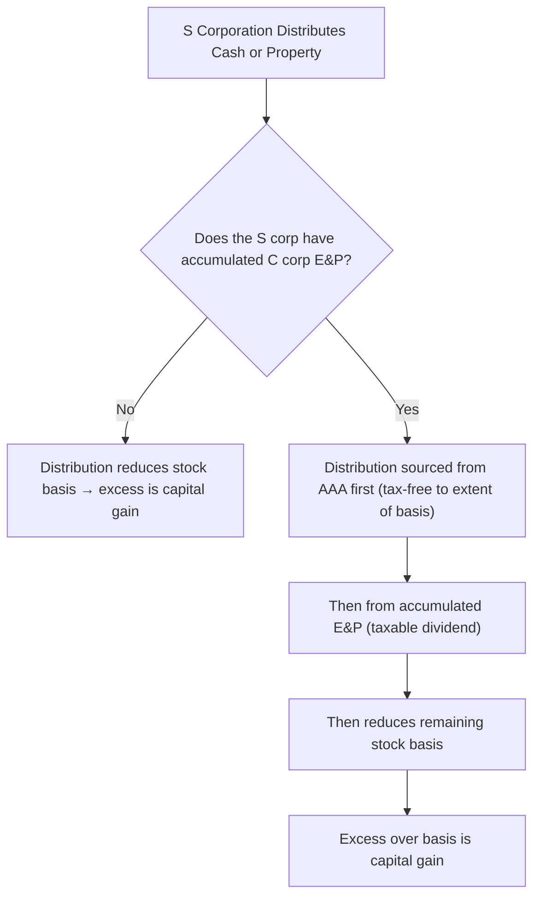

# S Corporations

## Introduction

An S corporation is a corporation that has elected pass-through tax treatment under **Subchapter S** of the Internal Revenue Code. Income, losses, deductions, and credits flow through to shareholders on **Schedule K-1** and are reported on their individual returns. While REG covers the fundamentals of S corporation taxation, the TCP exam goes deeper — testing your ability to calculate shareholder stock and debt basis, trace the impact of contributions, distributions, and loans on basis, and determine the tax consequences of transactions between an S corporation and its shareholders.

---

## Eligibility Requirements

Before diving into basis and transactions, recall the requirements that a corporation must meet to elect and maintain S status:

| Requirement | Detail |
|---|---|
| **Domestic corporation** | Must be organized in the U.S. |
| **Eligible shareholders** | Individuals, estates, certain trusts, and tax-exempt organizations — **no** partnerships, corporations, or nonresident aliens |
| **Maximum shareholders** | **100** shareholders (members of a family treated as one shareholder) |
| **One class of stock** | Only one class of stock allowed (differences in voting rights are permitted) |
| **Tax year** | Must use a calendar year (or a fiscal year with a valid business purpose, or §444 election) |

:::info

An S corporation files **Form 1120-S** as an information return. The entity generally does not pay federal income tax — income flows through to shareholders.

:::

---

## Basis of Shareholder's Interest

### Stock Basis

A shareholder's **stock basis** is the foundation for determining the deductibility of losses, the tax treatment of distributions, and the gain or loss on disposition of the stock.

#### Stock Basis Adjustments

Stock basis is adjusted annually in a specific order:

| Step | Adjustment | Direction |
|---|---|---|
| 1 | Contributions of cash or property | **Increase** |
| 2 | All income items (ordinary + separately stated, including tax-exempt income) | **Increase** |
| 3 | Nondeductible expenses that are not chargeable to capital (e.g., 50% meals disallowance, penalties, expenses related to tax-exempt income) | **Decrease** |
| 4 | Distributions (nondividend) | **Decrease** |
| 5 | Losses and deductions (ordinary + separately stated) | **Decrease** |

:::caution

The **ordering** of adjustments matters. Income items increase basis **before** distributions reduce it, ensuring that current-year income can be distributed tax-free. Losses are applied **last** — stock basis cannot go below **zero**.

:::

#### Contributions of Noncash Property

When a shareholder contributes noncash property to an S corporation:

| Scenario | Shareholder's Impact | Corporation's Basis |
|---|---|---|
| **§351 applies** (≥ 80% control) | Substituted basis in stock (adjusted basis of property − liabilities assumed + gain recognized) | Carryover basis from shareholder + gain recognized |
| **§351 does not apply** | Recognize gain or loss; basis in stock = FMV of property transferred | FMV basis |

If the corporation assumes liabilities in a §351 exchange, the assumption is treated as a distribution of money to the shareholder for basis purposes — it **reduces** the shareholder's stock basis.

> **Example:** Jordan contributes equipment (FMV \$80,000, adjusted basis \$50,000, subject to a \$20,000 liability) to Bear Co. (an S corporation) in a §351 exchange. Jordan's stock basis = \$50,000 (property basis) − \$20,000 (liability assumed) = **\$30,000**. Bear Co.'s basis in the equipment is \$50,000 (carryover).

#### Impact of Operations on Stock Basis

Each year, the shareholder adjusts stock basis for their **pro rata share** of the S corporation's items:

| Item | Effect on Stock Basis |
|---|---|
| Ordinary business income | Increase |
| Separately stated income items (capital gains, interest, etc.) | Increase |
| Tax-exempt income | Increase |
| Ordinary business loss | Decrease |
| Separately stated loss/deduction items | Decrease |
| Nondeductible, noncapital expenses | Decrease |
| Distributions | Decrease |

> **Example:** Alex owns 100% of MAS Inc. (S corporation). At the start of Year 1, Alex's stock basis is \$75,000. During Year 1, MAS Inc. has ordinary income of \$40,000, tax-exempt interest of \$2,000, a charitable contribution of \$5,000, and distributes \$30,000 to Alex.

| Adjustment | Amount |
|---|---|
| Beginning stock basis | \$75,000 |
| + Ordinary income | +\$40,000 |
| + Tax-exempt income | +\$2,000 |
| − Nondeductible expenses (none in this example) | \$0 |
| − Distribution | −\$30,000 |
| − Charitable contribution (separately stated deduction) | −\$5,000 |
| **Ending stock basis** | **\$82,000** |

### Debt Basis

Unlike partnerships, an S corporation shareholder **does not** receive basis from the entity's third-party debt. A shareholder only gets **debt basis** from **direct loans** made by the shareholder to the corporation.

| Source of Debt | Effect on Shareholder Basis |
|---|---|
| **Corporation borrows from a bank** | **No effect** on shareholder's basis (even if shareholder guarantees the loan) |
| **Shareholder loans funds directly to the corporation** | Creates **debt basis** equal to the face amount of the loan |
| **Shareholder guarantees corporate debt and makes payment** | Increases debt basis only when the shareholder **actually makes payment** under the guarantee |

:::warning

This is a critical distinction from partnerships. A partner's basis includes their share of entity-level liabilities (recourse and nonrecourse). An S corporation shareholder's basis includes **only** direct shareholder-to-corporation loans. A loan guarantee alone does **not** create debt basis until the shareholder makes an economic outlay.

:::

#### Using Debt Basis to Deduct Losses

When a shareholder's stock basis is reduced to zero, losses can be deducted against **debt basis** — but only to the extent of that debt basis.

| Step | Rule |
|---|---|
| 1 | Deduct losses against **stock basis** first (reduce to zero) |
| 2 | Deduct remaining losses against **debt basis** (reduce to zero) |
| 3 | Any remaining losses are **suspended** and carried forward indefinitely |

#### Restoring Debt Basis

Once debt basis has been reduced by losses, it must be **restored** before the shareholder recognizes income from loan repayments.

| Event | Treatment |
|---|---|
| Net income in a subsequent year | Restores **debt basis first**, then increases stock basis |
| Corporation repays loan while debt basis is below face amount | Shareholder recognizes **gain** to the extent the repayment exceeds the reduced debt basis |

> **Example:** Dana holds stock in Gies Co. (S corporation) with a stock basis of \$10,000 and a debt basis of \$25,000 (from a direct loan). Gies Co. allocates a \$30,000 loss to Dana. The first \$10,000 reduces stock basis to zero. The next \$20,000 reduces debt basis to \$5,000. If Gies Co. repays the full \$25,000 loan next year (before any net income), Dana recognizes a **\$20,000 gain** (\$25,000 repayment − \$5,000 debt basis).

### Reviewing Stock and Debt Basis Schedules

The TCP Blueprint includes a representative task requiring candidates to review shareholder basis schedules for accuracy. Common errors to identify:

| Common Error | What to Check |
|---|---|
| Including entity-level debt in shareholder basis | S corp shareholders get basis only from **direct loans** |
| Including a loan guarantee as debt basis | Guarantee creates basis only when **payment is made** |
| Applying losses before income adjustments | Income must be applied **before** distributions and losses |
| Failing to restore debt basis before stock basis | Net income restores **debt basis first** |
| Distributing in excess of stock basis without recognizing gain | Excess distributions are **capital gain** |

:::tip[Exam Tip]

Simulation questions may present a completed basis schedule with embedded errors. Work through the adjustments in the correct order: (1) income, (2) nondeductible expenses, (3) distributions, (4) losses. Verify that debt basis is from direct loans only and that loan repayments are tested against reduced debt basis.

:::

---

## Transactions Between Shareholder and S Corporation

### Contributions of Noncash Property

Contributions to an S corporation follow the same **IRC §351** rules as C corporations — if the transferor(s) control ≥ 80% of the corporation immediately after the exchange, the transaction is generally nonrecognition.

| Element | Rule |
|---|---|
| **Shareholder gain/loss** | No gain or loss recognized (unless boot received or liabilities exceed basis) |
| **Shareholder's stock basis** | Adjusted basis of property − boot received − liabilities assumed + gain recognized |
| **Corporation's basis in property** | Carryover basis + gain recognized by shareholder |

> **Example:** Sam contributes land (FMV \$120,000, adjusted basis \$70,000) to Kingfisher Industries (S corporation) for 100% of the stock. No boot is received. Sam's stock basis = \$70,000. Kingfisher's basis in the land = \$70,000.

### Nonliquidating Distributions

S corporation distributions follow a different framework than C corporation distributions because S corporations may have an **Accumulated Adjustments Account (AAA)**.

| Source of Distribution | Tax Treatment |
|---|---|
| **AAA** (from S corporation operations) | Tax-free to extent of stock basis; excess is capital gain |
| **Accumulated E&P** (from prior C corporation years) | **Taxable dividend** |
| **Remaining stock basis** | Tax-free return of capital |
| **Excess over basis** | **Capital gain** |

:::info

Most S corporations that have always been S corporations have **no accumulated E&P** — distributions simply reduce stock basis, and any excess is capital gain. The AAA/E&P ordering becomes relevant only for corporations that converted from C to S status with accumulated E&P.

:::

#### Distribution of Noncash Property

When an S corporation distributes appreciated property:

| Party | Tax Consequence |
|---|---|
| **S corporation** | Recognizes **gain** as if the property were sold at FMV (gain flows through to shareholders) |
| **Shareholder** | Receives a distribution equal to **FMV** of property; taxed under the ordering rules above |
| **Shareholder's basis in property** | **FMV** on the date of distribution |

> **Example:** Bear Co. (S corporation, 100% owned by Jordan) distributes equipment with FMV of \$45,000 and adjusted basis of \$20,000. Bear Co. recognizes a \$25,000 gain, which flows through to Jordan (increasing stock basis by \$25,000). The \$45,000 distribution then reduces Jordan's stock basis.

### Liquidating Distributions

In a complete liquidation of an S corporation:

| Party | Tax Consequence |
|---|---|
| **S corporation** | Recognizes gain or loss on all assets as if sold at FMV |
| **Shareholder** | Treats the distribution as payment in exchange for stock — **capital gain or loss** (FMV of assets received − stock basis) |
| **Shareholder's basis in property received** | **FMV** on the date of distribution |

### Allocation of Income/Loss After Sale of Ownership Interest

When an S corporation shareholder sells their stock during the year, the corporation's income and loss must be allocated between the selling and purchasing shareholders.

| Method | Description |
|---|---|
| **Per-day allocation** (default) | Income and loss allocated based on the number of days each shareholder owned the stock during the year |
| **Interim closing of the books** (elective) | Requires consent of all affected shareholders; income and loss allocated based on actual results in each period |

> **Example:** Illini Entertainment (S corporation with \$365,000 of ordinary income for the year) has one shareholder, Marcus, who sells 100% of his stock to Pat on July 1 (day 182). Under the per-day method: Marcus is allocated 181/365 × \$365,000 = **\$181,000**; Pat is allocated 184/365 × \$365,000 = **\$184,000**.

---

## Summary

| Topic | Key Concept |
|---|---|
| Stock basis adjustments | Income → nondeductible expenses → distributions → losses (in that order); cannot go below zero |
| Noncash contributions | §351 applies if ≥ 80% control; substituted basis for shareholder; carryover basis for corporation |
| Debt basis | Only from **direct shareholder loans** — not entity debt, not guarantees (until payment) |
| Loss deduction ordering | Stock basis first → debt basis second → excess suspended indefinitely |
| Debt basis restoration | Net income restores debt basis **first**, then stock basis |
| Distributions (no E&P) | Reduce stock basis; excess is capital gain |
| Distributions (with C corp E&P) | AAA first (tax-free) → accumulated E&P (dividend) → stock basis → capital gain |
| Property distributions | S corp recognizes gain (flows through); shareholder takes FMV basis |
| Liquidating distributions | S corp recognizes gain/loss; shareholder has capital gain/loss |
| Income allocation on sale | Default is per-day; elective interim closing of books requires consent |
