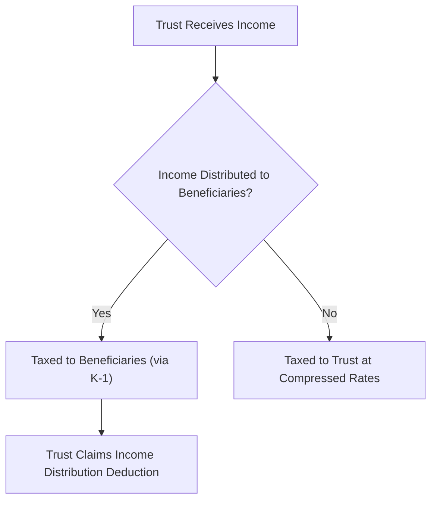

# Trusts

## Introduction

A trust is a legal arrangement in which a **grantor** transfers property to a **trustee**, who holds and manages it for the benefit of one or more **beneficiaries**. For federal income tax purposes, trusts are generally **pass-through entities** — income that is distributed or required to be distributed to beneficiaries is taxed at the beneficiary level, while income retained by the trust is taxed at the trust level. The TCP exam tests your ability to distinguish among types of trusts, understand the roles of the parties involved, and calculate **accounting income**, **distributable net income (DNI)**, and **taxable income** — including the income distribution deduction that connects the trust and its beneficiaries.

---

## Types of Trusts

### Simple Trusts

A **simple trust** meets all three of the following requirements:

| Requirement | Description |
|---|---|
| 1. **Distributes all income currently** | The trust instrument requires that all fiduciary accounting income be distributed to beneficiaries each year |
| 2. **No charitable contributions** | The trust does not make distributions for charitable purposes |
| 3. **No distributions of corpus** | The trust does not distribute principal (corpus) during the year |

If any of these requirements is violated in a given year, the trust is treated as a **complex trust** for that year.

:::info

A trust can be a simple trust in one year and a complex trust in another. The classification is determined **annually** based on the trust instrument and actual activity during the year.

:::

### Complex Trusts

A **complex trust** is any trust that is **not** a simple trust. This includes trusts that:

- Accumulate income (do not distribute all income currently)
- Make charitable contributions
- Distribute corpus (principal) to beneficiaries

| Feature | Simple Trust | Complex Trust |
|---|---|---|
| **Income distribution** | Must distribute all income currently | May accumulate income |
| **Charitable contributions** | Not permitted | Permitted |
| **Corpus distributions** | Not permitted | Permitted |
| **Personal exemption** | **\$300** | **\$100** |

### Grantor Trusts

A **grantor trust** is a trust in which the grantor retains certain powers or interests that cause the trust's income, deductions, and credits to be taxed directly to the **grantor** (not the trust or its beneficiaries). The trust is essentially disregarded for income tax purposes.

Common powers that trigger grantor trust status include:

| Power or Interest | IRC Section |
|---|---|
| Power to **revoke** the trust | §676 |
| Power to control **beneficial enjoyment** | §674 |
| Certain **administrative powers** (e.g., power to deal with trust assets for less than adequate consideration) | §675 |
| **Reversionary interest** exceeding 5% of the trust corpus | §673 |
| Income payable to or accumulated for the **grantor or grantor's spouse** | §677 |

:::tip[Exam Tip]

When you see a trust described as a "grantor trust" on the exam, the key takeaway is simple: **all income is taxed to the grantor**. The trust itself does not owe tax, and the beneficiaries are not taxed on trust income. The trust files Form 1041 but reports zero taxable income.

:::

### Revocable Trusts

A **revocable trust** is the most common type of grantor trust. The grantor retains the power to alter, amend, or revoke the trust during their lifetime.

| Feature | Treatment |
|---|---|
| **During grantor's lifetime** | Treated as a grantor trust — all income taxed to the grantor |
| **At grantor's death** | Becomes **irrevocable**; assets receive a step-up in basis; trust begins functioning as a separate taxpayer (simple or complex, depending on terms) |
| **Estate planning benefit** | Avoids probate; does **not** reduce the gross estate for estate tax purposes |

### The Trust as a Pass-Through Entity

For non-grantor trusts (simple and complex), the trust functions as a **conduit** — income distributed to beneficiaries is taxed at the beneficiary level, and income retained is taxed at the trust level.

### Key Roles

| Role | Description |
|---|---|
| **Grantor** | Person who creates and funds the trust by transferring property |
| **Trustee** | Person or institution responsible for managing trust assets and making distributions according to the trust instrument |
| **Beneficiary** | Person or entity entitled to receive income or corpus from the trust |
| **Corpus (principal)** | The body of trust assets — property originally transferred to the trust plus undistributed capital gains (generally) |

:::warning

Trust tax rates are **highly compressed** — the highest marginal rate (37%) is reached at a much lower income level than for individuals. This creates a strong incentive to distribute income to beneficiaries who may be in lower tax brackets, making the income distribution deduction a critical planning and compliance concept.

:::

---

## Income and Deductions

### Fiduciary Accounting Income

**Fiduciary accounting income** (also called **trust accounting income** or simply **accounting income**) is determined by the trust instrument and applicable state law — it is **not** the same as taxable income. It determines what amounts are available for distribution to income beneficiaries.

| Item | Typically Included in Accounting Income | Typically Allocated to Corpus |
|---|---|---|
| Interest income | ✓ | |
| Dividend income | ✓ | |
| Rental income | ✓ | |
| Capital gains | | ✓ (unless trust instrument allocates to income) |
| Stock splits | | ✓ |
| Trustee fees | Allocated between income and corpus (or as specified in trust instrument) | Allocated between income and corpus |
| Depreciation | Allocated between income and corpus | Allocated between income and corpus |
| Tax-exempt interest | ✓ | |

:::info

The allocation between income and corpus is governed by the **trust instrument first**, then by state law (usually the Uniform Principal and Income Act). Capital gains are almost always allocated to **corpus** unless the trust instrument states otherwise. This distinction is critical for computing DNI.

:::

> **Example:** The Bear Family Trust receives \$60,000 of interest income, \$20,000 of dividend income, and a \$35,000 long-term capital gain during the year. The trust instrument allocates capital gains to corpus and requires all income to be distributed to beneficiary Dana. Accounting income = \$60,000 + \$20,000 = **\$80,000**. The \$35,000 capital gain is allocated to corpus.

### Distributable Net Income (DNI)

**Distributable Net Income (DNI)** is the most important concept in trust taxation. It serves three functions:

1. **Caps the income distribution deduction** — the trust's deduction for distributions cannot exceed DNI
2. **Caps the amount taxable to beneficiaries** — beneficiaries are not taxed on more than their share of DNI
3. **Determines the character of income** — distributions carry out a proportionate share of each type of income in DNI

#### DNI Calculation

| Step | Adjustment |
|---|---|
| Start with | Trust's **taxable income** (before the income distribution deduction) |
| **Add back** | Personal exemption (\$300 for simple trusts, \$100 for complex trusts) |
| **Add** | Tax-exempt interest (net of allocable expenses) |
| **Subtract** | Capital gains allocated to **corpus** (unless they are distributed or required to be distributed) |
| **Add** | Capital losses allocated to corpus (net against capital gains first) |
| = | **Distributable Net Income (DNI)** |

:::tip[Exam Tip]

The key adjustment to remember: capital gains allocable to **corpus** are generally **excluded** from DNI (because they are not distributed to beneficiaries). Tax-exempt income is **included** in DNI (because it affects the character of distributions) but is then removed when calculating the income distribution deduction.

:::

> **Example:** The Gies Family Trust has the following items:

| Item | Amount |
|---|---|
| Interest income | \$50,000 |
| Dividend income | \$30,000 |
| Long-term capital gain (allocated to corpus) | \$25,000 |
| Tax-exempt interest | \$10,000 |
| Trustee fees (allocated \$8,000 to income, \$2,000 to corpus) | \$10,000 |
| Personal exemption (complex trust) | \$100 |

**DNI calculation:**

Taxable income before the distribution deduction is computed **excluding** tax-exempt interest from gross income. Trustee fees must be reduced by the portion allocable to tax-exempt income (that portion is nondeductible). For simplicity, assume \$1,000 of the \$10,000 in fees is allocable to tax-exempt income.

| Step | Amount |
|---|---|
| Taxable income before distribution deduction: \$50,000 + \$30,000 + \$25,000 − \$9,000 (deductible fees) − \$100 (exemption) = | \$95,900 |
| + Personal exemption | +\$100 |
| + Tax-exempt interest (net of allocable expenses: \$10,000 − \$1,000) | +\$9,000 |
| − Capital gains allocated to corpus | −\$25,000 |
| **DNI** | **\$80,000** |

### Income Distribution Deduction

The **income distribution deduction** is the mechanism by which the trust avoids double taxation — it deducts the income that flows through to beneficiaries.

| Trust Type | Income Distribution Deduction |
|---|---|
| **Simple trust** | Equal to DNI (but excluding tax-exempt income allocated to the distribution) |
| **Complex trust** | Lesser of: (1) actual distributions or amounts required to be distributed, or (2) DNI — both reduced by tax-exempt income |

### Taxable Income of the Trust

$$\text{Trust Taxable Income} = \text{Gross Income} - \text{Deductions} - \text{Income Distribution Deduction} - \text{Personal Exemption}$$

For a **simple trust** that distributes all income, the taxable income is typically limited to capital gains allocated to corpus (since all other income flows through to beneficiaries via the income distribution deduction).

> **Example:** Using the Bear Family Trust from above — accounting income of \$80,000 is distributed to Dana. The income distribution deduction equals DNI (excluding tax-exempt income). If DNI is \$80,000 and tax-exempt income in DNI is \$9,000, the income distribution deduction = \$80,000 − \$9,000 = **\$71,000**. The trust's taxable income includes the \$35,000 capital gain (allocated to corpus and not distributed) minus fees allocable to corpus and the exemption.

### Character of Distributions to Beneficiaries

Distributions from a trust carry out a **proportionate share** of each type of income in DNI. This preserves the character of income at the beneficiary level.

| Income Type in DNI | Proportion |
|---|---|
| Taxable interest | Interest / total DNI |
| Dividends | Dividends / total DNI |
| Tax-exempt interest | Tax-exempt / total DNI |
| Rental income | Rental / total DNI |

> **Example:** If the Gies Family Trust distributes \$60,000 to beneficiary Sam and DNI is \$80,000 (composed of \$50,000 interest, \$21,000 dividends, and \$9,000 tax-exempt interest), Sam's distribution carries out:
> - Interest: \$60,000 × (\$50,000 / \$80,000) = **\$37,500**
> - Dividends: \$60,000 × (\$21,000 / \$80,000) = **\$15,750**
> - Tax-exempt interest: \$60,000 × (\$9,000 / \$80,000) = **\$6,750**

Sam includes \$37,500 + \$15,750 = **\$53,250** in taxable income and excludes the \$6,750 of tax-exempt interest.

### Specific Deduction Rules for Trusts

| Deduction | Rule |
|---|---|
| **Trustee fees** | Allocated between income and corpus per trust instrument or state law; the portion allocable to tax-exempt income is **not deductible** |
| **Charitable contributions** | Deductible **without AGI limitations** if paid from gross income and authorized by the trust instrument |
| **Depreciation** | Allocated between the trust and beneficiaries based on accounting income allocated to each |
| **Tax-exempt income expenses** | Expenses allocable to tax-exempt income are **not deductible** (similar to the individual rule) |

---

## Summary

| Topic | Key Concept |
|---|---|
| Simple trust | Must distribute all income currently; no charitable contributions; no corpus distributions; \$300 exemption |
| Complex trust | May accumulate income, make charitable contributions, or distribute corpus; \$100 exemption |
| Grantor trust | Income taxed to the grantor; trust disregarded for income tax purposes |
| Revocable trust | Grantor trust during lifetime; becomes irrevocable at death; avoids probate |
| Accounting income | Determined by trust instrument and state law; capital gains usually allocated to corpus |
| DNI | Taxable income + exemption + tax-exempt interest − capital gains to corpus; caps distribution deduction and beneficiary inclusion |
| Income distribution deduction | Prevents double taxation; limited to DNI (less tax-exempt income) |
| Trust taxable income | Gross income − deductions − distribution deduction − exemption |
| Character of distributions | Pro rata share of each income type in DNI flows through to beneficiaries |
| Trust tax rates | Highly compressed brackets — strong incentive to distribute income to lower-bracket beneficiaries |
