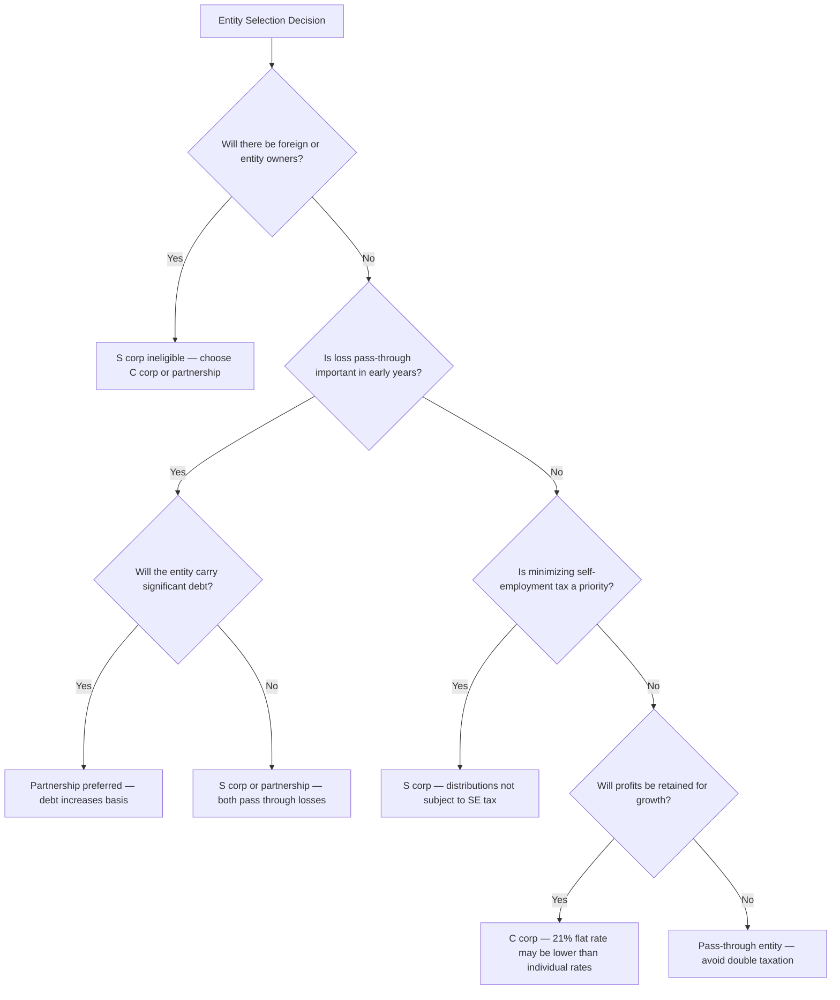

# Formation and Liquidation of Business Entities

## Introduction

Choosing the right business entity is one of the most consequential tax planning decisions a CPA advises on. The TCP exam tests your ability to **compare the tax implications of formation and liquidation across entity types** — C corporations, S corporations, and partnerships — and to identify which structure best fits a given set of facts. Unlike REG, which tests the mechanics of each entity in isolation, TCP requires you to analyze multiple entity types side by side, evaluate the tax cost of converting between structures, and recommend the optimal choice for a client's situation.

This page covers the entity selection decision framework, the tax consequences of forming each entity type with noncash property contributions, and the tax consequences of liquidating each entity type — always with an eye toward **comparative analysis** across structures.

---

## Entity Selection Decision Framework

### Legal Characteristics of Entity Types

The CPA exam may present a set of legal characteristics and ask you to identify the entity type. Understanding the distinguishing features is the starting point for entity selection.

| Characteristic | C Corporation | S Corporation | Partnership (General/LP/LLC) |
|---|---|---|---|
| **Liability protection** | Shareholders protected | Shareholders protected | General partners exposed; limited partners / LLC members protected |
| **Number of owners** | Unlimited | Maximum 100 | Minimum 2 (except single-member LLC treated as disregarded entity) |
| **Eligible owners** | Any person or entity | Individuals, estates, certain trusts, tax-exempt orgs — **no** nonresident aliens, partnerships, or corporations | Any person or entity |
| **Classes of equity** | Multiple classes of stock allowed | **One class of stock** (voting differences permitted) | Flexible — multiple classes of interests allowed |
| **Entity-level tax** | Yes — **double taxation** (entity + shareholder) | Generally no (exceptions: built-in gains tax, excess passive income tax) | No |
| **Pass-through of losses** | No — losses trapped at entity level | Yes — limited by stock and debt basis, at-risk, and passive activity rules | Yes — limited by outside basis, at-risk, and passive activity rules |
| **Self-employment tax** | Salary subject to FICA; distributions not subject to SE tax | Reasonable salary subject to FICA; distributions not subject to SE tax | General partners and active LLC members subject to SE tax on distributive share |
| **Basis from entity debt** | No | Only from **direct shareholder loans** | Yes — recourse and nonrecourse debt increase partner's outside basis |

:::tip[Exam Tip]

When the exam presents a scenario with multiple owners including a foreign investor, an S corporation is immediately eliminated (nonresident aliens cannot be S corporation shareholders). When the scenario involves an owner who wants to deduct entity-level debt against personal losses, a partnership is the best choice.

:::

### Key Decision Factors

---

## Tax Implications of Entity Formation

### C Corporation Formation (IRC §351)

A transfer of property to a C corporation in exchange for stock qualifies for **nonrecognition** under IRC §351 if the transferor(s) are in **control** (≥ 80% of voting power and ≥ 80% of all other classes of stock) immediately after the exchange.

| Element | Rule |
|---|---|
| **Control test** | Transferor(s) must own ≥ 80% immediately after the exchange |
| **Shareholder's stock basis** | Adjusted basis of property transferred − boot received + gain recognized |
| **Corporation's basis in property** | Carryover basis from shareholder + gain recognized by shareholder |
| **Boot received** | Gain recognized to the extent of boot (cash, other property, or excess liabilities), but not in excess of realized gain |
| **Loss recognition** | **Never** recognized in a §351 exchange — even if FMV < adjusted basis |

> **Example:** Bear Co. is formed as a C corporation. Jordan contributes equipment (FMV \$200,000, adjusted basis \$80,000) for 100% of Bear Co. stock. The §351 requirements are met. Jordan recognizes **no gain**. Jordan's stock basis = \$80,000. Bear Co.'s basis in the equipment = \$80,000 (carryover).

#### Assumption of Liabilities in Formation

| Scenario | Treatment |
|---|---|
| Liabilities assumed ≤ total basis of property transferred | No gain recognized; liabilities reduce shareholder's stock basis |
| **Liabilities assumed > total basis** of property transferred | Excess is recognized as gain (IRC §357(c)) |
| Liability assumption lacks business purpose / tax avoidance motive | **Entire** liability treated as boot (IRC §357(b)) |

> **Example:** Gies Co. is formed as a C corporation. Sam contributes land (FMV \$300,000, adjusted basis \$100,000, subject to a \$130,000 mortgage) for 100% of stock. Liabilities (\$130,000) exceed basis (\$100,000) by \$30,000. Sam recognizes \$30,000 of gain. Sam's stock basis = \$100,000 − \$130,000 + \$30,000 = **\$0**. Gies Co.'s basis in the land = \$100,000 + \$30,000 = **\$130,000**.

### S Corporation Formation

S corporation formation follows the **same §351 rules** as C corporation formation — the transaction is identical at the formation stage. The S election is a **separate** step filed on Form 2553.

| Timing | Rule |
|---|---|
| **New corporation** | S election must be filed within 75 days of formation (or by the 15th day of the 3rd month of the tax year) |
| **Existing C corporation** | S election effective for the following tax year if filed after the 2-month-and-15-day window |

:::info

From a **formation tax perspective**, there is no difference between forming a C corporation and forming an S corporation. The §351 analysis is identical. The distinction arises in ongoing operations (pass-through vs. entity-level tax) and in distributions and liquidation.

:::

### Partnership Formation (IRC §721)

A contribution of property to a partnership in exchange for a partnership interest is generally a **nonrecognition** event under IRC §721.

| Element | Rule |
|---|---|
| **Partner's outside basis** | Adjusted basis of property contributed + cash contributed − liabilities assumed by partnership (partner's relief) + partner's share of partnership liabilities |
| **Partnership's inside basis** | **Carryover basis** from contributing partner |
| **Holding period** | Tacks the contributing partner's holding period for capital and §1231 assets |
| **Gain recognition** | Only if liability relief exceeds the partner's basis in all contributed property |
| **Loss recognition** | **Never** recognized on contribution |

> **Example:** Illini Entertainment is formed as a partnership. Alex contributes equipment (FMV \$150,000, adjusted basis \$90,000, subject to a \$60,000 liability) for a 50% interest. Dana contributes cash of \$90,000 for a 50% interest.

| Calculation — Alex | Amount |
|---|---|
| Adjusted basis of equipment | \$90,000 |
| − Liability relief (100% assumed by partnership) | −\$60,000 |
| + Alex's share of partnership liabilities (50% × \$60,000) | +\$30,000 |
| **Alex's outside basis** | **\$60,000** |

| Calculation — Dana | Amount |
|---|---|
| Cash contributed | \$90,000 |
| + Dana's share of partnership liabilities (50% × \$60,000) | +\$30,000 |
| **Dana's outside basis** | **\$120,000** |

No gain is recognized because Alex's net liability relief (\$30,000) does not exceed the adjusted basis of the contributed property (\$90,000).

### Comparative Formation Analysis

| Factor | C Corporation (§351) | S Corporation (§351) | Partnership (§721) |
|---|---|---|---|
| **Nonrecognition** | Yes, if ≥ 80% control | Yes, if ≥ 80% control | Yes — no control requirement |
| **Control requirement** | ≥ 80% voting + value | ≥ 80% voting + value | **None** |
| **Basis to entity** | Carryover + gain recognized | Carryover + gain recognized | Carryover |
| **Basis to owner** | Substituted basis | Substituted basis | Adjusted basis ± liability adjustments |
| **Boot triggers gain** | Yes — gain to extent of boot | Yes — gain to extent of boot | Only if net liability relief > basis |
| **Flexibility** | Must meet strict §351 control test | Must meet strict §351 control test | Very flexible — almost any contribution qualifies |
| **Services for equity** | Income to service provider; no deduction to corporation | Income to service provider; no deduction to corporation | Income to service partner (FMV of interest received) |

:::warning

The **control requirement** is the most significant formation difference. A partnership formation under §721 has **no ownership threshold** — any contribution of property qualifies for nonrecognition. A corporate formation under §351 requires the transferor group to own ≥ 80% immediately after the exchange, which can fail when new investors are added.

:::

---

## Tax Implications of Entity Liquidation

### C Corporation Liquidation

A C corporation liquidation triggers **two levels of tax** — often the most expensive liquidation scenario.

| Level | Tax Consequence |
|---|---|
| **Corporate level** | Corporation recognizes gain or loss on all assets as if sold at FMV |
| **Shareholder level** | Shareholder recognizes capital gain or loss (FMV of assets received − stock basis) |
| **Shareholder's basis in property** | FMV on date of distribution |

> **Example:** Kingfisher Industries (C corporation) liquidates and distributes land (FMV \$500,000, adjusted basis \$200,000) to sole shareholder Dana (stock basis \$150,000). Kingfisher recognizes a \$300,000 corporate-level gain (taxed at 21%). Dana recognizes a \$350,000 capital gain (\$500,000 − \$150,000). **Total tax impact**: gain is taxed at both levels.

:::caution

Loss recognition is limited on distributions to **related parties** (> 50% shareholder). Losses on distributions of property that was contributed within the prior 5 years and declined in value may be disallowed entirely.

:::

#### Exception: IRC §332 Subsidiary Liquidation

When a **parent corporation** owns ≥ 80% of a subsidiary, the subsidiary's liquidation qualifies for nonrecognition under IRC §332:

| Party | Treatment |
|---|---|
| **Subsidiary** | No gain or loss recognized |
| **Parent** | No gain or loss recognized; takes **carryover basis** in subsidiary's assets |

### S Corporation Liquidation

An S corporation liquidation is economically similar to a C corporation liquidation in structure, but the **pass-through** nature changes the effective tax result.

| Level | Tax Consequence |
|---|---|
| **Entity level** | S corporation recognizes gain or loss on all assets as if sold at FMV — gain/loss **flows through** to shareholders |
| **Shareholder level** | Shareholder treats the distribution as payment in exchange for stock — capital gain or loss (FMV received − adjusted stock basis) |

> **Example:** MAS Inc. (S corporation, 100% owned by Jordan) liquidates. MAS Inc. has equipment (FMV \$180,000, adjusted basis \$100,000). The S corporation recognizes an \$80,000 gain, which flows through to Jordan (increasing stock basis by \$80,000). Jordan then receives \$180,000 in the liquidating distribution and recognizes capital gain equal to \$180,000 minus the adjusted stock basis.

:::info

Because the entity-level gain flows through and increases stock basis, the **shareholder-level capital gain is reduced** compared to a C corporation liquidation. There is effectively only **one level of tax** on the gain — a significant advantage over C corporation liquidation.

:::

### Partnership Liquidation

Partnership liquidation follows the most **favorable** general rules:

| Rule | Treatment |
|---|---|
| **Entity level** | Partnership recognizes **no gain or loss** on liquidating distributions |
| **Partner — cash only** | Gain if cash exceeds outside basis; loss if cash (plus unrealized receivables and inventory) is less than outside basis |
| **Partner — property** | Generally no gain recognized; partner takes a basis in distributed property equal to remaining outside basis (after reducing for cash received) |

> **Example:** BIF Partners liquidates and distributes \$50,000 cash and land (inside basis \$80,000, FMV \$120,000) to partner Alex (outside basis \$140,000). Cash reduces Alex's outside basis to \$90,000. Alex's basis in the land = remaining outside basis = **\$90,000**. No gain or loss recognized.

:::tip[Exam Tip]

Partnership liquidation is generally the **most tax-efficient** because there is no entity-level gain recognition. The exam may test scenarios where this advantage drives the entity selection decision — particularly for businesses that plan to liquidate and distribute appreciated assets.

:::

### Comparative Liquidation Analysis

| Factor | C Corporation | S Corporation | Partnership |
|---|---|---|---|
| **Entity-level gain** | Yes — taxed at 21% | Yes — passes through to shareholders (no entity tax) | **No** entity-level gain |
| **Owner-level gain** | Capital gain (FMV − stock basis) | Capital gain (FMV − adjusted stock basis after flow-through) | Gain only if cash > outside basis |
| **Owner-level loss** | Capital loss (FMV − stock basis) | Capital loss | Loss only if receiving cash, receivables, and/or inventory with basis < outside basis |
| **Effective tax levels** | **Two** (corporate + shareholder) | **One** (flow-through to shareholder) | **One** (partner level only — and often deferred) |
| **Basis in distributed property** | FMV | FMV | Substituted basis (remaining outside basis) |
| **§332 exception** | Yes — parent/subsidiary nonrecognition | N/A | N/A |

---

## Planning Strategies for Entity Selection

### When to Choose Each Entity Type

| Scenario | Recommended Entity | Reason |
|---|---|---|
| **Startup expecting losses in early years with significant debt** | Partnership (or LLC taxed as partnership) | Losses pass through; entity debt increases partner basis for loss deduction |
| **Professional services firm seeking to minimize SE tax** | S corporation | Reasonable salary subject to FICA, but distributions avoid SE tax |
| **Business with foreign investors** | C corporation or partnership | S corporation ineligible; C corp provides liability protection |
| **Business planning to retain earnings for growth** | C corporation | 21% flat rate may be lower than individual marginal rates |
| **Business expecting to distribute appreciated property on exit** | Partnership | No entity-level gain on liquidating distributions |
| **Business needing flexible equity structure** | Partnership or C corporation | S corp limited to one class of stock |
| **Business planning an IPO** | C corporation | Standard structure for public companies; S corp shareholder limit (100) is impractical |

### Conversion Considerations

| Conversion | Key Tax Implication |
|---|---|
| **C corp → S corp** | Built-in gains tax applies for 5 years on appreciation that existed at conversion |
| **S corp → C corp** | No immediate tax; accumulated AAA can be distributed within post-termination transition period |
| **Partnership → C corp** | IRC §351 applies if control test met; gain recognized to extent of boot |
| **C corp → Partnership** | Treated as a **liquidation** of the C corp followed by contribution to partnership — triggers corporate-level and shareholder-level gain |

:::danger

Converting a C corporation to a partnership is the **most tax-costly** conversion because it is treated as a corporate liquidation — triggering two levels of tax on all built-in gains. This is a one-way door that should be carefully analyzed before proceeding.

:::

---

## Summary

| Topic | Key Concept |
|---|---|
| Entity characteristics | C corp has double taxation; S corp limited to 100 eligible shareholders and one class of stock; partnerships offer the most flexibility |
| C corp formation (§351) | Nonrecognition if ≥ 80% control; substituted basis for shareholder; carryover basis for corporation |
| S corp formation | Same §351 rules as C corp; S election is a separate step |
| Partnership formation (§721) | Nonrecognition with **no control requirement**; outside basis adjusted for liabilities |
| Liability assumption | C/S corp: gain if liabilities > basis (§357(c)); partnership: gain if net liability relief > basis |
| C corp liquidation | Two levels of tax — corporate gain + shareholder capital gain |
| S corp liquidation | One effective level — gain flows through and increases basis before shareholder-level computation |
| Partnership liquidation | No entity-level gain; partner gain only if cash > outside basis |
| Entity conversion | C corp → partnership is most costly (deemed liquidation); C corp → S corp triggers 5-year BIG tax window |
| Planning factors | Consider loss utilization, SE tax, debt basis, exit strategy, and owner eligibility |
