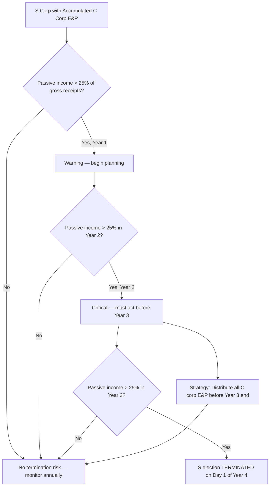

# Tax Planning for S Corporations

## Introduction

S corporation tax planning revolves around preserving the **pass-through tax advantage** while navigating the unique constraints of Subchapter S. The TCP exam tests your ability to calculate projected built-in gains (BIG) tax exposure on asset dispositions, evaluate the consequences of terminating the S election, analyze shareholder-level transactions (contributions, distributions, and loans), and plan distributions from the Accumulated Adjustments Account (AAA) versus accumulated Earnings and Profits (AEP). The focus is on **quantitative planning** — computing the tax impact of contemplated transactions and recommending the optimal approach.

This page builds on the S corporation compliance concepts covered in the Entity Tax Compliance section and focuses on strategies to **minimize taxes and preserve S election benefits**.

---

## Built-In Gains (BIG) Tax Planning

### Overview of the BIG Tax

When a C corporation converts to an S corporation, any **net unrealized built-in gain** (NUBIG) that existed at the conversion date is subject to the built-in gains tax under IRC §1374 if recognized within the **recognition period** (5 years after the S election becomes effective).

| Element | Rule |
|---|---|
| **NUBIG** | FMV of all assets − adjusted basis of all assets on the S election effective date |
| **Recognition period** | **5 years** from the first day of the first S corporation tax year |
| **Tax rate** | Highest corporate rate — currently **21%** |
| **Limitation** | BIG tax in any year is limited to the lesser of (1) recognized built-in gain for the year or (2) the corporation's taxable income as if it were a C corporation |
| **NOL offset** | Pre-conversion C corporation NOL carryforwards can offset recognized built-in gain |

:::warning

The BIG tax is an **entity-level tax** — one of the few taxes an S corporation pays directly. It effectively preserves the C corporation double-taxation result on appreciation that existed before the S election. The gain still flows through to shareholders (net of the BIG tax), so shareholders pay tax on the gain as well.

:::

### Calculating Built-In Gain on a Proposed Disposition

The exam may ask you to calculate the built-in gain on a specific asset disposition and the resulting BIG tax.

> **Example:** Bear Co. converted from a C corporation to an S corporation on January 1, 2022. At conversion, Bear Co. held the following assets:

| Asset | FMV at Conversion | Basis at Conversion | Built-In Gain |
|---|---|---|---|
| Land | \$400,000 | \$250,000 | \$150,000 |
| Equipment | \$180,000 | \$120,000 | \$60,000 |
| Inventory | \$70,000 | \$50,000 | \$20,000 |
| **NUBIG** | | | **\$230,000** |

On June 15, 2025 (within the 5-year recognition period), Bear Co. sells the land for \$450,000.

| Calculation | Amount |
|---|---|
| Sale price | \$450,000 |
| Basis at sale (assume same as conversion) | \$250,000 |
| Total gain on sale | \$200,000 |
| Built-in gain at conversion | \$150,000 |
| **Recognized built-in gain** (lesser of total gain or built-in gain) | **\$150,000** |
| BIG tax (21% × \$150,000) | **\$31,500** |

The remaining \$50,000 of gain (\$200,000 − \$150,000) represents post-conversion appreciation and is **not** subject to BIG tax. The entire \$200,000 gain (minus the \$31,500 BIG tax) flows through to shareholders.

### Strategies to Minimize BIG Tax

| Strategy | Description |
|---|---|
| **Wait out the recognition period** | Defer asset sales until after the 5-year period — built-in gain on assets sold after the period is not subject to BIG tax |
| **Use C corporation NOL carryforwards** | Pre-conversion NOLs offset recognized built-in gain dollar-for-dollar, reducing or eliminating BIG tax |
| **Sell low-BIG assets first** | Dispose of assets with minimal built-in gain during the recognition period; defer high-BIG asset sales |
| **Installment sales** | If gain is recognized on the installment method, BIG tax applies only to installments received within the recognition period |
| **Track NUBIG ceiling** | Cumulative recognized built-in gain cannot exceed NUBIG — once the ceiling is reached, no further BIG tax applies |

> **Example:** Gies Co. converted to S status with a NUBIG of \$500,000 and a C corporation NOL carryforward of \$200,000. In Year 2, Gies Co. sells an asset and recognizes \$300,000 of built-in gain. The NOL offsets \$200,000, leaving \$100,000 subject to BIG tax. BIG tax = 21% × \$100,000 = **\$21,000**. Remaining NUBIG ceiling = \$500,000 − \$300,000 = \$200,000.

:::tip[Exam Tip]

The exam frequently tests the interaction between the NUBIG ceiling and individual asset sales. Remember: the BIG tax on any single asset sale is limited to the **built-in gain in that specific asset at the conversion date** — not the total post-conversion gain. Additionally, cumulative recognized built-in gain across all years cannot exceed the original NUBIG.

:::

---

## S Election Termination Planning

### Events That Terminate the S Election

| Termination Event | Effective Date |
|---|---|
| **Voluntary revocation** (shareholders owning > 50% consent) | Effective on the date specified (or the first day of the following tax year if no date specified, or mid-year if specified) |
| **Ceasing to meet eligibility requirements** | Effective on the date the disqualifying event occurs (e.g., ineligible shareholder acquires stock) |
| **Excessive passive investment income** for 3 consecutive years (with accumulated C corp E&P) | Effective on the first day of the year following the third consecutive year |

### Tax Consequences of Termination

When an S election terminates mid-year, the corporation has an **S short year** and a **C short year** within the same tax year.

| Item | Treatment |
|---|---|
| **Income allocation** | Default is per-day allocation between the S and C short years; elective interim closing of the books requires consent of all shareholders |
| **S short year return** | Form 1120-S for the S period; income flows through to shareholders |
| **C short year return** | Form 1120 for the C period; income taxed at corporate level |
| **Re-election waiting period** | Generally cannot re-elect S status for **5 years** after termination (IRS may waive) |

:::caution

An **inadvertent termination** (e.g., an ineligible shareholder accidentally acquires stock) may be corrected under IRC §1362(f) if the corporation acts promptly to remedy the disqualifying event and the IRS determines the termination was not intentional. Planning should include shareholder agreements with transfer restrictions to prevent inadvertent terminations.

:::

### Planning Around Termination

| Strategy | Description |
|---|---|
| **Shareholder agreements** | Restrict stock transfers to eligible shareholders; include buy-sell provisions to prevent ineligible ownership |
| **Monitor passive income** | If the S corporation has accumulated C corp E&P, ensure passive investment income does not exceed 25% of gross receipts for 3 consecutive years |
| **Purge C corp E&P** | Distribute accumulated E&P to eliminate the passive income termination risk (see AEP distribution planning below) |
| **Timing of voluntary revocation** | If converting to C status, choose the effective date to minimize the overall tax burden (e.g., beginning of the tax year to avoid the complexity of a split year) |

---

## Shareholder Transaction Planning

### Contributions of Property

Post-formation contributions to an S corporation follow **IRC §351** rules (same as C corporations). The contributing shareholder(s) must have ≥ 80% control immediately after the exchange.

| Planning Consideration | Detail |
|---|---|
| **Appreciated property** | Defers gain; corporation takes carryover basis; future gain passes through to all shareholders (not just the contributor) |
| **Depreciated property** | Loss is **not recognized** — avoid contributing property with FMV < basis |
| **Liability assumption** | Reduces shareholder's stock basis; gain recognized if liabilities exceed basis of all contributed property |

:::info

Unlike a partnership where §704(c) allocates built-in gain back to the contributing partner, an S corporation has **no similar mechanism**. When appreciated property is contributed and later sold, the gain passes through to **all shareholders** based on ownership percentages. This can create inequitable results and should be considered in formation and post-formation planning.

:::

### Distribution Planning

#### S Corporation Without Accumulated E&P

For S corporations that have never been C corporations, distributions are straightforward:

| Distribution Layer | Tax Treatment |
|---|---|
| **Stock basis** | Tax-free return of capital (reduces stock basis) |
| **Excess over stock basis** | Capital gain |

#### S Corporation With Accumulated C Corp E&P (AAA vs. AEP)

When an S corporation has accumulated E&P from prior C corporation years, distributions follow a specific ordering:

| Priority | Source | Tax Treatment |
|---|---|---|
| 1 | **AAA** (Accumulated Adjustments Account) | Tax-free to extent of stock basis |
| 2 | **Accumulated E&P** | **Taxable dividend** |
| 3 | **Remaining stock basis** | Tax-free return of capital |
| 4 | **Excess** | Capital gain |

### AEP vs. AAA Distribution Election (IRC §1368(e)(3))

An S corporation with accumulated E&P may elect to **distribute from AEP first** (before AAA). This is the **deemed dividend election** — a critical planning tool.

| Approach | When to Use |
|---|---|
| **Default ordering (AAA first)** | When shareholders prefer tax-free distributions and want to preserve AEP for later distribution or purging |
| **Elect AEP first (§1368(e)(3))** | When the goal is to **purge accumulated E&P** to eliminate the passive investment income termination risk |

> **Example:** Illini Entertainment (S corporation) has AAA of \$200,000 and accumulated C corp E&P of \$80,000. The corporation distributes \$250,000 to sole shareholder Alex.

**Default ordering (AAA first):**

| Layer | Amount | Tax Treatment |
|---|---|---|
| AAA | \$200,000 | Tax-free (reduces stock basis) |
| Accumulated E&P | \$50,000 | Taxable dividend |
| **Total** | **\$250,000** | |

Remaining AEP = \$80,000 − \$50,000 = **\$30,000** (passive income risk continues).

**With §1368(e)(3) election (AEP first):**

| Layer | Amount | Tax Treatment |
|---|---|---|
| Accumulated E&P | \$80,000 | Taxable dividend |
| AAA | \$170,000 | Tax-free (reduces stock basis) |
| **Total** | **\$250,000** | |

Remaining AEP = **\$0** (passive income termination risk eliminated).

:::tip[Exam Tip]

The exam may present a scenario with an S corporation that has passive investment income approaching the 25% threshold and ask whether the §1368(e)(3) election should be made. The answer is almost always **yes** — the cost of dividend treatment on the E&P portion is far less than the cost of losing the S election. Calculate the tax cost of the dividend vs. the risk of termination.

:::

### Loan Planning

S corporation shareholders can increase their basis for loss deduction purposes through **direct loans** to the corporation.

| Approach | Effect on Basis |
|---|---|
| **Shareholder loans directly to S corp** | Creates **debt basis** — allows additional loss deductions beyond stock basis |
| **Shareholder guarantees third-party loan** | **No** debt basis until the shareholder makes an actual economic outlay |
| **Back-to-back loan** | Shareholder borrows from bank, then lends to S corp — creates debt basis (the shareholder has personal liability and makes a direct loan to the corporation) |

> **Example:** MAS Inc. (S corporation) allocates a \$120,000 loss to sole shareholder Jordan. Jordan's stock basis is \$50,000 and debt basis is \$0. Jordan can deduct only \$50,000 of the loss. If Jordan lends \$70,000 directly to MAS Inc. before year-end, Jordan's debt basis increases to \$70,000, allowing the full \$120,000 loss to be deducted (\$50,000 from stock basis + \$70,000 from debt basis).

:::warning

The **back-to-back loan** strategy requires genuine economic substance. The shareholder must borrow funds independently (creating personal liability) and then lend those funds directly to the S corporation. A loan from a bank directly to the corporation — even if guaranteed by the shareholder — does **not** create debt basis for the shareholder.

:::

#### Debt Basis Restoration and Loan Repayment

When an S corporation repays a shareholder loan after debt basis has been reduced by losses, the shareholder may recognize **gain** on the repayment.

| Scenario | Tax Consequence |
|---|---|
| Debt basis fully intact | Loan repayment is tax-free return of capital |
| Debt basis reduced by prior losses | Gain recognized to extent repayment exceeds reduced debt basis |
| Net income in subsequent year | Restores **debt basis first**, then increases stock basis |

> **Example:** Dana loaned \$50,000 to Kingfisher Industries (S corporation). Losses reduced Dana's debt basis to \$15,000. If Kingfisher repays the \$50,000 loan, Dana recognizes a **\$35,000 gain** (\$50,000 − \$15,000). If instead Kingfisher first allocates \$35,000 of income to Dana (restoring debt basis to \$50,000), the subsequent loan repayment is **tax-free**.

---

## Post-Termination Transition Period

### Distributions During the PTTP

After an S election terminates, there is a **post-termination transition period (PTTP)** — generally the 1-year period beginning on the termination date (plus any extended audit period).

| Rule | Treatment |
|---|---|
| **Cash distributions during PTTP** | Applied against **AAA** first — tax-free to the extent of remaining AAA and stock basis |
| **Suspended losses** | Shareholders can deduct suspended losses (from basis limitations) against stock basis during the PTTP |
| **After PTTP expires** | All distributions are treated under C corporation rules (dividend to extent of E&P) |

:::caution

The PTTP is a **limited window** for shareholders to extract remaining AAA tax-free and utilize suspended losses. Once it expires, the corporation is fully subject to C corporation distribution rules. Plan distributions and loss utilization immediately upon termination.

:::

---

## Comprehensive Planning Example

> **Example:** BIF Partners' owners are considering converting their C corporation to an S corporation. The C corporation has assets with FMV of \$2,000,000, adjusted basis of \$1,200,000 (NUBIG = \$800,000), accumulated E&P of \$300,000, and an NOL carryforward of \$150,000. The owners want to sell the business in 6 years.

| Planning Decision | Analysis |
|---|---|
| **BIG tax exposure** | \$800,000 NUBIG; 5-year recognition period. If assets are sold within 5 years, BIG tax = up to 21% × \$800,000 = \$168,000. NOL offsets \$150,000, reducing taxable BIG to \$650,000. BIG tax = \$136,500. |
| **Wait strategy** | If the sale occurs in Year 6 (after the recognition period), BIG tax = **\$0**. Tax savings = \$136,500. |
| **Passive income risk** | \$300,000 of accumulated E&P creates passive income termination risk. Purge E&P through a deemed dividend election (§1368(e)(3)). |
| **Distribution planning** | Distribute \$300,000 from AEP (taxable dividend to shareholders) to eliminate the passive income risk permanently. |

---

## Summary

| Topic | Key Concept |
|---|---|
| BIG tax | 21% entity-level tax on built-in gain recognized within 5 years of C-to-S conversion; limited by NUBIG ceiling |
| Minimizing BIG tax | Wait out the 5-year period; use C corp NOL carryforwards; sell low-BIG assets first; installment sales |
| S election termination | Voluntary revocation (> 50% consent), ineligible shareholder, or 3 years of excess passive income with C corp E&P |
| Termination planning | Shareholder agreements, monitor passive income, purge C corp E&P, choose revocation timing carefully |
| AAA vs. AEP ordering | Default: AAA first (tax-free), then AEP (dividend); election under §1368(e)(3) reverses the order to purge E&P |
| AEP purge strategy | Elect to distribute from AEP first when passive income threatens S election termination |
| Shareholder contributions | §351 rules apply; no §704(c) equivalent — built-in gain allocated to all shareholders pro rata |
| Loan planning | Direct shareholder loans create debt basis; guarantees do not; back-to-back loans require economic substance |
| Debt basis restoration | Net income restores debt basis first; loan repayment triggers gain if debt basis was reduced |
| Post-termination transition | 1-year window to distribute AAA tax-free and deduct suspended losses against stock basis |
