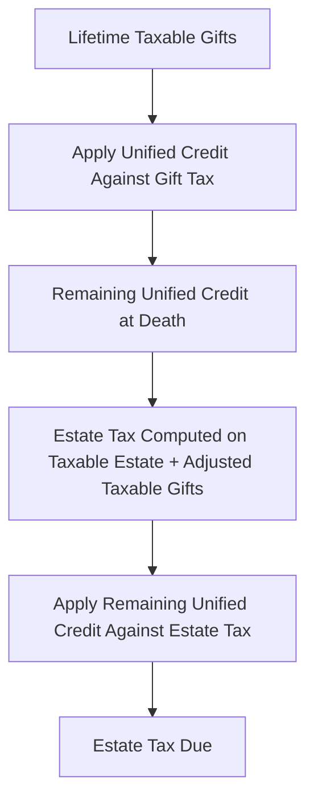

# Gift Taxation Compliance and Planning

## Introduction

Gift taxation is a critical component of the TCP exam that intersects tax compliance and planning. The federal gift tax applies to the **transfer of property by one individual to another** while receiving nothing, or less than full value, in return. Gift tax rules work in tandem with the estate tax through the **unified transfer tax system**, which means that gift planning decisions directly affect a donor's future estate tax exposure.

The TCP exam tests your ability to recall gift tax rules (exclusions, deductions, and credits), calculate taxable gifts, and identify planning strategies that minimize a donor's current and future tax liability — including selecting the optimal property to gift.

---

## Overview of the Federal Gift Tax

### What Constitutes a Gift

A **gift** for federal tax purposes is any transfer of property (including money) for less than adequate and full consideration. The gift tax applies to the **donor** (the person making the gift), not the recipient.

| Element | Rule |
|---|---|
| **Who pays the gift tax** | The **donor** is primarily liable |
| **When the gift is complete** | When the donor relinquishes dominion and control over the property |
| **Valuation** | Gifts are valued at **fair market value (FMV)** on the date of the gift |
| **Gift tax return (Form 709)** | Required if total gifts to any one person exceed the annual exclusion, or if a gift-splitting election is made |

:::info

The gift tax return is due on **April 15** of the year following the gift (same due date as the individual income tax return). Extensions to file the income tax return automatically extend the gift tax return.

:::

---

## Annual Exclusion

The **annual exclusion** allows a donor to give up to a specified amount per recipient per year without any gift tax consequences. The exclusion amount is indexed for inflation.

### Key Rules

| Rule | Detail |
|---|---|
| **Per-donee exclusion** | Applies separately to each recipient — a donor can give the annual exclusion amount to an unlimited number of people |
| **Present interest required** | The exclusion applies only to gifts of a **present interest** (the donee has an immediate right to use, possess, or enjoy the property) |
| **Future interest gifts** | Gifts of a future interest (e.g., remainder interests) do **not** qualify for the annual exclusion |

### Gift Splitting

Married couples may elect to **split gifts** — treating each gift as if half came from each spouse. This effectively doubles the annual exclusion per recipient.

> **Example:** Bear Co. founders Sam and Pat (married) want to make gifts to their three children. With gift splitting, they can give up to **2× the annual exclusion** per child (combining both spouses' exclusions) without any gift tax consequences. If the annual exclusion is \$18,000, each child can receive up to \$36,000 tax-free.

:::warning

Gift splitting requires the consent of both spouses and must be elected on **Form 709**. If either spouse makes a gift to a third party during the year, **both spouses** must file Form 709 if the gift-splitting election is made.

:::

---

## Allowable Deductions for Gift Tax Purposes

Certain transfers are fully deductible and are not subject to the gift tax, regardless of amount.

### Marital Deduction

Gifts between spouses qualify for an **unlimited marital deduction**, provided the recipient spouse is a **U.S. citizen**. This means unlimited gifts can pass between U.S. citizen spouses without any gift tax.

| Recipient Spouse | Deduction |
|---|---|
| **U.S. citizen** | Unlimited marital deduction |
| **Non-U.S. citizen** | No marital deduction; however, a higher annual exclusion amount applies (indexed for inflation) |

### Charitable Deduction

Gifts to **qualified charitable organizations** are fully deductible for gift tax purposes. There is no percentage limitation on the gift tax charitable deduction (unlike the income tax charitable deduction).

### Exclusions from Gift Tax

The following transfers are **not considered gifts** and are excluded from the gift tax entirely:

| Transfer | Reason for Exclusion |
|---|---|
| **Tuition** paid directly to an educational institution | Qualified transfer under IRC §2503(e) |
| **Medical expenses** paid directly to a medical provider | Qualified transfer under IRC §2503(e) |
| **Political contributions** | Not subject to gift tax |
| **Transfers to a spouse** | Covered by the marital deduction |
| **Transfers to charity** | Covered by the charitable deduction |

:::tip[Exam Tip]

The tuition and medical expense exclusions require **direct payment** to the institution or provider. If a donor writes a check to the student or patient (instead of to the school or hospital), the payment does not qualify for the exclusion and is treated as a gift subject to the annual exclusion rules.

:::

---

## The Unified Transfer Tax System

The federal gift tax and estate tax are linked through the **unified transfer tax system**. A single **unified credit** (also called the applicable credit amount) applies against both gift tax and estate tax. Using the credit against lifetime gifts reduces the credit available at death.

### How the System Works

### Key Concepts

| Term | Definition |
|---|---|
| **Unified credit** | A dollar-for-dollar credit against the tentative tax on cumulative taxable transfers (lifetime gifts + estate) |
| **Applicable exclusion amount** | The amount of taxable transfers sheltered by the unified credit (indexed for inflation) |
| **Cumulative taxable gifts** | All taxable gifts made during the donor's lifetime, aggregated across all years |
| **Adjusted taxable gifts** | Lifetime taxable gifts that are added to the taxable estate to determine the estate tax base |

:::info

The applicable exclusion amount is a large number (indexed for inflation) that shelters most taxpayers from actually paying gift or estate tax. However, the exam tests the **mechanics** of the system — how the credit works, how it is reduced by lifetime gifts, and how it carries over to the estate computation.

:::

---

## Calculating Taxable Gifts

The TCP exam requires you to compute the amount of taxable gifts for federal gift tax purposes.

### Computation Steps

| Step | Computation |
|---|---|
| 1 | **Total gifts** made during the year (at FMV) |
| 2 | Less: **Annual exclusion** (per donee, for present interest gifts only) |
| 3 | Less: **Marital deduction** (gifts to U.S. citizen spouse) |
| 4 | Less: **Charitable deduction** (gifts to qualified charities) |
| 5 | = **Taxable gifts** for the current year |

### Example Calculation

> Kingfisher Industries executive Morgan makes the following gifts in 2025 (assume \$18,000 annual exclusion):
>
> | Gift | Amount | Annual Exclusion | Other Deduction |
> |---|---|---|---|
> | Cash to child Alex | \$50,000 | (\$18,000) | — |
> | Cash to spouse (U.S. citizen) | \$200,000 | (\$18,000) | (\$182,000) marital deduction |
> | Stock to friend Pat | \$25,000 | (\$18,000) | — |
> | Cash to qualifying charity | \$100,000 | — | (\$100,000) charitable deduction |
>
> **Taxable gifts:** (\$50,000 − \$18,000) + (\$200,000 − \$18,000 − \$182,000) + (\$25,000 − \$18,000) + (\$100,000 − \$100,000) = \$32,000 + \$0 + \$7,000 + \$0 = **\$39,000**

---

## Gift Tax Planning Strategies

The TCP exam tests your ability to identify potential tax savings from gifting noncash property and to select the property that best achieves the planning objective.

### Gifting Appreciated Property

When a donor gifts **appreciated property**, the donee generally takes the donor's **carryover basis**. This removes the appreciation from the donor's estate without triggering current income tax, but the donee inherits the built-in gain.

| Factor | Implication |
|---|---|
| **Removes appreciation from estate** | The future growth of the gifted property occurs outside the donor's estate |
| **Carryover basis to donee** | The donee's basis is the donor's adjusted basis (plus any gift tax paid on the appreciation) |
| **No income tax triggered** | The donor does not recognize gain on the gift |

### Gifting Property with a Loss

When a donor gifts property with a **built-in loss** (FMV < basis), special rules apply to the donee:

- For **gain** purposes: donee uses the donor's carryover basis
- For **loss** purposes: donee uses the **FMV at the date of the gift**
- If the donee sells for an amount **between** the carryover basis and the FMV at the date of the gift, no gain or loss is recognized

:::caution

Gifting loss property is generally a poor planning strategy because the loss disappears. The donor should consider **selling** the property (to recognize the loss) and then gifting the cash proceeds.

:::

### Selecting Property to Minimize the Donor's Future Estate

When the planning objective is to minimize the donor's future estate, the optimal strategy is to gift property with the **highest expected future appreciation**. By removing the property from the estate now, all future growth escapes estate taxation.

> **Example:** Polar Inc. founder Lee owns two assets — Property X (current FMV \$500,000, expected to appreciate to \$2,000,000 over 10 years) and Property Y (current FMV \$500,000, expected to remain stable). To minimize the future estate, Lee should gift Property X because the \$1,500,000 of future appreciation will occur outside the estate.

### Selecting Property to Minimize the Donee's Future Tax

When the planning objective is to minimize the donee's future income tax on a sale, consider the donee's expected tax bracket and the property's built-in gain or loss:

- If the donee is in a **lower tax bracket** than the donor, gifting appreciated property shifts the gain recognition to the lower-bracket donee
- **Caution:** The kiddie tax may apply if the donee is a child under 19 (or a full-time student under 24) with unearned income exceeding the threshold

---

## Summary

| Concept | Key Rule |
|---|---|
| Gift tax liability | Falls on the **donor**, not the recipient |
| Annual exclusion | Per-donee, per-year; present interest gifts only; doubled with gift splitting |
| Marital deduction | Unlimited for gifts to U.S. citizen spouses |
| Charitable deduction | Unlimited for gift tax purposes (no AGI limitation) |
| Tuition/medical exclusion | Must be paid **directly** to the institution or provider |
| Unified credit | Single credit against both gift tax and estate tax; used against lifetime gifts first |
| Taxable gifts calculation | Total gifts − annual exclusions − marital deduction − charitable deduction |
| Appreciated property gifts | Removes appreciation from estate; donee takes carryover basis |
| Loss property gifts | Loss disappears; generally better to sell and gift cash |
| Planning to minimize estate | Gift property with highest expected future appreciation |
