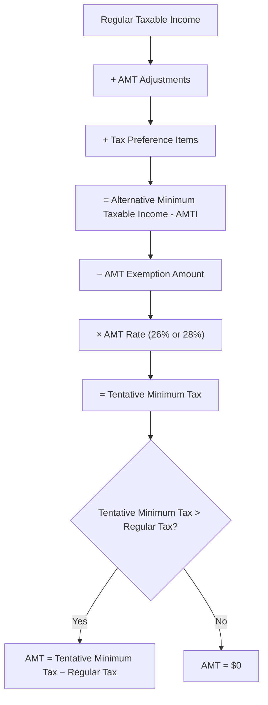

# Individual Compliance and Tax Planning

## Introduction

This topic covers the nonroutine individual tax compliance and planning issues tested on the TCP section of the CPA exam. While the core REG section addresses fundamental individual tax concepts (filing status, dependency, standard income inclusions and deductions), TCP goes deeper — testing equity compensation, Alternative Minimum Tax (AMT) items, the kiddie tax, imputed interest, and year-end planning strategies to minimize tax liability. The focus is on a newly licensed CPA's role in both **preparing and reviewing** tax returns and **advising clients** on tax planning opportunities.

---

## Equity Compensation Awards

Equity compensation is a common form of incentive pay, and the tax treatment varies significantly based on the type of award. The TCP exam expects you to recall the impact of equity compensation awards on taxable income and to analyze planning opportunities.

### Incentive Stock Options (ISOs)

Incentive stock options under **IRC §422** receive favorable tax treatment when specific holding-period requirements are met.

| Event | Tax Consequence |
|---|---|
| **Grant** | No taxable event |
| **Exercise** | No regular income tax; the **bargain element** (FMV − exercise price) is an AMT adjustment |
| **Qualifying disposition** (held > 2 years from grant and > 1 year from exercise) | Entire gain (sale price − exercise price) is **long-term capital gain** |
| **Disqualifying disposition** (holding periods not met) | Bargain element at exercise is **ordinary income**; any additional gain is capital gain |

:::tip[Exam Tip]

The bargain element on ISO exercise is one of the most commonly tested AMT adjustments. When a question asks about AMT implications of equity compensation, focus on ISOs.

:::

### Nonqualified Stock Options (NQSOs)

NQSOs do not receive the same favorable treatment as ISOs.

| Event | Tax Consequence |
|---|---|
| **Grant** | No taxable event (if no readily ascertainable FMV) |
| **Exercise** | Bargain element (FMV − exercise price) is **ordinary income** subject to employment taxes |
| **Sale** | Gain or loss measured from FMV at exercise is **capital gain or loss** |

### Restricted Stock and Restricted Stock Units (RSUs)

| Award Type | Default Treatment | IRC §83(b) Election Available? |
|---|---|---|
| **Restricted stock** | Taxed as ordinary income at FMV when restrictions lapse (vesting) | Yes — elect to recognize income at grant date |
| **RSUs** | Taxed as ordinary income at FMV when shares are delivered | No — §83(b) is not available for RSUs |

:::info

An **IRC §83(b) election** must be filed within **30 days** of the grant. If the stock appreciates significantly between grant and vesting, the election can convert what would have been ordinary income into long-term capital gain. However, if the stock declines or the employee forfeits the shares, no deduction is allowed for the income previously recognized.

:::

---

## Alternative Minimum Tax (AMT)

The AMT is a parallel tax system designed to ensure that taxpayers who benefit from certain preferences and adjustments pay at least a minimum amount of tax. The TCP exam tests your ability to recall items included in the determination of Alternative Minimum Taxable Income (AMTI).

### AMT Computation Overview

### Common AMT Adjustments and Preferences

| Item | Treatment |
|---|---|
| ISO bargain element at exercise | **Add** to AMTI |
| State and local tax deduction | **Add back** (SALT deduction disallowed for AMT) |
| Standard deduction | **Add back** (not allowed for AMT) |
| Private activity bond interest | **Add** as tax preference item |
| Depreciation on post-1986 property | Adjustment for **difference** between regular and AMT depreciation methods |

:::warning

The AMT exemption amount is **phased out** at higher income levels. The exam will provide the specific amounts and phase-out thresholds when needed — focus on understanding the computation mechanics, not memorizing the dollar figures.

:::

---

## Tax on a Child's Unearned Income (Kiddie Tax)

The **kiddie tax** under IRC §1(g) applies to the net unearned income of certain children to prevent parents from shifting investment income to their children to take advantage of lower tax brackets.

### Who Is Subject to the Kiddie Tax

The kiddie tax applies to a child who:

1. Has **unearned income** exceeding a threshold amount (indexed for inflation)
2. Is under age **19** at the end of the tax year, **or** is a full-time student under age **24**
3. Does not file a joint return
4. Has at least one living parent

### Computation

| Component | Amount |
|---|---|
| Child's unearned income | Total investment income |
| Less: First threshold amount | Tax-free |
| Less: Second threshold amount | Taxed at child's rate |
| **Net unearned income** | Taxed at the **parent's marginal rate** |

> **Example:** Polar Inc. executive Dana's 16-year-old child received \$5,000 in dividend income. Assume the first \$1,300 is tax-free and the next \$1,300 is taxed at the child's rate. The remaining \$2,400 of net unearned income is taxed at Dana's marginal rate.

---

## Imputed Interest on Below-Market Loans

Under **IRC §7872**, the IRS imputes interest on certain loans made at below-market rates. This affects the borrower's taxable income and may create income for the lender.

### Types of Below-Market Loans

| Loan Type | Treatment |
|---|---|
| **Gift loans** (between family members) | Lender has imputed interest income; borrower has a deemed gift |
| **Compensation-related loans** (employer to employee) | Lender has imputed interest income; borrower has compensation income |
| **Corporation-shareholder loans** | Imputed interest is treated as a distribution from the corporation |

### De Minimis Exception

For gift loans between individuals, no interest is imputed if the aggregate outstanding loans between the lender and borrower do not exceed **\$10,000**, unless the loan is directly attributable to the purchase or carrying of income-producing assets.

For gift loans of **\$100,000 or less**, the imputed interest income is limited to the borrower's net investment income. If the borrower's net investment income is \$1,000 or less, it is treated as zero.

---

## Income Earned Outside the U.S.

U.S. citizens and resident aliens are taxed on **worldwide income**, regardless of where it is earned. However, taxpayers working abroad may be eligible for the **Foreign Earned Income Exclusion (FEIE)** under IRC §911.

### Foreign Earned Income Exclusion

To qualify, the taxpayer must have a **tax home** in a foreign country and meet either:

- The **bona fide residence test** — a bona fide resident of a foreign country for an uninterrupted period that includes an entire tax year, or
- The **physical presence test** — physically present in a foreign country for at least **330 full days** during a 12-month period

The maximum exclusion amount is adjusted annually for inflation. In addition to the earned income exclusion, taxpayers may also exclude or deduct a **foreign housing amount**.

:::info

The FEIE applies only to **earned income** (wages, salaries, self-employment income). It does not apply to investment income, pensions, or other unearned income.

:::

---

## Flexible Spending Accounts (FSAs) and Health Savings Accounts (HSAs)

The TCP exam tests your ability to identify projected tax savings through the utilization of FSAs and HSAs.

### Flexible Spending Accounts (FSAs)

| Feature | Health FSA | Dependent Care FSA |
|---|---|---|
| **Contribution limit** | Indexed annually | \$5,000 (MFJ) or \$2,500 (MFS) |
| **Tax benefit** | Contributions are pre-tax (reduce gross income) | Contributions are pre-tax |
| **Use-it-or-lose-it** | Unspent funds generally forfeited at year-end (limited carryover or grace period may apply) | Unspent funds forfeited |
| **Eligible expenses** | Medical, dental, vision expenses | Daycare, preschool, after-school care |

### Health Savings Accounts (HSAs)

HSAs offer a **triple tax advantage**: contributions are tax-deductible (or pre-tax if through payroll), earnings grow tax-free, and qualified withdrawals are tax-free.

| Requirement | Detail |
|---|---|
| Must be enrolled in a **high-deductible health plan (HDHP)** | Minimum deductible and maximum out-of-pocket limits apply |
| No other non-HDHP coverage | Cannot be enrolled in Medicare or a general-purpose FSA |
| Contribution limits | Indexed annually; catch-up contribution available for age 55+ |

:::tip[Planning Opportunity]

When advising clients, compare the tax savings from FSA contributions (which reduce payroll taxes) against HSA contributions (which reduce income tax and can accumulate over time). For clients with predictable medical expenses and an HDHP, the HSA is generally the superior vehicle due to its unlimited carryover and investment potential.

:::

---

## Standard Deduction vs. Itemized Deductions

The TCP exam tests your ability to evaluate the planning implications of choosing between the standard deduction and itemized deductions.

### Key Planning Considerations

| Factor | Standard Deduction | Itemized Deductions |
|---|---|---|
| **Simplicity** | No documentation required | Requires substantiation of each deduction |
| **SALT deduction** | Not applicable | Capped at \$10,000 |
| **Mortgage interest** | Not applicable | Deductible on up to \$750,000 of acquisition indebtedness |
| **Charitable contributions** | Not applicable | Subject to AGI-based percentage limits |
| **Medical expenses** | Not applicable | Deductible to the extent exceeding 7.5% of AGI |

### Bunching Strategy

A common planning strategy is **bunching** — concentrating deductible expenses into a single year to exceed the standard deduction, then taking the standard deduction in alternate years.

> **Example:** Kingfisher Industries employee Alex normally has \$12,000 in annual charitable contributions. With a standard deduction of \$15,000 (single), itemizing does not produce a benefit. By making two years of contributions (\$24,000) in Year 1, Alex exceeds the standard deduction and itemizes in Year 1, then takes the standard deduction in Year 2. Total two-year deductions: \$24,000 + \$15,000 = \$39,000 vs. \$15,000 + \$15,000 = \$30,000.

---

## Estimated Tax Payments

Individuals who do not have sufficient tax withholding must make estimated tax payments to avoid an **underpayment penalty** under IRC §6654.

### Safe Harbor Rules

A taxpayer avoids the underpayment penalty if the total tax payments (withholding + estimated payments) equal or exceed the **lesser of**:

| Safe Harbor | Requirement |
|---|---|
| **Current-year safe harbor** | 90% of the current year's tax liability |
| **Prior-year safe harbor** | 100% of the prior year's tax liability (110% if prior-year AGI exceeds \$150,000, or \$75,000 for MFS) |

### Due Dates for Estimated Tax Payments

| Payment | Due Date |
|---|---|
| Q1 | April 15 |
| Q2 | June 15 |
| Q3 | September 15 |
| Q4 | January 15 of the following year |

:::info

The annualized income installment method allows a taxpayer whose income is not earned evenly throughout the year to base each quarterly payment on the income actually earned during that period, potentially reducing early-year estimated payments.

:::

---

## Charitable Contributions of Noncash Property

The TCP exam tests your ability to calculate the potential tax savings when donating noncash property and to identify the optimal property to donate given a specific planning scenario.

### General Rules for Noncash Donations

| Property Type | Deduction Amount | AGI Limitation |
|---|---|---|
| **Long-term capital gain property** donated to a **public charity** | Fair market value | 30% of AGI |
| **Long-term capital gain property** — elect reduced deduction | Adjusted basis | 50% of AGI |
| **Ordinary income property** (inventory, short-term gain property) | Adjusted basis | 50% of AGI |
| **Tangible personal property** unrelated to charity's purpose | Adjusted basis | 50% of AGI |

### Planning Strategy

When advising a client, identify the property that provides the greatest tax benefit:

- **Highly appreciated long-term capital gain property** produces the largest deduction relative to the economic cost of the donation because the taxpayer deducts FMV while avoiding capital gains tax on the appreciation.
- **Property with a loss** should generally be **sold** (to recognize the loss) rather than donated, since donations are limited to FMV (not basis) and the loss would go unrecognized.

> **Example:** Illini Entertainment director Sam wants to minimize this year's tax liability through a charitable contribution. Sam holds Stock A (FMV \$50,000, basis \$10,000, held 3 years) and Stock B (FMV \$50,000, basis \$60,000, held 2 years). Donating Stock A produces a \$50,000 FMV deduction and avoids \$40,000 of capital gain. Sam should sell Stock B to recognize the \$10,000 capital loss, then donate the cash proceeds if desired.

---

## Year-End Tax Planning

The TCP exam tests your ability to review a client's projected income and expenses prior to year end and recommend strategies to minimize tax liability.

### Income Timing Strategies

| Strategy | When Beneficial |
|---|---|
| **Defer income** to the next year | When the taxpayer expects to be in a **lower bracket** next year or when deferral avoids an AGI-based phase-out |
| **Accelerate income** into the current year | When tax rates are expected to **increase** next year or when the taxpayer has unusually large deductions this year |

### Deduction Timing Strategies

| Strategy | When Beneficial |
|---|---|
| **Accelerate deductions** into the current year | When the taxpayer is in a **higher bracket** this year and expects lower income next year |
| **Defer deductions** to the next year | When the taxpayer expects to be in a **higher bracket** next year |

### Impact of Changing Tax Rates and Legislation

The exam may present scenarios where enacted or proposed changes in tax rates affect the optimal timing of income and deductions. The key principle is straightforward:

- **Recognize income in the lower-rate year** and **claim deductions in the higher-rate year** to minimize the present value of total taxes paid.

:::warning

Year-end planning questions often involve multiple interacting variables — income timing, deduction timing, estimated tax payments, and AGI-based phase-outs. Read the scenario carefully and identify which variable the question is asking you to optimize.

:::

---

## Summary

| Topic | Key Concept |
|---|---|
| ISOs | No regular tax at exercise; bargain element is AMT adjustment; qualifying disposition produces LTCG |
| NQSOs | Ordinary income at exercise; capital gain/loss on later sale |
| Restricted stock / RSUs | Ordinary income at vesting (or grant if §83(b) elected for restricted stock) |
| AMT | Parallel tax system; add back adjustments and preferences to regular taxable income |
| Kiddie tax | Net unearned income of qualifying children taxed at parent's rate |
| Imputed interest | IRS imputes interest on below-market loans; de minimis exceptions apply |
| Foreign earned income | FEIE excludes qualifying earned income for taxpayers meeting residence or physical presence tests |
| FSAs and HSAs | Pre-tax benefits; HSAs offer triple tax advantage with unlimited carryover |
| Estimated taxes | Safe harbors: 90% current year or 100%/110% prior year |
| Noncash charitable donations | Appreciated LTCG property maximizes deduction; sell loss property instead of donating |
| Year-end planning | Recognize income in lower-rate years; claim deductions in higher-rate years |
