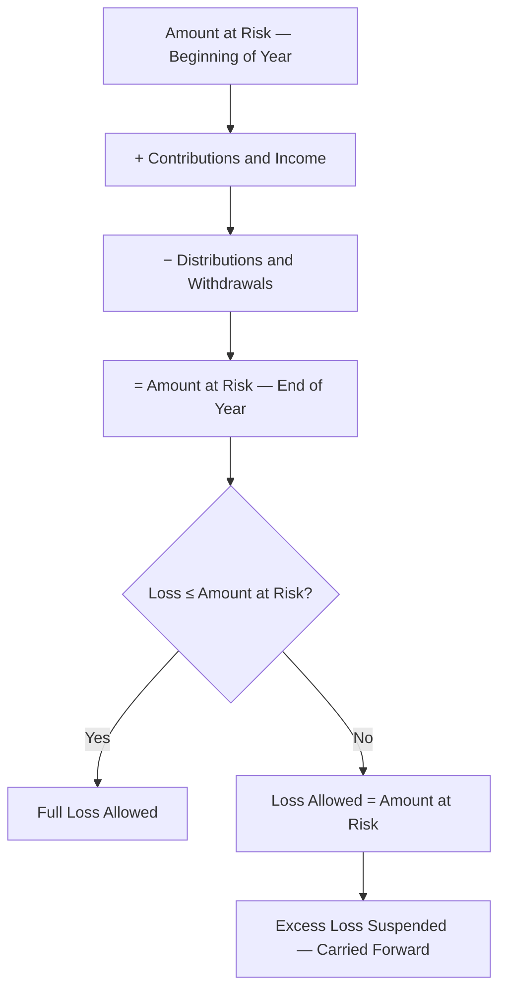

# Passive Activity and At-Risk Loss Limitations

## Introduction

When an individual recognizes a loss from a business activity or rental property, the tax code does not always allow the full deduction in the current year. Two key limitation regimes — the **at-risk rules** under **IRC §465** and the **passive activity loss rules** under **IRC §469** — restrict the amount of loss a taxpayer can deduct based on the economic substance of their investment and their level of participation. These rules are designed to prevent taxpayers from sheltering other income with losses from activities in which they bear limited economic risk or limited involvement.

The TCP exam tests these rules at a deeper level than REG. You must be able to calculate the at-risk limitation, apply the passive activity loss limitation, net passive gains and losses across multiple activities, and review supporting documentation to verify that losses are properly allocated between allowed and suspended amounts.

:::info

The TCP Blueprint specifically excludes **tax credit implications** from this topic. Focus on **loss limitations** only.

:::

---

## At-Risk Rules (IRC §465)

### Purpose

The at-risk rules prevent a taxpayer from deducting losses that exceed the amount they could actually lose in an activity. A taxpayer's deductible loss is limited to the amount they have **at risk** in the activity at the end of the tax year.

### Amount at Risk

The amount at risk generally includes:

| Increases to At-Risk Amount | Decreases to At-Risk Amount |
|---|---|
| Cash contributions to the activity | Distributions and withdrawals |
| Adjusted basis of property contributed | Losses previously allowed |
| Amounts borrowed for which the taxpayer is **personally liable** (recourse debt) | Loan guarantees that reduce personal liability |
| Amounts borrowed secured by **property not used in the activity** | |
| Income allocations from the activity | |

:::warning

**Nonrecourse debt** (debt for which the taxpayer is not personally liable) is generally **not** included in the at-risk amount. The major exception is **qualified nonrecourse financing** for real estate activities — certain nonrecourse debt secured by real property used in the activity is treated as an at-risk amount.

:::

### At-Risk Calculation

> **Example:** Bear Co. partner Jordan contributed \$40,000 cash to a partnership activity and was allocated a \$55,000 loss for the year. Jordan has no recourse debt in the activity. Jordan's at-risk amount is \$40,000, so only \$40,000 of the loss is deductible under the at-risk rules. The remaining \$15,000 is suspended and carried forward until Jordan increases the at-risk amount (through additional contributions or income allocations).

### Losses from Pass-Through Entities

For losses flowing through from partnerships and S corporations, the at-risk limitation is applied **after** the basis limitation (the first hurdle) and **before** the passive activity loss limitation (the third hurdle).

| Hurdle | Limitation | IRC Section |
|---|---|---|
| 1 | **Basis limitation** | §704(d) (partnerships), §1366(d) (S corps) |
| 2 | **At-risk limitation** | §465 |
| 3 | **Passive activity loss limitation** | §469 |
| 4 | **Excess business loss limitation** | §461(l) |

### Real Estate Rental Activities

Losses from real estate rental activities are subject to the at-risk rules. However, **qualified nonrecourse financing** (secured by real property used in the activity and borrowed from a qualified lender) is included in the at-risk amount. This is a critical exception — without it, most real estate investors would have very limited at-risk amounts because real estate debt is typically nonrecourse.

---

## Passive Activity Loss Rules (IRC §469)

### Purpose

The passive activity loss rules prevent taxpayers from using losses from activities in which they do not **materially participate** to offset income from activities in which they do (such as wages, salaries, and portfolio income). Passive losses can only offset passive income.

### Key Definitions

| Term | Definition |
|---|---|
| **Passive activity** | A trade or business activity in which the taxpayer does **not materially participate**, or any **rental activity** (with limited exceptions) |
| **Active income** | Wages, salaries, and income from a trade or business in which the taxpayer materially participates |
| **Portfolio income** | Interest, dividends, royalties, and gains from the disposition of investment property |
| **Material participation** | The taxpayer is involved in the operations of the activity on a **regular, continuous, and substantial** basis |

:::caution

**Portfolio income** is **never** passive income. Dividends, interest, and capital gains from investments cannot be offset by passive losses.

:::

### Material Participation Tests

A taxpayer materially participates in an activity if they meet **any one** of the following seven tests:

| Test | Description |
|---|---|
| 1 | Participated for more than **500 hours** during the year |
| 2 | Participation constituted **substantially all** of the participation by all individuals |
| 3 | Participated for more than **100 hours** and no other individual participated more |
| 4 | Significant participation activity (> 100 hours) and aggregate participation in all such activities exceeds **500 hours** |
| 5 | Materially participated in the activity in any **5 of the prior 10 years** |
| 6 | Activity is a personal service activity and the taxpayer materially participated in any **3 prior years** |
| 7 | Based on all facts and circumstances, participated on a **regular, continuous, and substantial basis** (minimum 100 hours) |

### Netting Passive Activity Gains and Losses

When a taxpayer has multiple passive activities, the gains and losses are **netted** against each other:

1. Calculate the net gain or loss from each passive activity separately
2. Net all passive gains against all passive losses
3. If the result is a **net passive loss**, the excess is **suspended** and carried forward
4. If the result is a **net passive gain**, the gain is included in income (and may release previously suspended losses)

> **Example:** Bear Co. manager Pat has three passive activities: Activity A generated a \$25,000 gain, Activity B generated a \$40,000 loss, and Activity C generated a \$10,000 gain. Net passive income: \$25,000 + \$10,000 − \$40,000 = (\$5,000) net passive loss. The \$5,000 is suspended and carried forward. Pat cannot deduct any of the net passive loss against wages or portfolio income.

### Rental Activities — Special Rules

All **rental activities** are generally treated as passive, regardless of material participation. However, two important exceptions exist:

#### Exception 1: Active Participation — \$25,000 Rental Loss Allowance

An individual who **actively participates** in a rental real estate activity may deduct up to **\$25,000** of rental losses against nonpassive income. Active participation is a lower standard than material participation — it requires bona fide involvement in management decisions (approving tenants, setting rental terms, approving expenditures).

| Requirement | Detail |
|---|---|
| **Ownership** | At least 10% ownership interest |
| **Active participation** | Bona fide involvement in management decisions |
| **AGI phase-out** | The \$25,000 allowance is reduced by 50% of AGI exceeding \$100,000 and fully phased out at \$150,000 AGI |

> **Example:** Illini Entertainment director Alex owns a rental property and actively participates in management. Alex's rental loss for the year is \$30,000 and AGI (before the rental loss) is \$120,000. The \$25,000 allowance is reduced by 50% × (\$120,000 − \$100,000) = \$10,000, leaving a \$15,000 allowance. Alex deducts \$15,000 of the rental loss against nonpassive income. The remaining \$15,000 is suspended.

#### Exception 2: Real Estate Professionals

A taxpayer who qualifies as a **real estate professional** under IRC §469(c)(7) is not automatically treated as passive for rental real estate activities. To qualify, the taxpayer must:

1. Spend more than **750 hours** during the year in real property trades or businesses in which the taxpayer materially participates, **and**
2. More than **50%** of total personal services are performed in real property trades or businesses

If both tests are met, each rental activity in which the taxpayer materially participates is treated as **nonpassive**.

---

## Disposition of a Passive Activity

When a taxpayer makes a **fully taxable disposition** of their entire interest in a passive activity to an unrelated party, all **suspended passive losses** from that activity are released and become deductible.

### Rules for Loss Release on Disposition

| Type of Disposition | Suspended Loss Treatment |
|---|---|
| **Fully taxable sale** to unrelated party | All suspended losses are **released** and deductible against any type of income |
| **Sale to a related party** | Suspended losses remain suspended until the related party disposes of the interest to an unrelated party |
| **Gift** | Suspended losses increase the **basis** of the gifted interest (they are not deductible by the donor) |
| **Death** | Suspended losses are deductible on the decedent's final return to the extent they exceed the step-up in basis |
| **Installment sale** | Suspended losses are released **proportionally** as installment payments are received |

> **Example:** Polar Inc. partner Casey has \$80,000 of suspended passive losses from a limited partnership investment. Casey sells the entire partnership interest to an unrelated buyer for a \$30,000 gain. On the sale, Casey releases the full \$80,000 of suspended losses. Net result: \$30,000 gain − \$80,000 released losses = \$50,000 net loss, deductible against any type of income (wages, portfolio income, etc.).

---

## Reviewing Basis Schedules and Supporting Documentation

The TCP Blueprint includes a representative task requiring candidates to **review an individual's basis schedules and supporting documentation** for a pass-through entity to confirm the correct allocation of a loss between amounts suspended for at-risk limitations, suspended for passive activity rules, and allowed for tax purposes.

### What to Review

| Item | Purpose |
|---|---|
| **Beginning basis schedule** | Verify the starting at-risk amount matches the prior year's ending balance |
| **Income and loss allocations** (Schedule K-1) | Confirm the allocated amounts match the entity's return |
| **Contributions and distributions** | Verify cash and property transactions are properly reflected |
| **Debt schedules** | For partnerships, verify the partner's share of recourse and nonrecourse liabilities; for S corporations, verify direct shareholder loans |
| **At-risk computation** | Confirm the loss allowed does not exceed the at-risk amount |
| **Passive activity worksheets** | Confirm the remaining loss is properly classified between passive and nonpassive |

:::tip[Exam Tip]

Simulation questions may present a completed basis schedule with one or more errors. Common errors include: including nonrecourse debt in an S corporation shareholder's at-risk amount, failing to reduce the at-risk amount for distributions, or netting passive losses against portfolio income. Practice identifying these errors systematically.

:::

---

## Summary

| Concept | Key Rule |
|---|---|
| At-risk amount | Cash + basis of contributed property + recourse debt + qualified nonrecourse financing (real estate) |
| At-risk limitation | Loss deduction limited to amount at risk at year end; excess suspended and carried forward |
| Passive activity | Activity in which taxpayer does not materially participate, or any rental activity (with exceptions) |
| Material participation | Seven tests; most common is the 500-hour test |
| Passive loss netting | Passive losses offset passive gains; net passive loss is suspended |
| \$25,000 rental allowance | Active participation required; phased out at \$100,000–\$150,000 AGI |
| Real estate professional | 750 hours + 50% of services in real property trades or businesses |
| Disposition of passive activity | Fully taxable sale to unrelated party releases all suspended losses |
| Loss ordering | Basis → At-risk → Passive activity → Excess business loss |
