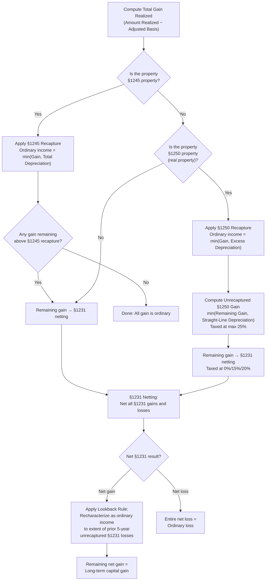

# Gains and Losses on Asset Disposition

## Introduction

When a taxpayer disposes of property used in a trade or business, characterizing the resulting gain or loss involves a layered analysis well beyond the basic "capital vs. ordinary" framework covered in REG. The TCP exam requires you to apply the **depreciation recapture** rules of §1245 and §1250, navigate the **§1231 netting process** (including the lookback rule), compute **unrecaptured §1250 gain**, evaluate losses on **§1244 small business stock**, and calculate gain recognized under the **installment sale** method. You must also be able to review a schedule of asset dispositions and identify discrepancies in the amount or character of reported gains and losses.

This page builds on the foundational gain/loss concepts from REG (amount realized, adjusted basis, holding period, capital vs. ordinary character) and dives into the higher-complexity disposition rules tested on the TCP section.

---

## Section 1231 — Trade or Business Property

### What Qualifies as §1231 Property

**Section 1231 property** includes depreciable property and real property used in a trade or business and held for **more than one year**. It also includes certain involuntary conversions of business property and capital assets held in connection with a trade or business.

| Qualifies as §1231 Property | Does NOT Qualify |
|---|---|
| Machinery and equipment used in business (held > 1 year) | Inventory or property held for sale to customers |
| Buildings and land used in business (held > 1 year) | Personal-use property (home, personal car) |
| Timber, coal, iron ore (with applicable election) | Securities and investment assets (these are capital assets) |
| Unharvested crops on land sold together | Property held for ≤ 1 year (short-term = ordinary) |
| Livestock held for draft, breeding, dairy, or sporting (with required holding periods) | Copyrights, artistic compositions (held by creator) |

:::info

Section 1231 property is technically a **noncapital asset** — it is excluded from the definition of a capital asset under §1221. However, net §1231 gains receive **long-term capital gain treatment**, giving taxpayers the "best of both worlds."

:::

### The §1231 Netting Process

At the end of the tax year, all §1231 gains and §1231 losses are netted together:

- If **net §1231 gains** exceed net §1231 losses → the entire net gain is treated as a **long-term capital gain** (taxed at preferential rates).
- If **net §1231 losses** exceed net §1231 gains → the entire net loss is treated as an **ordinary loss** (fully deductible against ordinary income with no \$3,000 limitation).

This is the "**best of both worlds**" rule: gains get capital treatment, losses get ordinary treatment.

:::tip[Exam Tip]

Remember the phrase "best of both worlds" for §1231. If the exam presents a scenario where a taxpayer has a net loss from selling business property held more than one year, that loss is ordinary — it is **not** subject to the capital loss limitations.

:::

> **Example:** Bear Co. sold two assets during the current year, both held for more than one year and used in its business:
>
> | Asset | Sale Price | Adjusted Basis | Gain (Loss) |
> |---|---|---|---|
> | Warehouse | \$600,000 | \$400,000 | \$200,000 |
> | Delivery truck | \$8,000 | \$25,000 | (\$17,000) |
>
> Net §1231 gain = \$200,000 − \$17,000 = **\$183,000**
>
> Because the net result is a gain, the entire \$183,000 is treated as a **long-term capital gain**. (Note: Depreciation recapture rules under §1245 and §1250 must be applied first — covered below — which may recharacterize a portion as ordinary income.)

### The §1231 Lookback Rule

The §1231 lookback rule prevents taxpayers from selectively timing dispositions to claim ordinary losses in some years and capital gains in others.

**Rule:** If the taxpayer had **net §1231 losses** in any of the **prior 5 tax years** that were treated as ordinary losses, the current year's net §1231 gain is **recharacterized as ordinary income** to the extent of those prior unrecaptured ordinary losses.

> **Example:** Bear Co. reported the following §1231 results over the past several years:
>
> | Year | Net §1231 Result | Character |
> |---|---|---|
> | Year 1 | (\$30,000) loss | Ordinary loss |
> | Year 2 | (\$10,000) loss | Ordinary loss |
> | Year 3 | \$0 | — |
> | Year 4 | \$15,000 gain | Ordinary income (lookback: \$15,000 recaptured) |
> | Year 5 | \$0 | — |
> | Year 6 (current) | \$50,000 gain | See below |
>
> Unrecaptured §1231 losses from the prior 5 years (Years 1–5):
> - Year 1: \$30,000 ordinary loss
> - Year 2: \$10,000 ordinary loss
> - Year 4 recaptured: (\$15,000)
> - **Remaining unrecaptured losses = \$30,000 + \$10,000 − \$15,000 = \$25,000**
>
> Of Bear Co.'s \$50,000 net §1231 gain in Year 6:
> - **\$25,000** is recharacterized as **ordinary income** (lookback recapture)
> - **\$25,000** is treated as **long-term capital gain**

:::caution

The lookback rule is easy to overlook. On the TCP exam, always check whether there are unrecaptured §1231 losses in the prior 5 years before characterizing a current-year net §1231 gain as a capital gain.

:::

---

## Section 1245 Depreciation Recapture

### Overview

**Section 1245** requires that gain on the sale of certain depreciable property be recaptured as **ordinary income** to the extent of **all accumulated depreciation** (or amortization) previously taken on the asset. This prevents taxpayers from claiming ordinary depreciation deductions and then treating the gain on sale as capital gain.

### Property Subject to §1245

Section 1245 property includes:

- **Personal property** used in a trade or business — machinery, equipment, vehicles, furniture, computers
- **Amortizable §197 intangibles** — patents, copyrights, customer lists, goodwill
- **Certain real property** that used accelerated depreciation methods (e.g., nonresidential real property placed in service before 1987)
- **Single-purpose agricultural or horticultural structures**

### The §1245 Recapture Formula

$$
\text{§1245 Ordinary Income} = \min(\text{Gain Realized},\ \text{Total Depreciation Taken})
$$

Any gain **in excess of** the total depreciation is §1231 gain (and enters the §1231 netting process).

| Component | Calculation |
|---|---|
| Gain realized | Amount realized − Adjusted basis |
| §1245 ordinary income | Lesser of gain realized or total depreciation |
| §1231 gain (if any) | Gain realized − §1245 ordinary income |

> **Example:** Polar Inc. purchased equipment for \$120,000 and claimed \$45,000 in depreciation. The equipment is sold for \$100,000.
>
> - Adjusted basis = \$120,000 − \$45,000 = **\$75,000**
> - Gain realized = \$100,000 − \$75,000 = **\$25,000**
> - §1245 ordinary income = min(\$25,000, \$45,000) = **\$25,000**
> - §1231 gain = \$25,000 − \$25,000 = **\$0**
>
> The entire \$25,000 gain is **ordinary income** because the gain does not exceed the total depreciation claimed.

> **Example:** Now suppose Polar Inc. sells the same equipment for \$140,000 instead.
>
> - Adjusted basis = \$120,000 − \$45,000 = **\$75,000**
> - Gain realized = \$140,000 − \$75,000 = **\$65,000**
> - §1245 ordinary income = min(\$65,000, \$45,000) = **\$45,000**
> - §1231 gain = \$65,000 − \$45,000 = **\$20,000**
>
> The first \$45,000 is **ordinary income** (recaptured depreciation). The remaining \$20,000 enters the **§1231 netting process** and, if net §1231 gains result, will be treated as long-term capital gain.

:::warning

Section 1245 recapture applies to **all** depreciation taken — not just "excess" depreciation. Even if the taxpayer used straight-line depreciation, the full amount of depreciation claimed is subject to §1245 recapture.

:::

### Sale at a Loss

If §1245 property is sold at a **loss**, there is no depreciation recapture (recapture cannot create or increase a loss). The loss enters the §1231 netting process.

> **Example:** Jordan sells office furniture with an original cost of \$30,000 and accumulated depreciation of \$22,000 (adjusted basis = \$8,000) for \$5,000.
>
> - Gain (loss) realized = \$5,000 − \$8,000 = **(\$3,000)**
> - §1245 recapture = **\$0** (there is no gain to recapture)
> - The \$3,000 loss is a **§1231 loss**

---

## Section 1250 Depreciation Recapture (Real Property)

### Overview

**Section 1250** applies to **depreciable real property** (buildings and structural components). Unlike §1245, which recaptures all depreciation, §1250 recaptures gain as ordinary income only to the extent of **excess depreciation** — the amount by which accelerated depreciation exceeded what straight-line depreciation would have been.

### The §1250 Recapture Formula

$$
\text{§1250 Ordinary Income} = \min(\text{Gain Realized},\ \text{Excess Depreciation})
$$

$$
\text{Excess Depreciation} = \text{Actual Depreciation Taken} - \text{Straight-Line Depreciation That Would Have Been Allowed}
$$

### Modern Relevance: Post-1986 Real Property

Since the Tax Reform Act of 1986, **nonresidential real property** (39-year) and **residential rental property** (27.5-year) must use the **straight-line** method. Because there is no accelerated depreciation, the excess depreciation is **zero**, and therefore **§1250 recapture is typically zero** for property placed in service after 1986.

:::info

For most real property on the TCP exam, §1250 recapture will be \$0 because straight-line depreciation has been required since 1987. However, you may encounter legacy assets placed in service before 1987 that used accelerated methods — in those cases, §1250 recapture applies.

:::

> **Example:** Illini Entertainment purchased a commercial building in 1984 for \$500,000 (excluding land). Over the years, the company claimed \$320,000 in accelerated depreciation. Had the straight-line method been used, depreciation would have been \$280,000.
>
> The building is sold for \$400,000.
>
> - Adjusted basis = \$500,000 − \$320,000 = **\$180,000**
> - Gain realized = \$400,000 − \$180,000 = **\$220,000**
> - Excess depreciation = \$320,000 − \$280,000 = **\$40,000**
> - §1250 ordinary income = min(\$220,000, \$40,000) = **\$40,000**
> - Remaining gain = \$220,000 − \$40,000 = **\$180,000** → enters §1231 netting

---

## Unrecaptured Section 1250 Gain

### What Is Unrecaptured §1250 Gain?

After applying §1250 recapture (which addresses excess depreciation), there is often remaining gain attributable to **straight-line depreciation** that was not recaptured as ordinary income. This gain is called **unrecaptured §1250 gain**, and it is taxed at a **maximum rate of 25%** (rather than the standard 0%/15%/20% long-term capital gain rates).

### The Formula

$$
\text{Unrecaptured §1250 Gain} = \min\!\Big(\text{Remaining §1231 Gain},\ \text{Straight-Line Depreciation Taken}\Big)
$$

More precisely, it equals the lesser of:
1. The gain that enters §1231 netting (after removing any §1250 ordinary income), or
2. The total straight-line depreciation allowed or allowable on the property

### Full Layering of Gain on Real Property

When real property used in a trade or business is sold at a gain, the gain is characterized in layers:

| Layer | Character | Tax Rate |
|---|---|---|
| **1. §1250 recapture** | Ordinary income | Ordinary rates (up to 37%) |
| **2. Unrecaptured §1250 gain** | Long-term capital gain (special category) | Maximum 25% |
| **3. Remaining §1231 gain** | Long-term capital gain | 0%, 15%, or 20% |

> **Example:** Bear Co. purchased a rental building in 2005 for \$800,000 (excluding land). Over the years, Bear Co. claimed \$250,000 in straight-line depreciation. The building is sold for \$900,000.
>
> - Adjusted basis = \$800,000 − \$250,000 = **\$550,000**
> - Gain realized = \$900,000 − \$550,000 = **\$350,000**
> - §1250 recapture (excess depreciation) = **\$0** (straight-line was used)
> - Unrecaptured §1250 gain = min(\$350,000, \$250,000) = **\$250,000** (taxed at max 25%)
> - Remaining §1231 gain = \$350,000 − \$250,000 = **\$100,000** (taxed at 0%/15%/20%)
>
> None of the gain is ordinary income because there is no excess depreciation. But \$250,000 of the gain attributable to straight-line depreciation is taxed at the higher 25% rate.

> **Example (Pre-1987 Property):** Suppose Illini Entertainment's commercial building from the §1250 example above produces a \$220,000 gain with \$40,000 in §1250 ordinary income. What happens to the remaining \$180,000?
>
> - Total depreciation taken = \$320,000
> - §1250 recapture (excess depreciation) = \$40,000
> - Straight-line depreciation = \$280,000
> - Unrecaptured §1250 gain = min(\$180,000, \$280,000) = **\$180,000** (taxed at max 25%)
> - Remaining §1231 gain at 0/15/20% = \$220,000 − \$40,000 − \$180,000 = **\$0**
>
> In this case, all of the remaining gain after §1250 recapture is unrecaptured §1250 gain because the total gain (\$220,000) does not exceed total depreciation (\$320,000).

:::tip[Exam Tip]

For post-1986 real property, §1250 recapture is almost always zero. The main issue becomes **unrecaptured §1250 gain**, which equals the depreciation taken (straight-line), capped at the amount of gain. This is a frequently tested topic on TCP.

:::

---

## The Complete Gain Characterization Framework

When a taxpayer sells §1231 property (business-use, held > 1 year), the gain must be characterized in a specific order. The following flowchart illustrates the process:

### Step-by-Step Summary

1. **Calculate total gain realized** on each asset sold.
2. **Apply §1245 recapture** (personal property): Recapture as ordinary income the lesser of gain or total depreciation.
3. **Apply §1250 recapture** (real property): Recapture as ordinary income the lesser of gain or excess depreciation (usually \$0 for post-1986 property).
4. **Calculate unrecaptured §1250 gain** (real property): The lesser of remaining gain or straight-line depreciation — taxed at max 25%.
5. **Enter §1231 netting**: Pool remaining gains and all §1231 losses.
6. **Apply lookback rule**: If net §1231 gain, recharacterize as ordinary income to the extent of unrecaptured §1231 losses from prior 5 years.
7. **Final characterization**: Any remaining net §1231 gain is long-term capital gain; any net §1231 loss is ordinary.

### Comprehensive Example

> **Example:** Dana operates a sole proprietorship. During the current year, Dana disposes of three business assets, all held for more than one year:
>
> | Asset | Type | Original Cost | Depreciation | Adj. Basis | Sale Price | Gain (Loss) |
> |---|---|---|---|---|---|---|
> | Equipment | §1245 | \$200,000 | \$80,000 | \$120,000 | \$185,000 | \$65,000 |
> | Building | §1250 (post-1986) | \$500,000 | \$150,000 | \$350,000 | \$525,000 | \$175,000 |
> | Land | §1231 (non-depreciable) | \$100,000 | \$0 | \$100,000 | \$70,000 | (\$30,000) |
>
> Dana has \$20,000 of unrecaptured §1231 ordinary losses from Year 2 (within the prior 5 years).
>
> **Step 1 — §1245 Recapture on Equipment:**
> - §1245 ordinary income = min(\$65,000 gain, \$80,000 depreciation) = **\$65,000 ordinary income**
> - Remaining §1231 gain from equipment = \$0
>
> **Step 2 — §1250 Recapture on Building:**
> - Excess depreciation = \$0 (straight-line used, post-1986)
> - §1250 ordinary income = **\$0**
>
> **Step 3 — Unrecaptured §1250 Gain on Building:**
> - Unrecaptured §1250 gain = min(\$175,000 gain, \$150,000 depreciation) = **\$150,000** (taxed at max 25%)
> - Remaining §1231 gain from building = \$175,000 − \$150,000 = \$25,000
>
> **Step 4 — §1231 Netting:**
>
> | Item | §1231 Gain (Loss) |
> |---|---|
> | Equipment (after §1245) | \$0 |
> | Building (after unrecaptured §1250) | \$25,000 |
> | Land | (\$30,000) |
> | **Net §1231 result** | **(\$5,000)** |
>
> Because the net result is a **loss**, the entire \$5,000 is an **ordinary loss**.
>
> **Summary of Dana's Tax Characterization:**
>
> | Component | Amount | Character |
> |---|---|---|
> | §1245 recapture | \$65,000 | Ordinary income |
> | Unrecaptured §1250 gain | \$150,000 | LTCG at max 25% |
> | Net §1231 loss | (\$5,000) | Ordinary loss |
> | **Net effect** | **\$210,000** | Mixed |
>
> Note: The lookback rule does not apply because the §1231 netting resulted in a net loss, not a gain. The \$20,000 of prior unrecaptured losses remains available for future lookback years.

---

## Section 1244 Small Business Stock

### Overview

**Section 1244** provides a special benefit: losses on the sale or worthlessness of qualifying **small business stock** are treated as **ordinary losses** rather than capital losses, up to annual limits. This allows the loss to be deducted against ordinary income without the \$3,000 capital loss limitation.

### Requirements for §1244 Treatment

| Requirement | Detail |
|---|---|
| **Issuing entity** | Must be a domestic **C corporation** or **S corporation** |
| **Capitalization limit** | Total money and property received by the corporation for stock (at time of issuance) must not exceed **\$1,000,000** |
| **Issued for money or property** | Stock must be issued in exchange for money or property (**not services**) |
| **Original holder** | Only the **original purchaser** of the stock qualifies (not subsequent buyers) |
| **Active business requirement** | During the 5 years before the loss (or the corporation's existence if shorter), more than **50%** of gross receipts must come from **active business operations** (not passive income) |

### Ordinary Loss Limits

| Filing Status | Maximum Ordinary Loss Per Year |
|---|---|
| Single / Head of Household / Married Filing Separately | **\$50,000** |
| Married Filing Jointly | **\$100,000** |

Any loss **exceeding** the annual limit is treated as a **capital loss** (subject to normal capital loss limitations).

> **Example:** Alex, a single taxpayer, purchased 1,000 shares of qualifying §1244 stock in BIF Partners Inc. for \$80,000. The corporation met all §1244 requirements. Alex later sells all 1,000 shares for \$15,000.
>
> - Loss realized = \$15,000 − \$80,000 = **(\$65,000)**
> - §1244 ordinary loss = **\$50,000** (single filer limit)
> - Remaining capital loss = \$65,000 − \$50,000 = **\$15,000** (long-term capital loss, assuming held > 1 year)
>
> Alex deducts the \$50,000 ordinary loss against ordinary income in full. The \$15,000 capital loss offsets capital gains first, then up to \$3,000 against ordinary income, with any remainder carried forward.

> **Example:** Sam and Priya, married filing jointly, each contributed \$40,000 to acquire §1244 stock in a qualifying small corporation (total investment = \$80,000). The stock becomes worthless.
>
> - Total loss = **\$80,000**
> - §1244 ordinary loss = **\$80,000** (within the \$100,000 MFJ limit)
> - Capital loss = **\$0**
>
> The entire \$80,000 is deductible as an ordinary loss.

:::caution

If stock was received in exchange for **services**, it does **not** qualify for §1244 treatment. Additionally, if the corporation's capitalization exceeded \$1,000,000 at the time the stock was issued, none of the stock qualifies.

:::

:::tip[Exam Tip]

The TCP exam may test whether stock qualifies for §1244 by modifying the facts — watch for stock issued for services, corporations with excess capitalization, or purchasers who acquired shares on the secondary market (not from the corporation directly).

:::

---

## Installment Sales (IRC §453)

### Overview

An **installment sale** is a disposition of property where at least one payment is received **after the year of sale**. Under the installment method, the taxpayer recognizes gain **proportionally** as payments are received — rather than recognizing the entire gain in the year of sale.

### Key Formulas

$$
\text{Gross Profit Percentage} = \frac{\text{Gross Profit}}{\text{Contract Price}}
$$

$$
\text{Gross Profit} = \text{Selling Price} - \text{Adjusted Basis} - \text{Selling Expenses}
$$

$$
\text{Contract Price} = \text{Selling Price} - \text{Mortgages Assumed by Buyer (to the extent they do not exceed basis)}
$$

$$
\text{Gain Recognized in a Year} = \text{Payments Received} \times \text{Gross Profit Percentage}
$$

:::info

**Payments received** include cash payments plus the portion of any mortgage assumed by the buyer that exceeds the seller's adjusted basis (this excess is treated as a payment received in the year of sale).

:::

### Basic Installment Sale Example

> **Example:** Jordan sells undeveloped land (not subject to depreciation) with an adjusted basis of \$60,000 for \$200,000. The buyer pays \$40,000 at closing and will pay \$40,000 per year for the next 4 years. Jordan incurs no selling expenses.
>
> **Calculate the gross profit percentage:**
> - Gross profit = \$200,000 − \$60,000 = \$140,000
> - Contract price = \$200,000 (no mortgage assumed)
> - Gross profit percentage = \$140,000 ÷ \$200,000 = **70%**
>
> **Gain recognized each year:**
>
> | Year | Payment Received | × GP% | Gain Recognized |
> |---|---|---|---|
> | Year 1 (sale) | \$40,000 | 70% | \$28,000 |
> | Year 2 | \$40,000 | 70% | \$28,000 |
> | Year 3 | \$40,000 | 70% | \$28,000 |
> | Year 4 | \$40,000 | 70% | \$28,000 |
> | Year 5 | \$40,000 | 70% | \$28,000 |
> | **Total** | **\$200,000** | | **\$140,000** |

### Installment Sale with Mortgage

When the buyer assumes an existing mortgage, the calculation requires additional steps.

> **Example:** Bear Co. sells a commercial building for \$500,000. The buyer assumes Bear Co.'s \$150,000 mortgage. Bear Co.'s adjusted basis is \$200,000. The buyer pays \$50,000 at closing and the remaining \$300,000 in equal installments over 3 years (\$100,000 per year). No selling expenses.
>
> **Step 1 — Determine if mortgage exceeds basis:**
> - Mortgage assumed = \$150,000
> - Adjusted basis = \$200,000
> - Excess mortgage = \$150,000 − \$200,000 = **\$0** (mortgage does not exceed basis)
>
> **Step 2 — Compute gross profit and contract price:**
> - Gross profit = \$500,000 − \$200,000 = **\$300,000**
> - Contract price = \$500,000 − \$150,000 = **\$350,000**
>
> **Step 3 — Gross profit percentage:**
> - GP% = \$300,000 ÷ \$350,000 = **85.71%**
>
> **Step 4 — Gain recognized each year:**
>
> | Year | Payment | × GP% | Gain Recognized |
> |---|---|---|---|
> | Year 1 (closing) | \$50,000 | 85.71% | \$42,857 |
> | Year 2 | \$100,000 | 85.71% | \$85,714 |
> | Year 3 | \$100,000 | 85.71% | \$85,714 |
> | Year 4 | \$100,000 | 85.71% | \$85,714 |
> | **Total** | **\$350,000** | | **\$300,000** (rounded) |

### Mortgage Exceeding Basis

When the mortgage assumed by the buyer **exceeds** the seller's adjusted basis, the excess is treated as a payment received in the year of sale.

> **Example:** Bear Co. sells property for \$400,000. The buyer assumes Bear Co.'s \$250,000 mortgage. Bear Co.'s adjusted basis is \$180,000.
>
> - Excess mortgage over basis = \$250,000 − \$180,000 = **\$70,000** (treated as Year 1 payment)
> - Gross profit = \$400,000 − \$180,000 = **\$220,000**
> - Contract price = \$400,000 − \$250,000 + \$70,000 = **\$220,000**
> - GP% = \$220,000 ÷ \$220,000 = **100%**
>
> Every dollar received (including the \$70,000 excess mortgage) is fully taxable gain.

### Depreciation Recapture and Installment Sales

**Critical rule:** Depreciation recapture under §1245 and §1250 is recognized in **full in the year of sale**, regardless of whether the installment method is used. Only the gain **in excess of** recapture income can be spread over the installment period.

> **Example:** Alex sells equipment (§1245 property) for \$300,000. Adjusted basis is \$100,000 (original cost \$220,000, depreciation of \$120,000). The buyer pays \$100,000 at closing, with the remaining \$200,000 paid over 2 years.
>
> - Gain realized = \$300,000 − \$100,000 = **\$200,000**
> - §1245 recapture = min(\$200,000, \$120,000) = **\$120,000** (ordinary income in Year 1)
> - Remaining §1231 gain eligible for installment method = \$200,000 − \$120,000 = **\$80,000**
> - GP% for installment portion = \$80,000 ÷ \$300,000 = **26.67%**
>
> | Year | Payment | Installment Gain | §1245 Recapture | Total Gain Recognized |
> |---|---|---|---|---|
> | Year 1 | \$100,000 | \$26,667 | \$120,000 | \$146,667 |
> | Year 2 | \$100,000 | \$26,667 | — | \$26,667 |
> | Year 3 | \$100,000 | \$26,667 | — | \$26,667 |
> | **Total** | **\$300,000** | **\$80,000** | **\$120,000** | **\$200,000** |

:::warning

Depreciation recapture is **never** deferred under the installment method. Even if no cash is received in the year of sale, the full recapture amount is recognized as ordinary income. This is one of the most commonly tested installment sale rules.

:::

### Exclusions from Installment Method

The installment method is **not available** for:

| Excluded Transaction | Reason |
|---|---|
| Sales of **inventory** | Dealer dispositions; gain recognized in full at sale |
| Sales of **publicly traded stock or securities** | Readily marketable; gain recognized in full at sale |
| Sales at a **loss** | Installment method applies only to gains |
| **Depreciation recapture** portion of gain | Recognized in full in year of sale (as discussed above) |
| Dealer dispositions of real or personal property | Gain recognized in full (with limited exceptions for farm property and timeshares) |

### Related Party Installment Sales

When an installment sale is made to a **related party** (as defined in §267 and §318), and the related party **resells** the property within **2 years**, the original seller must recognize the remaining deferred gain immediately.

This rule prevents taxpayers from using installment sales to related parties as a mechanism to defer gain while the related party converts the property to cash.

> **Example:** Derek sells land with an adjusted basis of \$50,000 to his daughter Jamie for \$150,000 under an installment note. Jamie then sells the land to an unrelated buyer 6 months later for \$155,000.
>
> - Derek's gross profit = \$100,000 (GP% = 66.67%)
> - Upon Jamie's resale within 2 years, Derek must **immediately recognize** all remaining deferred gain — even if he has not yet received all installment payments from Jamie.

:::danger

The related party resale rule is a **trap** on the exam. If the related-party buyer disposes of the property within 2 years, the original seller's remaining installment gain is accelerated into the year of the second disposition. Exceptions exist for involuntary conversions and sales after the death of either party.

:::

---

## Reviewing Asset Disposition Schedules

### The CPA's Role

A key competency tested on TCP is the ability to **review a schedule of asset dispositions** and supporting documentation to verify the **completeness and accuracy** of reported gains and losses. This includes verifying both the **amount** and the **character** of each gain or loss.

### Key Items to Verify

| Review Item | What to Check |
|---|---|
| **Original cost and date placed in service** | Confirm against purchase invoices, closing statements, or fixed asset ledger |
| **Accumulated depreciation** | Reconcile to the depreciation schedule; ensure depreciation methods and conventions are correct |
| **Sale price and date of sale** | Verify with sales agreements, closing documents, or 1099-S/1099-B |
| **Selling expenses** | Confirm commissions, legal fees, and transfer costs are deducted from amount realized |
| **Holding period** | Confirm > 1 year for §1231/LTCG treatment; check date placed in service vs. date of sale |
| **Asset classification** | Ensure §1245 vs. §1250 vs. capital asset classification is correct |
| **Depreciation recapture** | Verify §1245 and §1250 recapture computations match accumulated depreciation records |
| **Installment reporting** | Confirm gross profit percentage, payments received, and proper deferral of §1231 gain |
| **§1244 qualification** | Confirm capitalization limit, original issuance, and active business requirement |
| **Prior §1231 losses** | Check 5-year lookback for unrecaptured §1231 losses that would recharacterize current gains |

### Common Discrepancies and Diagnostic Checks

| Discrepancy | Resolution |
|---|---|
| Depreciation on the asset schedule does not match the tax depreciation schedule | Reconcile both schedules; adjust the disposition gain/loss calculation to reflect the correct accumulated depreciation |
| Asset classified as §1250 but is actually personal property (e.g., equipment) | Reclassify as §1245; recalculate recapture (all depreciation, not just excess) |
| Gain treated entirely as §1231 without applying depreciation recapture | Apply §1245/§1250 recapture first; recategorize the ordinary income portion |
| Holding period incorrectly computed (short-term treated as long-term) | Recompute holding period; if ≤ 1 year, gain/loss is ordinary rather than §1231 |
| Installment sale gain not adjusted for depreciation recapture in year of sale | Recognize full §1245/§1250 recapture in year of sale; defer only the remaining gain |
| §1231 lookback rule not applied | Review prior 5 years of §1231 activity; recharacterize net §1231 gain as ordinary income to the extent of unrecaptured losses |
| §1244 loss claimed but stock was acquired on secondary market | Disallow §1244 treatment; reclassify as capital loss |

:::tip[Exam Tip]

When the exam presents a "review" scenario, systematically check: (1) Is the amount of gain/loss correct? (2) Is the character correct? (3) Were the recapture rules applied in the right order? (4) Was the lookback rule considered? These four checks will catch most discrepancies.

:::

---

## Summary

| Concept | Key Rule |
|---|---|
| **§1231 property** | Depreciable/real property used in business, held > 1 year |
| **§1231 netting** | Net gain → LTCG; net loss → ordinary loss ("best of both worlds") |
| **§1231 lookback** | Net §1231 gain recharacterized as ordinary income to extent of unrecaptured §1231 losses in prior 5 years |
| **§1245 recapture** | Gain recaptured as ordinary income = min(gain, **all** accumulated depreciation); applies to personal property |
| **§1250 recapture** | Gain recaptured as ordinary income = min(gain, **excess** depreciation over straight-line); usually \$0 for post-1986 property |
| **Unrecaptured §1250 gain** | Straight-line depreciation portion of gain on real property; taxed at max **25%** |
| **§1244 stock loss** | Ordinary loss up to \$50,000 (single) / \$100,000 (MFJ) on qualifying small business stock; excess = capital loss |
| **Installment sales** | Gain recognized proportionally as payments received; GP% = Gross Profit ÷ Contract Price |
| **Installment + recapture** | Depreciation recapture recognized in **full** in year of sale — never deferred |
| **Related party installment** | If related buyer resells within 2 years, seller's remaining gain is accelerated |
| **Gain characterization order** | §1245/§1250 recapture → unrecaptured §1250 → §1231 netting → lookback rule |
| **Disposition review** | Verify amount, character, recapture, lookback, and reconcile to depreciation schedules |
