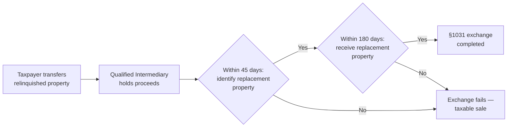
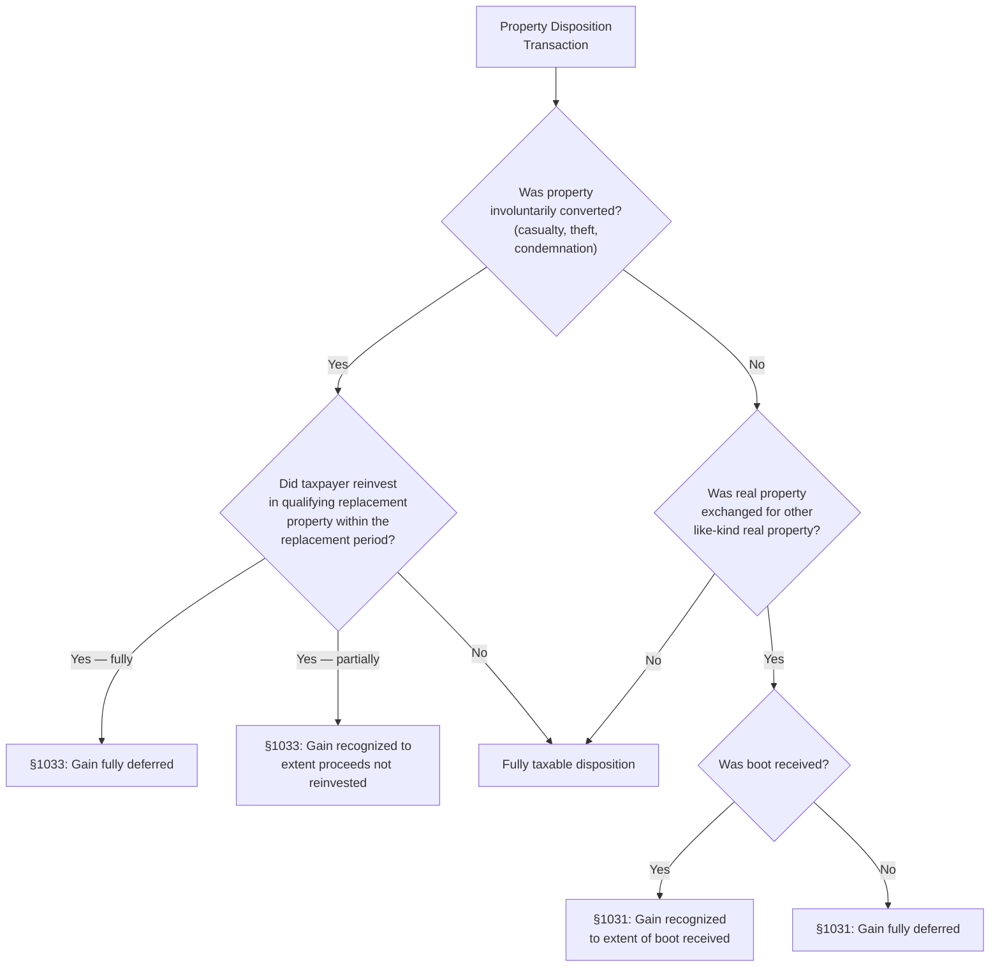

# Nontaxable Disposition of Assets

## Introduction

Not every asset disposition triggers an immediate tax liability. The Internal Revenue Code provides several **nonrecognition provisions** that allow taxpayers to defer (and sometimes permanently exclude) gains on qualifying transactions. The TCP exam tests your ability to calculate realized gain, recognized gain, and deferred gain on **like-kind exchanges** (IRC §1031) and **involuntary conversions** (IRC §1033), determine the basis of replacement property, and evaluate whether a given transaction qualifies for nontaxable treatment or must be reported as a taxable sale.

This page covers the two principal nonrecognition provisions — like-kind exchanges and involuntary conversions — with detailed calculation examples, and then provides a framework for distinguishing taxable from nontaxable transactions when reviewing client documentation.

---

## Like-Kind Exchanges (IRC §1031)

### Overview

A **like-kind exchange** allows a taxpayer to exchange qualifying real property held for productive use in a trade or business or for investment and defer recognition of gain (or loss) on the disposition. The theory is that the taxpayer has merely changed the form of their investment without cashing out — so taxation is deferred until a taxable disposition occurs.

### Qualifying Property

After the Tax Cuts and Jobs Act (TCJA) of 2017, §1031 applies **only to real property**. Personal property exchanges (vehicles, equipment, artwork, collectibles, cryptocurrency) **no longer qualify**.

| Qualifies for §1031 | Does NOT Qualify |
|---|---|
| Improved real property (office building, warehouse) | Personal property (machinery, vehicles, furniture) |
| Unimproved real property (vacant land) | Inventory or stock in trade |
| Domestic real property exchanged for domestic real property | U.S. real property exchanged for foreign real property |
| Leasehold interest in real property (≥ 30 years remaining) | Securities, stocks, bonds, partnership interests |
| Rental residential property exchanged for commercial property | Property held primarily for sale (dealer property) |

:::tip[Exam Tip]

The "like-kind" requirement for real property is **very broad** — any real property held for business or investment can be exchanged for any other real property held for business or investment. An office building can be exchanged for farmland, or a warehouse can be exchanged for a retail store. The key disqualifier is **use**: the property must be held for business or investment, not for personal use or as inventory.

:::

### Boot: Cash or Non-Like-Kind Property

A like-kind exchange rarely involves a perfectly equal swap. When one party adds cash or non-like-kind property to equalize values, the additional property is called **boot**.

| Boot Type | Effect on Payer | Effect on Receiver |
|---|---|---|
| **Cash boot** | Increases basis of new property | Triggers gain recognition (up to realized gain) |
| **Non-like-kind property boot** (e.g., equipment, vehicle) | Increases basis of new property | Triggers gain recognition; basis of boot received = FMV |
| **Mortgage relief** (other party assumes your liability) | Treated as boot **received** | Treated as boot **given** |
| **Mortgage assumed** (you assume the other party's liability) | Treated as boot **given** | Treated as boot **received** |

:::info

When both parties relieve and assume mortgages, the mortgage amounts are **netted**. Only the party with the **net mortgage relief** is treated as receiving boot.

:::

### Gain Recognition and Deferral Formulas

The following formulas are critical for exam calculations:

$$
\text{Realized Gain} = \text{FMV of Property Received} + \text{Boot Received} - \text{Adjusted Basis of Property Given} - \text{Boot Given}
$$

$$
\text{Recognized Gain} = \min(\text{Boot Received},\ \text{Realized Gain})
$$

$$
\text{Deferred Gain} = \text{Realized Gain} - \text{Recognized Gain}
$$

**Losses are never recognized** in a like-kind exchange — any realized loss is fully deferred.

### Basis of New Property

$$
\text{Basis of New Property} = \text{Adjusted Basis of Old Property} - \text{Boot Received} + \text{Boot Given} + \text{Gain Recognized}
$$

An equivalent way to think about it:

$$
\text{Basis of New Property} = \text{FMV of New Property} - \text{Deferred Gain}
$$

:::tip[Exam Tip]

The second formula is a quick check: the basis of the new property should always equal its FMV minus any deferred gain. If your calculated basis does not produce this result, recheck your work.

:::

### Holding Period

The holding period of the relinquished property **tacks onto** the replacement property. If the taxpayer held the old property for 3 years before the exchange, the new property is treated as held for 3+ years from day one.

Boot property received (non-like-kind property) gets a **new** holding period starting on the date of the exchange, with a basis equal to its FMV.

---

### Example 1: Basic Like-Kind Exchange (No Boot)

> **Example:** Bear Co. owns a warehouse (adjusted basis \$200,000, FMV \$350,000) used in its business. Bear Co. exchanges the warehouse directly for an office building (FMV \$350,000) owned by Polar Inc., also used in business.

| Step | Calculation | Amount |
|---|---|---|
| FMV of office building received | | \$350,000 |
| Adjusted basis of warehouse given | | \$200,000 |
| **Realized gain** | \$350,000 − \$200,000 | **\$150,000** |
| Boot received | | \$0 |
| **Recognized gain** | min(\$0, \$150,000) | **\$0** |
| **Deferred gain** | \$150,000 − \$0 | **\$150,000** |
| **Basis of office building** | \$200,000 − \$0 + \$0 + \$0 | **\$200,000** |

Verification: Basis of new property (\$200,000) = FMV (\$350,000) − Deferred gain (\$150,000) ✓

---

### Example 2: Like-Kind Exchange with Boot Received

> **Example:** Jordan owns an apartment building (adjusted basis \$300,000, FMV \$500,000) held for investment. Jordan exchanges it with Alex for a commercial retail space (FMV \$440,000) plus \$60,000 cash.

| Step | Calculation | Amount |
|---|---|---|
| FMV of retail space received | | \$440,000 |
| Cash (boot) received | | \$60,000 |
| Total amount realized | \$440,000 + \$60,000 | \$500,000 |
| Adjusted basis of apartment building | | \$300,000 |
| **Realized gain** | \$500,000 − \$300,000 | **\$200,000** |
| **Recognized gain** | min(\$60,000, \$200,000) | **\$60,000** |
| **Deferred gain** | \$200,000 − \$60,000 | **\$140,000** |
| **Basis of retail space** | \$300,000 − \$60,000 + \$0 + \$60,000 | **\$300,000** |

Verification: Basis (\$300,000) = FMV of retail space (\$440,000) − Deferred gain (\$140,000) ✓

---

### Example 3: Like-Kind Exchange with Mortgage Relief (Boot)

> **Example:** Polar Inc. owns a factory building (adjusted basis \$400,000, FMV \$700,000, subject to a \$150,000 mortgage). Polar Inc. exchanges the factory for a distribution center (FMV \$550,000) owned by Dana. Dana assumes the \$150,000 mortgage on the factory. No other boot is exchanged.

From Polar Inc.'s perspective, the mortgage assumed by Dana is **boot received**.

| Step | Calculation | Amount |
|---|---|---|
| FMV of distribution center received | | \$550,000 |
| Mortgage relief (boot received) | | \$150,000 |
| Total amount realized | \$550,000 + \$150,000 | \$700,000 |
| Adjusted basis of factory | | \$400,000 |
| **Realized gain** | \$700,000 − \$400,000 | **\$300,000** |
| **Recognized gain** | min(\$150,000, \$300,000) | **\$150,000** |
| **Deferred gain** | \$300,000 − \$150,000 | **\$150,000** |
| **Basis of distribution center** | \$400,000 − \$150,000 + \$0 + \$150,000 | **\$400,000** |

Verification: Basis (\$400,000) = FMV (\$550,000) − Deferred gain (\$150,000) ✓

---

### Example 4: Like-Kind Exchange with Mortgages on Both Sides

> **Example:** Sam owns a rental property (adjusted basis \$250,000, FMV \$600,000, subject to a \$200,000 mortgage). Sam exchanges the rental property for Priya's office building (FMV \$500,000, subject to a \$100,000 mortgage). Each party assumes the other's mortgage.

| Item | Sam Assumes | Sam is Relieved of |
|---|---|---|
| Mortgage | \$100,000 (boot given) | \$200,000 (boot received) |
| **Net boot received** | | **\$100,000** |

| Step | Calculation | Amount |
|---|---|---|
| FMV of office building received | | \$500,000 |
| Net boot received (mortgage relief) | \$200,000 − \$100,000 | \$100,000 |
| Total amount realized | \$500,000 + \$100,000 | \$600,000 |
| Adjusted basis of rental property | | \$250,000 |
| **Realized gain** | \$600,000 − \$250,000 | **\$350,000** |
| **Recognized gain** | min(\$100,000, \$350,000) | **\$100,000** |
| **Deferred gain** | \$350,000 − \$100,000 | **\$250,000** |
| **Basis of office building** | \$250,000 − \$100,000 + \$0 + \$100,000 | **\$250,000** |

Verification: Basis (\$250,000) = FMV (\$500,000) − Deferred gain (\$250,000) ✓

:::caution

When netting mortgages, only the party with the **net mortgage relief** recognizes boot. The party with the net mortgage assumed is treated as **giving** boot (which does not trigger gain recognition).

:::

---

### Related Party Rules for §1031

If a like-kind exchange occurs between **related parties** (as defined under §267(b) — family members, controlled entities, etc.), both parties must hold the replacement property for at least **2 years** after the exchange. If either party disposes of the property within the 2-year period, the original exchange is **disqualified** and the deferred gain becomes taxable in the year of the subsequent disposition.

| Related Party Rule | Detail |
|---|---|
| **Holding requirement** | Both parties must hold replacement property for ≥ 2 years |
| **Consequence of violation** | Deferred gain is recognized in the year of the early disposition |
| **Exceptions** | Death of either party, involuntary conversion, or non-tax-avoidance transactions |

> **Example:** Derek exchanges investment land (basis \$100,000, FMV \$250,000) with his sister Jamie for her rental building (FMV \$250,000). Fourteen months later, Jamie sells the rental building for \$260,000. Because the disposition occurs within 2 years and the parties are related, Derek must recognize his \$150,000 deferred gain in the year Jamie sells the property.

---

### Deferred (Starker) Exchanges

Most like-kind exchanges do not happen simultaneously. A **deferred exchange** (also called a Starker exchange) allows a taxpayer to sell the relinquished property first and acquire the replacement property later, using a **qualified intermediary** (QI) to hold the proceeds.

| Deadline | Rule |
|---|---|
| **45-day identification period** | Taxpayer must identify potential replacement property(ies) in writing within 45 days of transferring the relinquished property |
| **180-day exchange period** | Taxpayer must receive the replacement property within 180 days of transferring the relinquished property **or** by the due date (with extensions) of the tax return for the year of transfer — **whichever is earlier** |
| **Three-property rule** | Taxpayer may identify up to **3** replacement properties regardless of value |
| **200% rule** | Alternatively, taxpayer may identify any number of properties as long as their aggregate FMV does not exceed **200%** of the FMV of the relinquished property |

:::warning

If the taxpayer has **actual or constructive receipt** of the exchange proceeds (e.g., the proceeds are deposited in the taxpayer's bank account rather than held by a QI), the exchange fails and the transaction is treated as a taxable sale. The qualified intermediary structure is essential.

:::

> **Example:** Illini Entertainment sells a commercial building (adjusted basis \$500,000) for \$900,000 on March 1. The proceeds are held by a qualified intermediary. On April 10 (within 45 days), Illini Entertainment identifies a replacement office complex. On July 15 (within 180 days), the QI uses the proceeds to acquire the office complex for \$950,000, and Illini Entertainment pays \$50,000 of additional cash.

| Step | Calculation | Amount |
|---|---|---|
| FMV of office complex received | | \$950,000 |
| Amount realized on old property | | \$900,000 |
| Adjusted basis of old building | | \$500,000 |
| Additional cash paid (boot given) | | \$50,000 |
| **Realized gain** | \$900,000 − \$500,000 | **\$400,000** |
| Boot received | | \$0 |
| **Recognized gain** | min(\$0, \$400,000) | **\$0** |
| **Deferred gain** | \$400,000 − \$0 | **\$400,000** |
| **Basis of office complex** | \$500,000 − \$0 + \$50,000 + \$0 | **\$550,000** |

Verification: Basis (\$550,000) = FMV (\$950,000) − Deferred gain (\$400,000) ✓

Because Illini Entertainment reinvested **all** of the proceeds (and more), no boot was received and the entire gain is deferred.

---

## Involuntary Conversions (IRC §1033)

### Overview

An **involuntary conversion** occurs when property is destroyed, stolen, condemned, or disposed of under threat of condemnation, and the taxpayer receives insurance proceeds, a condemnation award, or other compensation. IRC §1033 allows the taxpayer to **elect to defer** the gain if the proceeds are reinvested in **similar-use** replacement property within the required replacement period.

Unlike §1031 (which is mandatory if the requirements are met), §1033 deferral is **elective** — the taxpayer must choose to apply nonrecognition treatment.

### Qualifying Events

| Qualifying Event | Description |
|---|---|
| **Destruction** | Fire, flood, storm, earthquake, or other casualty |
| **Theft** | Property stolen from the taxpayer |
| **Condemnation** | Government takes property through eminent domain |
| **Threat of condemnation** | Taxpayer sells property after being informed condemnation is imminent |

### Direct Conversion vs. Proceeds Received

| Conversion Type | Rule |
|---|---|
| **Direct conversion** (property received directly as compensation) | **No gain recognized** — mandatory nonrecognition; basis of replacement property = basis of old property |
| **Proceeds received** (cash from insurance, condemnation award) | Gain recognized only to the extent the proceeds **exceed** the cost of replacement property; taxpayer must **elect** deferral |

### Replacement Property Requirements

| Property Type | Replacement Standard | Replacement Period |
|---|---|---|
| **Personal-use or business personal property** | **Similar or related in service or use** (functional-use test — must serve same function) | **2 years** after close of the taxable year in which gain is first realized |
| **Real property condemned (business/investment use)** | **Like-kind** (broader — any real property held for business or investment) | **3 years** after close of the taxable year in which gain is first realized |
| **Federally declared disaster (principal residence)** | Tangible replacement property for scheduled personal property | **4 years** |

:::info

The replacement standard for **condemned real property** is the broader like-kind standard (same as §1031), while other involuntary conversions use the narrower functional-use test. This distinction is frequently tested on the exam.

:::

### Gain Recognition and Deferral Formulas

$$
\text{Realized Gain} = \text{Amount Realized (proceeds)} - \text{Adjusted Basis of Converted Property}
$$

$$
\text{Recognized Gain} = \max\bigl(\text{Proceeds} - \text{Cost of Replacement Property},\ 0\bigr)
$$

$$
\text{Deferred Gain} = \text{Realized Gain} - \text{Recognized Gain}
$$

### Basis of Replacement Property

$$
\text{Basis of Replacement Property} = \text{Cost of Replacement Property} - \text{Deferred Gain}
$$

---

### Example 5: Full Reinvestment — Complete Deferral

> **Example:** Bear Co.'s warehouse (adjusted basis \$300,000) is destroyed by a fire. Bear Co. receives \$500,000 in insurance proceeds and uses all \$500,000 to purchase a new warehouse within 2 years.

| Step | Calculation | Amount |
|---|---|---|
| Insurance proceeds (amount realized) | | \$500,000 |
| Adjusted basis of destroyed warehouse | | \$300,000 |
| **Realized gain** | \$500,000 − \$300,000 | **\$200,000** |
| Cost of replacement warehouse | | \$500,000 |
| Proceeds not reinvested | \$500,000 − \$500,000 | \$0 |
| **Recognized gain** | max(\$0, \$0) | **\$0** |
| **Deferred gain** | \$200,000 − \$0 | **\$200,000** |
| **Basis of new warehouse** | \$500,000 − \$200,000 | **\$300,000** |

Bear Co. defers the entire \$200,000 gain. The basis of the new warehouse equals the basis of the old warehouse — the deferred gain is preserved in the lower basis.

---

### Example 6: Partial Reinvestment — Partial Recognition

> **Example:** BIF Partners owns investment land (adjusted basis \$150,000) that is condemned by the city for a highway project. BIF Partners receives a condemnation award of \$400,000. BIF Partners elects §1033 treatment and purchases replacement investment land for \$350,000 within 3 years (condemned real property held for investment — the 3-year replacement period applies).

| Step | Calculation | Amount |
|---|---|---|
| Condemnation award (amount realized) | | \$400,000 |
| Adjusted basis of condemned land | | \$150,000 |
| **Realized gain** | \$400,000 − \$150,000 | **\$250,000** |
| Cost of replacement land | | \$350,000 |
| Proceeds not reinvested | \$400,000 − \$350,000 | \$50,000 |
| **Recognized gain** | max(\$50,000, \$0) | **\$50,000** |
| **Deferred gain** | \$250,000 − \$50,000 | **\$200,000** |
| **Basis of replacement land** | \$350,000 − \$200,000 | **\$150,000** |

BIF Partners recognizes \$50,000 of gain (the portion of the proceeds not reinvested) and defers \$200,000.

---

### Example 7: Proceeds Exceed Cost — Full Recognition Scenario

> **Example:** Alex owns a rental property (adjusted basis \$180,000) destroyed by a storm. Alex receives \$280,000 in insurance proceeds but only purchases replacement rental property for \$170,000 within the replacement period.

| Step | Calculation | Amount |
|---|---|---|
| Insurance proceeds (amount realized) | | \$280,000 |
| Adjusted basis of destroyed property | | \$180,000 |
| **Realized gain** | \$280,000 − \$180,000 | **\$100,000** |
| Cost of replacement property | | \$170,000 |
| Proceeds not reinvested | \$280,000 − \$170,000 | \$110,000 |
| **Recognized gain** | min(\$110,000, \$100,000) | **\$100,000** |
| **Deferred gain** | \$100,000 − \$100,000 | **\$0** |
| **Basis of replacement property** | \$170,000 − \$0 | **\$170,000** |

Because the unreinvested proceeds (\$110,000) exceed the realized gain (\$100,000), the entire gain is recognized. No deferral is available — the basis of the replacement property is simply its cost.

:::caution

Recognized gain under §1033 can **never exceed** the realized gain. Even if the taxpayer pockets a large portion of the proceeds, gain recognition is capped at the total realized gain.

:::

---

### Example 8: Direct Conversion

> **Example:** The city condemns Bear Co.'s commercial building and provides a replacement building directly (no cash proceeds). The old building had an adjusted basis of \$450,000, and the replacement building has a FMV of \$600,000.

| Step | Result |
|---|---|
| **Recognized gain** | **\$0** (direct conversion — mandatory nonrecognition) |
| **Basis of replacement building** | **\$450,000** (carries over from old property) |

In a direct conversion, the taxpayer never has access to cash, so there is no opportunity to "cash out." Gain is fully deferred by definition.

---

## Determining Taxable vs. Nontaxable Transactions

### Framework for Reviewing Transactions

When presented with a property disposition on the TCP exam, use the following decision framework:

### Key Documentation to Review

When evaluating whether a transaction qualifies for nonrecognition, the following documents and facts are critical:

| Document / Fact | What to Look For |
|---|---|
| **Deed / title transfer records** | Confirms real property was transferred — needed for §1031 qualification |
| **Exchange agreement / QI agreement** | Confirms a qualified intermediary was used and the exchange structure is valid |
| **45-day identification letter** | Confirms replacement property was identified within 45 days (deferred exchanges) |
| **Closing statements / settlement sheets** | Shows amounts paid, boot received, mortgages assumed or relieved |
| **Insurance claim / condemnation award** | Confirms involuntary conversion event and proceeds received |
| **Replacement property purchase agreement** | Confirms cost and date of replacement — needed to verify the replacement period |
| **Appraisals** | Supports FMV of properties exchanged — important for related party transactions |
| **Holding period records** | Verifies property was held for business/investment use (not personal use or inventory) |

### Comparison: Taxable Sales vs. §1031 vs. §1033

| Feature | Taxable Sale | §1031 Like-Kind Exchange | §1033 Involuntary Conversion |
|---|---|---|---|
| **Trigger** | Voluntary sale for cash | Exchange of like-kind real property | Casualty, theft, condemnation |
| **Gain recognition** | Full gain recognized | Gain recognized only to extent of boot received | Gain recognized only to extent proceeds not reinvested |
| **Loss recognition** | Allowed (subject to limitations) | **Not allowed** — loss deferred | Allowed for casualty/theft losses (subject to limitations) |
| **Election required?** | N/A | No — mandatory if requirements met | **Yes** — taxpayer must elect §1033 |
| **Replacement property** | N/A | Like-kind real property | Similar use (or like-kind for condemned real property) |
| **Time requirements** | N/A | 45-day ID / 180-day receipt | 2 years (general) or 3 years (condemned real property) |
| **Basis of new property** | Cost | Adjusted basis of old property ± boot ± gain recognized | Cost − deferred gain |
| **Holding period** | Starts new | **Tacks** from old property | Starts new (unless direct conversion) |

:::danger

A common exam trap: §1031 **defers losses** — they are never recognized in a like-kind exchange. In contrast, casualty and theft losses from involuntary conversions may be recognized under the casualty loss rules (subject to floors and limitations). If the exam presents an exchange of like-kind property at a loss, the answer is always **no loss recognized**.

:::

---

### Example 9: Classifying a Transaction

> **Example:** Illini Entertainment receives a letter from the county stating it intends to condemn a parking lot (adjusted basis \$120,000) for a public park. In response, Illini Entertainment sells the parking lot to the county for \$200,000 and uses \$185,000 to buy a replacement parking lot within 2 years.

This qualifies as an involuntary conversion under §1033 — a sale under **threat of condemnation** is treated as a condemnation. Because the condemned property is real property used in business, the replacement period is 3 years and the replacement standard is **like-kind**.

| Step | Calculation | Amount |
|---|---|---|
| Amount realized | | \$200,000 |
| Adjusted basis | | \$120,000 |
| **Realized gain** | \$200,000 − \$120,000 | **\$80,000** |
| Cost of replacement | | \$185,000 |
| Proceeds not reinvested | \$200,000 − \$185,000 | \$15,000 |
| **Recognized gain** | min(\$15,000, \$80,000) | **\$15,000** |
| **Deferred gain** | \$80,000 − \$15,000 | **\$65,000** |
| **Basis of replacement lot** | \$185,000 − \$65,000 | **\$120,000** |

:::tip[Exam Tip]

A **threat of condemnation** qualifies for §1033 treatment just like an actual condemnation — but the taxpayer must have been informed in writing or have reasonable grounds to believe the condemnation is imminent. A mere rumor is not sufficient.

:::

---

### Example 10: Transaction That Does NOT Qualify

> **Example:** Jamie owns investment land (adjusted basis \$90,000, FMV \$160,000). Jamie sells the land to an unrelated buyer for \$160,000 cash and uses the proceeds to buy different investment land for \$160,000 three months later.

This is a **taxable sale**, not a like-kind exchange or involuntary conversion:

- **Not §1031**: Jamie sold the land for cash. There was no exchange of properties and no qualified intermediary holding the proceeds. A sale followed by a separate purchase is not a like-kind exchange.
- **Not §1033**: The disposition was voluntary — there was no casualty, theft, or condemnation.

Jamie recognizes the full \$70,000 gain (\$160,000 − \$90,000), and the basis of the new land is its cost of \$160,000.

---

## Summary

| Concept | Key Rule |
|---|---|
| **§1031 — Qualifying property** | Real property held for business or investment only (post-TCJA); personal property no longer qualifies |
| **§1031 — Recognized gain** | Lesser of boot received or realized gain; loss is **never** recognized |
| **§1031 — Basis of new property** | Adjusted basis of old property − boot received + boot given + gain recognized |
| **§1031 — Holding period** | Tacks from relinquished property |
| **§1031 — Deferred exchange deadlines** | Identify replacement property within **45 days**; receive within **180 days** (or tax return due date, whichever is earlier) |
| **§1031 — Related party rule** | Both parties must hold replacement property for **2 years** or the exchange is disqualified |
| **§1033 — Qualifying events** | Casualty, theft, condemnation, or threat of condemnation |
| **§1033 — Election** | Taxpayer must **elect** to defer gain (unlike §1031, which is mandatory) |
| **§1033 — Recognized gain** | Proceeds not reinvested in qualifying replacement property (capped at realized gain) |
| **§1033 — Basis of replacement property** | Cost of replacement property − deferred gain |
| **§1033 — Replacement period** | **2 years** (general); **3 years** (real property condemned for business/investment use) |
| **§1033 — Replacement standard** | Similar or related in service or use (general); **like-kind** for condemned real property |
| **Taxable vs. nontaxable** | Voluntary cash sales are taxable; like-kind exchanges defer gain; involuntary conversions defer gain if reinvested |
