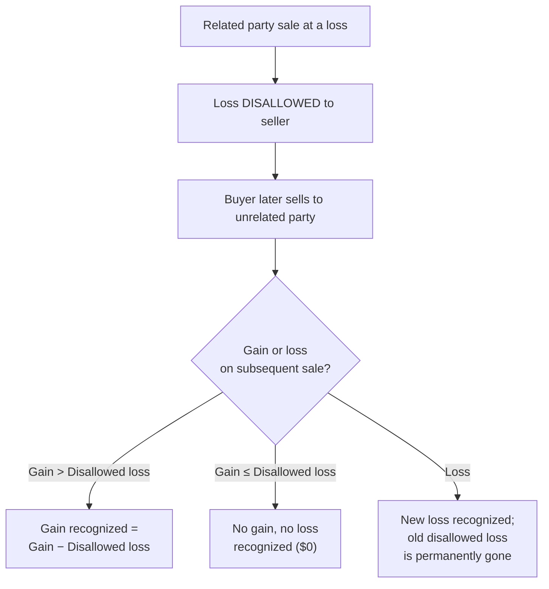

# Related Party Transactions

## Introduction

When taxpayers transact with parties who share close economic or familial ties, the tax law imposes special rules to prevent abuse — particularly the shifting of income and losses between related persons. The TCP exam requires you to **identify related parties** under IRC §267 and §707, **calculate direct and indirect (constructive) ownership percentages**, determine whether losses are **disallowed** on related party sales, compute the tax consequences when the buyer later **resells to an unrelated party**, apply the **gain recharacterization** rules of §1239, and calculate **imputed interest** under §7872 and §1274 when below-market or no-interest loans exist between related parties.

This page builds on the foundational coverage of related party loss disallowance introduced in REG and goes significantly deeper into constructive ownership calculations, the three outcomes on subsequent disposition, and the imputed interest framework.

---

## Related Party Definitions

### IRC §267 — Losses, Expenses, and Interest

Section 267 defines the following relationships as "related parties" for purposes of **loss disallowance** and certain expense/interest timing rules:

| Relationship | Description |
|---|---|
| **Family members** | Siblings (whole or half), spouse, ancestors (parents, grandparents), and lineal descendants (children, grandchildren) |
| **Individual and corporation** | An individual who owns **more than 50%** of the corporation's stock (directly or indirectly) |
| **Two corporations** | Members of the same **controlled group** (typically > 50% common ownership) |
| **Grantor and fiduciary** | A grantor and the fiduciary of a trust created by that grantor |
| **Fiduciary and beneficiary** | The fiduciary and beneficiary of the same trust |
| **Two trusts** | Fiduciaries of trusts created by the same grantor |
| **Tax-exempt organization** | An organization and a person who controls it |

:::warning

**Not** considered related parties under §267: aunts, uncles, cousins, in-laws, nieces, and nephews. This is a common exam trap — the family definition is narrower than you might expect.

:::

### IRC §707 — Partnership Transactions

Under §707(b), transactions between a **partnership** and a partner (or between two partnerships) are subject to related party treatment when:

- A partner owns **more than 50%** of the capital or profits interest in the partnership (directly or indirectly).
- Two partnerships in which the **same persons** own more than 50% of the capital or profits interests.

### Attribution (Constructive Ownership) Rules

Taxpayers are deemed to own stock or partnership interests held by certain related persons. This is critical because the **more-than-50% threshold** is tested using both **direct** and **constructive** ownership.

| Attribution Type | Rule |
|---|---|
| **Family attribution** | An individual is deemed to own stock owned by their spouse, children, grandchildren, and parents |
| **Entity-to-owner attribution** | Stock owned by a partnership, S corporation, estate, or trust is attributed proportionally to the partners, shareholders, or beneficiaries |
| **Owner-to-entity attribution** | Stock owned by a partner (≥ 50% interest) or beneficiary is attributed to the partnership, S corporation, estate, or trust |

:::caution

Under §267, there is **no re-attribution from family to family** (sometimes called "sidewise" attribution). Stock attributed to an individual from their spouse **cannot** then be re-attributed from that individual to their parent. However, entity attribution **can** chain through multiple levels.

:::

---

## Direct and Indirect Ownership Calculations

### Direct Ownership

Direct ownership is straightforward — it is the percentage of stock or partnership interest that a taxpayer holds in their own name.

> **Example:** Jordan owns 300 of the 1,000 outstanding shares of Bear Co. common stock. Jordan's direct ownership is:
>
> $$
> \frac{300}{1{,}000} = 30\%
> $$

### Constructive (Indirect) Ownership

To determine total ownership for the more-than-50% test, add direct ownership to any ownership attributed from family members or entities.

#### Step-by-Step: Family Attribution

> **Example:** Alex owns 25% of Polar Inc. stock directly. Alex's spouse, Dana, owns 30% of Polar Inc. stock directly.
>
> | Source | Ownership |
> |---|---|
> | Alex — direct | 25% |
> | Attributed from spouse Dana | 30% |
> | **Total (direct + constructive)** | **55%** |
>
> Because Alex's total ownership exceeds 50%, Alex and Polar Inc. are **related parties** under §267. Any loss on a sale between Alex and Polar Inc. would be **disallowed**.

#### Step-by-Step: Entity Attribution

> **Example:** Priya owns a 60% capital and profits interest in BIF Partners. BIF Partners owns 400 of the 1,000 outstanding shares of Bear Co. (40%).
>
> Priya's constructive ownership of Bear Co. stock through BIF Partners:
>
> $$
> 60\% \times 40\% = 24\%
> $$
>
> If Priya also owns 30% of Bear Co. directly:
>
> | Source | Ownership of Bear Co. |
> |---|---|
> | Priya — direct | 30% |
> | Attributed from BIF Partners (60% × 40%) | 24% |
> | **Total** | **54%** |
>
> Priya and Bear Co. are related parties (54% > 50%).

#### Multiple-Chain Attribution

> **Example:** Sam owns 80% of Illini Entertainment (a corporation). Illini Entertainment owns 70% of Bear Co. Sam also has a spouse, Jamie, who owns 10% of Bear Co. directly.
>
> | Source | Ownership of Bear Co. |
> |---|---|
> | Sam — direct | 0% |
> | Attributed from Illini Entertainment (80% × 70%) | 56% |
> | Attributed from spouse Jamie | 10% |
> | **Total** | **66%** |
>
> Sam and Bear Co. are related parties. Additionally, **Illini Entertainment and Bear Co.** are in the same controlled group (Illini Entertainment directly owns 70% of Bear Co.).

### Corporation Stock Ownership Test

For an individual-to-corporation relationship, aggregate **all** of the following:

1. Shares the individual owns directly.
2. Shares attributed from the individual's family (spouse, children, grandchildren, parents).
3. Shares attributed proportionally from any partnership, estate, trust, or corporation in which the individual has an ownership interest.

If the total exceeds 50% of the corporation's outstanding stock, the individual and the corporation are related parties.

### Partnership Interest Ownership Test

The test mirrors the corporate test but uses **capital interest** or **profits interest** (whichever is greater). A partner who owns more than 50% (directly or constructively) of the capital or profits interest is a related party to the partnership.

:::tip[Exam Tip]

When the exam gives you a chain of ownership percentages, **multiply through** for entity attribution (proportional), but **add fully** for family attribution (100% of family member's shares are attributed, not a proportional amount).

:::

---

## Loss Disallowance (IRC §267)

### The Basic Rule

When a taxpayer sells or exchanges property **at a loss** to a related party, the loss is **completely disallowed**. The seller cannot deduct the loss in the current year, in any future year, or carry it forward. The loss simply disappears for the seller.

However, the **buyer** receives a potential benefit: the disallowed loss may offset gain if the buyer later sells the property to an **unrelated third party**.

### The Three Outcomes on Subsequent Sale

When the related-party buyer later sells the property to an unrelated party, there are exactly three possible outcomes:

| Scenario | Subsequent Sale Result | Tax Treatment |
|---|---|---|
| **1. Gain exceeds disallowed loss** | Buyer sells at a gain greater than the disallowed loss | Recognize gain **reduced by** the disallowed loss |
| **2. Gain is less than disallowed loss** | Buyer sells at a gain, but gain ≤ disallowed loss | Recognize **\$0** gain (no gain, no loss) |
| **3. Loss on subsequent sale** | Buyer sells at a loss | Recognize the **new loss only**; the original disallowed loss is **permanently lost** |

### Scenario 1 — Gain Exceeds Disallowed Loss

> **Example:** Derek owns 100% of Bear Co. Derek sells land with a basis of \$100,000 to Bear Co. for \$70,000.
>
> **Step 1 — Related party sale:**
>
> | Item | Amount |
> |---|---|
> | Amount realized | \$70,000 |
> | Adjusted basis | \$100,000 |
> | Realized loss | (\$30,000) |
> | **Loss disallowed under §267** | **(\$30,000)** |
>
> Derek recognizes **\$0** loss. Bear Co.'s basis in the land = \$70,000 (cost).
>
> **Step 2 — Bear Co. sells to unrelated buyer for \$120,000:**
>
> | Item | Amount |
> |---|---|
> | Amount realized | \$120,000 |
> | Bear Co.'s basis | \$70,000 |
> | Realized gain | \$50,000 |
> | Less: Disallowed loss offset | (\$30,000) |
> | **Recognized gain** | **\$20,000** |
>
> The \$30,000 disallowed loss offsets \$30,000 of Bear Co.'s gain. Bear Co. recognizes only \$20,000.

### Scenario 2 — Gain Is Less Than the Disallowed Loss

> **Example:** Using the same original transaction (Derek → Bear Co., \$30,000 disallowed loss, Bear Co.'s basis = \$70,000), Bear Co. later sells the land to an unrelated buyer for \$90,000.
>
> | Item | Amount |
> |---|---|
> | Amount realized | \$90,000 |
> | Bear Co.'s basis | \$70,000 |
> | Realized gain | \$20,000 |
> | Less: Disallowed loss offset (limited to gain) | (\$20,000) |
> | **Recognized gain** | **\$0** |
>
> The gain (\$20,000) is less than the disallowed loss (\$30,000), so the entire gain is eliminated. Bear Co. recognizes **no gain and no loss**. The remaining \$10,000 of the disallowed loss is permanently lost.

### Scenario 3 — Loss on the Subsequent Sale

> **Example:** Again using the same original transaction, Bear Co. later sells the land to an unrelated buyer for \$60,000.
>
> | Item | Amount |
> |---|---|
> | Amount realized | \$60,000 |
> | Bear Co.'s basis | \$70,000 |
> | Realized loss | (\$10,000) |
> | **Recognized loss** | **(\$10,000)** |
>
> Bear Co. recognizes the \$10,000 loss from its own sale. The original \$30,000 disallowed loss from Derek's sale provides **no benefit** — it is permanently lost. The disallowed loss can only offset **gains**, never increase a loss.

:::tip[Exam Tip]

Think of the disallowed loss as a "coupon" that the buyer holds. It can **reduce a gain** on a subsequent sale to an unrelated party — but it can never create or increase a loss. If the buyer sells at a loss, the coupon expires worthless.

:::

### Comprehensive Worked Example

> **Example:** Jordan owns 60% of Polar Inc. Jordan sells equipment (adjusted basis \$80,000) to Polar Inc. for \$55,000.
>
> **Step 1 — Disallowed loss:**
>
> $$
> \text{Realized loss} = \$55{,}000 - \$80{,}000 = (\$25{,}000)
> $$
>
> Loss is **disallowed** because Jordan and Polar Inc. are related parties (60% > 50%). Jordan recognizes \$0. Polar Inc.'s basis in the equipment = \$55,000.
>
> **Step 2 — Polar Inc. sells the equipment to an unrelated buyer for \$72,000:**
>
> $$
> \text{Realized gain} = \$72{,}000 - \$55{,}000 = \$17{,}000
> $$
>
> The realized gain (\$17,000) is less than the disallowed loss (\$25,000), so:
>
> $$
> \text{Recognized gain} = \$0
> $$
>
> The remaining \$8,000 of disallowed loss (\$25,000 − \$17,000) is permanently lost.

---

## Gain Recharacterization — Capital to Ordinary (IRC §1239)

### The Rule

When **depreciable property** is sold between related parties, any **gain** on the sale is recharacterized as **ordinary income** rather than capital gain. The rationale is to prevent a taxpayer from selling property to a related party to generate a capital gain (taxed at lower rates) while the buyer takes depreciation deductions against ordinary income (taxed at higher rates).

### Applicability

Section 1239 applies when **all** of the following are true:

| Requirement | Detail |
|---|---|
| **Sale at a gain** | The transaction produces a gain (§1239 does not apply to losses) |
| **Depreciable property** | The property is depreciable **in the hands of the buyer** |
| **Related parties** | The seller and buyer are related under §1239's definition |

### Related Party Definition Under §1239

The §1239 definition of related parties is **narrower** than §267:

| Related Party Relationship | §1239 Applies? |
|---|---|
| Taxpayer and spouse | ✅ Yes |
| Individual and > 50% owned entity (corporation, partnership) | ✅ Yes |
| Two entities with > 50% common ownership | ✅ Yes |
| Siblings, parents, children (without entity ownership) | ❌ No (§1239 does not use family attribution for this purpose beyond spouse) |

:::info

The key distinction: under §1239, the **more-than-50% ownership test** uses constructive ownership rules. But the core trigger is that the property must be **depreciable in the buyer's hands**.

:::

> **Example:** Alex owns 100% of Bear Co. Alex sells a building to Bear Co. for \$500,000. Alex's adjusted basis in the building is \$350,000. Bear Co. will use the building in its business and depreciate it.
>
> | Item | Amount |
> |---|---|
> | Amount realized | \$500,000 |
> | Adjusted basis | \$350,000 |
> | Gain | \$150,000 |
> | **Character under §1239** | **Ordinary income** |
>
> Without §1239, the gain might have been §1231 gain (long-term capital gain treatment). Because the buyer (Bear Co.) is related to the seller (Alex, 100% owner) and will depreciate the building, the entire \$150,000 gain is **ordinary income**.

> **Example:** Dana sells a computer (adjusted basis \$2,000) to Dana's sibling, Priya, for \$5,000. Priya uses the computer in her sole proprietorship.
>
> Even though the computer is depreciable in Priya's hands, siblings are **not related parties under §1239** (they are related under §267 but not §1239). The \$3,000 gain retains its normal character — it would likely be ordinary income under §1245 recapture anyway, but §1239 is not the operative section here.

---

## Imputed Interest (IRC §7872 and §1274)

### Overview

When related parties enter into loans or seller-financed sales with **below-market interest rates** (or no interest at all), the IRS **imputes** interest at the **Applicable Federal Rate (AFR)**. This prevents parties from disguising interest income as gifts or capital gains and avoiding the proper tax treatment.

### Applicable Federal Rate (AFR)

The IRS publishes AFRs monthly for three term categories:

| Loan Term | AFR Category |
|---|---|
| ≤ 3 years | Short-term AFR |
| > 3 years but ≤ 9 years | Mid-term AFR |
| > 9 years | Long-term AFR |

:::info

You will **not** need to memorize specific AFR percentages for the exam — they will be provided in the question. You must know **which rate applies** based on the loan term and **how to calculate** imputed interest.

:::

### Below-Market Loans (IRC §7872)

A **below-market loan** is any loan where the stated interest rate is less than the AFR. Section 7872 applies to the following categories of below-market loans between related parties:

| Loan Type | Description | Tax Treatment of Imputed Interest |
|---|---|---|
| **Gift loan** | Loan between family members (e.g., parent to child) | Imputed interest treated as a **gift** from lender to borrower, then as **interest income** from borrower to lender |
| **Compensation-related loan** | Employer to employee | Imputed interest treated as **compensation** to borrower, then as **interest income** to lender |
| **Corporation-shareholder loan** | Corporation to shareholder (or vice versa) | Imputed interest treated as a **dividend** to shareholder, then as **interest income** to the corporation |
| **Tax avoidance loan** | Any loan with a principal purpose of tax avoidance | Imputed interest treated as **interest income** to lender |

### Imputed Interest Calculation

For a **demand loan** (payable on demand), imputed interest is calculated each year as:

$$
\text{Imputed Interest} = \text{Loan Principal} \times (\text{AFR} - \text{Stated Rate})
$$

For a **term loan** (fixed repayment date), the imputed interest is the **excess** of the amount loaned over the **present value** of all required payments, discounted at the AFR.

> **Example:** On January 1, Sam lends \$200,000 to Jamie (Sam's adult child) as a demand loan at 1% annual interest. The applicable short-term AFR is 5%.
>
> **Year 1 imputed interest calculation:**
>
> | Item | Amount |
> |---|---|
> | Loan principal | \$200,000 |
> | AFR | 5% |
> | Stated rate | 1% |
> | Interest differential | 4% |
> | **Imputed interest** | **\$8,000** |
>
> Tax consequences:
> - Sam is treated as making a **\$8,000 gift** to Jamie.
> - Jamie is treated as paying **\$8,000 of interest** to Sam.
> - Sam reports **\$8,000 of interest income** (in addition to the \$2,000 actually received, totaling \$10,000).
> - Jamie may deduct the imputed interest if it qualifies (e.g., investment interest, mortgage interest).

### De Minimis Exceptions

Congress provided safe harbors to exclude small loans from imputed interest rules:

| Exception | Threshold | Condition |
|---|---|---|
| **Gift loans** | Aggregate loans ≤ **\$10,000** | Imputed interest rules **do not apply** unless the loan is directly used to purchase income-producing assets |
| **Gift loans — investment income cap** | Aggregate loans between **\$10,001** and **\$100,000** | Imputed interest is limited to the borrower's **net investment income** for the year; if net investment income ≤ \$1,000, it is treated as **\$0** |
| **Compensation & corporation-shareholder loans** | Aggregate loans ≤ **\$10,000** | Imputed interest rules do not apply if tax avoidance is **not** a principal purpose |

> **Example:** Derek lends \$8,000 to his son, Jordan, interest-free. The loan is not used to purchase income-producing assets. Because the aggregate gift loans between them do not exceed \$10,000, the imputed interest rules **do not apply**. No interest income is imputed to Derek.

> **Example:** Priya lends \$60,000 to her daughter, Alex, interest-free. Alex's net investment income for the year is \$750.
>
> Because the loan exceeds \$10,000 but does not exceed \$100,000, the imputed interest is capped at Alex's net investment income. Since Alex's net investment income (\$750) is ≤ \$1,000, it is treated as **\$0**. No imputed interest applies for this year.

:::tip[Exam Tip]

The **\$10,000 de minimis exception** applies across all three loan categories (gift, compensation, corporation-shareholder). But for gift loans between \$10,001 and \$100,000, always check the borrower's **net investment income** — it may further reduce or eliminate the imputed amount.

:::

### Seller-Financed Sales and Original Issue Discount (IRC §1274)

When a related party sells property and provides **seller financing** at a below-market rate (or with no stated interest), §1274 recharacterizes a portion of the stated purchase price as **imputed interest** (Original Issue Discount, or OID).

**How it works:**

1. The IRS computes the **present value** of all payments under the installment note, discounted at the AFR.
2. If the present value is **less** than the stated principal, the difference is **OID** — treated as interest income to the seller and interest expense to the buyer over the life of the note.
3. The **stated principal is reduced** by the OID amount, which reduces the seller's amount realized (and the buyer's basis in the property).

> **Example:** Jamie sells land (basis \$100,000) to Bear Co. (owned 100% by Jamie) for \$300,000. The sale is structured as a 5-year installment note with **0% stated interest**. The mid-term AFR is 5%.
>
> **Step 1 — Present value of payments:**
>
> The note calls for a single \$300,000 payment in 5 years at 0% interest.
>
> $$
> \text{PV} = \frac{\$300{,}000}{(1.05)^5} = \frac{\$300{,}000}{1.27628} = \$235{,}058
> $$
>
> **Step 2 — Original Issue Discount:**
>
> $$
> \text{OID} = \$300{,}000 - \$235{,}058 = \$64{,}942
> $$
>
> **Step 3 — Tax treatment:**
>
> | Item | Amount |
> |---|---|
> | Stated sale price | \$300,000 |
> | Less: OID (imputed interest) | (\$64,942) |
> | **Adjusted sale price** (amount realized) | **\$235,058** |
> | Seller's basis | \$100,000 |
> | **Gain on sale** | **\$135,058** |
>
> Jamie reports \$64,942 as **interest income** over the 5-year term (accruing under OID rules). The gain of \$135,058 is reported as capital gain (assuming the land is a capital asset). Bear Co.'s depreciable basis in the land is \$235,058, not \$300,000.

### Sale Price Threshold for Seller-Financed Sales

| Sale Price | Rule |
|---|---|
| ≤ **\$250,000** | Imputed interest rules under §1274 **do not apply** (safe harbor for small transactions) |
| > **\$250,000** | Must test the stated interest rate against the AFR; if below AFR, imputed interest applies |

:::danger

Do not confuse the **\$10,000** de minimis exception for loans with the **\$250,000** threshold for seller-financed sales. They apply to different types of transactions (loans vs. installment sales) and are tested under different code sections (§7872 vs. §1274).

:::

---

## Planning Considerations

### Structuring Transactions to Avoid Related Party Issues

| Strategy | Explanation |
|---|---|
| **Sell to an unrelated party first** | If a taxpayer wants to recognize a loss, sell the asset on the open market rather than to a family member or controlled entity |
| **Reduce ownership below 50%** | Divesting ownership to fall below the more-than-50% threshold removes the related party designation (but watch constructive ownership) |
| **Charge adequate interest** | On intercompany or family loans, set the stated rate ≥ AFR to avoid imputed interest |
| **Use fair market value** | Document that the sale price reflects FMV to withstand IRS scrutiny; obtain independent appraisals for significant transactions |
| **Timing of transactions** | Avoid selling loss property to a related party near year-end — the loss disallowance applies regardless of the business purpose |

### Documentation Requirements

Transactions between related parties receive heightened IRS scrutiny. Best practices include:

- **Independent appraisals** for property sales between related parties.
- **Written loan agreements** with stated interest rates, repayment schedules, and arm's-length terms.
- **Contemporaneous records** documenting the business purpose of the transaction.
- **Transfer pricing documentation** for intercompany transactions between commonly controlled entities.

:::warning

The IRS may **recharacterize** a related party transaction that lacks economic substance. A sale between family members at a price significantly below FMV may be treated as a **part-sale, part-gift**, changing the tax consequences entirely.

:::

---

## Summary

| Concept | Key Rule |
|---|---|
| **Related parties (§267)** | Family (siblings, spouse, ancestors, lineal descendants), individual + > 50% owned entity, controlled group corporations, trusts and beneficiaries |
| **Related parties (§707)** | Partner with > 50% capital/profits interest in a partnership |
| **Constructive ownership** | Add family-attributed shares (100%) and entity-attributed shares (proportional) to direct ownership |
| **Loss disallowance** | Losses on sales to related parties are **completely disallowed** to the seller |
| **Subsequent sale — gain > disallowed loss** | Gain recognized = Gain − Disallowed loss |
| **Subsequent sale — gain ≤ disallowed loss** | No gain, no loss recognized (\$0); excess disallowed loss is permanently lost |
| **Subsequent sale — loss** | New loss is recognized; original disallowed loss provides **no benefit** |
| **§1239 recharacterization** | Gain on sale of depreciable property to related party is **ordinary income** |
| **Imputed interest (§7872)** | Below-market loans: IRS imputes interest at AFR; treatment depends on loan type (gift, compensation, corporation-shareholder) |
| **Imputed interest (§1274)** | Seller-financed sales below AFR: excess of stated price over PV of payments is OID (interest income to seller) |
| **De minimis — loans** | Gift/compensation/shareholder loans ≤ \$10,000: no imputed interest (unless used to buy income-producing assets) |
| **De minimis — gift loans \$10K–\$100K** | Imputed interest capped at borrower's net investment income; if ≤ \$1,000, treated as \$0 |
| **De minimis — seller-financed sales** | Sale price ≤ \$250,000: §1274 imputed interest rules do not apply |
